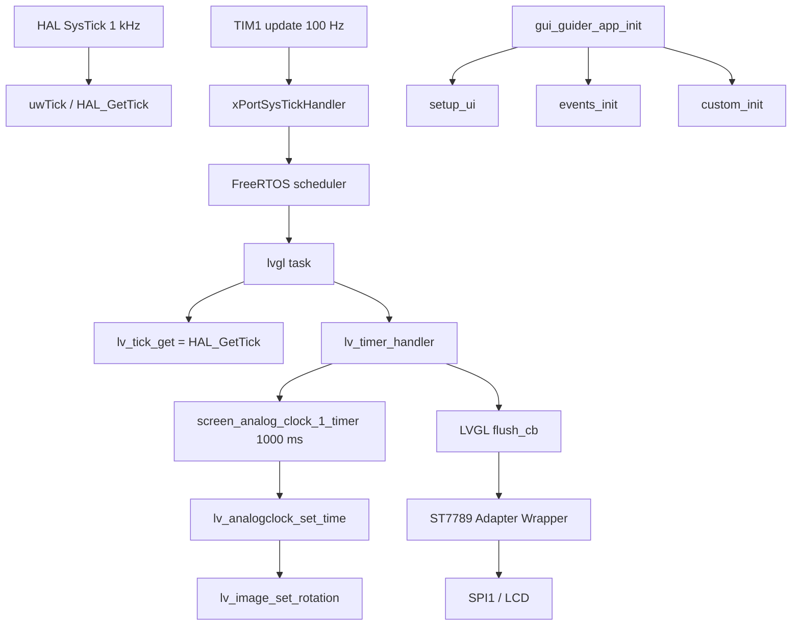

# GUI Guider 移植指南（STM32F411CEU6 + LVGL 9）

> [!summary] 当前结论
> GUI Guider 8.3.10 生成页面已接入 `gui-guider` 分支的 STM32F411CEU6 工程。目标 LVGL 保持 `9.6.0-dev`。Debug/Release ARM GCC 构建通过，Debug ELF 已通过 J-Link 烧录。板上运行计数证明 FreeRTOS、LVGL Tick、ST7789 Flush 和 1 秒模拟时钟回调均在运行；实际 LCD 照片、触摸坐标和长按/右滑动作尚未完成。

## 1. 版本、来源与许可证

| 项目 | 实际值 |
|---|---|
| 工作分支 | `gui-guider` |
| 当前工程 HEAD | `7b2844e feat: add SPI1 DMA display transport` |
| LVGL 目录最近变更 | `1a24a85 feat: integrate LVGL v9 with FreeRTOS` |
| LVGL | `9.6.0-dev`，证据为 `Middlewares/LVGL/include/lvgl/lv_version.h` |
| GUI Guider 工程 | `test.guiguider`，工具版本 `1.10.1-GA` |
| GUI Guider 生成版本 | LVGL `8.3.10` 输出形式 |
| 分辨率 | 240×280；表盘资源 240×240 |
| MCU/资源 | STM32F411CEU6，512 KB Flash，128 KB RAM |
| 许可证 | 生成文件保留 NXP 版权头和 `LICENSE.txt`；`Widget/gui_analogclock.*` 为项目自有适配代码 |

源工程模拟器截图：

![[GUI Guider移植-源模拟器.png]]

## 2. 迁移文件映射

```text
App/GuiGuider/
├── Generated/       GUI Guider 生成的页面、事件和资源声明
├── Custom/          custom.c/.h
├── Widget/          项目自有 gui_analogclock.c/.h
├── Assets/images/   当前页面实际引用的 4 个图片资源
├── Assets/fonts/    alimama 12/16 字号
├── Project/         test.guiguider
└── gui_guider_app.* 页面初始化入口
```

没有复制源工程完整 LVGL、Linux/QNX ports、模拟器二进制库或 DLL。页面层不调用 HAL、SPI、I2C 或 FreeRTOS API。

## 3. 运行时调用链



关键时基分工：SysTick 只调用 `HAL_IncTick()`，TIM1 更新中断调用 `xPortSysTickHandler()`。TIM1 使用当前 APB2 Timer 时钟配置为 1 MHz 计数、ARR=9999，因此产生 100 Hz OS Tick；LVGL 仍读取 HAL 的毫秒时基。

## 4. 模拟时钟适配

GUI Guider 8.3.10 的 `lv_analogclock_*` 不是目标 LVGL 9 原生控件，因此新增 `App/GuiGuider/Widget/gui_analogclock.c/.h`，保留生成代码所需接口。控件使用公共 LVGL 对象和子 `lv_image` 指针：

- 表盘对象固定为 240×240；
- 支持普通刻度、主刻度和隐藏数字/中心点；
- 时、分、秒针分别使用 `lv_image`；
- `set_time()` 更新状态并设置三根指针的旋转角度；
- 生成代码使用 `lv_timer_create(screen_analog_clock_1_timer, 1000, NULL)`；
- 秒针角度使用 0.1° 单位，按 60 秒映射到 360°。

时间角度关系为：

```text
angle_0_1deg = ((value * 3600 / 60) + 2700) % 3600
```

定时器回调中的 `clock_count()` 负责秒进位、分进位和 12 小时制时进位。

## 5. 资源与容量

首轮仅保留当前页面引用资源：表盘、时针、分针、秒针以及 alimama 12/16 字体。图片转换为 LVGL 9 的 `RGB565A8`，数据平面为 RGB565 + Alpha，避免继续使用约 4 MB 文本资源集合。

```text
表盘数据平面：172800 B
时针数据平面：600 B
分针数据平面：1050 B
秒针数据平面：1050 B
```

当前 ARM GCC 结果：

| 构建 | text | data | bss | Flash 使用 | RAM 使用 |
|---|---:|---:|---:|---:|---:|
| Debug | 468496 B | 180 B | 55076 B | 468684 / 524288 = 89.39% | 55248 / 131072 = 42.15% |
| Release | 468496 B | 180 B | 55076 B | 468684 / 524288 = 89.39% | 55248 / 131072 = 42.15% |

Flash 已接近 90% 高风险线；后续增加页面、字体或图片前必须重新读取 `.map`。若超过容量，优先裁剪字体/图片，再把表盘背景改为 `lv_draw` 刻度绘制。

## 6. 实施步骤记录

1. 在 `gui-guider` 分支确认目标工程和 LVGL 版本。
2. 读取 `test.guiguider`，确认 GUI Guider 1.10.1-GA、LVGL 8.3.10 输出形式和 240×280 分辨率。
3. 复制 Generated、Custom、Project 和当前页面资源，排除源工程 LVGL、模拟器 ports 和二进制库。
4. 新增 `gui_analogclock` 兼容 facade，避免机械修改全部 GUI Guider 生成代码。
5. 新增 `gui_guider_app_init()`，将 `setup_ui/events_init/custom_init` 放在 Display/Input 创建之后。
6. 将 `lvgl_port` 中的演示标签和按钮移除，恢复为显示、输入、Tick、Flush 和 GUI task 端口职责。
7. 将 FreeRTOS OS Tick 从 SysTick 迁移到 TIM1；SysTick 释放为 HAL System Tick。
8. 接入 CMake GUI_GUIDER OBJECT target，并加入 LVGL、FreeRTOS、BSP 和 APP include path。
9. 按 Debug、Release 构建并读取 ELF/map 容量。
10. J-Link 烧录 Debug ELF，读取运行时计数、TIM1 寄存器和 CFSR。

## 7. 验证证据

### 静态与构建

- 分支：`gui-guider`。
- LVGL：`9.6.0-dev`。
- Debug 构建：通过。
- Release 构建：通过。
- 仅有 LVGL 9 兼容 API 的 deprecated warning，未出现链接错误。
- CFSR：板上读取为 `0`。

### 板上运行

J-Link 15 秒运行窗口读取到的关键数据：

```text
uwTick                  = 0x0000FBBD（约 64.96 s，包含启动后的累计时间）
g_freertos_heartbeat    = 0x41（65）
g_lvgl_handler_count    = 0x1635（5685）
g_gui_timer_count       = 0x40（64）
g_gui_timer_valid_count = 0x40（64）
g_gui_update_count      = 0x41（65，含初始设置）
timer_paused            = 0
TIM1 CR1                = 0x00000005（URS + CEN）
TIM1 DIER               = 0x00000001（UIE）
TIM1 PSC                = 99
TIM1 ARR                = 9999
CFSR                    = 0
```

`PSC=99`、`ARR=9999` 对应 100 MHz TIM1 时钟下的 100 Hz 更新中断；FreeRTOS 心跳和模拟时钟回调均按约 1 秒递增。实际 LCD 指针视觉变化尚需相机/人眼确认，当前不能把计数证据等同于屏幕照片。

## 8. 常见问题与回滚点

### 指针不变化或间隔不稳定

现象：GUI 任务和 Flush 仍在运行，但指针回调次数异常。根因是 FreeRTOS 和 HAL/LVGL 共用 SysTick，时基职责耦合。修复是 `Core/Src/freertos_tim1_tick.c` 覆写 FreeRTOS 的 weak `vPortSetupTimerInterrupt()`，并从 `SysTick_Handler` 删除 `xPortSysTickHandler()`。

回滚时删除 TIM1 tick 源文件、从 CMake 移除该文件，并恢复 SysTick 中的 FreeRTOS handler 调用；但不建议回滚到共用时基。

### Flash 接近上限

优先删除未引用图片和字体字符集；若仍超过 512 KB，使用索引色/Alpha8 或完全改为矢量刻度。

### GUI Guider 重新生成覆盖适配

重新生成后重点检查 `Generated/gui_guider.h` 对 `gui_analogclock.h` 的 include，以及 `widgets_init.c` 中的 1000 ms timer 回调诊断适配。长期可将诊断逻辑移动到项目 wrapper，减少对生成文件的直接修改。

## 9. 截图索引

| 截图 | 状态 |
|---|---|
| `GUI Guider移植-源模拟器.png` | 已归档；源模拟器窗口截图 |
| 源 `test.guiguider` 版本/分辨率 | 已由工程文件静态读取，未单独截取 GUI 编辑器窗口 |
| `gui-guider` 分支状态 | 已由 Git 命令读取，未单独截取终端窗口 |
| 目标工程结构/API 扫描 | 已由静态扫描读取，未单独截取终端窗口 |
| 构建输出/ELF size/map | 已由 Debug/Release 构建和 map 读取，未单独截取终端窗口 |
| 实际 LCD 与触摸结果 | 尚未验证，暂无实物截图 |

## 10. Q&A

### Q1：为什么 LVGL 仍使用 `HAL_GetTick()`？

A：TIM1 只提供 FreeRTOS 调度节拍；SysTick 继续推进 HAL `uwTick`，因此 LVGL 定时器拥有独立于 OS 调度器的毫秒时间基准。

### Q2：为什么不直接把 `lv_analogclock` 加回 LVGL 源码？

A：它是 GUI Guider/源工程专属控件，不属于目标 LVGL 9 公共 API。放在 APP 的 Widget 目录可以保持中间件干净，也便于未来重新生成页面。

### Q3：编译通过是否等于容量通过？

A：不是。本工程必须同时读取 ELF 和 `.map`；当前 Flash 89.39%，虽然链接通过，但已经是高风险状态。

## 11. 总结

本次移植将 GUI Guider 页面放入 APP 层，保留 LVGL 9 中间件和 BSP/FreeRTOS 端口边界。模拟时钟通过项目自有 Widget 兼容 GUI Guider 旧接口，指针使用 LVGL 9 `lv_image` 对象更新。FreeRTOS Tick 已切换到 TIM1，SysTick 释放为 HAL System Tick，板上运行计数证明 1 秒回调恢复稳定。最终仍需补做实际 LCD 指针视觉、单点触摸映射、长按/右滑切屏和 30 分钟稳定性测试。

## 12. 参考文件

- [[LVGL 移植指南（STM32F411CEU6 + FreeRTOS）]]
- [[GUI Guider移植-源模拟器.png]]
- 工程：`App/GuiGuider/Project/test.guiguider`
- 时钟适配：`App/GuiGuider/Widget/gui_analogclock.c/.h`
- OS Tick：`Core/Src/freertos_tim1_tick.c`
- LVGL 端口：`Core/Src/lvgl_port.c`
- 构建：`cmake/stm32cubemx/CMakeLists.txt`
- J-Link 运行检查：`tools/jlink_gui_guider_runtime_check.jlink`
