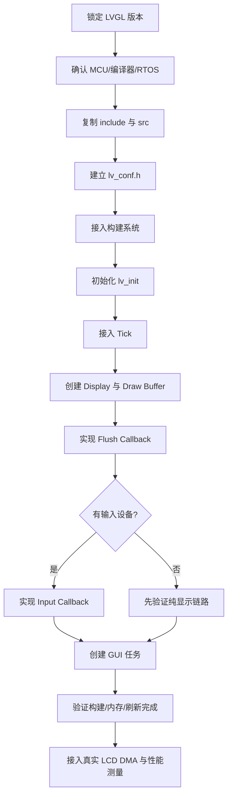

# LVGL 移植指南（STM32F411CEU6 + FreeRTOS）

> [!summary] 本次结论
> 已在 `lvgl` 分支将本地 LVGL v9.6.0-dev 接入 STM32F411CEU6 + FreeRTOS 工程，完成配置、CMake、Tick、GUI 任务、Display 和 RGB565 Flush Callback，并通过 Debug/Release 交叉编译。
>
> 当前工程没有 LCD、SPI、触摸或按键外设配置，所以本次 Flush 的目标是 `128×64` 虚拟 framebuffer。真实屏幕显示仍需根据屏幕控制器、接口和引脚补齐 BSP Wrapper。

## 1. 版本与工程基线

| 项目 | 本次值 |
|---|---|
| LVGL 来源 | `D:\zhuomian\lvgl` |
| LVGL 版本证据 | `include/lvgl/lv_version.h`：`9.6.0-dev` |
| LVGL 源 commit | `02c8fbfeb` |
| MCU | STM32F411CEU6，Cortex-M4F |
| OS | FreeRTOS Kernel 11.1.0，GCC ARM_CM4F |
| 工程分支 | `freertos` 基线 → `lvgl` 集成 |
| 颜色格式 | RGB565，16 bpp |
| 当前显示 profile | 128×64，partial render，8 行 buffer |

![[lvgl工程结构.svg|720]]

## 2. 通用移植步骤

下面的流程适用于大多数“MCU + RTOS + LVGL + 外部 LCD”工程。硬件相关内容必须替换为实际 BSP，不要把示例分辨率和引脚直接当成产品配置。



### 2.1 锁定版本

先读取 `lv_version.h`，确认使用 v8 还是 v9。v9 使用 `lv_display_t`、`lv_display_create`、`lv_display_set_flush_cb`；v8 的 `lv_disp_drv_t`、`lv_disp_draw_buf_t` 不能混用。

### 2.2 复制源码

本工程将 LVGL 公共头文件和源码放在：

```text
Middlewares/LVGL/
├── Config/lv_conf.h
├── include/lvgl/       # 公共 API
├── src/                # LVGL C 源码
└── lvgl.h              # 源码相对 include 所需的兼容头
```

只复制 `include` 和 `src` 即可作为中间件集成；`examples`、`demos` 和 `env_support` 不进入 MCU 固件目标。

### 2.3 配置 `lv_conf.h`

位置：`Middlewares/LVGL/Config/lv_conf.h`

本次关键配置：

```c
#define LV_USE_STDLIB_MALLOC LV_STDLIB_BUILTIN
#define LV_MEM_SIZE (16U * 1024U)
#define LV_USE_OS LV_OS_FREERTOS
#define LV_USE_FREERTOS_TASK_NOTIFY 1
#define LV_COLOR_DEPTH 16
#define LV_USE_DRAW_SW 1
```

通用原则：

1. `LV_USE_OS` 必须与实际 OS 适配层一致。
2. `LV_COLOR_DEPTH` 必须与 LCD 传输格式和 Flush 数据解释一致。
3. `LV_MEM_SIZE`、绘制缓冲和任务栈要一起估算 RAM。
4. 不使用的图片解码器、输入设备和复杂 Widget 应显式关闭，产品版再按需求打开。

### 2.4 接入 CMake

位置：`cmake/stm32cubemx/CMakeLists.txt`

核心边界是：

```cmake
file(GLOB_RECURSE LVGL_Src CONFIGURE_DEPENDS
    ${CMAKE_CURRENT_SOURCE_DIR}/../../Middlewares/LVGL/src/*.c
)
add_library(LVGL OBJECT ${LVGL_Src})
target_include_directories(LVGL PRIVATE ${LVGL_Inc_Dirs})
target_compile_definitions(LVGL PRIVATE LV_CONF_INCLUDE_SIMPLE STM32F411xE)
```

应用目标还要继承 `Config`、`include/lvgl`、FreeRTOS 和 CMSIS 目录，否则 `lvgl_port.c` 与 `lv_freertos.c` 会出现头文件缺失。

### 2.5 接入 Tick、Display 和 Flush

位置：`Core/Src/lvgl_port.c`

初始化顺序：

```c
lv_init();
lv_tick_set_cb(HAL_GetTick);
s_lvgl_display = lv_display_create(128U, 64U);
lv_display_set_color_format(s_lvgl_display, LV_COLOR_FORMAT_RGB565);
lv_display_set_flush_cb(s_lvgl_display, lvgl_flush_cb);
lv_display_set_buffers(s_lvgl_display, s_lvgl_draw_buffer, NULL,
                       sizeof(s_lvgl_draw_buffer),
                       LV_DISPLAY_RENDER_MODE_PARTIAL);
```

Flush Callback 的职责是把 `area` 对应的像素送到 LCD，并且在同步复制或 DMA 完成后调用：

```c
lv_display_flush_ready(display);
```

当前示例把 RGB565 像素复制到 `s_lvgl_framebuffer`，因此可以在没有 LCD 的情况下验证 LVGL 的渲染和 Flush 完成链路。真实 LCD 替换点就是 `lvgl_flush_cb` 中的区域复制代码。

### 2.6 创建 GUI 任务

位置：`Core/Src/lvgl_port.c` 的 `lvgl_task`，由 `Core/Src/freertos_app.c` 的 `freertos_app_init` 启动。

```c
static void lvgl_task(void *argument)
{
    for (;;) {
        lv_timer_handler();
        vTaskDelay(pdMS_TO_TICKS(5U));
    }
}
```

任务节拍不应与 Flush DMA 完成信号混为一谈：CPU 绘制完成后，Flush 可以同步完成，也可以等待 DMA 中断后再调用 `lv_display_flush_ready`。

![[lvgl运行链路.svg|720]]

## 3. 本工程关键文件

| 文件 | 职责 |
|---|---|
| `Middlewares/LVGL/Config/lv_conf.h` | LVGL v9 配置、FreeRTOS OSAL、RGB565 和内存预算 |
| `Middlewares/LVGL/include/lvgl/` | LVGL 公共头文件 |
| `Middlewares/LVGL/src/` | LVGL 内核、绘制、Widget、FreeRTOS OSAL 源码 |
| `Middlewares/LVGL/lvgl.h` | 源码相对路径兼容头 |
| `Core/Inc/lvgl_port.h` | 当前显示 profile 与刷新计数器声明 |
| `Core/Src/lvgl_port.c` | `lv_init`、Tick、Display、Buffer、Flush、GUI task |
| `Core/Src/freertos_app.c` | FreeRTOS LED task 与 `lvgl_port_init` 启动顺序 |
| `cmake/stm32cubemx/CMakeLists.txt` | LVGL OBJECT target、头文件路径和目标链接 |

## 4. 构建与验证

```powershell
cmake --preset Debug
cmake --build --preset Debug -j 4

cmake --preset Release
cmake --build --preset Release -j 4
```

本次结果：

| 构建 | RAM | Flash | 状态 |
|---|---:|---:|---|
| Debug `-O0 -g3` | 49,816 B / 128 KB | 463,140 B / 512 KB | 通过 |
| Release `-Os` | 33,344 B / 128 KB | 237,708 B / 512 KB | 通过 |

![[lvgl构建验证.svg|720]]

代码中保留了两个调试观测量：

```c
volatile uint32_t g_lvgl_flush_count;
volatile uint32_t g_lvgl_last_flush_pixels;
```

使用 J-Link 或调试器运行后，可观察 `g_lvgl_flush_count` 是否递增、`g_lvgl_last_flush_pixels` 是否出现有效区域像素数。这可以证明 LVGL 任务和 Flush Callback 运行；由于当前没有实体 LCD，不能把它等同于“屏幕已经显示”。

## 5. 真实 LCD 接入清单

当前 `.ioc`、HAL 配置和工程源码中没有可确认的 LCD 控制器、SPI、触摸或按键配置。接入实体屏幕时需要补齐：

- 确定控制器型号、分辨率、RGB565 字节序和扫描方向。
- 由 BSP 初始化 GPIO、SPI、DMA、CS、DC、RESET 和背光。
- 在 `lvgl_flush_cb` 中设置 LCD 窗口并发送区域像素；DMA 完成中断中调用 `lv_display_flush_ready`。
- 如果有触摸/按键，新增 `lv_indev_create` 与 `read_cb`，把读取动作放在 BSP/OS 边界内。
- 对 DMA 使用的 buffer 做内存对齐和 Cache 一致性处理；当前 STM32F411 无 D-Cache，仍需保留可移植边界。
- 重新测量单帧耗时、Flush 带宽、GUI 任务栈水位和 LVGL 内存水位。

## 6. 常见问题

### 找不到 `lvgl.h`

现象：应用端或 LVGL 源码找不到头文件。根因通常是 `include/lvgl` 没加入应用目标，或者缺少源码根目录下的兼容 `lvgl.h`。本工程在 `LVGL_Inc_Dirs` 和 `Middlewares/LVGL/lvgl.h` 中分别处理。

### `lv_display_flush_ready` 没有调用

现象：首帧后任务不再刷新或显示状态卡住。根因是 Flush Callback 没有在同步复制完成或 DMA 完成中断中报告完成。修复：所有正常和异常路径都要保证一次 `lv_display_flush_ready`。

### 把 Debug 体积当成产品体积

Debug 使用 `-O0`，LVGL 大量绘制代码会显著膨胀。本工程 Debug 为 463 KB，Release `-Os` 为 237 KB；产品空间评估应以 Release、实际字体和实际 Widget 配置为准。

### 把虚拟 framebuffer 当成实体屏幕验证

虚拟 framebuffer 只能证明 LVGL 核心、Tick、任务和 Flush 回调运行。只有接入真实 LCD 并观察实物画面，才算完成显示链路验收。

## 7. 总结

LVGL 移植的核心不是把源码复制进工程，而是建立版本、配置、OS、Tick、Display、Buffer、Flush 和 Input 的边界。本工程已在 `lvgl` 分支完成 LVGL v9.6.0-dev + FreeRTOS 的可构建集成，并用 RGB565 虚拟 framebuffer 验证渲染链路。下一步只需把 `lvgl_flush_cb` 的虚拟复制替换为具体 LCD BSP/DMA，补上输入设备后再做板上画面和性能验收。

## 8. 参考资料

- [LVGL 源码仓库](https://github.com/lvgl/lvgl) — 本工程使用本地 checkout `02c8fbfeb`。
- [项目 GitHub · lvgl 分支](https://github.com/shuai-yemao/stm32f411ceu6_freertos_transplant/tree/lvgl) — 当前移植分支。
- [项目 GitHub · freertos 分支](https://github.com/shuai-yemao/stm32f411ceu6_freertos_transplant/tree/freertos) — FreeRTOS 基线分支。
