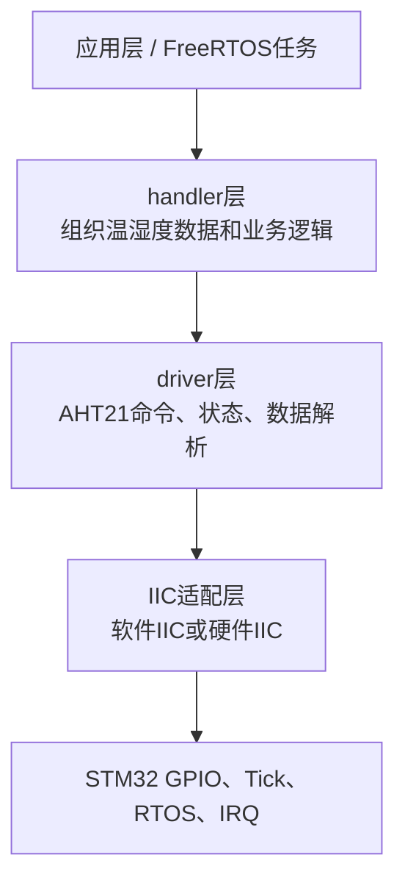
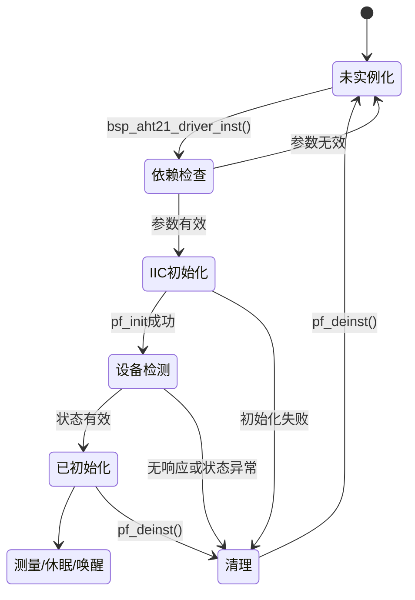
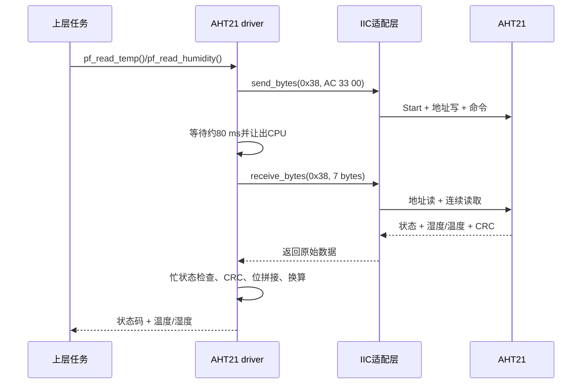

# 📖 引言

> 这篇笔记要讲什么？用一句话概括核心主题。

将 aht 21 外设的实现逻辑抽象，将其从 core 层的绑定中脱离出来，成为可复用的代码

---

# 📝 driver 层的设计思路

> 用一句话说清楚这个知识点是什么。

按一定的流程来编写 bsp_xx_driver.h 和.c 文件

## 实际意义

> 为什么会有该知识点？

1. 提高复用，减少开发时间
2. 架构中层层解耦，让代码可以快速移植

## 应用场景

> 在实际中主要被用来做什么？

1. 常用外设的快速测试与上手
2. 

## 核心逻辑/原理

> 它是如何工作的？拆解背后的机制。

1. 分析 bsp 外设在架构中的需要接收的资源和对外提供的 API
2. 利用结构体 + 函数指针来实现多态，先根据需要接收的资源和 API 来编写 driver.h 文件
3. Driver.c 文件根据.h 文件来编写对外接口函数，其余函数皆为内部静态函数，让上层调用不用在乎内部实现

```c
// 关键代码段
```

### 驱动层的边界

本工程把 AHT21 驱动拆成四层，职责从下到上逐渐接近业务：



- `BSP/AHT21/driver` 只负责 AHT21 的设备协议和数据含义。
- `BSP/AHT21/iic` 负责 Start、Stop、ACK、字节收发等总线事务。
- `System/Adapter` 或其他平台代码负责把 GPIO、时间基准、互斥锁和中断操作接入驱动。
- `handler` 不应该直接操作 SDA/SCL，而应该调用 driver 暴露的函数指针。

这样做的结果是：更换软件 IIC、硬件 IIC 或 MCU 平台时，主要替换南向适配接口，不必重写 AHT21 的测量换算逻辑。

### `.h` 文件应该先设计什么

按照“先定义资源，再定义对外行为”的顺序编写头文件：

1. **配置项**：`AHT21_I2C_ADDR`、命令字节、忙状态掩码、测量等待时间、数据长度和 CRC 长度放在 `bsp_aht21_config.h`。
2. **状态枚举**：`aht21_status_t` 统一表达成功、普通错误、超时、资源错误、参数错误、内存错误和中断上下文错误。
3. **南向接口**：`iic_driver_interface_t`、`timebase_interface_t`、`yield_interface_t`、`irq_interface_t` 描述驱动需要平台提供什么。
4. **驱动实例**：`bsp_aht21_driver_t` 保存初始化状态、依赖接口和北向操作函数指针。
5. **公共入口**：只保留 `bsp_aht21_driver_inst()` 作为实例化入口，实例化成功后通过 `pf_init`、`pf_read_temp` 等函数指针调用功能。

### 南向接口：驱动需要什么资源

| 接口 | 驱动使用目的 | 当前工程中的具体内容 |
| --- | --- | --- |
| IIC | 与 AHT21 收发命令和数据 | 初始化、反初始化、发送/接收字节、ACK、读状态 |
| 时间基准 | 测量等待、忙轮询、唤醒等待 | `pf_get_tick_count()`、`pf_delay_ms()` |
| RTOS | 等待期间让出 CPU | `pf_rtos_yield()` |
| IRQ/锁 | 保护 IIC 临界区和共享资源 | `pf_lock()`、`pf_unlock()`、开关中断 |

```c
typedef struct {
    iic_driver_interface_t *p_iic_driver_instance;
    timebase_interface_t *p_timebase_instance;
    yield_interface_t *p_yield_instance;
    irq_interface_t *p_irq_instance;
} aht21_ops_t;
```

这里的关键不是“把所有函数都放进结构体”，而是明确：**driver 不直接依赖 HAL、FreeRTOS 或具体 GPIO，只依赖这些抽象接口**。

### 北向接口：driver 对外提供什么

`bsp_aht21_driver_t` 中的函数指针就是北向接口：

| 函数 | 作用 | 调用前提 |
| --- | --- | --- |
| `pf_init` | 初始化 IIC 并等待传感器稳定 | 实例已绑定依赖 |
| `pf_read_id` | 通过状态命令检查 AHT21 响应 | IIC 可用 |
| `pf_read_temp` | 触发测量、等待、校验并换算温度 | 已初始化 |
| `pf_read_humidity` | 触发测量、等待、校验并换算湿度 | 已初始化 |
| `pf_sleep` | 发送休眠命令 | 已初始化 |
| `pf_wakeup` | 发送唤醒命令并等待约 10 ms | 已初始化 |
| `pf_deinit` | 关闭底层 IIC | 已初始化 |
| `pf_deinst` | 清空函数指针和依赖，恢复未实例化状态 | 任意错误清理路径 |

### 关键代码：实例化和生命周期

```c
aht21_status_t bsp_aht21_driver_inst(
    bsp_aht21_driver_t *self,
    aht21_ops_t *const ops_instance);

/* 上层使用方式 */
bsp_aht21_driver_t aht21;
aht21_ops_t ops = {
    .p_iic_driver_instance = &iic_ops,
    .p_timebase_instance = &time_ops,
    .p_yield_instance = &yield_ops,
    .p_irq_instance = &irq_ops,
};

if (bsp_aht21_driver_inst(&aht21, &ops) == AHT21_OK) {
    float temperature;
    aht21.pf_read_temp(&aht21, &temperature);
}
```

实例化函数的内部顺序是：检查 `self` 和所有依赖 → 防止重复实例化 → 保存 `ops` → 绑定各个内部函数 → 调用 `pf_init` → 读取状态验证设备 → 成功后保持 `AHT21_INIT`。任意一步失败，都应该调用 `pf_deinst` 清理已经绑定的资源。



### 温湿度读取的内部逻辑

`aht21_read_temp()` 和 `aht21_read_humidity()` 不应该各自重复写一套 IIC 流程。当前工程通过 `aht21_read_measurement()` 统一完成：

1. 检查驱动实例、IIC 接口、时间基准和输出缓存。
2. 发送 `0xAC 0x33 0x00` 触发测量。
3. 等待 `AHT21_MEASURE_DELAY_MS`，再轮询状态字节 bit7。
4. 忙状态达到最大重试次数后返回 `AHT21_ERRORTIMEOUT`。
5. 对前 6 字节执行 CRC-8，并与第 7 字节比较。
6. 温度函数提取 `data[3]` 低 4 位、`data[4]`、`data[5]`；湿度函数提取 `data[1]`、`data[2]` 和 `data[3]` 高 4 位。
7. 只有测量和 CRC 都成功后，才把结果写入上层输出变量。



### 错误处理和日志设计

驱动函数返回 `aht21_status_t`，不要只返回一个布尔值。上层可以根据状态区分“参数错误”“资源未初始化”“IIC 超时”和“CRC 错误”。`DEBUG_AHT21` 控制日志宏，统一使用 `AHT21` 标签，便于 RTT/EasyLogger 过滤。

典型错误路径如下：

```c
if (self == NULL || temp == NULL ||
    self->p_ops_instance == NULL) {
    DEBUG_AHT21_OUT(e, "read temperature: invalid resource");
    return AHT21_ERRORRESOURCE;
}

if (self->is_inited != AHT21_INIT) {
    DEBUG_AHT21_OUT(e, "read temperature: driver not initialized");
    return AHT21_ERRORRESOURCE;
}
```

错误日志应说明“哪个阶段失败”和“返回状态码”，但不要在 driver 内部吞掉错误或把无效测量值继续向上层传递。

## 关键公式/结论

> 最终结论和公式。

1. 北向接口：由下层向上层提供的接口
2. 南向接口：由上层向下层提供的接口
3. Driver 文件与 config.h 文件构成 bsp 层的 HAL（硬件抽象层）
4. `driver.h` 先确定南向资源和北向 API，`driver.c` 再实现内部流程。
5. AHT21 的测量、CRC 和数据换算属于设备驱动层；IIC 的电平时序属于 IIC 适配层。
6. 驱动实例化成功不等于一次测量成功；每次测量仍需检查忙状态、通信状态和 CRC。

## 实际操作步骤

> 动手验证/配置的具体操作。

![[file-20260711202928038.png]]

### 第 0 步：分析原理图和数据手册

确认 AHT21 的供电、SDA/SCL、7 位地址 `0x38`、命令格式、测量等待时间、数据位布局和 CRC 规则。先画出“触发测量 → 等待 → 读取 7 字节 → 校验 → 换算”的数据流，再设计函数接口。

### 第一步：编写 `bsp_aht21_config.h` 和 `bsp_aht21_driver.h`

先放置地址、命令、状态掩码和延时等稳定配置，再定义状态枚举、南向接口、驱动实例和北向函数指针。接口参数要明确所有权、输出缓存大小、错误返回和调用前提。

### 第二步：编写 `bsp_aht21_driver.c`

按照“参数检查 → 状态检查 → 调用南向接口 → 等待/轮询 → 数据校验 → 数据换算 → 返回状态”的顺序实现。对重复的测量流程抽取 `aht21_read_measurement()`，对等待抽取 `aht21_wait_ms()`，其余内部函数使用 `static` 限制作用域。

### 第三步：绑定工程适配层

把 `BSP/AHT21/iic`、系统 Tick、FreeRTOS `yield`、互斥锁和中断保护函数填入 `aht21_ops_t`。driver 不直接包含 GPIO、HAL 或任务句柄，实现平台替换时只修改适配层。

### 第四步：单元测试和目标板验证

先用 mock 验证命令字节、错误码、CRC 和温湿度公式，再用 RTT/逻辑分析仪验证真实 IIC 波形。测试至少覆盖：空指针、重复实例化、IIC 无响应、忙超时、CRC 错误、正常温度、正常湿度、休眠和唤醒。

### 第五步：提交前检查

确认 `.h` 中的接口与 `.c` 中的函数指针完全一致，确认生成的 Keil 输出文件没有加入提交，运行正常固件和测试固件两种构建，并记录实际 RTT 日志。

## 常见问题

> 现象 → 根因 → 修复。

### 发现的问题

### 根因分析

### 改进方法

---

# 💬 Q&A

> 自问自答，检验理解深度。按难度递进排列。

1.什么是面向对象？什么是面向过程？

2.IIC 为什么要上拉电阻？

3。Const 关键词的作用是什么？是在编译阶段产生作用，还是运行时阶段？

4．请考虑如何在接口中加入 Const 来指示输入和输出参数，在指针符号前加入 const 和指针符号后加入 const 的区别是什么？

1．IIC 总线上的动作分为哪几种？IIC 的 start 动作 SDA 和 SCL 如何变化的?

2.IIC 的读信号和写信号有什么区别

## 🟢 基础

> 最基本的概念和用法，入门必知。

### Q1

A1：

### Q2

A2：

## 🟡 进阶

> 容易踩的坑和常见误区。

### Q3

A3：

## 🔴 困难

> 结合实战的深层原理和设计权衡。

### Q4

A4：

---

# 📋 总结

> 3-5 句话回顾核心要点，用自己的话复述。

---

# 📎 参考资料

> 学习过程中用到的外部资源汇总。

## 🎥 视频链接

> B 站 / YouTube 教程，优先选项目实战类和原理动画类。

- [标题](url) — 一句话说明讲了什么

## 🔗 博客/文档链接

> 分析最透彻的博客、官方文档、社区帖子。

- [标题](url) — CSDN / 博客园 / 飞书 / 知乎
- [标题](url) — 芯片厂商官方文档

## 💻 仓库链接

> GitHub / Gitee 源码仓库，含 Demo 工程和工具链。

- [owner/repo](url) — 一句话描述
- [owner/repo](url)

## 📄 代码/附件

> 本地 PDF、代码包、工具链文件。

- [[附件文件.pdf]]
- [[示例代码.zip]]
