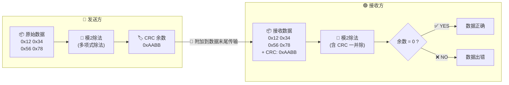
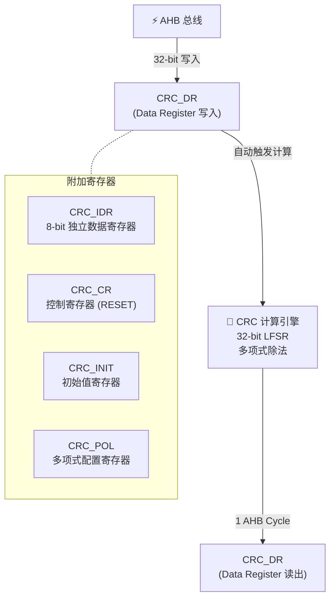

日期：2026.05.13

文章标签： #CRC #STM32 #嵌入式校验 #数据完整性

## 1. 学习内容

### 知识点总览

| 序号  | 知识点                        |
| --- | -------------------------- |
| 1   | CRC 基本原理：模 2 除法与多项式表示      |
| 2   | 常见 CRC 标准：CRC-8/16/32 参数对比 |
| 3   | STM32F411 CRC 硬件模块架构与特性    |
| 4   | HAL 库 CRC API 编程实战         |
| 5   | CRC 工程应用场景与常见误区            |

### 知识点关联思维导图

![[assets/CRC校验思维导图.excalidraw]]

---

## 2. 逐点精讲

### 知识点 1：CRC 基本原理——模 2 除法与多项式

#### 实际意义

CRC（Cyclic Redundancy Check，循环冗余校验）是嵌入式领域使用最广泛的数据完整性校验算法之一。它能在不引入过多计算开销的前提下，检测出数据传输或存储过程中的绝大多数错误（包括单比特翻转、连续突发错误等）。从串口通信到固件 OTA，从 Modbus 协议到 Flash 存储，CRC 无处不在。

#### 应用场景

| 场景 | 说明 |
|------|------|
| **串口/SPI/I2C 通信** | 在数据帧末尾附加 CRC 值，接收方重新计算比对，判定位错误 |
| **Modbus RTU/TCP** | 标准强制使用 CRC-16，确保工业现场噪声环境下的数据可靠 |
| **固件 OTA 升级** | 升级包附带 CRC-32，升级前校验完整性，防止写入错误固件 |
| **Flash 存储校验** | 关键参数区在写入后计算 CRC 并存入冗余区，上电时校验 |
| **CAN 总线** | CAN 帧自带 15 位 CRC，由硬件自动处理 |
| **文件传输协议** | YMODEM/XMODEM 等协议均依赖 CRC 校验数据块 |

#### 常见误区

1. **「CRC 和校验和是一回事」**—— 普通校验和（累加/异或）对多比特错误的检出率远低于 CRC，CRC 能检出所有单比特、双比特错误和任意奇数个比特错误
2. **「CRC-32 只有一种」**—— CRC-32 在不同的初始值、输出异或值、输入反转、输出反转组合下有多种变体（如 CRC-32/MPEG2、CRC-32/BZIP2、CRC-32C 等），不可混用
3. **「CRC 硬件模块默认就是标准 CRC-32」**—— STM32F4 的 CRC 模块默认使用 CRC-32/MPEG2 参数（非标准 CRC-32），与其他平台计算值可能不一致
4. **「数据对齐无所谓」**—— CRC 计算对字节序和 32-bit 对齐敏感，同一段数据用 8-bit 和 32-bit 方式送入可能得到不同结果

#### 辅助图示



> **CRC 校验流程**：发送方对原始数据做模 2 除法得到余数（CRC），附在数据后发送。接收方对完整数据（含 CRC）再做一次除法——余数为 0 则数据无误，否则出错。

#### 通俗人话解释

想象你要快递一箱苹果。你在箱子上贴一个标签，上面写着「共 24 个苹果」。路上如果掉了一个，收件人一数 23 个，对不上，就知道出错了。普通校验和就像这个标签——简单粗暴，但万一掉了一个又掉了一个刚好总数不变呢？

CRC 就聪明多了：它不是简单数苹果，而是把每一排苹果变着花样地 " 折叠 " 计算。比方说苹果的排列形状会影响结果，途中任何位置哪怕只换了一个苹果，整箱的 " 形状特征 " 就变了。这种变换的数学本质是**模 2 多项式除法**——用一套精巧的多项式运算把整段数据映射成一个固定长度的余数。

#### 核心逻辑/原理

CRC 的本质是在 **GF(2) 伽罗瓦域（即模 2 运算）** 上的多项式除法：

1. 将原始数据视为一个二进制多项式的系数（比特流）
2. 将该多项式乘以 $x^n$（n = CRC 宽度），相当于在数据末尾补 n 个 0
3. 除以**生成多项式**（Generator Polynomial）
4. 取余数作为 CRC 值附加到数据末尾

接收方对收到的完整数据（含 CRC）再做一次除法：余数为 0 → 数据正确，非 0 → 数据出错。

**模 2 运算核心规则**：加法和减法等效于 XOR（异或），没有进位/借位。

#### 关键公式/结论

$$
CRC = (M(x) \cdot x^n) \bmod G(x)
$$

- $M(x)$：原始数据多项式
- $G(x)$：生成多项式（关键参数，决定检错能力）
- $n$：CRC 宽度（8 / 16 / 32）
- $\bmod$：模 2 多项式除法取余

#### 公式深度拆解

##### 1. $G(x)$ 是怎么来的？

**不是 " 生成 " 的，是 " 选定 " 的。**

$G(x)$ 是由数学家和工程师经过代数编码理论分析确定的、预先约定好的标准多项式。其阶数 $n$ 决定了 CRC 宽度：

| CRC 宽度 | $G(x)$ 阶数 | 十六进制表示（隐含 $x^n$） |
|---------|------------|------------------------|
| CRC-8   | 8 次       | `0x07`  |
| CRC-16  | 16 次      | `0x8005` |
| CRC-32  | 32 次      | `0x04C11DB7` |

**关键细节**：$G(x)$ 的最高次项 $x^n$ 是**隐含的**，不进入十六进制表示。例如 CRC-32 的 `0x04C11DB7` 实际对应的是 33 项多项式：

$$
x^{32} + x^{26} + x^{23} + x^{22} + x^{16} + x^{12} + x^{11} + x^{10} + x^8 + x^7 + x^5 + x^4 + x^2 + x + 1
$$

最高位 $x^{32}$ 是 " 与生俱来 " 的，所以存储/通信时省略，用 32-bit 表示即可。

**$G(x)$ 不是随便选的**。一个 " 好 " 的生成多项式必须满足：

- 能检测所有单比特错误
- 能检测所有长度 ≤ n 的突发错误
- 对双比特错误有检测能力（取决于 $G(x)$ 的具体形式）
- 因子中包含 $x+1$ 时能检测任意奇数个错误

工程师不用自己发明——直接从国际标准中选用即可（CRC-8、CRC-16/CCITT、CRC-32 等）。

##### 2. $M(x)$ 在实践中是什么？

**$M(x)$ 就是你要校验的那段原始数据，翻译成 GF(2) 域上的二进制多项式。**

映射规则很直观——每个比特就是多项式的一个系数（只能是 0 或 1，因为没有进位）：

$$
M(x) = b_{N-1}x^{N-1} + b_{N-2}x^{N-2} + \cdots + b_1x + b_0
$$

其中 $b_{N-1}$ 是数据的最高位（MSB），$b_0$ 是最低位。

**实例**：数据 `0x0A`（二进制 `0000 1010`），约定 MSB 先送：

$$
M(x) = 0\cdot x^7 + 0\cdot x^6 + 0\cdot x^5 + 0\cdot x^4 + 1\cdot x^3 + 0\cdot x^2 + 1\cdot x + 0 = x^3 + x
$$

每一段串口数据、每一帧固件升级包、每一个 Flash 存储块——在 CRC 的世界里，都是这样一个多项式。

##### 3. 为什么要乘以 $x^n$？

这是公式中最巧妙的一步，有三个目的：

**① 给 CRC 余数腾位置**

把整个数据当 " 被除数 "，$G(x)$ 当 " 除数 "。问题在于：如果直接做除法，余数会和数据末尾的位混在一起，接收方没法区分 " 哪里是数据、哪里是余数 "。

乘以 $x^n$ 等价于**在原始数据末尾补 n 个 0**，腾出 n 位空间：

```
原始数据:  1010 1100
× x^n 后:  1010 1100 0000 0000   ← 腾出了 16 位空间
                                 ← 然后做除法得到 ≤ 16 位的余数
```

算出的余数 ≤ n 位，直接粘贴到数据末尾，接收方知道最后 n 位就是 CRC，前面是数据。

**② 保证 " 余数 0 = 数据正确 " 的优雅性质**

发送方发送的完整帧是：

$$
T(x) = M(x) \cdot x^n + CRC, \quad CRC = M(x) \cdot x^n \bmod G(x)
$$

接收方对 $T(x)$ 整体做除法：

$$
T(x) \bmod G(x) = [M(x) \cdot x^n + (M(x) \cdot x^n \bmod G(x))] \bmod G(x)
$$

在 GF(2) 域中，加法 = XOR，所以 $R + R = 0$，因此：

$$
T(x) \bmod G(x) = 0
$$

**接收方不需要知道 CRC 值也能验证**——对整个数据（含末尾 CRC）做一次除法，余数为 0 就对了。

**③ 防止前导零被忽略**

如果 $M(x)$ 以全零开头（如 `0x00 0x00 0x01`），直接模除时前导零会被系数忽略。乘以 $x^n$ 把数据 " 抬高 " n 位，使 CRC 计算对数据中的零值区域也有敏感性。

> **一句话**：$M(x) \cdot x^n$ = 给数据末尾补 n 个 0，腾出位置放 CRC 余数；$\bmod G(x)$ = 用标准多项式做模 2 除法求余数。补零 → 除法 → 取余 → 替换补的零 → 发出去。接收方反过来，连数据带 CRC 一起除，余数为 0 即正确。

##### 4. 工程中的额外 " 调味料 "

上述是纯数学模型。实际工程实现中还有四个额外参数：

| 参数 | 作用 |
|------|------|
| **Init**（初始值） | 除法开始前 CRC 寄存器的初值，防止数据前导零被忽略 |
| **RefIn/RefOut**（反转） | 适配不同硬件/协议的比特序（大端/小端） |
| **XorOut**（输出异或） | 最终结果的掩码处理 |

这些参数不改变公式的代数本质，但在移位和输出阶段增加了额外处理。[[#跨平台 CRC 一致性核查清单|跨平台核对时需确认全部参数一致]]。

| 参数 | 含义 | 常见值示例 |
|------|------|-----------|
| **Poly** | 生成多项式 | CRC-32: `0x04C11DB7` |
| **Init** | 初始值 / 寄存器初值 | CRC-32/MPEG2: `0xFFFFFFFF` |
| **RefIn** | 输入字节比特序是否反转 | `true` / `false` |
| **RefOut** | 输出结果比特序是否反转 | `true` / `false` |
| **XorOut** | 最终结果异或掩码 | CRC-32/MPEG2: `0x00000000` |

---

### 知识点 2：常见 CRC 标准对比

| 标准                | 多项式 (Hex)  | 宽度  | 初始值        | 输出异或       | 典型应用             |
| ----------------- | ---------- | --- | ---------- | ---------- | ---------------- |
| **CRC-8**         | 0x07       | 8   | 0x00       | 0x00       | SMBus、1-Wire     |
| **CRC-8/MAXIM**   | 0x31       | 8   | 0x00       | 0x00       | 1-Wire DS18B20   |
| **CRC-16/CCITT**  | 0x1021     | 16  | 0x0000     | 0x0000     | XMODEM、蓝牙        |
| **CRC-16/MODBUS** | 0x8005     | 16  | 0xFFFF     | 0x0000     | Modbus RTU       |
| **CRC-32**        | 0x04C11DB7 | 32  | 0xFFFFFFFF | 0xFFFFFFFF | Ethernet、ZIP、PNG |
| **CRC-32/MPEG2**  | 0x04C11DB7 | 32  | 0xFFFFFFFF | 0x00000000 | **STM32 硬件默认**   |
| **CRC-32C**       | 0x1EDC6F41 | 32  | 0xFFFFFFFF | 0xFFFFFFFF | iSCSI、SCTP       |

> **关键差异**：CRC-32 与 CRC-32/MPEG2 的**多项式相同，但 XorOut 不同**（前者异或全 1，后者不异或）。同一数据用两种标准算出的值完全不同！

---

### 知识点 3：STM32F411 CRC 硬件模块

#### 实际意义

STM32F411CEU6 内置一个**硬件 CRC 计算单元**，可以在**单个 AHB 时钟周期内完成一次 32-bit CRC 计算**，完全无需 CPU 参与循环移位。相比软件查表法（约 10~20 个 CPU 周期/字节），硬件模块在大量数据校验场景下有数量级的性能提升。

#### 硬件架构



> - **CRC_DR**：写入触发计算，读出获取当前 CRC 值（同一地址，双向功能）
> - **CRC_IDR**：独立于计算引擎，可存放临时值而不影响 CRC 结果
> - **CRC_CR**：`RESET` 位写 1 将 CRC 值重置为 `0xFFFFFFFF`
> - **CRC_POL**：可自定义多项式（F411 支持）
> - **CRC_INIT**：可自定义初始值（F4 部分型号支持，F411 需查阅勘误表）

#### 核心特性

| 特性           | 说明                                         |
| ------------ | ------------------------------------------ |
| **默认多项式**    | CRC-32/MPEG2（`0x04C11DB7`）                 |
| **计算速度**     | 1 个 AHB 时钟/32-bit 字                        |
| **数据宽度**     | 支持 8/16/32-bit 写入                          |
| **可配置多项式**   | 可通过 `CRC_POL` 寄存器自定义                       |
| **RESET 控制** | `CRC_CR.RESET = 1` 将 CRC 值重置为 `0xFFFFFFFF` |
| **IDR 独立**   | 8-bit IDR 寄存器，可用于临时存储，不影响计算                |

---

### 知识点 4：HAL 库 CRC 编程实战

#### 实际意义

HAL 库封装了 CRC 外设的所有寄存器操作，提供阻塞式和非阻塞式（DMA）两种调用方式，大幅降低开发门槛。

#### 初始化代码模板

```c
// 1. 使能 CRC 时钟
__HAL_RCC_CRC_CLK_ENABLE();

// 2. 配置并初始化 CRC 外设
CRC_HandleTypeDef hcrc;
hcrc.Instance = CRC;

// 使用默认多项式 (CRC-32/MPEG2)
hcrc.Init.DefaultPolynomialUse    = DEFAULT_POLYNOMIAL_ENABLE;
hcrc.Init.DefaultInitValueUse     = DEFAULT_INIT_VALUE_ENABLE;
hcrc.Init.InputDataInversionMode  = CRC_INPUTDATA_INVERSION_NONE;
hcrc.Init.OutputDataInversionMode = CRC_OUTPUTDATA_INVERSION_DISABLE;
hcrc.InputDataFormat = CRC_INPUTDATA_FORMAT_BYTES;  // 字节/半字/字

HAL_CRC_Init(&hcrc);
```

#### 常用 API

| API | 功能 | 使用场景 |
|-----|------|---------|
| `HAL_CRC_Calculate()` | 单次计算，阻塞式 | 小数据块校验 |
| `HAL_CRC_Accumulate()` | 累加计算，可分多次送入 | 流式数据/大块数据 |
| `HAL_CRC_Calculate_DMA()` | DMA 方式计算，非阻塞 | 大块数据传输不阻塞 CPU |
| `HAL_CRC_Accumulate_DMA()` | DMA 累加方式 | DMA 流式处理 |

#### 关键代码示例

```c
// --- 示例 1: 单次计算 ---
uint32_t data[] = {0x12345678, 0x9ABCDEF0};
uint32_t crc_val;

// 重置 CRC 到初始值
__HAL_CRC_DR_RESET(&hcrc);

crc_val = HAL_CRC_Calculate(&hcrc, data, 2);  // 2 个 32-bit 字
printf("CRC-32 result: 0x%08lX\r\n", crc_val);

// --- 示例 2: 逐字节累加（适用于串口接收）---
uint8_t byte_buf[] = {0x12, 0x34, 0x56, 0x78};
uint32_t crc32;

__HAL_CRC_DR_RESET(&hcrc);
crc32 = HAL_CRC_Accumulate(&hcrc, (uint32_t*)byte_buf, 1); // 每次送入 4 字节

// --- 示例 3: 自定义多项式计算 CRC-16/MODBUS ---
hcrc.Init.DefaultPolynomialUse = DEFAULT_POLYNOMIAL_DISABLE;
hcrc.Init.GeneratingPolynomial  = 0x8005;  // CRC-16/MODBUS 多项式
hcrc.Init.CRCLength             = CRC_POLYLENGTH_16B;
hcrc.Init.DefaultInitValueUse   = DEFAULT_INIT_VALUE_DISABLE;
hcrc.Init.InitValue             = 0xFFFF;  // MODBUS 初始值
HAL_CRC_Init(&hcrc);
```

---

### 知识点 5：工程应用场景与常见误区

#### 实际意义

CRC 在嵌入式工程中无处不在，但**参数选择的细微差异**常常导致不同平台算出的值对不上，是调试中令人头疼的问题之一。

#### 经典应用场景详解

| 场景 | 推荐 CRC | 要点 |
|------|---------|------|
| **固件完整性校验** | CRC-32/MPEG2 | 直接使用 STM32 硬件模块默认参数，Bootloader 中校验 |
| **Modbus RTU 通信** | CRC-16/MODBUS | 需软件实现或配置自定义多项式；注意小端序 |
| **串口自定义协议** | CRC-16 或 CRC-8 | 根据数据长度选择：≤256 字节用 CRC-8，更长用 CRC-16 |
| **参数存储区** | CRC-32 | 每次写入参数后更新 CRC，上电读回校验 |
| **YMODEM 文件传输** | CRC-16/CCITT | 协议规定，需软件实现 |
| **OTA 差分升级** | CRC-32 | 校验差分包完整性后再写入 |

#### 常见误区深度解析

| 误区 | 真相 |
|------|------|
| **" 硬件 CRC 模块比软件快不了多少 "** | 大量数据下差距巨大：软件查表法约需 15 cycles/byte，硬件 0.25 cycles/byte（32-bit 输入），**快 60 倍** |
| **"CRC 能纠错 "** | CRC 只能**检错**，不能纠错。纠错需要 ECC（Error Correcting Code）如汉明码、Reed-Solomon |
| **"CRC 值越长相等的概率越低 "** | 在理论碰撞概率上确实如此，但实际工程中 CRC-32 对于固件级数据量（几 MB）已足够，碰撞概率 ≈ $10^{-9}$ |
| **" 同一数据不同芯片算出来的 CRC 应该一样 "** | 取决于参数配置。除非显式匹配 Init/RefIn/RefOut/XorOut 全部参数，否则不同平台（即使同型号芯片）结果可能不同 |
| **"DMA 方式总是更快 "** | 对于小数据块（< 32 字节），DMA 配置开销可能超过计算本身，此时阻塞式 `HAL_CRC_Calculate()` 反而更优 |

#### 跨平台 CRC 一致性核查清单

当需要上位机（Python/C#）与 STM32 计算相同 CRC 值时，逐项核对：

- [ ] 生成多项式（Poly）一致
- [ ] 初始值（Init）一致
- [ ] 输入字节序（RefIn）一致 —— 常用 Python `crcmod` 库明确指定
- [ ] 输出字节序（RefOut）一致
- [ ] 最终异或值（XorOut）一致
- [ ] 数据送入顺序一致（大端 vs 小端）

---

## 3. 相关资料

### 🎥 视频链接

| 序号 | 标题 | 链接 |
|------|------|------|
| 1 | 适合单片机的 CRC 校验方法（普通校验和 vs CRC 直观对比） | [B站 BV1ZbTyzdEGV](https://www.bilibili.com/video/BV1ZbTyzdEGV/) |
| 2 | STM32 硬件 CRC 模块详解与实践 | [B站搜索：STM32 CRC 硬件](https://search.bilibili.com/all?keyword=STM32+CRC+%E7%A1%AC%E4%BB%B6) |
| 3 | CRC 校验原理——模 2 除法动画讲解 | [B站搜索：CRC 原理 动画](https://search.bilibili.com/all?keyword=CRC+%E5%8E%9F%E7%90%86+%E5%8A%A8%E7%94%BB) |

### 🔗 资料链接

| 序号  | 标题                                                                      | 链接                                      |
| --- | ----------------------------------------------------------------------- | --------------------------------------- |
| 1   | A Painless Guide to CRC Error Detection Algorithms (Ross Williams 经典原文) | https://zlib.net/crc_v3.txt             |
| 2   | STM32F411 Reference Manual - CRC Section                                | 参考手册 RM0383 Chapter 4                   |
| 3   | Online CRC Calculator (在线校验你的 CRC 实现)                                   | https://crccalc.com/                    |
| 4   | Python `crcmod` 库文档（上位机 CRC 计算）                                         | https://crcmod.sourceforge.net/         |
| 5   | 博客园：CRC 校验原理与实现 (寄存器移位法/查表法/反转算法)                                       | https://www.cnblogs.com (搜索：CRC 校验原理)   |
| 6   | CSDN：STM32 硬件 CRC 使用注意事项                                                | https://blog.csdn.net (搜索：STM32 硬件 CRC) |

### 💻 代码/PDF

| 序号 | 内容 | 备注 |
|------|------|------|
| 1 | `CRC_Calculate_Demo.c` — HAL 库 CRC 完整示例 | 含阻塞/DMA/自定义多项式三种模式 |
| 2 | `crc_check_table.py` — Python 上位机 CRC 校验工具 | 使用 crcmod 库，参数可配置 |
| 3 | RM0383 Reference Manual (CRC Chapter) | ST 官方参考手册 CRC 章节 |

---

## 4. Q&A（只提问不解答）

### CRC 基本原理类

**Q 1**：CRC 的 " 模 2 除法 " 和普通除法有什么本质区别？为什么非要用模 2 运算？

**Q 2**：生成多项式 $G(x)$ 是怎么选出来的？是随便取一个多项式都能当 CRC 多项式吗？

**Q 3**：CRC-32 的生成多项式 `0x04C11DB7` 转换成二进制后是 33 位（含隐含的最高位 1），但 CRC 输出只有 32 位——这多出来的 1 到底去哪了？

**Q 4**：为什么说「CRC 能检出所有单比特错误和奇数个比特错误」？用数学怎么证明？

**Q 5**：初始值（Init）为什么通常设为全 1（`0xFFFFFFFF`）而不是全 0？全 0 有什么问题？

**Q 6**：输出异或（XorOut）到底起了什么作用？去掉它会怎样？

**Q 7**：输入反转（RefIn）和输出反转（RefOut）是纯粹为了兼容历史串行硬件，还是有数学上的必要性？

### STM32 硬件模块类

**Q 8**：STM32F411 的 CRC 模块写入 `CRC_DR` 寄存器后，计算结果要等多少个时钟周期才能读回？中间要不要加 `nop`？

**Q 9**：`CRC_IDR` 独立数据寄存器除了存临时值还能有什么巧妙用途？

**Q 10**：CRC 模块的 `RESET` 控制位重置后 CRC 值变为 `0xFFFFFFFF`，这和直接往 `CRC_DR` 写入 `0xFFFFFFFF` 效果一样吗？

**Q 11**：在 STM32F411 上用 HAL 库自定义 CRC-16/MODBUS 多项式时，`InitValue` 设为 `0xFFFF`，但硬件模块是 32 位的——它怎么处理这个 16 位的初始值？

**Q 12**：`HAL_CRC_Calculate()` 和 `HAL_CRC_Accumulate()` 在实现上有什么区别？如果我在 `Accumulate` 中间偷偷改了多项式寄存器会怎样？

**Q 13**：DMA 方式计算 CRC 时，如果 DMA 传输出错了（比如数据没对齐），CRC 模块会有感知吗？还是默默算出一个错值？

### 字节序与对齐类

**Q 14**：一组数据 `{0x12, 0x34, 0x56, 0x78}`，用 `CRC_INPUTDATA_FORMAT_BYTES` 和 `CRC_INPUTDATA_FORMAT_WORDS` 送入，结果为什么不一样？

**Q 15**：上位机 Python 用 `crcmod` 计算出来的 CRC-32 和 STM32 硬件算出来的对不上，除了参数设置，还要排查什么？

**Q 16**：CRC-16/MODBUS 在 STM32 上算出来的值是 `0xABCD`，但串口发送时 Modbus 协议要求先发低字节——这个 `0xAB` 和 `0xCD` 发送顺序和 CRC 输出字节序是什么关系？

### 工程实战类

**Q 17**：固件升级包校验时，是把 CRC 附在数据末尾一并写入 Flash，还是单独存一个区域？各自有什么坑？

**Q 18**：一个参数配置区的 CRC 校验失败，除了数据真的坏了之外，还可能是什么原因？

**Q 19**：用 YMODEM 协议传输文件时，每一帧的 CRC 是发送方算的还是接收方算的？帧尾的 CRC 是谁校验谁？

**Q 20**：OTA 升级中断电了，上电后 CRC 校验不通过——这时候 Bootloader 该怎么决策？重新请求升级包还是直接跳转？

**Q 21**：CRC 碰撞概率在工程上意味着什么？假设 256KB 固件用 CRC-32 校验，期望多少年遇到一次假通过？

**Q 22**：如果有一个 1MB 的数据块需要校验，是整体算一个 CRC-32 合理，还是分成 64 个 16KB 的块各自算 CRC-16 合理？

**Q 23**：Modbus RTU 通信中 CRC-16 校验失败怎么处理？是直接丢弃帧、请求重发、还是尝试容错？

**Q 24**：你的 STM32 固件在某块板子上一切正常，换一块同样的板子 CRC 就过不了——除了硬件故障，软件层面有哪些可能？

**Q 25**：CRC 校验和密码学哈希（如 MD5、SHA-256）在嵌入式场景下怎么选？什么时候 CRC 不够用了？

### 查表法与软件实现类

**Q 26**：CRC 查表法（Table-Driven）的表是 256 个 32-bit 值，这 256 个值是怎么预先算出来的？

**Q 27**：查表法比逐位计算快多少？如果我的 MCU 没有 CRC 硬件模块，Flash 又紧张放不下 1KB 的查找表，有什么折中方案？

**Q 28**：CRC 的「直接查表法」和「反转查表法」有什么区别？为什么会有两种表？

### 协议与标准类

**Q 29**：Modbus RTU 用的是 CRC-16/MODBUS，Modbus TCP 用的也是 CRC-16 吗？如果不是，为什么 TCP 不需要？

**Q 30**：Ethernet 帧尾的 FCS（帧校验序列）用的是 CRC-32，但计算范围不包括前导码和帧首定界符——为什么不包含？

**Q 31**：CAN 总线的 CRC 为什么是 15 位而不是 16 位？这少了一位对检错能力有多大影响？

**Q 32**：SD 卡的 SPI 模式下，命令帧 CRC 是必须的还是可选的？为什么很多代码直接把 CRC 字段写死成 `0xFF`？
