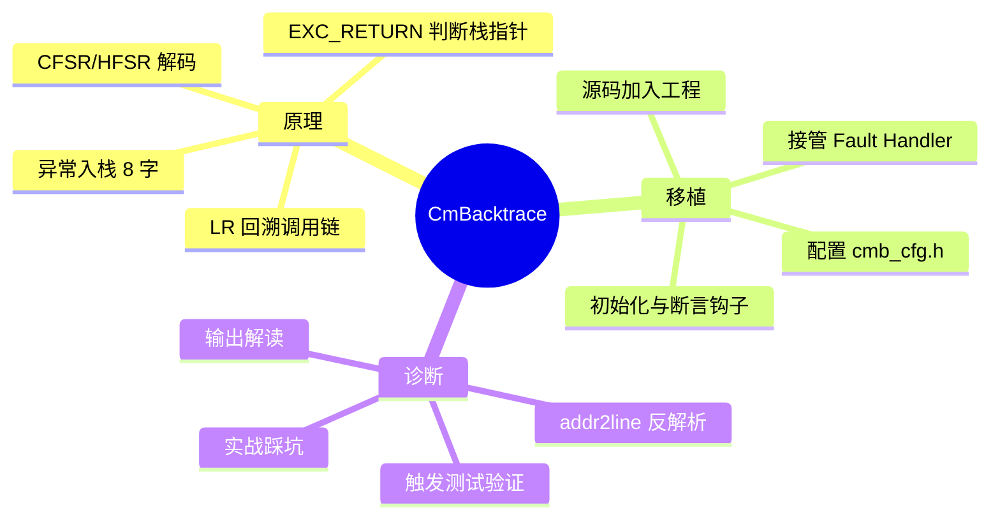
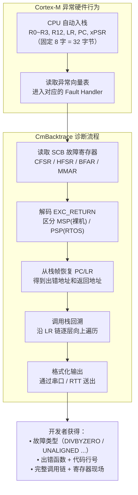
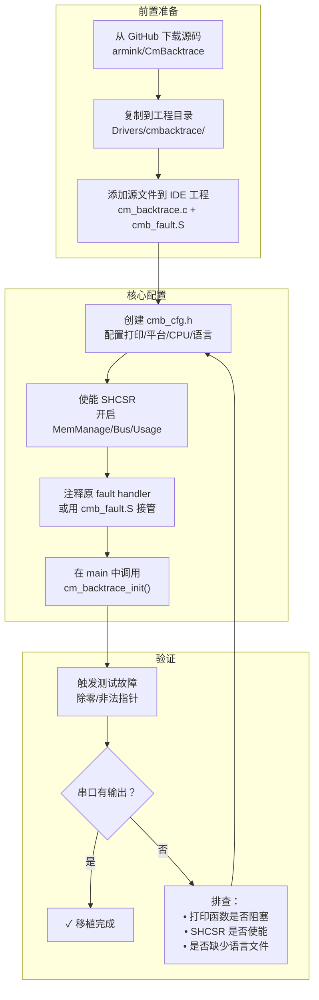

日期：2026.06.01

文章标签： #debug #cmbacktrace #hardfault

## 1. 学习内容

### 知识点总览

| 序号 | 知识点 |
| --- | --- |
| 1   | CmBacktrace 的工作原理 |
| 2   | CmBacktrace 的移植与配置 |
| 3   | CmBacktrace 的故障诊断实践 |

### 知识点关联思维导图



---

## 2. 逐点精讲

### 知识点 1：CmBacktrace 的工作原理

#### 实际意义

- **故障现场保留**：HardFault 发生时 CPU 现场转瞬即逝，CmBacktrace 在异常 Handler 中瞬间 " 拍照 "，保留出错时的寄存器、栈和调用链
- **自动根因分类**：不只知道崩了，还知道为什么崩——除零、非对齐访问、总线错误、存储器保护违规等，通过 CFSR/HFSR 自动解码
- **无仿真器排障**：量产设备接不了 JTAG/SWD，通过串口或 RTT 输出即可定位问题

#### 应用场景

- **偶发 HardFault 死机** — 产品跑着跑着就死了，没有串口输出，仿真器一断开就抓不到
- **断言失败分析** — `assert` 触发后只知道在哪行断言，不知道为什么断言失败
- **Bug 极难复现** — 真机调试必须断开仿真器，问题一两个月出现一次
- **新人调试困难** — 不知道故障寄存器（CFSR/HFSR/BFSR/MMFSR）怎么读
- **函数调用栈还原** — 出问题后需要还原调用关系，不只是知道死在哪个地址

#### 常见误区

| 误区 | 真相 |
|------|------|
| CmBacktrace 能处理所有崩溃场景 | 栈已被严重破坏（如 DMA 溢出写栈）时回溯结果不准确 |
| 加进工程就能用 | 必须配置 `cmb_cfg.h`、接管 fault handler、使能 SHCSR，缺一不可 |
| 有了 CmBacktrace 就不需要仿真器了 | 它能定位崩在哪，但交互式调试（单步/断点）仍然是必要的补充手段 |
| 只支持 HardFault | 同时支持 MemManage、BusFault、UsageFault、HardFault 以及断言失败 |

#### 辅助图示

1. Cmbacktrace 的工作流程



2. 栈回溯源代码 ![[file-20260607150250580.png]]

#### 通俗人话解释

> CmBacktrace 就像一个装在 MCU 里的**「黑匣子」**：系统崩溃的瞬间，它自动拍下 " 案发现场照片 "——哪个地址崩的、当时 CPU 在做什么、函数调用链是怎样的——然后通过串口把这组照片发给开发者。

类比成 Debug 侦探：

- **Cortex-M 异常入栈** → 案发时 CPU 自动把在场人员名单（R0~R3、R12、LR、PC、xPSR）登记在册
- **CFSR/HFSR 解码** → 法医鉴定报告（是中毒/刀伤/坠楼？对应除零/总线错/内存违规）
- **EXC_RETURN** → 案发时此人正在工作（MSP = 主循环）还是休息（PSP = RTOS 任务）
- **调用栈回溯** → 监控录像倒放，还原此人是怎么一步步走到案发现场的

#### 核心逻辑/原理

##### ① 硬件自动入栈

Cortex-M 进入异常 Handler 时，硬件自动将 8 个寄存器按固定顺序压栈：

```
SP → [R0]     ← 第 0 个参数
     [R1]
     [R2]
     [R3]
     [R12]    ← 临时寄存器
     [LR]     ← 被中断点的返回地址
     [PC]     ← 被中断点的 PC（即出错指令）
     [xPSR]   ← 程序状态寄存器
```

这 8 个字（32 字节）是 CmBacktrace 回溯的**核心原材料**。

##### ② 解码异常原因

从 System Control Block 读取故障寄存器：

| 寄存器 | 地址 | 作用 |
|--------|------|------|
| **CFSR** | 0xE000ED28 | 细分 BusFault/MemManage/UsageFault 的具体原因 |
| **HFSR** | 0xE000ED2C | 判断是否为升级到 HardFault |
| **BFAR** | 0xE000ED38 | 导致 BusFault 的目标地址 |
| **MMAR** | 0xE000ED34 | 导致 MemManageFault 的目标地址 |

##### ③ EXC_RETURN 确定栈指针

LR 在异常入口被替换为 EXC_RETURN：

```c
EXC_RETURN & (1 << 2) == 0  → 使用 MSP（裸机/中断上下文）
EXC_RETURN & (1 << 2) != 0  → 使用 PSP（FreeRTOS 任务上下文）
```

用 `EXC_RETURN & 0xFFFFFFF9` 快速判断：

- `0xFFFFFFF9` → Thread 模式 + MSP
- `0xFFFFFFFD` → Thread 模式 + PSP
- `0xFFFFFFF1` → Handler 模式 + MSP

##### ④ 调用栈回溯

1. 从异常帧取出 PC → 出错指令地址
2. 从异常帧取出 LR → 调用者的返回地址
3. 用 LR 在符号表中查对应的函数名
4. 沿 LR 链递归向上，直到 `Reset_Handler` 或栈底


##### ⑤ 栈回溯核心代码逐段解析

CmBacktrace 的栈回溯核心在 `cm_backtrace.c` 的 `cm_backtrace_fault()` 函数中，以下逐段拆解关键逻辑：

**Step A — 获取栈指针并确定帧起始地址：**

```c
/* 判断当前使用 MSP 还是 PSP */
if (lr_value & (1 << 2)) {
    sp_value = psp;  /* RTOS 任务上下文 */
} else {
    sp_value = msp;  /* 裸机/中断上下文 */
}

/* 计算异常帧起始地址（入栈的 8 个字在栈顶） */
uint32_t *fault_stack = (uint32_t *)sp_value;
```

`EXC_RETURN` 的 bit2 是 MSP/PSP 选择位。选错栈指针 → 读到的栈帧数据全是错的 → 回溯结果完全不可用。

**Step B — 从栈帧中提取 PC 和 LR：**

```c
/* 异常入栈布局：SP → R0, R1, R2, R3, R12, LR, PC, xPSR */
uint32_t fault_pc = fault_stack[6];   /* 偏移 6 × 4 = 24 字节 → PC */
uint32_t fault_lr = fault_stack[5];   /* 偏移 5 × 4 = 20 字节 → LR */
```

入栈顺序固定，PC 在第 7 个位置（索引 6），LR 在第 6 个位置（索引 5）。这就是为什么之前那张 " 入栈布局表 " 这么重要——索引算错一位，拿到的就是错误的地址。

**Step C — PC 有效性校验与地址对齐：**

```c
/* 检查 PC 是否在 Flash 地址范围内 */
if (fault_pc >= FLASH_BASE && fault_pc <= FLASH_END) {
    fault_pc &= ~1;  /* 清除 Thumb bit（ARM 指令地址 bit0 = 1） */
} else {
    fault_pc = 0;    /* PC 异常 → 无法定位 */
}
```

Cortex-M 强制 Thumb 模式，PC 的 bit0 恒为 1。查询符号表前必须清除，否则地址对不上。

**Step D — 调用栈递归回溯（核心算法）：**

```c
#define MAX_DEPTH  20                    /* 最大回溯深度 */
uint32_t call_stack[MAX_DEPTH];          /* 存储回溯地址 */
uint32_t current_lr = fault_lr;          /* 从异常帧的 LR 开始 */
int depth = 0;

/* 沿 LR 链逐层向上遍历 */
while (current_lr != 0 && depth < MAX_DEPTH) {
    /* 校验 LR 是否在有效代码区 */
    if (current_lr >= FLASH_BASE && current_lr <= FLASH_END) {
        call_stack[depth++] = current_lr & ~1;  /* 存地址，清 Thumb bit */
    }

    /* ★ 关键：通过栈中的前一个 LR 来"向上跳" */
    /*   ARM 函数调用时，BL 指令自动将返回地址存入 LR */
    /*   函数入口通常将 LR 压栈保存：PUSH {LR} */
    /*   回溯算法沿栈向下扫描，找到下一个看起来像 LR 的值 */
    current_lr = find_next_lr_on_stack(sp_value, depth);
}
```

**回溯算法的本质**：ARM 函数调用通过 `BL (Branch with Link)` 指令实现，`BL func` 自动将下一条指令地址存入 LR。函数入口通常 `PUSH {LR}`（或 `PUSH {R4-R7, LR}`）将 LR 保存在栈上。回溯算法就是**沿栈向下翻找这些被保存的 LR 值**，还原出完整的调用链。

**Step E — 符号表查找：**

```c
/* 遍历函数符号表，匹配地址区间 */
for (int i = 0; i < symbol_count; i++) {
    if (call_addr >= symbol_table[i].addr_start &&
        call_addr <  symbol_table[i].addr_end) {
        /* 找到对应的函数名 */
        debug_printf("  [%d] %s() @ 0x%08X\n", depth,
                     symbol_table[i].func_name, call_addr);
        break;
    }
}
```

CmBacktrace 不自带完整的符号表解析器，它输出地址后依赖外部 `addr2line` 工具做地址→行号的转换。

**Step F — 异常向量表基址保护：**

```c
/* 检测到地址落在异常向量表范围（0x00000000 ~ 0x0000003F）时 */
if (fault_pc < VECTOR_TABLE_END) {
    /* 这个地址不是代码，是中断向量入口 */
    /* 可能是从错误的函数指针跳转过来的 */
    debug_printf("[!] PC 落在中断向量表区域，可能原因：\n");
    debug_printf("    1. 函数指针未初始化或已被破坏\n");
    debug_printf("    2. 虚函数表(vtable)指针损坏\n");
    debug_printf("    3. 栈损坏导致返回地址异常\n");
}
```

这是一个重要的保护逻辑——PC 跑到 0x00000000~0x0000003F 区间通常是**函数指针未初始化**或**栈被踩**的典型症状。

**核心回溯算法总结：**

```
异常触发
   │
   ▼
硬件自动入栈 8 字（R0~R3, R12, LR, PC, xPSR）
   │
   ▼
CmBacktrace 接管：
  ① 读取 EXC_RETURN → 选 MSP/PSP
  ② 从栈帧提取 PC → 出错指令地址
  ③ 从栈帧提取 LR → 起始回溯点
  ④ 沿栈逐层翻找 PUSH {LR} 留下的返回地址
  ⑤ 符号表匹配 → 地址变函数名
  ⑥ 输出 addr2line 命令 → 离线反解析行号
```

#### 关键公式/结论

**异常入栈布局**：

| SP 偏移 | 内容 | 用途 |
|---------|------|------|
| +0 | R0 | 参数 |
| +4 | R1 | 参数 |
| +8 | R2 | 参数 |
| +12 | R3 | 参数 |
| +16 | R12 | 临时 |
| +20 | LR | 返回地址（回溯关键） |
| +24 | PC | **出错地址（核心）** |
| +28 | xPSR | 程序状态 |

**Cortex-M4F FPU Lazy Stacking**（FPU Active 时）：

基础 8 字 + S0~S15(16 字) + FPSCR(1 字) + 对齐 (1 字) = **26 字 = 104 字节**

**CmBacktrace 局限性**：

- 回溯深度受栈空间限制，一般 10~30 层
- `-O2/-O3` 优化可能内联函数，导致回溯链断裂（建议 `-Og` 或 `-O1`）
- 必须有 `.map` 文件或符号表才能将地址翻译为函数名

---

### 知识点 2：CmBacktrace 的移植与配置

#### 实际意义

- **原理通了不移植等于零**，移植是让 CmBacktrace 从 " 理论 " 变成 " 工具 " 的关键一步
- **一次移植，全线复用**：F411 的移植流程可直接套用到 F1/F4/F7/H7，核心步骤一致
- **裸机和 RTOS 通用**：一套移植方案覆盖裸机、FreeRTOS、RT-Thread，差别仅在于 OS 类型配置

#### 应用场景

- **新工程首次集成** — 从零搭建时一步到位加入 CmBacktrace 作为基础调试组件
- **老旧工程硬故障排查** — 频繁 HardFault 但仿真器无法复现，低侵入接入
- **RTOS 集成** — 裸机验证后移植到 FreeRTOS 以获取任务名和任务栈信息

#### 常见误区

| 误区 | 真相 |
|------|------|
| CubeMX 生成的工程默认使能了所有 Fault 异常 | MemManage/BusFault/UsageFault 默认**关闭**，必须手动使能 SHCSR |
| 只改 `.c/.h` 就行，不用动启动文件 | M4F 的 FPU 寄存器需要汇编包装处理，启动文件中的 fault handler 可能需弱定义 |
| 移植完不用验证 | 必须主动触发一次除零或非法指针访问来确认移植正确 |
| 用 HAL_UART_Transmit 阻塞模式做打印输出 | 中断上下文中调用会导致互斥锁死锁 |

#### 辅助图示



#### 通俗人话解释

> 移植 CmBacktrace 就像给 MCU 装行车记录仪：
> 1. **下载源码** → 买记录仪主机
> 2. **配置 cmb_cfg.h** → 告诉记录仪用哪种喇叭（串口/RTT）
> 3. **接管 fault handler** → 把记录仪的电源接到碰撞传感器上，一撞就自动开机录像
> 4. **使能 SHCSR** → 确保碰撞传感器通电待命（出厂默认是断电的！）
> 5. **触发测试** → 故意去撞个纸箱，验证记录仪真的会启动录像

#### 核心逻辑/原理

##### Step 1：源码获取与工程加入

从 [armink/CmBacktrace](https://github.com/armink/CmBacktrace) 获取，工程文件布局：

```
Drivers/cmbacktrace/
├── src/
│   ├── cm_backtrace.c          # 核心算法
│   ├── cm_backtrace.h          # 头文件
│   ├── cmb_cfg.h               # ★ 用户配置文件（自行创建）
│   └── cmb_def.h               # 默认配置定义
├── fault_handler/
│   ├── cmb_fault.S             # MDK (ARMCC) 汇编
│   ├── cmb_fault.s             # GCC / IAR 汇编
│   └── cmb_fault.c             # C 语言版本
└── Languages/
    ├── en-US/
    └── zh-CN/
```

> **注意**：语言文件（`Languages/` 目录）必须从 GitHub 下载，否则编译报 `cannot open source input file`。这是新手最容易漏的步骤。

##### Step 2：创建 `cmb_cfg.h`

```c
#ifndef _CMB_CFG_H_
#define _CMB_CFG_H_

/* ===== 1. 输出接口 ===== */
#include <stdio.h>
#define cmb_println(...)            printf(__VA_ARGS__); printf("\r\n")

/* ===== 2. 平台选择 ===== */
#define CMB_USING_BARE_METAL_PLATFORM          /* 裸机 */
// #define CMB_USING_OS_PLATFORM                    /* RTOS */

/* ===== 3. OS 类型（仅 OS 模式） ===== */
// #define CMB_OS_PLATFORM_TYPE  CMB_OS_PLATFORM_FREERTOS

/* ===== 4. CPU 平台 ===== */
#define CMB_CPU_PLATFORM_TYPE       CMB_CPU_ARM_CORTEX_M4

/* ===== 5. 功能开关 ===== */
#define CMB_USING_DUMP_STACK_INFO               /* Dump 堆栈 */

/* ===== 6. 语言 ===== */
#define CMB_PRINT_LANGUAGE          CMB_PRINT_LANGUAGE_CHINESE

#endif /* _CMB_CFG_H_ */
```

##### Step 3：使能 Fault 异常 + 接管 Handler

**SHCSR 使能**（复位后默认关闭）：

```c
SCB->SHCSR |= SCB_SHCSR_MEMFAULTENA_Msk   /* bit16 */
           |  SCB_SHCSR_BUSFAULTENA_Msk    /* bit17 */
           |  SCB_SHCSR_USGFAULTENA_Msk;   /* bit18 */

SCB->CCR  |= SCB_CCR_DIV_0_TRP_Msk;        /* 除零捕获（调试用） */
```

**方式 A — 汇编包装（推荐）**：在启动文件中将 fault handler 替换为 `cmb_fault.S` 的符号。`cmb_fault.S` 自动保存完整上下文（含 FPU 寄存器），调用 `cm_backtrace_fault()` 后卡死。

**方式 B — 纯 C 接管**：在 `stm32f4xx_it.c` 中修改：

```c
void HardFault_Handler(void)
{
    uint32_t lr_value, sp_value;
    __asm volatile("MOV %0, LR\nMOV %1, SP\n" : "=r"(lr_value), "=r"(sp_value));
    cm_backtrace_fault(lr_value, sp_value);
    while (1);
}
```

> **方式 B 的 FPU 隐患**：纯 C 接管下 FPU 寄存器能否正确保存取决于进入 Handler 时硬件 Lazy Stacking 的状态，汇编包装更可靠。

##### Step 4：初始化

```c
int main(void)
{
    // ... 硬件初始化 ...
    cm_backtrace_init("F411-App", "HW-1.0", "SW-1.0.0");
    // ...
}
```

> **`cm_backtrace_init` 三个参数**：设备名、硬件版本、软件版本——会作为故障输出的 header，帮助区分不同固件版本。

##### Step 5：printf 重定向

CubeMX 不自动生成 `fputc`，printf 默认走半主机模式。必须手动添加：

```c
#pragma import(__use_no_semihosting)
struct __FILE { int handle; };
FILE __stdout;
void _sys_exit(int x) { while(1); }
int fputc(int ch, FILE *f)
{
    while (!(USART1->SR & USART_SR_TXE));
    USART1->DR = (ch & 0xFF);
    return ch;
}
```

> 若使用 `HAL_UART_Transmit` 实现 fputc，需确保 HAL 时基（TIM/SysTick）在调用 printf 时已正常工作。

#### 关键公式/结论

**STM32F411 移植核心参数**：

| 配置项 | F411 取值 |
|--------|-----------|
| CPU 平台 | `CMB_CPU_ARM_CORTEX_M4` |
| 启动文件 | `startup_stm32f411xe.s` |
| SHCSR | 0xE000ED24 |
| Flash 起始 | 0x08000000 |
| SRAM 起始 | 0x20000000 |

**移植检查清单**：

```
[ ] ① 源码文件加入工程，包含路径配置正确
[ ] ② Languages/ 目录完整（否则编译报错）
[ ] ③ cmb_cfg.h 配置完成（打印/平台/CPU/语言）
[ ] ④ SHCSR 使能 MemManage + BusFault + UsageFault
[ ] ⑤ 原 fault handler 已注释或由 cmb_fault.S 接管
[ ] ⑥ cm_backtrace_init() 在 main 中调用
[ ] ⑦ printf 已重定向到串口
[ ] ⑧ 触发测试验证通过
```

---

### 知识点 3：CmBacktrace 的故障诊断实践

#### 实际意义

- **移植完成只是开始**，真正价值在于能快速解读输出、定位代码、解决实际问题
- **addr2line 是关键工具**，没有它 CmBacktrace 输出的地址就是一堆数字，有了它才变成可读的函数名 + 行号
- **实战踩坑**来自真实项目（F411 + FreeRTOS + HC-05 蓝牙），比理论说明更有参考价值

#### 应用场景

- **移植后验证** — 触发测试故障，确认整个链路是否打通
- **量产故障排查** — 拿到现场串口日志，离线反解析地址定位代码
- **RTOS 任务栈溢出定位** — 确认是哪个任务、哪行代码导致崩溃

#### 常见误区

| 误区                              | 真相                                                                                      |
| ------------------------------- | --------------------------------------------------------------------------------------- |
| addr2line 输出 `??:?` 就是工具坏了      | 通常是 Keil 工程没有勾选 **Debug Information**，或编译优化过高（`-O2`/`-O3`）移除了符号信息                       |
| CmBacktrace 输出的地址直接在 IDE 搜索就能定位 | Flash 地址是链接后的地址，需反偏移到源码行号，addr2line 是标准做法                                               |
| 故障测试放在 main() 中就能验证 RTOS 集成     | 调度器启动前触发 → 输出 "bare metal(no OS)"；要在 **FreeRTOS 任务中**触发才能看到 "Fault on thread: TaskName" |

#### 辅助图示


#### 通俗人话解释

> CmBacktrace 的角色是**「交通事故现场勘查员」**，addr2line 是**「地址簿翻译官」**。

勘查员（CmBacktrace）在现场拍下照片、记录坐标（Flash 地址），然后把坐标写在纸条上交给翻译官（addr2line）。翻译官对照地图（.map / .elf 文件）告诉你：" 这个地址对应的是 XX 市的 YY 路 ZZ 号（main.c 第 38 行）"。

你不需要重新开车去事故现场——拿着地址簿（离线日志 + addr2line）在家就能分析。

#### 核心逻辑/原理

##### 触发测试

```c
/* 放在 FreeRTOS 任务中触发（验证 RTOS 集成） */
void StartTestTask(void *argument)
{
    SCB->CCR |= SCB_CCR_DIV_0_TRP_Msk;   /* 使能除零捕获 */
    __DSB();

    volatile uint32_t a = 100, b = 0;
    volatile uint32_t c = a / b;          /* 触发除零异常 */
}
```

串口输出示例：

```
============= CmBacktrace (V1.4.0) =============
*** Firmware: F411-App, HW: HW-1.0, SW: SW-1.0.0 ***
=================================================
[cm_backtrace_fault] please input command:

addr2line -e firmware.axf -a -f 08000a60 08000141 0800313f

=================== Fault Registers ====================
SCB_CFSR:      0x00010000  [DIVBYZERO]
SCB_HFSR:      0x40000000  [FORCED]
```

##### addr2line 反解析

在 Keil 工程 Output 目录执行：

```bash
arm-none-eabi-addr2line -e firmware.axf -a -f 08000a60 08000141 0800313f
```

输出：

```
0x08000a60
fault_test_by_div0
D:/project/fault_test.c:38
0x08000141
main
D:/project/app.c:20
0x0800313f
_call_main
??:?
```

> `??:?` 表示该地址不在用户代码区（如 C 库启动代码），可忽略。

##### 输出总览

CmBacktrace 完整输出包含六部分：

| 部分 | 内容 | 用途 |
|------|------|------|
| 固件信息 | 设备名/版本 | 区分不同固件版本 |
| addr2line 命令 | 可直接复制的命令行 | 一键反解析 |
| 故障寄存器 | CFSR/HFSR/BFAR/MMAR 原始值 | 手动分析用 |
| 故障诊断 | 自动分析类型和原因 | 快速定位根因 |
| 函数调用栈 | 一系列 PC 地址 | 还原调用链 |
| 堆栈 Dump | 原始堆栈数据（可选） | 深入分析 |

##### 实战踩坑集锦

**坑 1：Keil ARMCC 下 CMB_ASSERT 触发通病**

`cm_backtrace_fault` 内部有 `CMB_ASSERT(!on_fault)`。在 Keil ARMCC v5（未勾选 MicroLIB）时，标准 C 库的 BSS 初始化时机与 `on_fault` 静态变量存在竞态，导致首次调用时 `on_fault` 误判为 true。

**解决**：在 `cmb_def.h` 中将 CMB_ASSERT 定义为空：

```c
#define CMB_ASSERT(EXPR)  ((void)(EXPR))
```

或者勾选 MicroLIB

**坑 2：FreeRTOS tasks.c 需追加三个函数**

```c
/* 在 tasks.c 文件末尾（所有 #endif 之后）追加 */
uint32_t *vTaskStackAddr(void) { return (uint32_t *)pxCurrentTCB->pxStack; }
uint32_t vTaskStackSize(void)  { return 256; }  /* 或动态计算 */
char *vTaskName(void)          { return (char *)pxCurrentTCB->pcTaskName; }
```

> FreeRTOS V10.3.1 的 TCB 中没有 `uxStackDepth` 字段，`vTaskStackSize` 需返回固定值或动态计算。

**坑 3：RTT 输出替代 UART**

```c
#include "SEGGER_RTT.h"
#define cmb_println(...)        do { \
    char buf[256]; \
    int len = snprintf(buf, sizeof(buf), __VA_ARGS__); \
    if (len > 0) SEGGER_RTT_Write(0, buf, len); \
    SEGGER_RTT_Write(0, "\r\n", 2); \
} while(0)
```

> 注意：256 字节栈缓冲区在 HardFault 上下文中可能触发主栈溢出，需将启动文件中的 `Stack_Size` 从 `0x400`(1KB) 改为 `0x800`(2KB)。

**坑 4：蓝牙串口 — 先监听再复位**

通过 HC-05 等蓝牙模块接收诊断输出时，必须先打开 PC 端串口监听**再复位板子**，否则数据可能丢失。

**坑 5：JLink 烧录后需断电重上电**

JLink 在调试模式下会影响 HC-05 蓝牙模块状态。烧录完成后需拔掉 JLink 排线并完全断电重上电。

#### 关键公式/结论

**addr2line 命令格式**：

```bash
arm-none-eabi-addr2line -e <可执行文件> -a -f <地址1> <地址2> <地址3>...
```

**Keil 工程编译器选项（必备）**：

- Project → Target → **勾选 C99 Mode**
- Project → Output → **勾选 Debug Information**

**常见输出错误解决速查**：

| 现象 | 根因 | 解决 |
|------|------|------|
| 串口无输出 | `cmb_println` 未正确配置 | 确认指向实际的串口输出函数 |
| addr2line `??:?` | 调试信息缺失或优化过度 | 检查 `-O0`/`-Og` 和 Debug Information |
| "bare metal(no OS)" 但用了 FreeRTOS | 故障在调度器启动前触发 | 将测试代码移到任务函数中 |
| HardFault_Handler 重复定义 | cmb_fault.S 和启动文件都定义了 | 注释掉启动文件或 it.c 中的定义 |
| CMB_ASSERT 误触发 | Keil ARMCC BSS 竞态 | 将 CMB_ASSERT 定义为空 |

---

## 3. 相关资料

### 🎥 视频链接

- [B 站: CmBacktrace 移植与使用教程](https://www.bilibili.com/video/BV1LB4y1Q78a)
- [B 站: ARM Cortex-M HardFault 调试技巧合集](https://www.bilibili.com/video/BV1uF411i7Ka)
- [B 站: FreeRTOS + CmBacktrace 实战](https://www.bilibili.com/video/BV1rb4y1474Y)

### 🔗 资料链接

- **官方 GitHub**: [https://github.com/armink/CmBacktrace](https://github.com/armink/CmBacktrace)
- **中文文档**: [https://github.com/armink/CmBacktrace/blob/master/README_ZH.md](https://github.com/armink/CmBacktrace/blob/master/README_ZH.md)
- **Demo 工程**: [https://github.com/armink/CmBacktrace/tree/master/demos](https://github.com/armink/CmBacktrace/tree/master/demos)
- **ARMv7-M Architecture Reference Manual** — Chapter B1.5 (Exception handling)
- **STM32F411 Reference Manual (RM0383)** — Section 6 (NVIC)

### 💻 代码/PDF

- **CmBacktrace 源码包**: [GitHub Releases](https://github.com/armink/CmBacktrace/releases)
- **独立 addr2line 工具**: CmBacktrace 仓库 [tools/](https://github.com/armink/CmBacktrace/tree/master/tools) 目录
- **arm-gcc 工具链**: 含 `arm-none-eabi-addr2line`

---

## 4. Q&A

### 🟢 基础篇

#### **Q1（栈回溯原理）**：Cortex-M 进入异常 Handler 时硬件自动压栈了哪些寄存器？压栈顺序是固定的吗？CmBacktrace 如何从栈帧中提取出错的 PC 地址？

 A 1:

 1. 自动硬件压栈的寄存器有 PSR, LR, PC, R 12, R 3~R 0 这八个，压栈顺序是固定的
 2. cmbacktrace 通过压栈顺序和栈顶指针，得到代码偏移值从其中取出 PC 地址

#### **Q2（MSP vs PSP）**：异常入口处 LR 被替换为 EXC_RETURN，它的 bit2 为 0 和 1 分别代表什么？裸机和 FreeRTOS 两种场景下各使用哪个栈指针？如果选错栈指针会导致什么后果？

 A 2:

 1. 0 代表 sp 是主栈（裸机环境下）的栈顶指针，1 代表 sp 是线程栈（rtos 环境下）的栈顶指针
 2. 出栈的寄存器数据与上下文不一致，得到的 PC 指针访问非合法区域导致进入 hard fault 中断，或者因为访问路径的改变导致调度异常

#### **Q3（SHCSR 使能）**：很多人移植了 CmBacktrace 但触发除零异常后没有进入 HardFault，最可能的原因是什么？如何修复？

 A 3:

 1. SCB->CCR 寄存器，其中的位 4 名为 DIV_0_TRP，需要将其置一来让除零触发 hard fault 来
 2. # define SCB_CCR ((volatile uint32_t * )0xE000ED14) * SCB_CCR |= (1 << 4);  //  set DIV_0_TRP bit S

### 🟡 进阶篇

#### **Q4（Keil 移植通病）**：在 Keil MDK (ARMCC) 环境下移植 CmBacktrace 时，常遇到的 CMB_ASSERT 误触发问题是什么原因导致的？有哪些解决方案？各有什么优缺点？

 A 4:

 1. 未勾选 MicroLIB 导致的
 2. 勾线 microLIB 即可，或者想减少代码体积的话就注释 CMB_ASSERT 即可

#### **Q5（回溯算法边界）**：CmBacktrace 沿 LR 链回溯调用栈时，如果遇到栈已被 DMA 溢出写破坏的情况，算法可能表现出什么异常行为？有哪些硬件层手段可以验证栈帧完整性？

 A 5:

 1. 因为 DMA 溢出，会因为地址上的数据，在函数调用期间访问至不合法区域导致 fault，还有函数读取或返回的值是乱码
 2. 在 cmbacktrace 回溯算法中加入地址有效性检查，系统层使用 MPU 或者系统总线写保护让 DMA 无法写入栈区域

### 🔴 困难篇

#### **Q 6（编译优化的影响）**：生产固件通常开 `-O2` 优化，但高优化级别会导致 CmBacktrace 的回溯链断裂。具体来说，编译器做了哪些优化导致了这个问题？如果生产固件必须开 `-O2`，有什么方法可以尽量保留回溯可用性？

 A 6:

 1. 函数调用顺序优化如尾调用优化共用同一个栈帧导致函数数据丢失或者编译器改变指令的执行顺序，或者 inline 函数直接展开导致没有对应的 BL 指令也没有独立的栈帧空间，
 2. Attribute 禁用内联，保留帧指针和关闭尾调用优化，或者使用硬件辅助如硬件 trace
