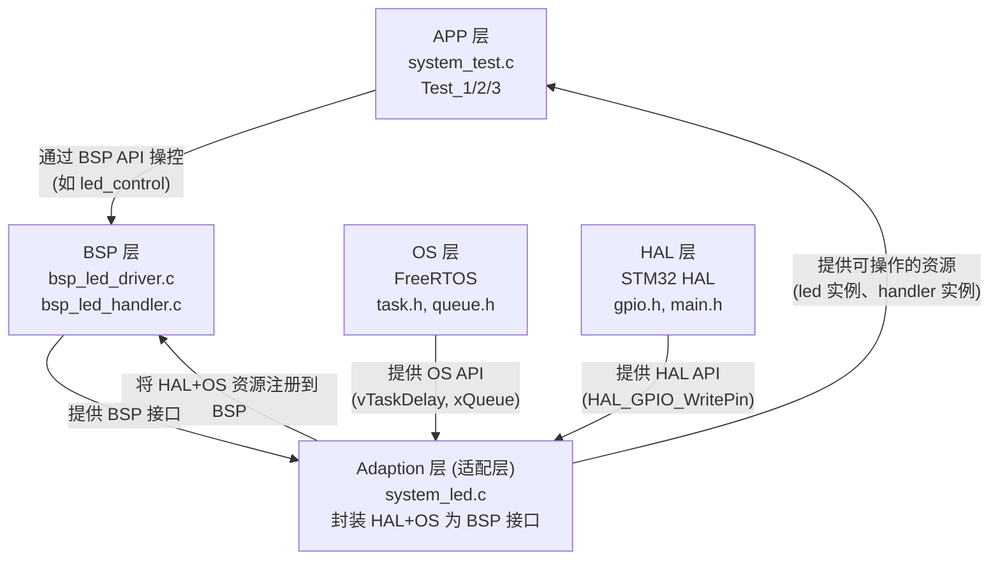
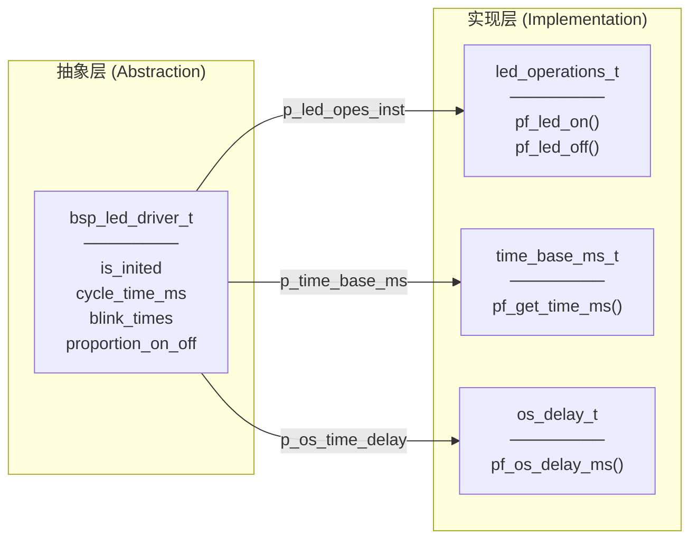
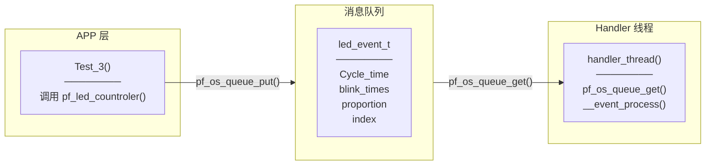

##### 6. 将 LED 对象属性清空后，对其使用内部初始化如果初始化失败将 LED 对象操作函数赋值 NULL

```

 led_status_t led_driver_init(bsp_led_driver_t *const self) {

  led_status_t ret = LED_OK;

  DEBUG_OUT("led init start\r\n");

  /* ── 参数有效性检查 — 空指针保护 ─────────────────────────────────── */

if (NULL == self) {

#ifdef DEBUG

    DEBUG_OUT("LED_ERRORPARAMETER\r\n");

#endif

    return LED_ERRORPARAMETER;

  }

  /* ── 初始化序列 ──────────────────────────────────────────────────── */

  /* 1. 确保 LED 初始为熄灭状态 */

  self->p_led_opes_inst->pf_led_off();

  /* 2. 等待 600ms，让电源/GPIO 稳定 */

  self->p_os_time_delay->pf_os_delay_ms(600);

  /* 3. 获取当前时间戳，作为闪烁时序的基准点 */

  uint32_t time_stamp = 0;

  self->p_time_base_ms->pf_get_time_ms(&time_stamp);

  return ret;

}

```

##### 7 . 初始化成功标记初始化完成并返回状态值

```

/* ── 调用内部初始化 ───────────────────────────────────────────────── */

  ret = led_driver_init(self);

  if (LED_OK != ret) {

#ifdef DEBUG

    DEBUG_OUT("LED_init_failed\r\n");

#endif

    /* 初始化失败 → 清空接口指针，防止外部误用                      */

    self->p_led_opes_inst = NULL;

    self->p_os_time_delay = NULL;

    self->p_time_base_ms = NULL;

    return ret;

  }

  /* ── 标记初始化完成 ──────────────────────────────────────────────── */

  self->is_inited = INITED;

#ifdef DEBUG

  DEBUG_OUT("LED init finished\r\n");

#endif // DEBUG

  return ret;

```

##### 8. 开始编写控制 LED 以设定的属性来闪烁的函数，传入 bsp_led_driver_t 的 self 指针与需要的 LED 对象属性

##### 9. ==判断其指针是否空指针与其 self 是否已初始化==

##### 10 . 将传入参数赋值给 self 并调用闪烁函数

```

 static led_status_t led_control(bsp_led_driver_t *const self, // target

                                uint32_t cycle_time,    //     Cycle_time[ms]

                                uint32_t blink_times,   // blink_times[times]

                                proportion_t proportion //  proportion_on_off

) {

  /*************0.Checing the target statues  **********/

  led_status_t ret = LED_OK;

  // 1.check if the target has been instantiated

  if (NULL == self || NOT_INITED == self->is_inited) {

    // 2.if not instantiated, return error to caller

    // TBD:3.option - mutex to upgrade low priority task to init target ASAP

    ret = LED_ERRORPARAMETER;

    return ret;

  }

  /*************1.Checing the input parameters**********00) &&

        ((PROPORTIONN_1_3 <= proportion) &&

         (PROPORTIONN_1_1 >= proportion))) // end of !(

      )                                    // end of if(

  {

    ret = LED_ERRORPARAMETER;

    return ret;

  }

  /*************2.Adding the data in target*************/

  self->cycle_time_ms = cycle_time;

  self->blink_times = blink_times;

  self->proportion_on_off = proportion;

  /************3. run the operations of led************HOLDERmquzxx9nm3kuw261}

 void Test_1(void) {

  led_status_t ret = LED_OK;

  bsp_led_driver_t led1;

  bsp_led_driver_t led2;

  /* 实例化两个 LED 驱动 */

  ret = led_driver_inst(&led1, &led_operations_myown, &os_delay_myown,

                        &time_base_ms_myown);

  ret = led_driver_inst(&led2, &led_operations_myown, &os_delay_myown,

                        &time_base_ms_myown);

  /* 测试闪烁功能 */

  ret = led1.pf_led_countroler(&led1, 5, 30, PROPORTIONN_1_1);

  ret = led1.pf_led_countroler(&led2, 2, 10, PROPORTIONN_1_1);

}

```

#### 第六步：handler.h 根据架构设计来编写

##### 1. 开始 handler.h 文件的编写，先添加头文件等注释与头文件保护

##### 2 . 根据 LED 对象的内部实现与外部接口来编写 bsp_handler_t 结构体，同样定义了初始化标志防止野指针的出现，还定义了 LED 实例数组与队列线程句柄

```

 typedef struct bsp_led_handler {

    uint8_t is_inited;                          /* 初始化标志: HANDLER_INITED / HANDLER_NOT_INITED */

    instance_registered_t instances;             /* LED 实例注册表                                 */

    void* queue_handler;
    void* thread_handler;
    /* ── 桥接模式: 硬件接口 ────────────────────────────────────────────── */
    handler_time_base_ms_t *p_time_base_ms;      /* 指向毫秒时间基准接口                            */

#ifdef OS_SUPPROT

    handler_os_delay_t *p_os_time_delay;         /* 指向 OS 阻塞延时接口                            */

    handler_os_queue_t *p_os_queue_interface;    /* 指向 OS 消息队列接口                            */

    handler_os_critical_t *p_os_critical;        /* 指向 OS 临界区接口                              */

    handler_os_thread_t * p_os_thread;

#endif

    /* ── 策略选择: 闪烁算法 ────────────────────────────────────────────── */
    pf_handler_led_control_t pf_led_countroler;  /* 指向 LED 控制算法函数 (闪烁策略)               */
    pf_handler_led_register_t pf_led_register;   /* 指向 LED 注册函数                              */

} bsp_led_handler_t;

```

##### 3 . 创建 LED 对象实例指针数组是为了方便管理 LED 实例

```

 typedef struct {

    uint32_t led_instance_num;                                /* 已注册的 LED 实例数量 */

    bsp_led_driver_t *led_instance_group[MAX_INSTANCE_NUMBER]; /* LED 实例指针数组      */

} instance_registered_t;

```

##### 4 . 同时还定义 handler 状态枚举来反映 handler 函数状态

```

typedef enum {

    HANDLER_OK               = 0,  /* 操作成功完成                                */

    HANDLER_ERROR            = 1,  /* 运行时未归类错误                            */

    HANDLER_ERRORTIMEOUT     = 2,  /* 操作超时                                    */

    HANDLER_ERRORRESOURCE    = 3,  /* 资源不可用                                  */

    HANDLER_ERRORPARAMETER   = 4,  /* 参数错误                                    */

    HANDLER_ERRORNOMEMORY    = 5,  /* 内存不足                                    */

    HANDLER_ERRORISR         = 6,  /* 不允许在中断上下文中调用                     */

    HANDLER_RESERVED         = 0x7FFFFFFF /* 保留 - 32 位对齐强制值               */

} led_handler_status_t;

```

##### 5 . 对于 OS 层的操作函数要根据 OS 层函数进行调整，利用函数指针来实现面向对象思想

```

/**

 * @struct handler_os_queue_t
 * @brief  OS 消息队列接口
 *
 *         仅在定义 OS_SUPPROT 宏时可用。
 *         提供消息队列的创建、发送、接收、删除操作，
 *         用于 LED Handler 与任务间的消息通信。

 */

typedef struct {

    led_handler_status_t (*pf_os_queue_create)(uint32_t const item_num,

                                               uint32_t const item_size,

                                               void **const queue_handler);

    led_handler_status_t (*pf_os_queue_put)(void *const queue_handler,
                                            void *const item,
                                            uint32_t timeout);

    led_handler_status_t (*pf_os_queue_get)(void *const queue_handler,
                                            void *const msg,
                                            uint32_t timeout);

    led_handler_status_t (*pf_os_queue_delete)(void *const queue_handler);

} handler_os_queue_t;

```

##### 6 . 定义 LED 控制函数与实例注册函数

```

/**

 * @typedef pf_handler_led_control_t
 * @brief   Handler 层 LED 控制策略函数指针
 *
 *          指向具体的 LED 闪烁策略实现。
 *          用于 Handler 统一调度所有注册的 LED 实例执行相同策略。
 *
 * @param[in]  self            Handler 实例指针
 * @param[in]  cycle_time_ms 闪烁周期总时长 (ms)
 * @param[in]  blink_times 闪烁次数
 * @param[in]  proportion 亮灭占空比
 * @param[in]  index           LED 实例索引
 * @return led_handler_status_t 操作状态码
 */
typedef led_handler_status_t (*pf_handler_led_control_t)(
    bsp_led_handler_t *const self,
    uint32_t cycle_time_ms,
    uint32_t blink_times,
    proportion_t proportion,
    led_index_t const index);

/**

 * @typedef pf_handler_led_register_t
 * @brief   LED 注册函数指针
 *
 *          用于将 LED 驱动实例注册到 Handler 管理器中。
 *          注册成功后返回分配的索引，后续通过索引访问该 LED。
 *
 * @param[in]      self        Handler 实例指针
 * @param[in]      led_driver 待注册的 LED 驱动实例
 * @param[out]     index 输出参数，返回分配的 LED 索引
 * @return led_handler_status_t 操作状态码
 */
typedef led_handler_status_t (*pf_handler_led_register_t)(
    bsp_led_handler_t *const self,
    bsp_led_driver_t *const led_driver,
    led_index_t *const index);

```

#### 第七步：handler.c 根据.h 文件的编写

##### 1.添加头文件等注释

##### 2.根据 bsp_led_handler_t 结构体来编写 handler 构造函数，第一个传入的参数为 self 指针，其余参数主要为 OS 层操作函数

```

led_handler_status_t led_handler_inst(bsp_led_handler_t *const self,

#ifdef OS_SUPPROT

                                      handler_os_delay_t *const os_delay,

                                      handler_os_queue_t *const os_queue,

                                      handler_os_critical_t *const os_critical,

                                      handler_os_thread_t *const os_thread,

#endif

                                      handler_time_base_ms_t *const time_base)

```

##### 3.涉及到指针，==进入函数第一步就是检查函数是否为空指针==（利用宏定义 DEBUG 输出日志信息以及状态码返回值）

```

/* 参数检查 */

  if ((NULL == self) ||

#ifdef OS_SUPPROT

      (NULL == os_delay) || (NULL == os_queue) || (NULL == os_critical) ||

      (NULL == os_thread) ||

#endif

      (NULL == time_base)) {

#ifdef OS_SUPPROT

    DEBUG_OUT("HANDLER_ERRORPARAMETER\r\n");

#endif

    ret = HANDLER_ERRORPARAMETER;

    return ret;

  }

```

##### 4. 第二步就是==检查是否已初始化==避免程序崩溃 / 未定义错误（野指针问题），利用 DEBUG 输出日志

```

/* 检查是否已初始化 */

  if (HANDLER_INITED == self->is_inited) {

#ifdef OS_SUPPROT

    DEBUG_OUT("HANDLER_ERRORRESOURCE\r\n");

#endif

    ret = HANDLER_ERRORRESOURCE;

    return ret;

  }

```

##### 5.为 LED 对象的 OS 操作函数、 tick 函数以及外部接口函数绑定实例函数

```

/* 绑定硬件接口 */

  self->p_time_base_ms = time_base;

#ifdef OS_SUPPROT

  self->p_os_time_delay = os_delay;

  self->p_os_queue_interface = os_queue;

  self->p_os_critical = os_critical;

  self->p_os_thread = os_thread;

#endif

  /* 设置控制策略函数 */

  self->pf_led_countroler = handler_led_control;

  self->pf_led_register = led_register;

```

##### 6.创建 LED 实例数组

```

/* 初始化实例数组 */

  self->instances.led_instance_num = 0;

  ret = __array_init(self->instances.led_instance_group, MAX_INSTANCE_NUMBER);

  if (HANDLER_OK != ret) {

#ifdef DEBUG

    DEBUG_OUT("HANDLER_ERRORNOMEMORY at __array_init\r\n");

#endif

    return ret;

  }

```

##### 7.创建 LED 对象的线程与队列

```

#ifdef OS_SUPPROT

  /* 创建 Handler 线程 */

  ret = self->p_os_thread->pf_os_thread_create(handler_thread,

                                               "handler_thread",

                                               256,

                                               self,

                                               0,

                                               &self->thread_handler);

  if (HANDLER_OK != ret) {

#ifdef DEBUG

    DEBUG_OUT("HANDLER_ERRORNOMEMORY at pf_os_thread_create\r\n");

#endif

    return ret;

  }

  /* 创建消息队列 */

  ret = self->p_os_queue_interface->pf_os_queue_create(10,

                                                       sizeof(led_event_t),

                                                       &(self->queue_handler));

  if (HANDLER_OK != ret) {

#ifdef DEBUG

    DEBUG_OUT("HANDLER_ERRORNOMEMORY at pf_os_queue_create\r\n");

#endif

    self->p_os_thread->pf_os_thread_delete(self->thread_handler);

    return ret;

  }

#endif

```

##### 8.初始化成功标记初始化完成并返回状态值

##### 9.开始编写 LED 控制函数

```

led_handler_status_t handler_led_control(bsp_led_handler_t *const self,

                                         uint32_t Cycle_time,

                                         uint32_t blink_times,

                                         proportion_t proportion_on_off,

                                         led_index_t const index) {

#ifdef DEBUG

  DEBUG_OUT("Start_handler_led_control \r\n");

#endif

  led_handler_status_t ret = HANDLER_OK;

#ifdef DEBUG

  DEBUG_OUT("Checing the target statues \r\n");

#endif

  /* 检查 Handler 是否已初始化 (使用 Handler 层的 HANDLER_NOT_INITED 常量) */

  if (HANDLER_NOT_INITED == self->is_inited) {

#ifdef DEBUG

    DEBUG_OUT("HANDLER_ERRORRESOURCE \r\n");

#endif

    ret = HANDLER_ERRORRESOURCE;

    return ret;

  }

#ifdef DEBUG

  DEBUG_OUT("Checing the input parameters \r\n");

#endif

  /* 参数检查 */

  if (!((Cycle_time < 10000) && (blink_times < 1000) &&

        ((PROPORTIONN_1_3 <= proportion_on_off) &&

         (PROPORTIONN_1_1 >= proportion_on_off)) &&

        (index <= MAX_INSTANCE_NUMBER))) {

#ifdef DEBUG

    DEBUG_OUT("HANDLER_ERRORRESOURCE \r\n");

#endif

    ret = HANDLER_ERRORPARAMETER;

    return ret;

  }

#ifdef DEBUG

  DEBUG_OUT("Sending event to LED queue \r\n");

#endif

  /* 构造事件并发送到队列 */

  led_event_t let_event = {

      .Cycle_time = Cycle_time,

      .blink_times = blink_times,

      .proportion_on_off = proportion_on_off,

      .index = index};

  ret = self->p_os_queue_interface->pf_os_queue_put(self->queue_handler,

                                                     &let_event, 0);

  if (HANDLER_OK != ret) {

#ifdef DEBUG

    DEBUG_OUT("HANDLER_ERRORNOMEMORY\r\n");

#endif

    return ret;

  }

#ifdef DEBUG

  DEBUG_OUT("Sending event to LED queue successfully!!\r\n");

#endif

  return ret;

}

```

##### 10.开始编写 LED 实例注册函数

```

led_handler_status_t led_register(bsp_led_handler_t *const self,

                                  bsp_led_driver_t *const led_driver,

                                  led_index_t *const index) {

  led_handler_status_t ret = HANDLER_OK;

#ifdef DEBUG

  DEBUG_OUT("Start_led_register\r\n");

#endif

  /* 参数检查 */

  if ((NULL == led_driver) || (NULL == index) ||

      (HANDLER_NOT_INITED == self->is_inited)) {

#ifdef DEBUG

    DEBUG_OUT("HANDLER_ERRORPARAMETER\r\n");

#endif

    ret = HANDLER_ERRORPARAMETER;

    return ret;

  }

  /* 检查 LED 驱动是否已初始化 (使用 Driver 层的 INITED 常量) */

  if (INITED != led_driver->is_inited) {

#ifdef DEBUG

    DEBUG_OUT("HANDLER_ERRORRESOURCE\r\n");

#endif

    ret = HANDLER_ERRORRESOURCE;

    return ret;

  }

  /* 检查实例数量是否已满 */

  if ((MAX_INSTANCE_NUMBER - self->instances.led_instance_num) == 0) {

    ret = HANDLER_ERRORRESOURCE;

    return ret;

  }

#ifdef OS_SUPPROT

  /* 进入临界区，保护共享资源 */

  self->p_os_critical->pf_os_critical_enter();

#endif

  /* 注册 LED 实例 */

  if ((MAX_INSTANCE_NUMBER - self->instances.led_instance_num) > 0) {

    self->instances.led_instance_group[self->instances.led_instance_num] =

        led_driver;

    *index = (led_index_t)self->instances.led_instance_num;

    self->instances.led_instance_num++;

  }

#ifdef OS_SUPPROT

  /* 退出临界区 */

  self->p_os_critical->pf_os_critical_exit();

#endif

  return HANDLER_OK;

}

```

##### 11.创建 LED 线程函数

```

led_handler_status_t handler_thread(void *argument) {

  osDelay(1000);

#ifdef DEBUG

  DEBUG_OUT("Start_handler_thread \r\n");

#endif

  led_handler_status_t ret = HANDLER_OK;

  bsp_led_handler_t *p_led_handler;

  led_event_t msg;

  osDelay(10);

  if (NULL != argument) {

    p_led_handler = argument;

  }

  /* 主循环: 接收并处理 LED 事件 */

  for (;;) {

    DEBUG_OUT("Start_handler_thread 2\r\n");

    ret = p_led_handler->p_os_queue_interface->pf_os_queue_get(
        p_led_handler->queue_handler, &msg, 0);

    if (HANDLER_OK == ret) {
      DEBUG_OUT("the message received \r\n");
      __event_process(p_led_handler, msg);
    }

    osDelay(1000);

  }

}

```

##### 12.编写 LED 事件处理函数

```

led_handler_status_t __event_process(bsp_led_handler_t *self, led_event_t msg) {

  led_handler_status_t ret = HANDLER_OK;

  /* 检查索引有效性 */

  if (!((MAX_INSTANCE_NUMBER > msg.index) ||

        (LED_NOT_INITIALIZED == msg.index))) {

#ifdef DEBUG

    DEBUG_OUT("HANDLER_ERRORRESOURCE __event_process index checking\r\n");

#endif

    return HANDLER_ERRORRESOURCE;

  }

  /* 检查是否已初始化 */

  if (LED_NOT_INITIALIZED == msg.index) {

#ifdef DEBUG

    DEBUG_OUT("__event_process LED_NOT_INITIALIZED\r\n");

#endif

    return HANDLER_ERRORRESOURCE;

  }

  /* 检查驱动是否已注册 */

  if (INIT_PATTERN == self->instances.led_instance_group[msg.index]) {

#ifdef DEBUG

    DEBUG_OUT("HANDLER_ERRORRESOURCE at __event_process\r\n");

#endif

    return HANDLER_ERRORRESOURCE;

  }

#ifdef DEBUG

  DEBUG_OUT("Start Processing at __event_process\r\n");

#endif

  /* 设置 LED 参数 */

  (self->instances.led_instance_group[msg.index])->cycle_time_ms =

      msg.Cycle_time;

  (self->instances.led_instance_group[msg.index])->blink_times =

      msg.blink_times;

  (self->instances.led_instance_group[msg.index])->proportion_on_off =

      msg.proportion_on_off;

  /* 执行 LED 闪烁 */

  ret = led_blink_handler(self->instances.led_instance_group[msg.index]);

  if (HANDLER_OK != ret) {

#ifdef DEBUG

    DEBUG_OUT("event processed failed at __event_process\r\n");

#endif

    return HANDLER_ERROR;

  }

#ifdef DEBUG

  DEBUG_OUT("event processed at __event_process\r\n");

#endif

  return ret;

}

```

##### 13. handle 层的 LED 闪烁函数与 driver 层的代码逻辑一致

#### 第八步 系统集成层中 handle 实例函数与代码单元测试

##### 1.##### 1. Handler.c 和.h 文件都编写完毕，现在开始编写实例函数与测试函数，实例函数与测试函数分别创建于系统集成层的 system_led 和 system_test 文件中，这样结构清晰

##### 2. OS 层操作函数，外部接口函数，系统 tick 函数，并且==创建实例结构体传入 LED 对象构造函数中绑定 LED 对象==

##### 3. 打开 DUBUD 日志输出，观察日志信息是否正常

##### 4 . 测试闪烁功能，是否能按要求正确实现功能

#### 第九步 利用 attribute 和 SCT 实现飞秒启动

##### 1.利用 attribute 指令将代码放入指定内存段

```

/**

 * @def BSP_TARGET_SECTION
 * @brief BSP 全局实例放入此 section，便于链接器管理和调试器查看
 */
#define BSP_TARGET_SECTION "bsp_target"

/* Private variables ---------------------------------------------------------*/

/* ── BSP 层全局实例 ───────────────────────────────────────────────────────── */

/**

 * @brief  LED Handler 管理器实例 (全局唯一)
 * @note 使用 INIT_PATTERN_SYSTEM 初始化，标识该实例由系统层创建
 * @note 放入 bsp_target section，便于调试器定位
 */
__attribute__((used, section(BSP_TARGET_SECTION)))
bsp_led_handler_t handler_1 = {INIT_PATTERN_SYSTEM};

/**

 * @brief  LED 驱动实例 1 (全局唯一)
 * @note 使用 INIT_PATTERN_SYSTEM 初始化，标识该实例由系统层创建
 * @note 放入 bsp_target section，便于调试器定位
 */
__attribute__((used, section(BSP_TARGET_SECTION)))
bsp_led_driver_t led1 = {INIT_PATTERN_SYSTEM};

```

##### 2.在 SCT 文件中添加自定义内存段，放入 SRAM 中（SRAM 访问速度比 Flash 快很多）

```

LR_IROM1 0x08000000 0x00080000 {

	ER_IROM1 0x08000000 0x00080000 {

		*.o (RESET, +First) 

		*(InRoot$$Sections) 

		.ANY (+RO) 

		.ANY (+XO) 

	}

	RW_IRAM1 0x20000000 0x00020000 {

		.ANY (+RW +ZI) 

	}

}

LR_IROM2 0x08007000 0x00001000 {

	ER_IROM1 0x20019000 0x00001000 {

		*.o (bsp_target) 

	}

}

```

### 关键公式/结论

> 从项目架构中提取的核心设计模式、公式和原则。

---

#### 1. 架构分层



**层级职责**：

| 层级 | 核心文件 | 职责 | 移植性 |
|------|----------|------|--------|
| **APP 层** | `system_test.c` | 应用逻辑：调用 BSP API 控制 LED | ⚠️ 需修改 |
| **Adaption 层** | `system_led.c` | 适配层：封装 HAL+OS 为 BSP 接口 | ⚠️ 需修改 |
| **BSP 层** | `bsp_led_driver.c/h`<br/>`bsp_led_handler.c/h` | 业务逻辑：闪烁策略、多实例调度 | ✅ 无需修改 |
| **OS 层** | `task.h`, `queue.h`<br/>`FreeRTOS/` | 任务调度、消息队列、同步原语 | 📦 中间件 |
| **HAL 层** | `main.c`, `gpio.c`<br/>`Drivers/` | 硬件抽象：GPIO、定时器、外设 | 🔄 自动生成 |

**关键设计要点**：

- **依赖方向**：APP → BSP ← Adaption ← OS + HAL
- **接口注入**：Adaption 层将 OS + HAL API 封装为统一接口注入 BSP 层
- **双向通信**：APP 层通过 BSP API 操控，BSP 层通过 Adaption 层获取资源

---

#### 2. 核心设计模式

**桥接模式 (Bridge Pattern)**：分离抽象与实现



**策略模式 (Strategy Pattern)**：运行时切换算法

```c
// 函数指针指向具体策略
pf_led_control_t pf_led_countroler;

// 可扩展的策略
led_status_t led_blink(bsp_led_driver_t *self);  // 闪烁算法
// 可扩展：呼吸灯、流水灯等
```

**事件驱动模式**：消息队列异步通信



**注册表模式**：多实例管理

```c
typedef struct {
    uint32_t led_instance_num;                    // 已注册数量
    bsp_led_driver_t *led_instance_group[10];     // 实例指针数组
} instance_registered_t;
```

---

#### 3. 核心设计原则

| 原则 | 实现方式 | 代码示例 | 收益 |
|------|----------|----------|------|
| **关注点分离** | 五层架构各司其职 | APP/Adaption/BSP/OS/HAL 分离 | 职责清晰，易于维护 |
| **依赖倒置** | 函数指针接口 | `led_operations_t *p_led_opes_inst` | BSP 层跨平台复用 |
| **接口隔离** | 独立的 OS 接口结构体 | `os_delay_t`, `handler_os_queue_t` | 条件编译，按需裁剪 |
| **防御式编程** | NULL 检查 + 初始化标志 | `if (NULL == self) return LED_ERRORPARAMETER` | 防止野指针和 HardFault |
| **事件驱动** | 消息队列 + 后台线程 | `pf_os_queue_put/get()` | APP 层非阻塞 |
| **原子保护** | 临界区 | `pf_os_critical_enter/exit()` | 防止多任务数据竞争 |
| **注册表管理** | 实例指针数组 | `led_instance_group[10]` | 多实例统一管理 |

**关键设计要点**：

- **依赖方向**：APP → BSP ← Adaption ← OS + HAL
- **接口注入**：Adaption 层将 OS + HAL API 封装为统一接口注入 BSP 层
- **双向通信**：APP 层通过 BSP API 操控，BSP 层通过 Adaption 层获取资源
- **条件编译**：通过 `OS_SUPPROT` 宏控制是否启用 OS 支持

---

#### 4. 移植指南

**仅需修改的文件**：

- `System/Src/system_led.c` — 平台适配函数
- `System/Inc/system_led.h` — 适配函数声明

**无需修改的文件**：

- `BSP/LED/Src/bsp_led_driver.c` — 业务逻辑
- `BSP/LED/Src/bsp_led_handler.c` — 多实例调度

**适配接口清单**：

| 接口类型 | 函数签名 | STM32 实现 |
|----------|----------|------------|
| LED 操作 | `led_status_t (*pf_led_on/off)(void)` | `HAL_GPIO_WritePin()` |
| 时间基准 | `led_status_t (*pf_get_time_ms)(uint32_t*)` | `HAL_GetTick()` |
| OS 延时 | `led_status_t (*pf_os_delay_ms)(uint32_t)` | `vTaskDelay()` |
| 消息队列 | `handler_os_queue_t` | `xQueueCreate/Send/Receive` |
| 临界区 | `handler_os_critical_t` | `vPortEnterCritical()` |

### 常见问题

> 现象 → 根因 → 修复

| 问题 | 现象 | 根因 | 修复 |
|------|------|------|------|
| **LED 不亮** | 调用 led_on() 后 LED 无反应 | GPIO 方向未配置为输出，或电平极性错误 | 检查 GPIO 初始化，确认 Active High/Low |
| **闪烁时间不准** | LED 闪烁周期与预期不符 | vTaskDelay() 精度受系统滴答频率影响 | 调整 configTICK_RATE_HZ，或使用高精度定时器 |
| **HardFault** | 程序崩溃，进入异常处理 | 野指针访问：未初始化结构体或初始化失败后继续使用 | 检查 is_inited 标志，确保初始化成功后再使用 |
| **多实例冲突** | 多个 LED 同时控制时行为异常 | 未使用临界区保护共享资源（如实例注册表） | 在 led_register() 中添加 pf_os_critical_enter/exit |
| **队列溢出** | 消息丢失或阻塞 | 队列深度不足，或发送频率过高 | 增大队列深度，或降低发送频率 |
| **移植后不工作** | 更换平台后 LED 无响应 | Adaption 层未正确封装 HAL/OS API | 检查 system_led.c 中的适配函数实现 |
| **编译报错** | 未定义的符号或类型错误 | 头文件未包含，或宏定义未开启 | 检查 #include 和 #define，确认 OS_SUPPROT 宏 |
| **内存不足** | 链接器报错 overflow | 队列或线程栈占用过多 SRAM | 减小栈深度或队列深度，优化内存使用 |

---

## 📎 相关资料

### 🎥 视频链接

> B 站 / YouTube 教程，优先选项目实战类和原理动画类。

- 搜索关键词：`STM32 FreeRTOS LED 控制教程` — B 站搜索 RTOS 任务调度和队列使用
- 搜索关键词：`嵌入式设计模式 桥接模式` — B 站搜索设计模式在嵌入式中的应用

### 🔗 博客/文档链接

> 分析最透彻的博客、官方文档、社区帖子。

- [STM32F411 官方参考手册](https://www.st.com/resource/en/reference_manual/rm0383-stm32f411xc411xe-advanced-armbased-32bit-mcus-stmicroelectronics.pdf) — GPIO、定时器、DMA 章节
- [FreeRTOS 官方文档](https://www.freertos.org/Documentation/02-Kernel/02-Kernel-Porting/01-Porting-a-FreeRTOS-kernel) — 任务管理、队列、临界区 API
- [桥接模式详解](https://refactoring.guru/design-patterns/bridge) — GoF 设计模式参考
- [STM32 HAL 库 API 文档](https://www.st.com/resource/en/user_manual/um1724-description-of-stm32f4-hal-and-lowlayer-drivers-stmicroelectronics.pdf) — HAL_GPIO_WritePin, HAL_GetTick 等 API
- 搜索关键词：`C 语言面向对象 桥接模式 嵌入式` — CSDN/知乎搜索相关博客

### 💻 仓库链接

> GitHub / Gitee 源码仓库，含 Demo 工程和工具链。

- [KEY_LED 项目源码](https://gitee.com/TNSH/shuai) — 本项目完整源码，含 Demo 工程和 SCT 文件
- [FreeRTOS-Kernel](https://github.com/FreeRTOS/FreeRTOS-Kernel) — FreeRTOS 官方内核源码
- [STM32CubeF4](https://github.com/STMicroelectronics/STM32CubeF4) — STM32 HAL 库官方仓库

### 📄 代码/附件

> 本地 PDF、代码包、工具链文件。

- `MDK-ARM/build/KEY_LED/KEY_LED.sct` — 链接器散列文件，配置内存布局
- `BSP/LED/Inc/bsp_led_driver.h` — 桥接模式核心数据结构定义
- `System/Src/system_led.c` — 平台适配层实现参考
- `System/Src/system_test.c` — 三级自测代码（Test_1/2/3）

---

## 💬 Q&A

> 自问自答，检验理解深度。按难度递进排列。

### 🟢 基础

#### Q1：桥接模式的核心思想是什么？

1. 提取对象的通用部分，提高复用性，方便扩展以及维护
2. 降低架构层级之间的耦合性，便于移植

#### Q2：为什么使用函数指针而不是直接调用函数？

1. 使用函数指针可以实现多态即动态绑定，只有在使用的时候才能决定使用哪个函数

#### Q3：bsp_led_driver_t 中的 is_inited 标志有什么作用？

1. 防止其他函数因为未初始化产生的野指针导致的 hard fault 报错
2. 防止重复初始化

#### Q4：led_operations_t 结构体包含哪些函数指针？

1. LED 的开启函数
2. LED 的关闭函数

### 🟡 进阶

#### Q5：消息队列在 Handler 层是如何实现异步通信的？

1. 通过消息队列将 LED 事件发送给 LED 线程，再 LED 线程接收到消息后会操作 LED

#### Q6：为什么需要临界区保护？哪些操作需要临界区？

1. Rtos 的任务调度极易产生野指针或者指针越界导致 hardfault 报错
2. 设计到数组，指针，消息队列发送，长时间操作的都需要

#### Q7：SCT 文件中 bsp_target section 的作用是什么？

1. 在 flash 地址中空出一 部分内容存放初始化代码
2. 并直接加载在 SRAM 无需再次编译

#### Q8：如何实现的飞秒启动？快在哪里？

1. 先利用 attribute 将代码放入指定段中
2. 在 sct 文件中定义自定义段，并加载到 SRAM 中
3. 无需多次入栈出栈，节省启动时间
4. 无需二次编译，直接指针访问初始化函数地址即可？

### 🔴 困难

#### Q9：如果要添加呼吸灯功能，需要修改哪些文件？

1. 先分析呼吸灯的实现，控制 LED 的电压输出来达到渐变效果
2. 需要定时器的 pwm 输出，这是从 LED 的内部实现出发的，而内部实现在 driver 文件中
3. 同时还需要提供外部接口给 OS 或 app 层让其可以使用呼吸灯功能，handler 文件的 led_control 函数也需要修改
4. 系统集成层叫适配层更合适，需要编写实例函数绑定对象结构体成员
5. 在单元测试函数中添加呼吸灯功能测试

#### Q10：如何将本项目移植到 ESP32 平台？

1. Bsp 层的 driver 和 handle 无需修改，直接移植即可
2. System 层的 system_led 需要将实例函数中的内部实现与 os 操作函数替换
3. 最后使用 system_test 中的单元测试函数测试 LED 对象的构造，挂载以及使用是否正常

#### Q11：多任务环境下，如何保证 LED 实例注册的线程安全？

1. 利用临界区保护来保持线程安全与原子性操作
2. 如使用互斥锁来防止其他任务重复注册和注册过程中切换任务调用相关操作函数
3. 也可以暂停任务调度，注册完成后再开启任务调度
4. 最极端的情况就是关闭所有中断后再注册

#### Q12：如果队列深度不足导致消息丢失，有哪些解决方案？

1. 深度不足是如何导致消息丢失的？传入值大小超出队列缓冲区字节大小
2. 最简单就是扩大队列缓冲区大小
3. 将值传递改为指针传递，如果传入值大于 4 个字节及以上
4. 利用双缓冲区来解决，一个接收一个处理

---

---

## 📝 纠错与解惑

> 对 Q&A 回答的反馈和建议，帮助加深理解。

---

### 🟢 基础问题反馈

#### Q1：桥接模式的核心思想是什么？

**✅ 回答正确！**

**补充说明**：

1. **分离抽象与实现**：桥接模式的核心是将「抽象部分」（控制策略）与「实现部分」（硬件操作）分离，让它们可以独立变化
2. **接口指针连接**：通过函数指针（如 `p_led_opes_inst`）建立抽象层与实现层的连接

---

#### Q2：为什么使用函数指针而不是直接调用函数？

**✅ 回答正确！**

**补充说明**：

1. **多态/动态绑定**：运行时决定调用哪个具体函数
2. **依赖倒置**：高层（BSP）不依赖低层（HAL/OS），通过接口指针实现依赖反转

---

#### Q3：bsp_led_driver_t 中的 is_inited 标志有什么作用？

**✅ 回答正确！**

**补充说明**：

1. **防止野指针**：未初始化时结构体指针可能指向随机内存，导致 HardFault
2. **防止重复初始化**：避免多次绑定接口导致资源冲突

---

#### Q4：led_operations_t 结构体包含哪些函数指针？

**✅ 回答正确！**

**补充说明**：

- `pf_led_on()`：点亮 LED
- `pf_led_off()`：熄灭 LED

---

### 🟡 进阶问题反馈

#### Q5：消息队列在 Handler 层是如何实现异步通信的？

**✅ 回答正确！**

**补充说明**：

- APP 层通过 `pf_os_queue_put()` 发送事件（非阻塞）
- Handler 线程通过 `pf_os_queue_get()` 接收事件并处理

---

#### Q6：为什么需要临界区保护？哪些操作需要临界区？

**⚠️ 回答需要修正！**

**❌ 你的回答**：

> "RTOS 的任务调度极易产生野指针或者指针越界导致 hardfault 报错 "

**✅ 正确理解**：

临界区保护的核心是**防止数据竞争**（Data Race），而不是防止野指针。

**需要临界区的操作**：

- ✅ LED 实例注册（`led_register()`）
- ✅ 实例计数修改（`led_instance_num++`）
- ✅ 共享变量读写

**不需要临界区的操作**：

- ❌ 消息队列操作（FreeRTOS 已内部保护）
- ❌ GPIO 操作（硬件原子）

---

#### Q7：SCT 文件中 bsp_target section 的作用是什么？

**⚠️ 回答需要修正！**

**❌ 你的回答**：

> " 在 flash 地址中空出一部分内容存放初始化代码，并直接加载在 SRAM 无需再次编译 "

**✅ 正确理解**：

bsp_target section 的作用是**将全局变量存放到 SRAM 中以提高访问速度**，而不是存放初始化代码。

**性能提升**：

| 操作 | Flash 访问 | SRAM 访问 | 提升 |
|------|------------|-----------|------|
| 读取数据 | 2-3 个等待周期 | 0 等待周期 | 2-3x |

---

#### Q8：如何实现的飞秒启动？快在哪里？

**⚠️ 回答需要修正！**

**❌ 你的回答**：

> " 无需多次入栈出栈，节省启动时间 "

**✅ 正确理解**：

飞秒启动的核心是**SRAM 零等待周期访问**，而不是避免入栈出栈。

**快在哪里？**

- **SRAM 访问**：0 等待周期，直接访问
- **Flash 访问**：2-3 个等待周期，需要预取
- **性能提升**：SRAM 比 Flash 快 2-3 倍

---

### 🔴 困难问题反馈

#### Q9：如果要添加呼吸灯功能，需要修改哪些文件？

**✅ 回答正确！**

**补充说明**：

需要修改的文件：

1. `bsp_led_driver.h/c`：添加呼吸灯算法
2. `bsp_led_handler.h/c`：修改事件处理
3. `system_led.c`：封装 PWM HAL API
4. `system_test.c`：添加测试用例

---

#### Q10：如何将本项目移植到 ESP32 平台？

**✅ 回答正确！**

---

#### Q11：多任务环境下，如何保证 LED 实例注册的线程安全？

**✅ 回答正确！**

**补充说明**：

| 方案 | 优点 | 缺点 |
|------|------|------|
| **临界区** | 简单高效 | 关中断影响实时性 |
| **互斥锁** | 灵活 | 开销较大 |
| **暂停调度** | 简单 | 影响所有任务 |

---

#### Q12：如果队列深度不足导致消息丢失，有哪些解决方案？

**✅ 回答正确！**

**补充说明**：

| 方案 | 优缺点 |
|------|--------|
| **扩大队列** | 简单，但占用更多 SRAM |
| **指针传递** | 节省内存，但需管理生命周期 |
| **双缓冲区** | 复杂，但高效 |

---

## 🎯 总结

| 问题 | 评价 | 核心修正 |
|------|------|----------|
| **Q1** | ✅ 正确 | - |
| **Q2** | ✅ 正确 | - |
| **Q3** | ✅ 正确 | - |
| **Q4** | ✅ 正确 | - |
| **Q5** | ✅ 正确 | - |
| **Q6** | ⚠️ 需修正 | 核心是「数据竞争」，不是「野指针」 |
| **Q7** | ⚠️ 需修正 | 作用是「提高访问速度」，不是「存放初始化代码」 |
| **Q8** | ⚠️ 需修正 | 快在「SRAM 零等待」，不是「避免入栈出栈」 |
| **Q9** | ✅ 正确 | - |
| **Q10** | ✅ 正确 | - |
| **Q11** | ✅ 正确 | - |
| **Q12** | ✅ 正确 | - |
