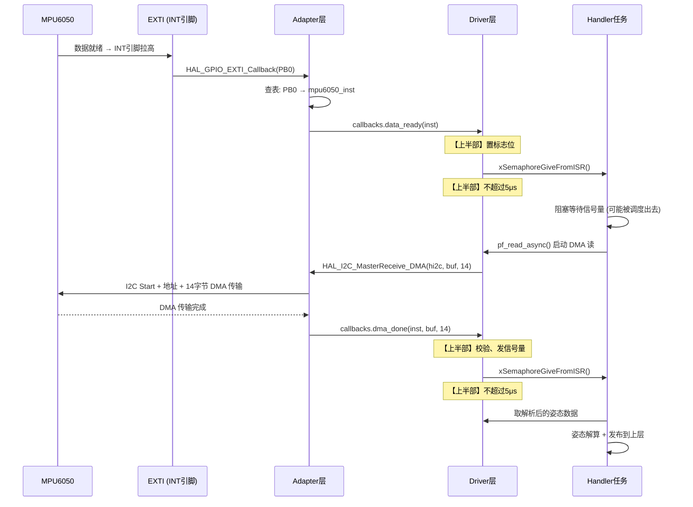

# 📖 引言

> 这篇笔记要讲什么？用一句话概括核心主题。

Bsp 层从 core 层芯片平台接收到通信接口和 tick 信号的同时，IRQ 和 DMA 的处理进阶的标准

---

# 📝driver 文件的设计思路

> 用一句话说清楚这个知识点是什么。

如何处理 bsp_xxx_driver 中内部实现的中断回调函数和 dma 中断回调函数与 adapter 层的芯片平台实际外部中断回调函数和 dma 回调函数的转接，以及 driver 中的中断回调函数如何处理异步处理和通知
## 实际意义

> 为什么会有该知识点？解决了什么实际问题？

### 问题起源：中断向量表属于芯片平台，但数据处理逻辑属于外设驱动

中断回调转接的核心矛盾在于：

- **中断向量表**（`EXTI0_IRQHandler`、`DMA1_Stream0_IRQHandler`）是芯片平台独有的，放在 Core/Adapter 层，由 STM32 HAL 管理
- **外设的业务逻辑**（MPU6050 数据就绪后读 FIFO、DMP 解算）属于 BSP driver 层，不应该绑定在 STM32 上
- 当 MPU6050 的 INT 引脚触发 EXTI 时，HAL 的回调 `HAL_GPIO_EXTI_Callback()` 如何"找到"正确的 driver 实例并调用其处理函数？

这就是**中断回调的跨层路由问题**——也是本笔记要解决的核心问题。

### 1. 中断回调的跨层转接是嵌入式分层架构中的"最后一公里"

AHT21 驱动（[[AHT21的driver文件架构设计思路]]）主要使用**同步阻塞**模式——发送命令 → 等待 → 轮询状态 → 读数据，所有操作在同一个任务上下文中完成，不涉及中断回调。

但 MPU6050 不同：

- 数据就绪由 INT 引脚以 **200Hz 频率触发外部中断**
- 数据量大（加速度 + 陀螺仪 + 温度 = 14 字节），**适合 DMA 传输**
- 姿态解算有实时性要求，**不能靠轮询**

这意味着 driver 必须处理两类**平台中断 → driver 回调**的转接：

| 中断源 | 平台侧入口 | driver 侧需要做什么 |
|--------|-----------|-------------------|
| INT 引脚 (EXTI) | `HAL_GPIO_EXTI_Callback(pin)` | 通知 driver"数据就绪，可以读了" |
| I2C DMA 接收完成 | `HAL_I2C_MasterRxCpltCallback(hi2c)` | 校验数据、解析、上报给 handler |
| I2C DMA 错误 | `HAL_I2C_ErrorCallback(hi2c)` | 重试或复位通信状态机 |

如果没有合理的转接机制，driver 就不得不在 `HAL_GPIO_EXTI_Callback()` 里直接写 MPU6050 的业务逻辑，导致 **driver 与 STM32 HAL 强耦合**——换一个 MCU 就要重写全部中断逻辑。

### 2. 回调注册/注入机制：让 driver"订阅"平台中断，而不是"入侵"平台代码

参考 AHT21 的 `iic_ops` / `irq_ops` 设计，MPU6050 driver 也通过**函数指针注入**来实现回调转接：

```c
// driver.h — driver 向上层（adapter）暴露回调注册接口
typedef void (*mpu6050_data_ready_cb_t)(void *user_data);
typedef void (*mpu6050_dma_done_cb_t)(void *user_data, uint8_t *buffer, uint16_t len);
typedef void (*mpu6050_error_cb_t)(void *user_data, uint32_t error_code);

typedef struct {
    mpu6050_data_ready_cb_t data_ready;  // INT 引脚触发时调用
    mpu6050_dma_done_cb_t   dma_done;    // DMA 传输完成时调用
    mpu6050_error_cb_t      on_error;    // 通信异常时调用
    void                    *user_data;   // 上下文指针（指向 driver 实例）
} mpu6050_irq_callbacks_t;
```

```
┌─────────────────────────────────────────────────────┐
│                  adapter 层 (STM32)                   │
│  HAL_GPIO_EXTI_Callback(pin)                        │
│    └→ 查表: pin=PB0 → mpu6050_inst1                 │
│       └→ 调用 mpu6050_inst1.callbacks.data_ready()  │
│                                                      │
│  HAL_I2C_MasterRxCpltCallback(hi2c)                 │
│    └→ 查表: hi2c=&hi2c1 → mpu6050_inst1             │
│       └→ 调用 mpu6050_inst1.callbacks.dma_done()    │
└──────────────────────┬──────────────────────────────┘
                       │ 函数指针调用（不依赖 HAL）
┌──────────────────────▼──────────────────────────────┐
│               BSP driver 层 (平台无关)                │
│  mpu6050_data_ready_isr() — 在回调中置位事件标志     │
│  mpu6050_dma_rx_isr()    — 校验、解析、发信号量      │
└─────────────────────────────────────────────────────┘
```

**实际意义**：
- adapter 层只做"转接"（中断来了 → 查表 → 调函数指针），不包含任何 MPU6050 业务逻辑
- driver 层只做"响应"（收到回调 → 处理数据），不依赖任何 STM32 HAL 接口
- 更换 MCU 时，只需重写 adapter 层的查表逻辑（用 ESP32 的 `gpio_isr_handler_add()` 替换 `HAL_GPIO_EXTI_Callback`），driver 层零改动

### 3. 中断上下半部分离：不让 ISR 做重活

**为什么要分离？**

ARM Cortex-M 的中断优先级机制决定了：ISR 执行期间，**同级和低优先级中断全部被阻塞**。如果 MPU6050 的 EXTI ISR 里直接跑 6 轴数据解算 + 卡尔曼滤波，会带来几个严重后果：

1. **丢失其他中断**：SysTick 被阻塞 → FreeRTOS tick 不计数 → 所有延时/超时失效
2. **中断延迟增大**：其他高优先级外设（如串口 DMA）必须等到 MPU6050 ISR 结束才能响应
3. **栈溢出风险**：ISR 使用 MSP（主栈），大计算量 + 中断嵌套会导致栈溢出，触发 HardFault

**正确做法 — 上半部 / 下半部模式**：

```
┌── 上半部 (ISR 上下文) ──────────────────┐
│  • 清除中断标志位                          │
│  • 判断中断来源（INT 还是 DMA 完成）        │
│  • 发送信号量 / 任务通知 / 队列消息         │
│  • 耗时: < 5μs，尽可能短                   │
└────────────┬────────────────────────────┘
             │ 通知机制 (Semaphore / TaskNotify)
┌────────────▼── 下半部 (任务上下文) ────────┐
│  • 阻塞等待信号量                           │
│  • 通过 I2C/DMA 读取 FIFO 数据              │
│  • CRC 校验 + 数据解析                      │
│  • 姿态解算 (Madgwick / Mahony)             │
│  • 发布数据到 handler 层                    │
│  • 耗时: 可到 ms 级别，不受中断限制          │
└───────────────────────────────────────────┘
```

**与笔记中 Q&A 的关联**：
- Q9 "中断延迟影响因素" → 上半部执行时间直接影响中断延迟
- Q2 "为什么少用中断在 FreeRTOS 中" → 中断过多会导致频繁的任务切换开销，且 ISR 过长会阻塞调度器
- Q8 "中断能否超过两个 tick 周期" → ISR 超过 2ms（1000Hz tick）会导致 SysTick 丢失，系统时基偏移

### 4. DMA 中断的异步通知链

当 I2C 使用 DMA 模式读取 MPU6050 数据时，整个流程是一个**跨层异步通知链**：



关键设计点：
- **每次中断只做最小工作**，把重活全部推到任务上下文
- **信号量作为中断→任务的同步原语**（也可以用任务通知，速度更快、开销更小）
- **DMA 完成 ≠ 数据可用**：driver 还需要做 CRC 校验（如果配置了）和字节序转换

### 5. 多实例支持：同一个 driver 驱动多个 MPU6050

一个机器人项目可能在机械臂关节处放 3 个 MPU6050。如果没有回调注册机制：

```c
// ❌ 错误做法：HAL 回调里硬编码设备
void HAL_GPIO_EXTI_Callback(uint16_t pin) {
    if (pin == GPIO_PIN_0) { process_mpu1(); }
    if (pin == GPIO_PIN_1) { process_mpu2(); }
    if (pin == GPIO_PIN_3) { process_mpu3(); }
}
// 问题：每加一个传感器就要改 HAL 层回调，且 driver 和 HAL 耦合
```

有了回调注册：

```c
// ✅ 正确做法：动态注册，adapter 只做查表转发
typedef struct {
    uint16_t            int_pin;
    I2C_HandleTypeDef   *hi2c;
    mpu6050_driver_t    driver;       // 平台无关的 driver 实例
    mpu6050_irq_callbacks_t callbacks;
} mpu6050_binding_t;

mpu6050_binding_t sensors[3] = {
    { .int_pin = GPIO_PIN_0, .hi2c = &hi2c1 },
    { .int_pin = GPIO_PIN_4, .hi2c = &hi2c1 },
    { .int_pin = GPIO_PIN_5, .hi2c = &hi2c2 },
};

void HAL_GPIO_EXTI_Callback(uint16_t pin) {
    for (int i = 0; i < 3; i++) {
        if (sensors[i].int_pin == pin) {
            sensors[i].callbacks.data_ready(&sensors[i].driver);
        }
    }
}
```

每增加一个 MPU6050，只需在 `sensors[]` 表里加一行，HAL 层回调逻辑不变。

### 6. 信号量之外的选择：为什么笔记 Q&A 里问"一定要用信号量吗？"

笔记中 Q&A 第 3 问："一定要用信号量来做中断和线程之间的同步吗？如果不是，那应该怎么做？这样做的好处是什么？"

| 同步方式 | 适用场景 | 优点 | 缺点 |
|---------|---------|------|------|
| **二值信号量** | 中断→单任务通知 | 简单、标准 | 有优先级反转风险（需互斥量保护共享数据） |
| **任务通知** | 中断→固定单任务 | **比信号量快 45%、RAM 开销更小** | 只能有一个接收者，不能广播 |
| **消息队列** | 中断→多任务、需传数据 | 可携带数据、可多对多 | 内存开销大、需预分配队列 |
| **事件组** | 多条件同步 | 等"DMA 完成 AND INT 触发"同时成立 | 无数据传递 |
| **回调链** | 分层架构 | 无需 RTOS 原语，纯函数指针 | 回调嵌套深、难以调试 |

**推荐做法**：对于 MPU6050 的 INT → 读数据场景，**任务通知是最佳选择**，因为：
- 数据就绪通知总是指向同一个处理任务，不需要广播
- 比信号量更轻量，减少中断中的 CPU 周期
- FreeRTOS 的 `xTaskNotifyFromISR()` 和 `ulTaskNotifyTake()` 天生支持中断上下文

---

**总结：本知识点的实际意义**

本笔记要解决的问题不是"怎么读写 MPU6050 寄存器"，而是**在分层架构下，如何让平台中断信号正确、高效、解耦地流向平台无关的外设驱动**。具体包括：

1. **回调转接机制** — adapter 层注册中断回调，通过函数指针转发给 driver，实现平台解耦
2. **中断上下半部分离** — ISR 只做标志位 + 发信号量（< 5μs），重活在任务中完成，保护系统实时性
3. **DMA 异步通知链** — 从 INT 触发 → DMA 读 → 数据校验 → 姿态解算，全链路异步，不阻塞 CPU
4. **多实例管理** — 一套 driver 代码驱动多个 MPU6050，通过查表+回调上下文实现实例隔离
5. **同步原语选择** — 任务通知 > 信号量（更快更轻），但需根据场景选择

> 这和 [[AHT21的driver文件架构设计思路]] 形成了互补：AHT21 侧重"同步阻塞 + 资源注入"，MPU6050 侧重"异步中断 + 回调路由"。两者共同构成了 BSP driver 设计的两个核心范式。

## 应用场景

> 在实际中主要被用来做什么？

### 场景 1：无人机/机器人姿态解算（IMU + AHRS）

**最典型的应用**。MPU6050 以 200Hz 频率通过 INT 引脚输出数据就绪信号。

```
硬件连接：MPU6050 INT → STM32 PB0 (EXTI0)
          MPU6050 SDA/SCL → I2C1 (DMA模式)

运行时流程：
┌──────────────────────────────────────────────────────┐
│ 200Hz 节奏                                           │
│                                                      │
│ T=0ms    INT↑ → ISR: 发任务通知                      │
│          Handler任务醒来: 启动DMA读14字节             │
│ T=0.5ms  DMA完成 → ISR: 校验+解析+发任务通知          │
│          Handler任务: Madgwick AHRS 解算              │
│ T=1.5ms  姿态数据发布到飞控任务 (消息队列)             │
│ T=5ms    下一轮 INT↑ (200Hz = 每5ms一次)              │
└──────────────────────────────────────────────────────┘
```

为什么必须用中断+回调而不是轮询？
- 200Hz = 每 5ms 一次，如果轮询间隔稍大就会丢数据
- 飞控任务需要精确的采样时间戳，INT 中断的时间确定性远好于轮询
- DMA 读数据期间 CPU 可以做姿态解算（上一帧数据），实现流水线并行

### 场景 2：DMA 双缓冲实现零拷贝高速采集

当采样率更高（如 ICM-20948 的 1kHz），用**双缓冲 + DMA 半完成中断**实现无缝数据流：

```
DMA 配置：循环模式，缓冲区大小 = 28 字节 (2帧)
┌─────────────────────────────────┐
│  buffer[0..13]  │  buffer[14..27] │
│  帧 N            │  帧 N+1          │
└─────────────────────────────────┘

HAL_I2C_MasterRxCpltCallback:    → 全完成→ 处理帧N+1
HAL_I2C_MasterRxHalfCpltCallback: → 半完成→ 处理帧N
```

```
时间线：
──────────────────────────────────────────────────────→
│  DMA写帧0  │  DMA写帧1  │  DMA写帧0  │  DMA写帧1  │
│  处理帧N-1  │  处理帧N    │  处理帧N+1  │            │
```

这里的核心是：**DMA 的半完成/全完成中断要通过 adapter → driver 的回调转接，让 driver 知道"哪一半缓冲可以处理了"，同时硬件继续填充另一半**。

### 场景 3：低功耗运动检测唤醒（WOM — Wake On Motion）

电池供电的物联网传感器节点需要在无运动时深度休眠：

```
配置：
  MPU6050 配置为运动检测模式（WOM 阈值 = 50mg）
  MCU 进入 STOP 模式（功耗 < 10μA）
  仅 EXTI 线路保持供电

运行时：
  静止状态（99% 时间）：
    MPU6050 内部 DMP 持续监控
    INT 引脚保持低电平
    MCU 在 STOP 模式，I2C 时钟关闭

  检测到运动：
    MPU6050 INT ↑
    → EXTI 唤醒 MCU
    → adapter: HAL_GPIO_EXTI_Callback()
    → driver: callbacks.data_ready() → 确认是运动事件
    → driver: pf_wakeup() → 重新初始化 I2C
    → handler: 开始正常数据采集（切换到 200Hz 模式）
    → 上报数据后，重新配置 WOM，回 STOP 模式
```

回调转接在这里的关键作用：**MCU 从 STOP 模式醒来时，只有 adapter 层知道发生了什么事（哪个引脚触发的），它必须把控制权交还给 driver，由 driver 决定是"真正开始采集"还是"噪声触发，回去继续睡"。**

### 场景 4：跨平台产品线 — 同一套 MPU6050 driver 部署到不同 MCU

```
产品线：
  ├── V1: STM32F411CEU6 (原型验证)
  ├── V2: ESP32-S3 (WiFi联网版本)
  └── V3: GD32F303 (成本优化版本)

代码复用：
  driver/  (平台无关，三款 MCU 共用)
  ├── bsp_mpu6050_driver.h
  ├── bsp_mpu6050_driver.c
  └── bsp_mpu6050_config.h

  adapter/ (平台相关，每款 MCU 独立实现)
  ├── stm32f4xx/
  │   └── bsp_mpu6050_adapter.c  ← 用 HAL_GPIO_EXTI_Callback + HAL_I2C
  ├── esp32s3/
  │   └── bsp_mpu6050_adapter.c  ← 用 gpio_isr_handler_add + i2c_master
  └── gd32f30x/
      └── bsp_mpu6050_adapter.c  ← 用 gd32 Exti_IRQHandler + gd32 I2C
```

**实际项目经验**：driver 层的 ~600 行代码（状态机、FIFO 解析、DMP 配置、自检、校准）三款芯片零改动复用。adapter 层每款约 150 行（中断查表 + I2C 封装 + Tick 注入），专人半天适配完成。

### 场景 5：自动化测试 — 用 Mock 中断验证 driver 逻辑

在没有硬件的情况下，通过**注入 mock 中断**来测试 driver 的中断处理正确性：

```c
// test_mpu6050_driver.c (Unity 测试, 跑在 PC 上)

void test_data_ready_callback_triggers_semaphore(void) {
    // Arrange: 创建 mock adapter + driver 实例
    mpu6050_driver_t drv;
    mock_adapter_t mock;
    mpu6050_init(&drv, &mock.ops);

    // Act: 模拟 INT 中断 → adapter 转发 → driver data_ready 回调
    mock_trigger_exti(&mock, MPU6050_INT_PIN);

    // Assert: driver 应该调用了 xSemaphoreGiveFromISR
    TEST_ASSERT_TRUE(mock.semaphore_given_from_isr);
}
```

本工程 AHT21 驱动已验证过这套 mock 测试模式（[[AHT21的driver文件架构设计思路#实际操作步骤]]），MPU6050 的测试扩展到了中断回调转接的验证。

### 场景 6：多传感器时间同步（Sensor Fusion）

当系统同时接入 MPU6050（IMU）、磁力计（HMC5883L）、气压计（BMP280）时：

```
                    ┌─────────────┐
MPU6050 INT ──────→│             │
                    │  Adapter    │
HMC5883L DRDY ────→│  中断路由   │
                    │  层         │
BMP280 EOC ───────→│             │
                    └──────┬──────┘
                           │ 统一的回调分发
              ┌────────────┼────────────┐
              ▼            ▼            ▼
         mpu6050_drv  hmc5883l_drv  bmp280_drv
              │            │            │
              └────────────┼────────────┘
                           ▼
                   Sensor Fusion Task
              (EKF / 互补滤波, 100Hz)
```

回调转接机制保证了：**每个传感器的数据就绪时间戳被精确记录**（在 ISR 上半部打时间戳），融合算法拿到的是**时间对齐**的多传感器数据帧，而不是各自漂移的时间点。

---

**总结应用场景**：动态绑定 + 中断回调转接的核心价值在于——

| 场景 | 具体体现 |
|------|---------|
| 无人机飞控 | 200Hz INT 驱动采集 + DMA 异步读 |
| 高速采集 | DMA 双缓冲 + 半完成中断零拷贝 |
| 低功耗 IoT | WOM 唤醒 → ISR 过滤 → 任务处理 |
| 跨平台部署 | driver 不变，只换 adapter |
| CI 自动化测试 | mock 中断注入验证逻辑 |
| 多传感器融合 | 时间同步 + 统一回调分发 |
## 核心逻辑/原理

> 它是如何工作的？拆解背后的机制。

1.
2.
3.

```c
// 关键代码段
```

## 关键公式/结论

> 最终结论和公式。

1.
2.
3.

## 实际操作步骤

> 动手验证/配置的具体操作。

### 第一步

### 第二步

### 第三步

## 常见问题

> 现象 → 根因 → 修复。

### 发现的问题

### 根因分析

### 改进方法

---

# 💬 Q&A

> 自问自答，检验理解深度。按难度递进排列。

1.什么是时间片切割?

2.为什么少用中断在 FreeRTOS 中?

3.什么是 CPU 运行流水线?

4.FreeRTOS 切换任务时如何保存线程上下文?

1. S-Bus 的压栈时间受什么影响?
2.ICode 取向量的速度优化存在哪些方法?
1.硬件 IIC 相较于软件 IIC 是如何实现异步的?
2.IIC 的传输完成中断是如何被 CPU 作为异常处理的？信号在内核中是如何传递的?
3.一定要用信号量来做中断和线程之间的同步吗？如果不是，那应该怎么做？这样做的好处是什么？

1.中断延时在系统中是被什么影响的?

2.中断延时很高，该怎么办?

3.中断延时和中断上半部、中断下半部有什么关系吗?

## 🟢 基础

> 最基本的概念和用法，入门必知。

### Q 1

A 1：

### Q 2

A 2：

## 🟡 进阶

> 容易踩的坑和常见误区。

### Q 3

A 3：

## 🔴 困难

> 结合实战的深层原理和设计权衡。

### Q 4

A 4：

---

# 📋 总结

> 3-5 句话回顾核心要点，用自己的话复述。

---

# 📎 参考资料

> 学习过程中用到的外部资源汇总。

## 🎥 视频链接

> B 站 / YouTube 教程，优先选项目实战类和原理动画类。

- [标题](url) — 一句话说明讲了什么

## 🔗 博客/文档链接

> 分析最透彻的博客、官方文档、社区帖子。

- [标题](url) — CSDN / 博客园 / 飞书 / 知乎
- [标题](url) — 芯片厂商官方文档

## 💻 仓库链接

> GitHub / Gitee 源码仓库，含 Demo 工程和工具链。

- [owner/repo](url) — 一句话描述
- [owner/repo](url)

## 📄 代码/附件

> 本地 PDF、代码包、工具链文件。

- [[附件文件.pdf]]
- [[示例代码.zip]]
