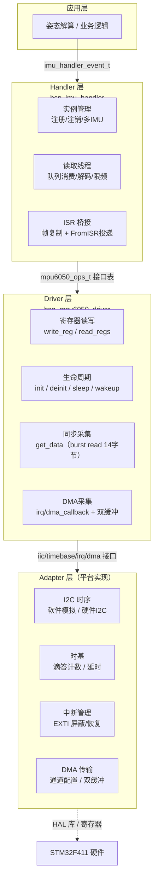
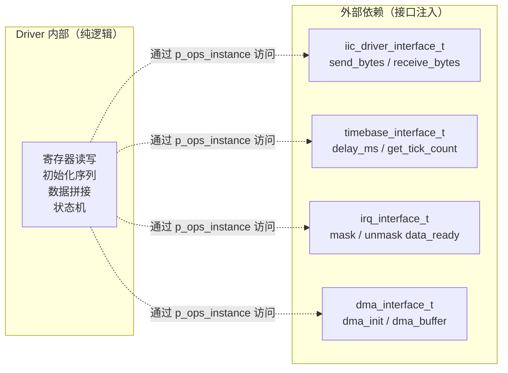
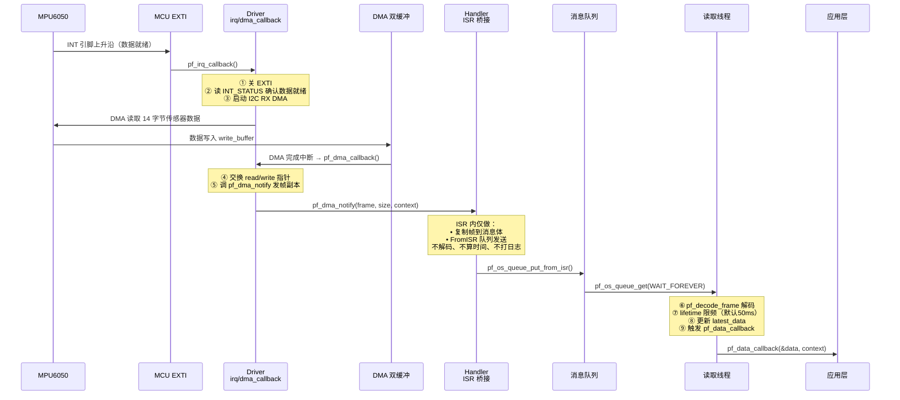
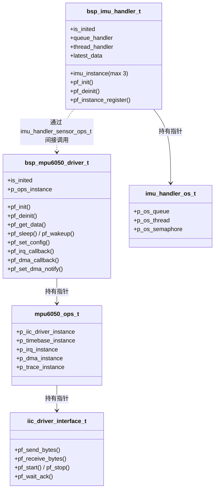
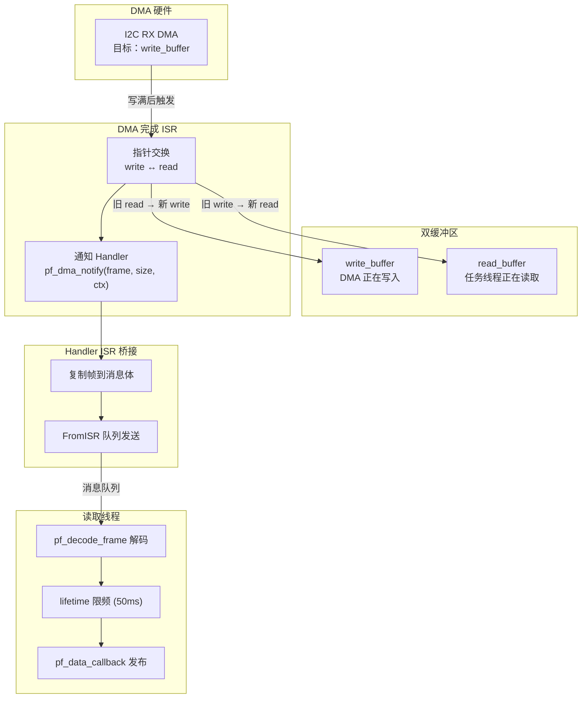
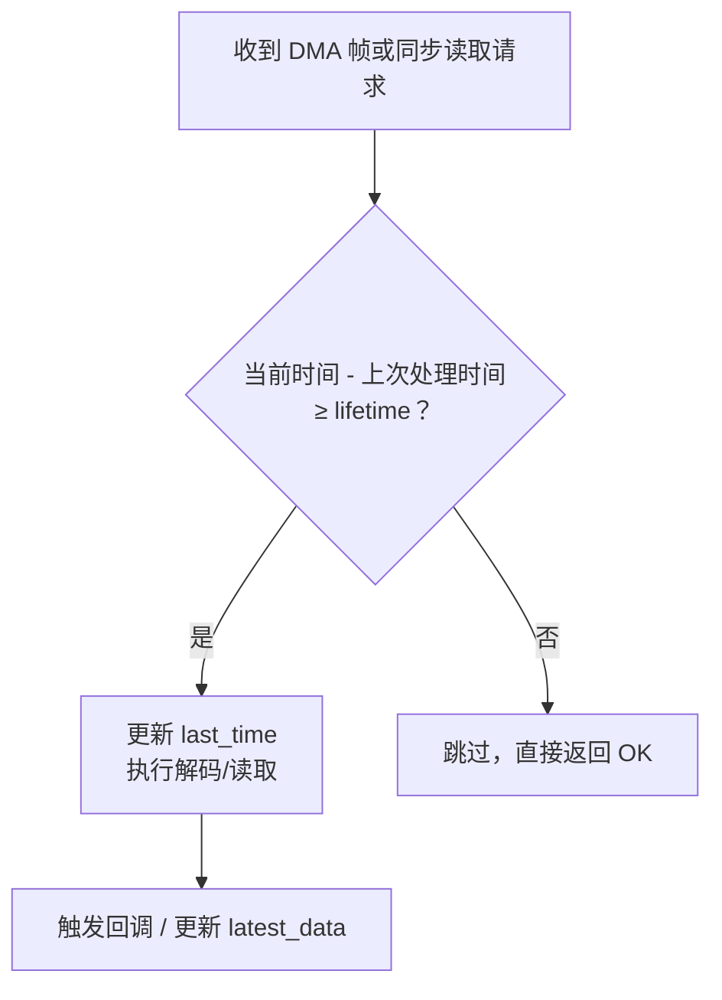
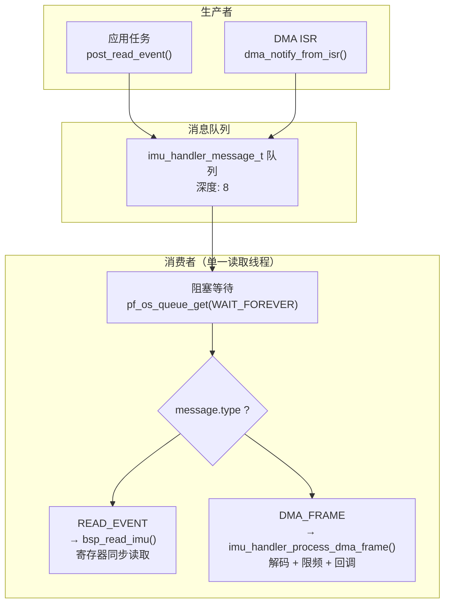

# 📖 引言

> 这篇笔记要讲什么？用一句话概括核心主题。

Bsp 层从 core 层芯片平台接收到通信接口和 tick 信号的同时，IRQ 和 DMA 的处理进阶的标准

---

# 📝driver 文件的设计思路

> 用一句话说清楚这个知识点是什么。

如何处理 bsp_xxx_driver 中内部实现的中断回调函数和 dma 中断回调函数与 adapter 层的芯片平台实际外部中断回调函数和 dma 回调函数的转接，以及 driver 中的中断回调函数如何处理异步处理和通知

## 实际意义

> 为什么会有该知识点？解决了什么实际问题？

MPU6050 是一个 I2C 接口的六轴 IMU 芯片（加速度计 + 陀螺仪各三轴）。驱动层的核心任务只有一件：**把寄存器操作封装成可靠的函数调用，让上层不用关心 I2C 时序、寄存器地址、位域拼接**。

AHT21 驱动（[[AHT21的driver文件架构设计思路]]）用同步阻塞模式（发命令→等→读），不需要中断。但 MPU6050 不同——数据由 INT 引脚以最高 8kHz 触发，数据量大适合 DMA，必须走**异步中断驱动**路线。

本项目文件拆成了清晰的四层，各司其职：



- **Config 层** (`bsp_mpu6050_config.h`)：纯寄存器地址、位域掩码、配置结构体，零运行时逻辑。相当于芯片手册的 C 语言翻译。
- **Driver 层** (`bsp_mpu6050_driver.h/.c`)：寄存器级读写、设备生命周期、同步/DMA 采集。**不调任何 HAL 或 OS 函数**。
- **Handler 层** (`bsp_imu_handler.h/.c`)：多 IMU 实例管理、RTOS 线程调度、DMA ISR 到任务上下文的桥接。
- **Adapter 层**（由平台开发者实现）：I2C 时序、时基、中断、DMA 的具体 HAL 实现。

### 1. 依赖注入：Driver 不依赖任何具体硬件

Driver 所有外部依赖通过操作表指针注入，视角里只有接口：



**换 MCU 只改 Adapter 层**，Driver 和 Handler 原封不动。单元测试时注入 mock 函数，PC 上就能跑全部驱动逻辑，不用每次烧片验证。

### 2. 中断上下半部分离

ISR 执行期间同级和低优先级中断全部被阻塞。如果在 EXTI ISR 里直接跑姿态解算，SysTick 会被阻塞导致 FreeRTOS 时基偏移。

```
上半部 (ISR, <5μs):  关EXTI → 查INT_STATUS → 启动DMA / 复制帧到队列
下半部 (任务上下文):  解码 → lifetime限频 → 更新latest_data → 发布回调
```

ISR 里只做内存拷贝和 FromISR 队列投递，不解码、不算时间、不打日志。重活全扔到读取线程。

### 3. 消息队列统一调度

不管消息来自任务还是 ISR，最终都在同一条读取线程里串行处理。没有并发竞争，不需要互斥锁。线程永久阻塞在 `pf_os_queue_get(WAIT_FOREVER)` 上，没消息时零 CPU 占用。

### 4. 多实例支持

Handler 通过 `imu_handler_sensor_ops_t` 操作表管理最多 3 个 IMU 实例。每个实例独立维护操作表，DMA 通知绑定在注册时自动完成，`instance_index` 贯穿整条数据链路。

## 应用场景

> 在实际中主要被用来做什么？

### 1. DMA + 中断驱动的高频采集（核心场景）



整条链路 ISR 里只做内存拷贝和队列投递，解码和限频推迟到线程。适用于姿态解算、振动分析等需要稳定采样周期的场景。

### 2. 单传感器轮询读取

裸机或 RTOS 下，定时调用 `pf_get_data` 同步读 14 字节传感器数据。Driver 一次 burst read 保证三轴数据属于同一采样时刻。适用于对实时性要求不高、不想引入 DMA 复杂度的场景。

### 3. 多 IMU 实例管理

Handler 支持注册最多 3 个传感器实例，每个独立维护操作表和 DMA 通知绑定。适用于需要多 IMU 冗余或不同位置姿态采集的场景（如机器人关节角度测量）。

### 4. 跨平台复用

Driver 层不调任何 HAL 或 OS 函数，换 MCU 只改写 Adapter 层。同一套代码在 STM32F4 / GD32 / ESP32 间复用，变动的只有 I2C 时序和 DMA 通道配置。

### 5. 单元测试 / Mock 调试

因为全部依赖通过接口注入，PC 上注入 mock 的 I2C 和时基函数就能跑全部驱动逻辑，不需要硬件。GPIO trace 接口可接逻辑分析仪观测中断回调进出时间。

## 核心逻辑/原理

> 它是如何工作的？拆解背后的机制。

### 1. 接口注入解耦

Driver 运行时，不调任何 HAL 或 OS 函数。`bsp_mpu6050_driver_t` 通过 `p_ops_instance` 指针访问所有外部依赖：



### 2. DMA 双缓冲 + 中断安全



关键设计点：
- 指针交换发生在 EXTI 关闭期间，不会和新数据中断竞争。
- 永远有一个 buffer 是稳定的——任务线程读 `read_buffer` 时 DMA 在写 `write_buffer`，互不干扰。
- ISR 里只复制帧到消息体，不解码不计算——重活推迟到线程。

### 3. lifetime 限频



四种读取类型（ACCEL / GYRO / TEMPERATURE / ALL）各自独立计时。DMA 路径默认 50ms 限频——MPU6050 数据就绪可达 8kHz，但读取线程没必跟着跑那么快，限频保证 CPU 不被打满。

### 4. 消息队列统一调度



不管消息来源是任务还是 ISR，最终都在同一条线程串行处理。没有并发竞争，不需要互斥锁。线程没消息时永久阻塞，零 CPU 占用。

### 5. 函数指针表模式

Driver 所有方法（`pf_init`、`pf_get_data`、`pf_sleep` 等）在 `bsp_mpu6050_driver_inst()` 里一次性绑定到静态函数。上层调 `driver->pf_get_data(&driver, ...)`，不关心后面是 MPU6050 还是未来换的 ICM-20948。Handler 同理——依赖的是 `imu_handler_sensor_ops_t` 操作表，不直接碰 `bsp_mpu6050_driver_t`。

## 关键公式/结论

> 最终结论和公式。

1.
2.
3.

## 实际操作步骤

> 动手验证/配置的具体操作。

### 启动阶段

**第一步 — Adapter 实现接口**

平台开发者实现四个接口结构体并填好函数指针：

```c
// 1. I2C 接口 — 对接 HAL_I2C_Mem_Write / HAL_I2C_Mem_Read
iic_driver_interface_t i2c_if = {
    .pf_send_bytes    = my_i2c_send_bytes,    // 封装 HAL_I2C_Mem_Write
    .pf_receive_bytes = my_i2c_receive_bytes, // 封装 HAL_I2C_Mem_Read
    .pf_start         = my_i2c_start,
    .pf_stop          = my_i2c_stop,
    // ...
};

// 2. 时基接口
timebase_interface_t tick_if = {
    .pf_delay_ms = HAL_Delay,          // 或 FreeRTOS vTaskDelay
    .pf_delay_us = my_delay_us,
};

// 3. 中断接口（关键 — 负责 EXTI 屏蔽/恢复）
irq_interface_t irq_if = {
    .pf_mask_data_ready_irq   = HAL_NVIC_DisableIRQ, // 关 MPU6050 EXTI
    .pf_unmask_data_ready_irq = HAL_NVIC_EnableIRQ,  // 开 MPU6050 EXTI
};

// 4. DMA 接口（可选）
dma_interface_t dma_if = { .pf_dma_init = my_dma_start, /* ... */ };
```

**第二步 — 聚合接口、实例化 Driver**

```c
mpu6050_ops_t ops = {
    .p_iic_driver_instance = &i2c_if,
    .p_timebase_instance   = &tick_if,
    .p_irq_instance        = &irq_if,
    .p_dma_instance        = &dma_if,  // NULL 则禁用 DMA
};

bsp_mpu6050_driver_t mpu_drv = {0};
mpu6050_status_t ret = bsp_mpu6050_driver_inst(&mpu_drv, &ops);
// 内部执行：绑定方法表 → 复位设备 → 等100ms → 选PLL时钟
//          → 写采样率/量程/DLPF/中断配置 → 读 WHO_AM_I 校验
```

**第三步 — 实例化 Handler、注册 Driver**

```c
// Adapter 实现传感器操作表
imu_handler_sensor_ops_t sensor_ops = {
    .pf_init       = my_imu_init,        // 调 driver->pf_init()
    .pf_deinit     = my_imu_deinit,      // 调 driver->pf_deinit()
    .pf_read_data  = my_imu_read,        // 调 driver->pf_get_data()
    .pf_decode_frame = my_decode_frame,  // 把14字节原始帧 → imu_handler_data_t
    .pf_set_dma_notify = my_set_dma_notify, // 调 driver->pf_set_dma_notify()
    .pf_detect     = my_imu_detect,      // 调 driver->pf_read_id()
};

// 初始化 Handler（内部创建信号量→队列→读取线程）
bsp_imu_handler_t handler = {0};
imu_handler_os_t os_ops = { .p_os_queue = &queue_if, /* ... */ };
bsp_imu_handler_inst(&handler, &tick_if, &os_ops);

// 注册 Driver 实例（自动绑定 DMA 通知）
handler.pf_instance_register(&handler, &mpu_drv, &sensor_ops);
```

### 运行阶段

**路径 A — 任务同步读取**

```c
imu_handler_data_t data = {0};
imu_handler_event_t event = {
    .data        = &data,
    .lifetime    = 20,                    // 最小间隔 20ms
    .read_status = IMU_HANDLER_READ_ALL,
    .pf_event_callback = my_data_ready,   // 读取完成后回调
};
handler_post_read_event(&handler, &event, 100); // 超时 100ms
// → 队列 → 读取线程 → bsp_read_imu → pf_read_data → pf_get_data
//   → I2C burst read 14字节 → 拼 int16_t → my_data_ready(&data)
```

**路径 B — DMA 异步读取（零代码介入）**

应用层只需在启动期注册数据回调，之后 DMA 全自动运行：

```c
void on_imu_data(const imu_handler_data_t *data, void *ctx) {
    // data 已经是解码后的 int16_t 原始值，单位换算在上层做
    float ax = data->accel_x / 16384.0f;  // ±2g 量程
    float gz = data->gyro_z  / 131.0f;    // ±250dps 量程
    // 喂给姿态解算...
}

bsp_imu_handler_set_data_callback(&handler, on_imu_data, NULL);

// 之后一切自动：
// MPU6050 INT → EXTI ISR → Driver.irq_callback → DMA → Driver.dma_callback
//   → Handler ISR 桥接 → 队列 → 读取线程 → on_imu_data()
```

**路径 C — 调试观测**

Driver 的 trace 接口可接逻辑分析仪：

```c
// Adapter 实现 trace 接口（直接用 GPIO 翻转）
void trace_pin_set(uint8_t level) {
    HAL_GPIO_WritePin(TRACE_GPIO_Port, TRACE_Pin, level ? GPIO_PIN_SET : GPIO_PIN_RESET);
}
// 逻辑分析仪抓 TRACE_Pin：
//   level=1 → 进入 irq_callback/dma_callback
//   level=0 → 退出
// 可精确测量 ISR 执行时长和 DMA 完成间隔
```

### 停止阶段

```c
// 按创建逆序释放
handler.pf_deinit(&handler);  // 删线程 → 删队列 → 删信号量 → 清实例引用
mpu_drv.pf_deinit(&mpu_drv);  // 写 PWR_MGMT_1.SLEEP → 标记 NOT_INITED
```

## 常见问题

> 现象 → 根因 → 修复。

### 发现的问题

### 根因分析

### 改进方法

---

# 💬 Q&A

> 自问自答，检验理解深度。按难度递进排列。

1.什么是时间片切割?

2.为什么少用中断在 FreeRTOS 中?

3.什么是 CPU 运行流水线?

4.FreeRTOS 切换任务时如何保存线程上下文?

1. S-Bus 的压栈时间受什么影响?
2.ICode 取向量的速度优化存在哪些方法?
1.硬件 IIC 相较于软件 IIC 是如何实现异步的?
2.IIC 的传输完成中断是如何被 CPU 作为异常处理的？信号在内核中是如何传递的?
3.一定要用信号量来做中断和线程之间的同步吗？如果不是，那应该怎么做？这样做的好处是什么？

1.中断延时在系统中是被什么影响的?

2.中断延时很高，该怎么办?

3.中断延时和中断上半部、中断下半部有什么关系吗?

## 🟢 基础

> 最基本的概念和用法，入门必知。

### Q 1

A 1：

### Q 2

A 2：

## 🟡 进阶

> 容易踩的坑和常见误区。

### Q 3

A 3：

## 🔴 困难

> 结合实战的深层原理和设计权衡。

### Q 4

A 4：

---

# 📋 总结

> 3-5 句话回顾核心要点，用自己的话复述。

---

# 📎 参考资料

> 学习过程中用到的外部资源汇总。

## 🎥 视频链接

> B 站 / YouTube 教程，优先选项目实战类和原理动画类。

- [标题](url) — 一句话说明讲了什么

## 🔗 博客/文档链接

> 分析最透彻的博客、官方文档、社区帖子。

- [标题](url) — CSDN / 博客园 / 飞书 / 知乎
- [标题](url) — 芯片厂商官方文档

## 💻 仓库链接

> GitHub / Gitee 源码仓库，含 Demo 工程和工具链。

- [owner/repo](url) — 一句话描述
- [owner/repo](url)

## 📄 代码/附件

> 本地 PDF、代码包、工具链文件。

- [[附件文件.pdf]]
- [[示例代码.zip]]
