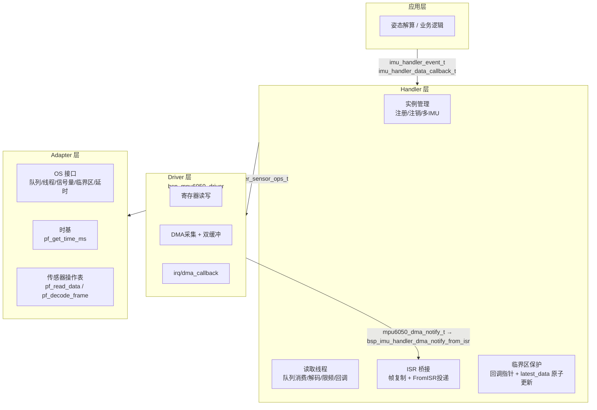
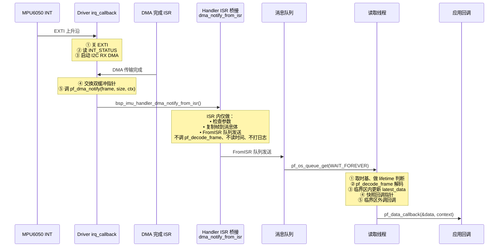
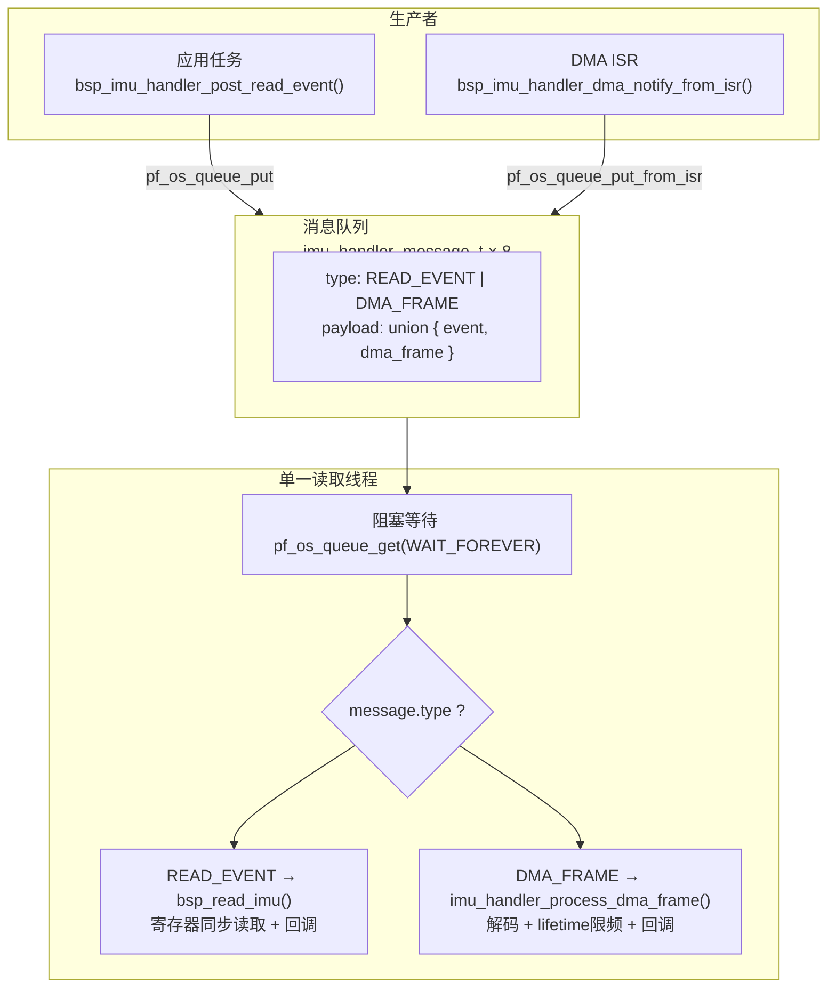
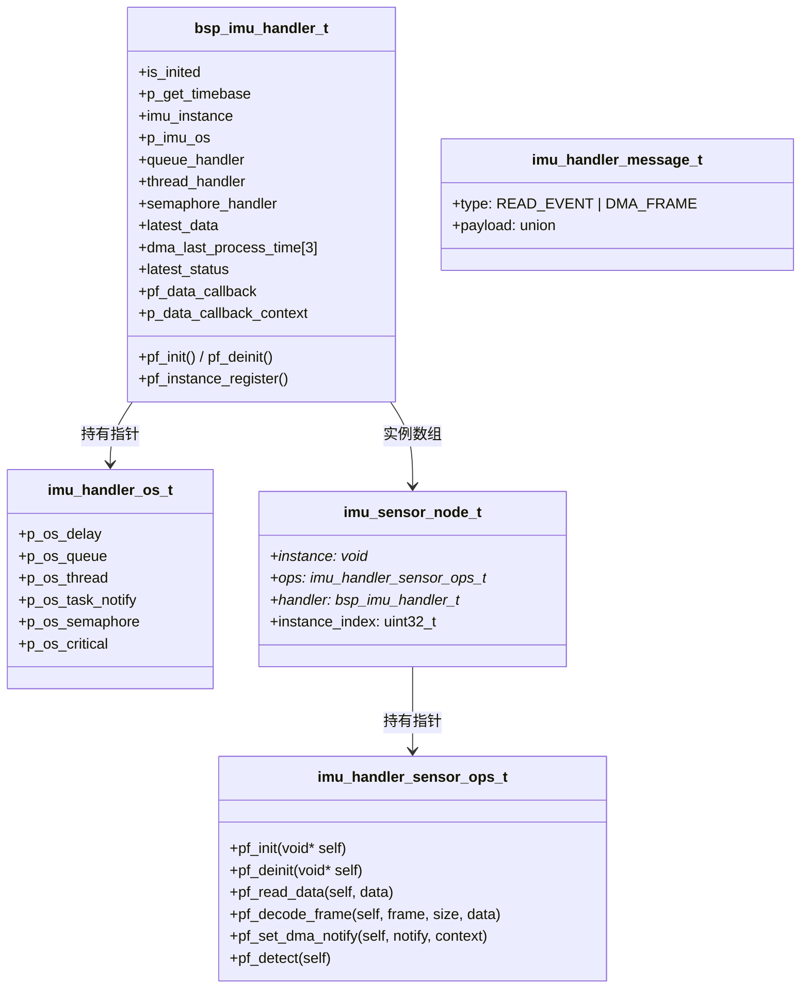
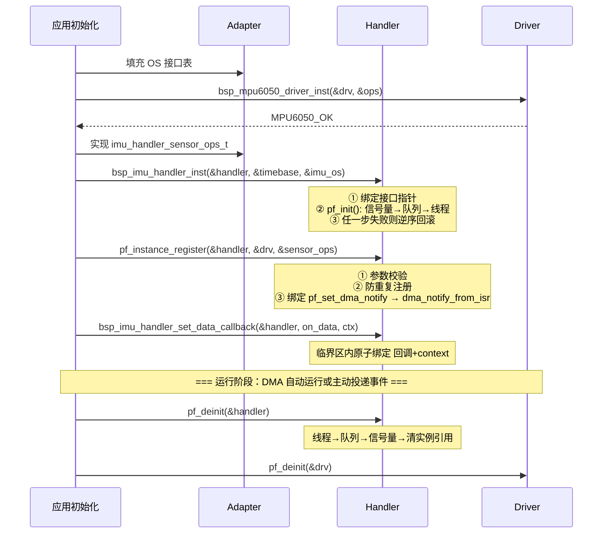
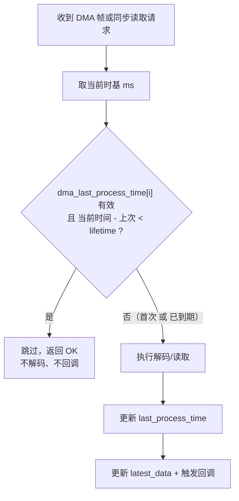
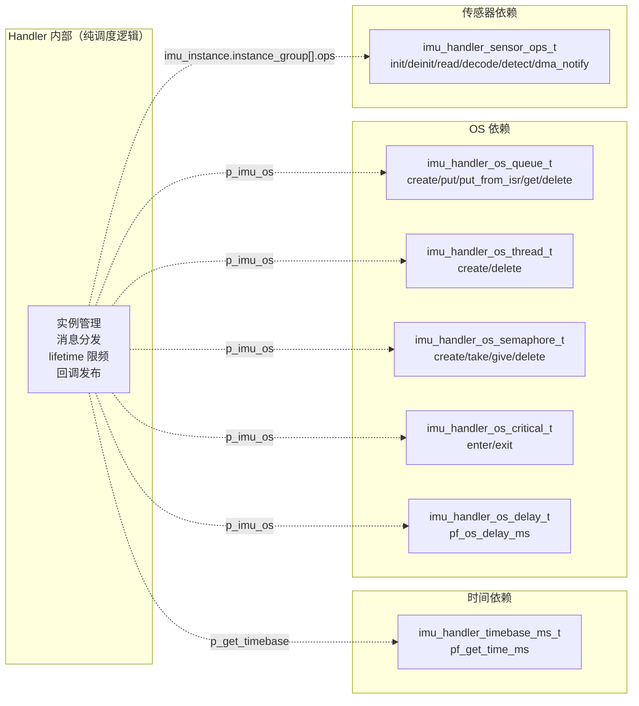
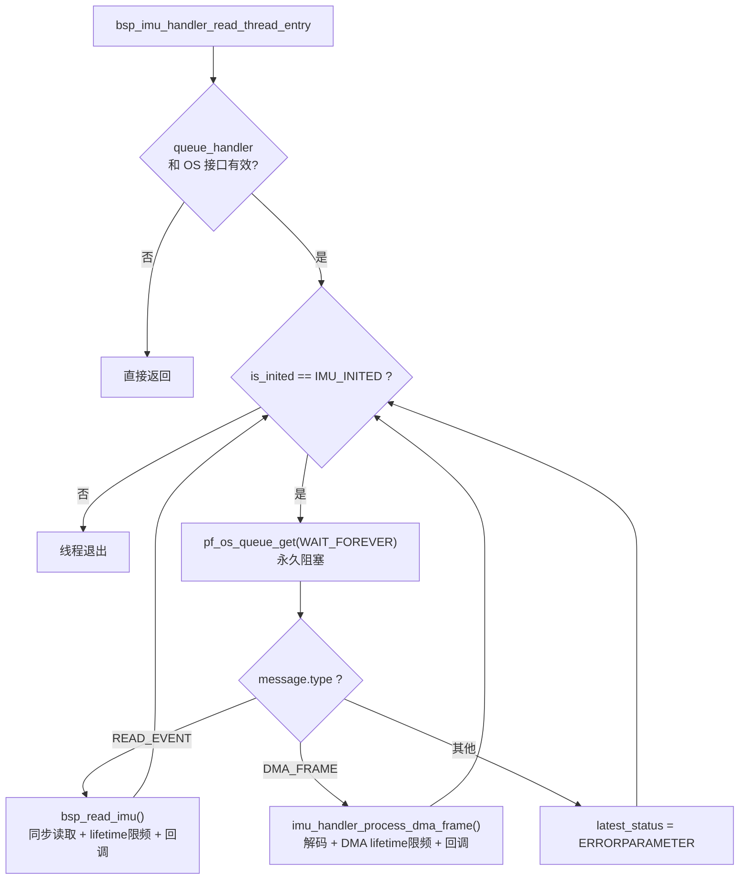

# 📖 引言

> 这篇笔记要讲什么？用一句话概括核心主题。

将 IMU 传感器共同需要的实例管理、中断上下半部分离、消息分发和 RTOS 资源抽象为可复用的 handler，与具体 IMU 驱动解耦。

---

# 📝 handle 文件的设计思路

> 用一句话说清楚这个知识点是什么。

Handler 位于 Driver 之上、应用层之下，通过依赖注入的 OS 接口和统一的传感器操作表，把"谁在采数据、什么时候采、采完通知谁"的管理逻辑从具体芯片驱动中剥离出来。

## 实际意义

> 为什么会有该知识点？解决了什么实际问题？

MPU6050 驱动（[[MPU6050的driver文件架构设计思路]]）解决了"怎么操作寄存器"的问题，但没有解决"怎么管理数据流"的问题。实际工程中面临：

1. **中断上下半部分离**：MPU6050 数据就绪可达 8kHz，EXTI ISR 必须极短（<5μs），不能在里面解码数据、算时间、打日志。需要一个机制把重活从 ISR 搬到任务上下文。
2. **多来源消息统一调度**：数据既可能来自 DMA ISR（高频被动推送），也可能来自应用任务（低频主动查询）。两种来源要在同一套逻辑里串行处理，不能打架。
3. **多 IMU 实例管理**：机器人、无人机等场景需要 2~3 个 IMU 冗余测量。每个实例独立维护操作表、lifetime 时间戳和 DMA 通知绑定，Handler 统一遍历。
4. **平台解耦**：Handler 不直接调 `osMessageQueue*`、`osThread*`、`HAL_GetTick()`，全部通过 Adapter 注入的接口调用。换 RTOS（FreeRTOS → RT-Thread）或换 MCU（STM32F4 → GD32）只需改 Adapter。
5. **DMA 异步通知桥接**：Driver 的 DMA 回调只负责双缓冲交换，Handler 负责把完成帧投递到队列让读取线程解码。

分层边界：



### 1. 把"驱动操作"提升为"传感器管理服务"

Driver 只管一个 MPU6050 的寄存器读写和设备状态。Handler 管的是：

- **有哪些传感器可用**（`imu_instance.instance_group[]`）
- **数据什么时候该处理**（lifetime 限频，DMA 默认 50ms）
- **数据处理好后通知谁**（`pf_data_callback`）
- **OS 资源如何创建和回收**（信号量 → 队列 → 线程，失败时逆序回滚）

Handler 依赖的是 `imu_handler_sensor_ops_t` 操作表，不是 `bsp_mpu6050_driver_t` 具体类型。后续换成 ICM-20948 或其他 IMU，只要实现了同样的操作表就能注册到同一个 Handler。

### 2. 中断上下半部分离（ISR → 队列 → 线程）



上半部（ISR，<5μs）：复制帧到消息体 + FromISR 队列投递，不碰时基、不解码、不打日志。

下半部（读取线程）：lifetime 判断、解码、更新 latest_data、发布回调。重活全在这。

### 3. 消息队列统一调度：单消费者，无锁设计



不管消息来源是任务还是 ISR，最终在同一条线程里串行处理。**没有并发写 `latest_data` 的问题，不需要互斥锁。** 线程没消息时永久阻塞在 `WAIT_FOREVER`，零 CPU 占用。

### 4. 核心数据结构



关键设计：

- **`imu_handler_sensor_ops_t`**：Handler 与 Driver 之间的适配协议。`pf_decode_frame` 是 Adapter 实现的——把 14 字节原始帧转为 `imu_handler_data_t`（大端拼接 int16_t）。`pf_set_dma_notify` 把 Handler 的 `bsp_imu_handler_dma_notify_from_isr` 注册到 Driver 的 `pf_dma_notify` 函数指针上。
- **`imu_sensor_node_t`**：每个注册的实例一个节点。`instance` 指向 `bsp_mpu6050_driver_t`，`ops` 指向对应的操作表，`handler` 回指所属 Handler，`instance_index` 贯穿整条数据链路。
- **`imu_handler_message_t`**：队列消息体，用 union 节省内存。`READ_EVENT` 携带事件指针（不复制数据，调用方负责生命周期）；`DMA_FRAME` 携带帧副本（ISR 己复制，线程可直接消费）。
- **`imu_handler_os_t`**：聚合了 6 类 OS 接口。注入 NULL 的接口被视为"未使能"，调用时做空检查。

### 5. 生命周期与资源管理



初始化三阶段不能颠倒：先 Driver 实例化 → 再 Handler 实例化 → 最后注册。

资源创建顺序：**信号量 → 队列 → 线程**。去初始化严格逆序：**删线程 → 删队列 → 删信号量**。任一步失败，已创建的资源全部回滚，避免泄漏。

### 6. 临界区保护

Handler 定义了三处需要临界区保护的共享资源访问点：

| 位置 | 共享资源 | 写者 | 读者 | 保护方式 |
|------|---------|------|------|---------|
| `set_data_callback` | `pf_data_callback` + `context` | 应用任务 | 读取线程 | `enter_critical` / `exit_critical` |
| `process_dma_frame` | `latest_data` + `latest_status` | 读取线程 | 回调函数 | 临界区内写入 + 快照回调到局部变量 |
| `process_dma_frame` | `pf_data_callback` + `context` | 应用任务 | 读取线程 | 临界区内快照到局部变量，**回调在临界区外调用** |

关键细节：回调本身不在临界区内执行（防止回调内调 `set_data_callback` 导致死锁）：

```c
// 临界区内：原子写入 latest_data + 快照回调到局部变量
imu_handler_enter_critical(self);
self->latest_data = data;
self->dma_last_process_time[...] = timestamp_ms;
self->latest_status = IMU_HANDLER_OK;
data_callback    = self->pf_data_callback;      // 快照
callback_context = self->p_data_callback_context; // 快照
imu_handler_exit_critical(self);

// 临界区外：安全调用回调
if (NULL != data_callback) {
    data_callback(&self->latest_data, callback_context);
}
```

DMA 双缓冲交换在 EXTI 关闭期间完成（天然互斥）；消息队列单消费者串行处理（无并发写 `latest_data`）。只有回调配置和读取这条路需要显式临界区。

### 7. lifetime 限频



四种同步读取类型（ACCEL / GYRO / TEMPERATURE / ALL）各自独立计时，用静态数组 `last_read_time[4]` 记录。DMA 路径的 lifetime 固定为 `IMU_HANDLER_DMA_LIFETIME_MS`（默认 50ms），对应 20Hz 有效刷新率。

DMA ISR 不做 lifetime 判断——不管是否需要，ISR 都复制帧进队列。lifetime 判断推迟到读取线程，保证 ISR 足够短。

## 应用场景

> 在实际中主要被用来做什么？

### 1. DMA + 中断驱动的高频 IMU 采集（核心场景）

MPU6050 INT 引脚以最高 8kHz 触发 → Driver irq_callback 启动 I2C RX DMA → DMA 完成 → dma_callback 交换双缓冲 → pf_dma_notify 通知 Handler → ISR 桥接复制帧到队列 → 读取线程解码 + 限频 + 回调。整条链路 ISR 耗时 <5μs。适用于姿态解算、振动分析等需要稳定采样周期的场景。

### 2. 应用任务主动查询

裸机或低频场景下，调用 `bsp_imu_handler_post_read_event()` 投递读取事件到队列。读取线程通过 `bsp_read_imu()` → `pf_read_data()` → Driver 的 `pf_get_data()` 完成一次同步 I2C burst read。适用于不想引入 DMA 复杂度、只需偶尔读一次数据的场景。

### 3. 多 IMU 实例管理

最多注册 3 个 IMU 实例，每个独立维护操作表和 DMA 通知绑定。`instance_index` 用于区分数据来源。读取线程遍历所有已注册实例依次调用 `pf_read_data`。适用于机器人关节角度测量、姿态冗余等场景。

### 4. 跨 RTOS 和跨 MCU 复用

Handler 不调任何 HAL、CMSIS-RTOS 或 FreeRTOS API。所有 OS 依赖通过 `imu_handler_os_t` 注入。换 RTOS 只改 Adapter 的队列/线程/信号量实现，Handler 源码零改动。

### 5. 单元测试

通过注入 mock 的 OS 接口（队列用环形 buffer 模拟、线程直接同步调用入口函数），PC 上就能跑全部调度逻辑：注册→投递事件→lifetime 限频→解码→回调。不需要硬件和 RTOS。

## 核心逻辑/原理

> 它是如何工作的？拆解背后的机制。

### 1. 依赖注入：Handler 不认识任何具体硬件

Handler 的三大外部依赖全部通过接口指针注入：



### 2. ISR 桥接：bsp_imu_handler_dma_notify_from_isr

这是 Handler 中唯一可在 ISR 上下文调用的函数。它的全部工作是：

1. 从 `context`（其实是 `imu_sensor_node_t*`）还原 `handler` 和 `instance_index`
2. 校验 `frame` 和 `size` 不超过 `IMU_HANDLER_RAW_FRAME_MAX_SIZE`（32 字节）
3. 逐字节复制帧到 `message.payload.dma_frame.frame[]`
4. 调 `pf_os_queue_put_from_isr()` 投递
5. 返回 `higher_priority_task_woken` 给调用方（Driver 的 dma_callback），通知其退出 ISR 前触发调度

**不在 ISR 做的**：不解码（留给线程中的 `pf_decode_frame`）、不算时间（留给线程中的 `pf_get_time_ms`）、不调回调（留给线程中的 `pf_data_callback`）、不打日志。

### 3. 读取线程主循环



线程不主动轮询硬件，永久阻塞等消息。`is_inited` 被 `pf_deinit()` 改为 `IMU_NOT_INITED` 后，线程自然退出循环。

### 4. 函数指针表双层解耦

Handler 有两层接口表：

| 层 | 接口类型 | 方向 | 作用 |
|----|---------|------|------|
| 传感器操作表 | `imu_handler_sensor_ops_t` | 南向（调 Driver） | Handler 不感知具体 IMU 类型 |
| OS 操作表 | `imu_handler_os_t` | 南向（调 RTOS） | Handler 不感知具体 RTOS |
| 时基接口 | `imu_handler_timebase_ms_t` | 南向（调平台） | Handler 不感知具体 Tick 来源 |
| 公开 API | `pf_init` / `pf_post_read_event` / `pf_set_data_callback` 等 | 北向（被上层调） | 上层不感知内部队列和线程 |

`bsp_imu_handler_inst()` 一次性绑定所有这些指针：

```c
self->p_get_timebase       = timebase_ms;
self->p_imu_os             = imu_os;
self->pf_init              = imu_handler_init;
self->pf_deinit            = imu_handler_deinit;
self->pf_instance_register = imu_handler_instance_register;
```

### 5. 状态码分层

Handler 有自己的状态码枚举 `imu_handler_status_t`，与 Driver 的 `mpu6050_status_t` 数值一一对应（OK=0, ERROR=1, TIMEOUT=2, RESOURCE=3, PARAMETER=4, NOMEMORY=5, ISR=6）。Adapter 实现 `pf_read_data` 和 `pf_decode_frame` 时负责做映射，让 Handler 不直接依赖 `mpu6050_status_t`。

## 关键公式/结论

> 最终结论和公式。Handler 层只做调度和数据流转，不做单位换算。

### Handler 核心常量

| 宏 | 值 | 含义 |
|----|-----|------|
| `IMU_NUM_MAX` | 3 | 最大 IMU 实例数 |
| `IMU_HANDLER_RAW_FRAME_MAX_SIZE` | 32 | 单帧最大字节数（MPU6050 burst read 仅 14 字节，留余量） |
| `IMU_HANDLER_READ_QUEUE_LENGTH` | 8 | 消息队列深度 |
| `IMU_HANDLER_READ_THREAD_STACK_DEPTH` | 256 | 读取线程栈深度（字） |
| `IMU_HANDLER_READ_THREAD_PRIORITY` | 2 | 读取线程优先级 |
| `IMU_HANDLER_DMA_LIFETIME_MS` | 50 | DMA 帧最小处理间隔（ms） |
| `IMU_HANDLER_DMA_TIMESTAMP_INVALID` | 0xFFFFFFFF | 标记时间戳未初始化 |

### imu_handler_data_t 与 mpu6050_data_t 的关系

两者字段完全一致（accel_xyz, temperature, gyro_xyz），都是 int16_t 原始值。区别在于 `imu_handler_data_t` 多了 `instance_index` 和 `timestamp_ms`，由 Handler 在读取成功后填写。Driver 不感知这些元数据。

### 帧解码公式（在 Adapter 的 pf_decode_frame 中实现）

```c
data->accel_x = (int16_t)(((uint16_t)frame[0] << 8) | frame[1]);  // 大端
data->accel_y = (int16_t)(((uint16_t)frame[2] << 8) | frame[3]);
// ... 依此类推，14 字节解出 7 个 int16_t
```

### lifetime 限频逻辑

```
elapsed = current_time_ms - dma_last_process_time[instance_index]
if (last_time != INVALID && elapsed < IMU_HANDLER_DMA_LIFETIME_MS):
    skip → return OK（不调 pf_decode_frame、不更新 latest_data）
else:
    decode → update latest_data → callback
```

首次收到帧（`last_time == INVALID`）不检查 lifetime，直接解码。

### 资源创建与回滚顺序

```
初始化: 信号量 → 队列 → 线程
去初始化: 线程 → 队列 → 信号量

信号量创建失败：直接返回错误（无资源需回收）
队列创建失败：删除信号量 → 返回错误
线程创建失败：删除队列 → 删除信号量 → 返回错误
```

### 信号量语义

创建时 `max_count=1, initial_count=1`，即二值信号量（初始可用）。当前代码中已创建但**未在数据路径中实际使用**（take/give 仅定义了接口）。实际生效的是 `enter_critical/exit_critical` 临界区。

## 实际操作步骤

> 动手验证/配置的具体操作。

### 第一步：Adapter 实现 OS 接口表

平台开发者填充 6 类 OS 接口：

```c
// 队列 — 对接 FreeRTOS xQueueCreate / xQueueSend / xQueueSendFromISR / xQueueReceive
imu_handler_os_queue_t queue_if = {
    .pf_os_queue_create        = adapter_queue_create,   // xQueueCreate
    .pf_os_queue_put           = adapter_queue_put,      // xQueueSend
    .pf_os_queue_put_from_isr  = adapter_queue_put_from_isr, // xQueueSendFromISR
    .pf_os_queue_get           = adapter_queue_get,      // xQueueReceive
    .pf_os_queue_delete        = adapter_queue_delete,   // vQueueDelete
};

// 线程 — 对接 xTaskCreate / vTaskDelete
imu_handler_os_thread_t thread_if = {
    .pf_os_thread_create = adapter_thread_create,  // xTaskCreate
    .pf_os_thread_delete = adapter_thread_delete,  // vTaskDelete
};

// 信号量 — 对接 xSemaphoreCreateCounting
imu_handler_os_semaphore_t semaphore_if = {
    .pf_os_semaphore_create = adapter_semaphore_create,
    .pf_os_semaphore_delete = adapter_semaphore_delete,  // vSemaphoreDelete
};

// 临界区 — 对接 taskENTER_CRITICAL / taskEXIT_CRITICAL
imu_handler_os_critical_t critical_if = {
    .pf_os_critical_enter = adapter_critical_enter,
    .pf_os_critical_exit  = adapter_critical_exit,
};

// 时基 — 对接 HAL_GetTick 或 xTaskGetTickCount
imu_handler_timebase_ms_t timebase = {
    .pf_get_time_ms = adapter_get_time_ms,
};

// 聚合
imu_handler_os_t imu_os = {
    .p_os_queue     = &queue_if,
    .p_os_thread    = &thread_if,
    .p_os_semaphore = &semaphore_if,
    .p_os_critical  = &critical_if,
};
```

### 第二步：实现 sensor_ops（Driver 桥接）

```c
// 解码函数：14 字节原始帧 → imu_handler_data_t
imu_handler_status_t mpu6050_decode_frame(void *self,
    const uint8_t *frame, uint32_t size, imu_handler_data_t *data) {
    if (14 != size) return IMU_HANDLER_ERRORPARAMETER;
    data->accel_x = (int16_t)(((uint16_t)frame[0] << 8) | frame[1]);
    data->accel_y = (int16_t)(((uint16_t)frame[2] << 8) | frame[3]);
    data->accel_z = (int16_t)(((uint16_t)frame[4] << 8) | frame[5]);
    data->temperature = (int16_t)(((uint16_t)frame[6] << 8) | frame[7]);
    data->gyro_x  = (int16_t)(((uint16_t)frame[8] << 8) | frame[9]);
    data->gyro_y  = (int16_t)(((uint16_t)frame[10] << 8) | frame[11]);
    data->gyro_z  = (int16_t)(((uint16_t)frame[12] << 8) | frame[13]);
    return IMU_HANDLER_OK;
}

// 读取函数：调 Driver 的 pf_get_data，映射状态码
imu_handler_status_t mpu6050_read_data(void *self, imu_handler_data_t *data) {
    bsp_mpu6050_driver_t *drv = (bsp_mpu6050_driver_t *)self;
    mpu6050_data_t raw = {0};
    mpu6050_status_t ret = drv->pf_get_data(drv, MPU6050_DATA_ALL, &raw);
    if (MPU6050_OK == ret) {
        data->accel_x = raw.accel_x;
        // ... 逐字段拷贝
    }
    return (imu_handler_status_t)ret;  // 枚举值一一对应
}

imu_handler_sensor_ops_t mpu6050_sensor_ops = {
    .pf_init            = (void*)mpu_drv.pf_init,
    .pf_deinit          = (void*)mpu_drv.pf_deinit,
    .pf_read_data       = mpu6050_read_data,
    .pf_decode_frame    = mpu6050_decode_frame,
    .pf_set_dma_notify  = (void*)mpu_drv.pf_set_dma_notify,
    .pf_detect          = (void*)mpu_drv.pf_read_id,
};
```

### 第三步：实例化 Handler + 注册 Driver

```c
bsp_imu_handler_t handler = {0};

// 实例化 — 绑定接口 + 创建 OS 资源
bsp_imu_handler_inst(&handler, &timebase, &imu_os);

// 注册传感器 — 绑定 DMA 通知
handler.pf_instance_register(&handler, &mpu_drv, &mpu6050_sensor_ops);

// 配置数据回调（DMA 路径）
handler.pf_set_data_callback(&handler, on_imu_data, NULL);
```

此后 DMA 路径全自动运行：

```
MPU6050 INT → EXTI ISR → Driver.irq_callback → DMA → Driver.dma_callback
→ Handler ISR 桥接 → 队列 → 读取线程 → on_imu_data()
```

### 第四步：同步读取（可选）

```c
imu_handler_data_t data = {0};
imu_handler_event_t event = {
    .data        = &data,
    .lifetime    = 20,                    // 最小间隔 20ms
    .read_status = IMU_HANDLER_READ_ALL,
    .pf_event_callback = my_read_done,    // 读取完成后回调
};
bsp_imu_handler_post_read_event(&handler, &event, 100);
```

### 第五步：停止和清理

```c
handler.pf_deinit(&handler);  // 删线程 → 删队列 → 删信号量 → 清实例引用
mpu_drv.pf_deinit(&mpu_drv);  // 写 SLEEP 位 → 标记 NOT_INITED
```

## 常见问题

> 现象 → 根因 → 修复。均来自本项目的实际代码分析。

### 发现的问题

1. **回调指针和 context 的竞态窗口**：应用任务调 `set_data_callback` 时，读取线程可能正在 `process_dma_frame` 中检查和使用回调指针。不加临界区会出现"检查通过 → 被清空 → 空指针调用"。
2. **信号量定义了但未在数据路径中使用**：Handler 创建了二值信号量（initial_count=1），但 `latest_data` 的保护实际走临界区而非信号量。两套机制并存但只有一套生效，信号量属于预留接口。
3. **`pf_instance_register` 无临界区保护**：注册修改 `instance_group` 和 `instance_num` 时没加锁。当前启动阶段单线程操作规避了此问题，但未来支持运行时热注册需加锁。
4. **deinit 直接删线程**：`pf_os_thread_delete` 不等线程函数 return。如果线程正在 `pf_decode_frame` 中操作外部 buffer，buffer 可能被释放而线程还在写入。
5. **DMA lifetime 默认 50ms 丢弃大量数据**：8kHz 数据就绪意味着 400 帧只处理 1 帧。这是有意为之（保护 CPU），但需根据实际需求调整。

### 根因分析

问题 1~3 根源相同：Handler 设计为"消息队列单消费者"模型，大部分数据路径天然无竞争。但回调配置走的是另一条路——写者和读者是不同的执行上下文，必须显式同步。当前代码已加临界区（问题 1 已修复），回调在临界区外调用是刻意设计（防死锁）。

问题 4 是 RTOS 线程删除语义的固有限制——`vTaskDelete` 不会等线程 return。标准做法是 deinit 前先发"退出"消息让线程自己 return，再删句柄。

问题 5 不是 bug 是设计权衡。50ms = 20Hz，对姿态解算（通常 100~200Hz）已够用。

### 改进方法

1. 当前临界区保护方案已覆盖关键路径，维持现状。
2. deinit 改为"发退出消息 → 等线程 return → 删句柄"三段式。
3. 注册实例时加临界区，读取线程遍历 `instance_group` 时同样处理。
4. 根据应用需求调整 `IMU_HANDLER_DMA_LIFETIME_MS`：姿态解算 10~20ms，振动分析 1~5ms。

---

# 💬 Q&A

> 自问自答，检验理解深度。按难度递进排列。

## 🟢 基础

> 最基本的概念和用法，入门必知。

### Q 1

A 1：

### Q 2

A 2：

## 🟡 进阶

> 容易踩的坑和常见误区。

### Q 3

A 3：

## 🔴 困难

> 结合实战的深层原理和设计权衡。

### Q 4

A 4：

---

# 📋 总结

> 3-5 句话回顾核心要点，用自己的话复述。

Handler 位于 Driver 之上，通过 `imu_handler_sensor_ops_t` 操作表隔离具体 IMU 驱动，通过 `imu_handler_os_t` 接口表隔离具体 RTOS，实现"管理传感器实例和事件调度"与"操作具体芯片寄存器"的彻底分离。核心机制是消息队列统一调度——无论 DMA ISR 的帧还是应用任务的读取请求，都在同一条读取线程中串行处理，天然无并发竞争。ISR 桥接函数只做帧复制和 FromISR 投递（<5μs），解码和 lifetime 限频推迟到线程，保证中断响应速度。初始化按信号量→队列→线程顺序创建，失败时逆序回滚；临界区保护回调指针和 latest_data 的并发访问，但回调本身在临界区外调用以防止死锁。

---

# 📎 参考资料

> 学习过程中用到的外部资源汇总。

## 🎥 视频链接

> B 站 / YouTube 教程，优先选项目实战类和原理动画类。

- 暂无固定视频资源；本笔记主要依据工程源码和 RTOS 运行链路分析。

## 🔗 博客/文档链接

> 分析最透彻的博客、官方文档、社区帖子。

- [FreeRTOS Queue Management](https://www.freertos.org/Embedded-RTOS-Queues.html) — 理解 `xQueueSendFromISR` 和 `xQueueReceive` 的语义，尤其是 `pxHigherPriorityTaskWoken` 的作用。
- [FreeRTOS Task Notifications](https://www.freertos.org/RTOS-task-notifications.html) — 轻量级任务通知，比队列更快但不传数据。
- [[MPU6050的driver文件架构设计思路]] — Driver 层的寄存器读写、DMA 双缓冲、中断回调的完整设计。
- [[AHT21的handler文件架构设计思路]] — 同一 Handler 模式在温湿度传感器上的应用，对比可加深理解。

## 💻 仓库链接

> GitHub / Gitee 源码仓库，含 Demo 工程和工具链。

- 当前笔记对应本地工程：`STM32F411CEU6_Mpu6050`，分支 `mpu6050`。
- 工程构建工具链：Keil MDK + arm-none-eabi-gcc。

## 📄 代码/附件

> 本地 PDF、代码包、工具链文件。

- `BSP/MPU6050/handler/Inc/bsp_imu_handler.h` — Handler 状态码、消息结构体、传感器操作表、OS 接口和实例结构体定义。
- `BSP/MPU6050/handler/Src/bsp_imu_handler.c` — 实例化、资源创建/回滚、ISR 桥接、读取线程、lifetime 限频和临界区保护的完整实现。
- `BSP/MPU6050/driver/Inc/bsp_mpu6050_driver.h` — Driver 层接口定义，含 `mpu6050_dma_notify_t` 回调类型。
- [[MPU6050的driver文件架构设计思路]]
- [[AHT21的handler文件架构设计思路]]
