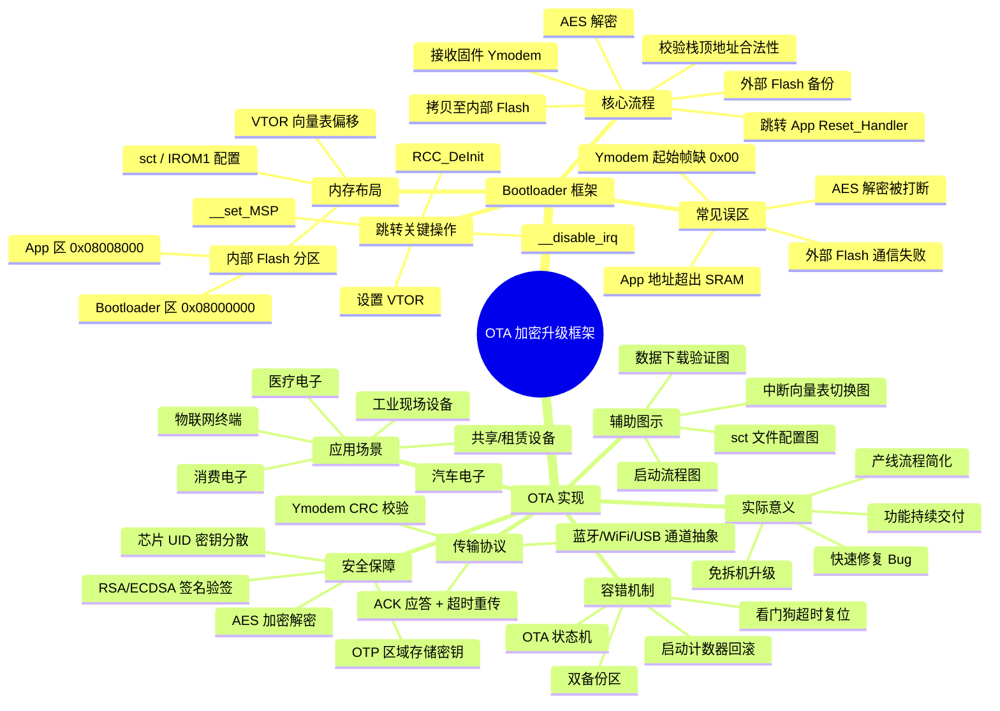
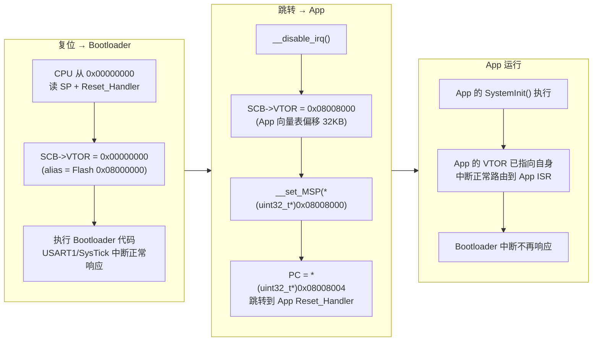

日期：2026.4.22

文章标签： #bootloader #OTA

## 1. 学习内容

### 知识点总览

| 序号  | 知识点                |
| --- | ------------------ |
| 1   | Bootloader 框架与实际使用 |
| 2   | OTA 框架与实际使用        |

### 知识点关联思维导图



---

## 2. 逐点精讲

### 知识点 1：Bootloader 框架与实际使用

#### 常见误区

1. Ymodem 协议通信失败，起始帧内容未添加 0 x 00
2. AES 解密失败，解密过程被打断
3. App 地址未位于 SRAM 地址范围内
4. 外部 flash 通信失败，无法将数据存入备份区

#### 辅助图示

1. 自定义 boot 的初始化工作 ![[file-20260513203724025.png]]
2. 数据下载与验证过程 ![[file-20260513204155058.png]]
3. 自定义 Boot 代码流程 ![[file-20260513204248347.png]]
4. Bootloader 代码移动示意图 ![[assets/OTA加密升级框架/file-20260429204733682.png]]
5. App 代码流程图 ![[file-20260513204404495.png]]

#### 核心逻辑/原理

确定自定义 bootloader 在内部 flash 中的内存大小与范围，设置 app 程序起始地址，通过 Ymodem 协议来接收上位机的 app 新固件将其存入外部 flash 备份区，传输完毕数据无丢失，将其备份区数据解密成功后，将备份区数据拷贝至 app 程序 flash 范围，自定义 boot 判断 app 地址是否合法，（这里是否应该将）合法则跳转至 app 程序起始地址运行新固件

#### 关键公式/结论

1. ../Drivers/STM32F4xx_StdPeriph_Driver/src/misc.c(157): error: no member named 'IPR' in 'NVIC_Type'157 |     NVIC->IPR[NVIC_InitStruct->NVIC_IRQChannel] = tmppriority; 移植工程报错将 IPR 改成 IP 即可
2. 双备份区的存在，当新固件无法使用时可以回滚老固件，或者解密过程以及拷贝过程中被中断，还存有原程序可以重新解密或者拷贝
3. 厂家 boot 在 STM 32 中也叫系统存储器，该区域的代码无法修改
4. 自定义 boot 根据其自举模式指定的起始地址去选择内存位置

### 知识点 2：OTA 的实现

#### 实际意义

OTA（Over-The-Air）升级解决了嵌入式设备生命周期中最核心的维护痛点：

1. **免拆机升级**：产品已部署在现场或用户手中，无需开盖、无需 JTAG/SWD 烧录器，通过通信接口直接完成固件更新，大幅降低售后维护成本
2. **快速迭代与修复**：发现 Bug 或安全漏洞后，可以在数小时内推送修复固件，而不是等待设备返厂或安排现场工程师上门
3. **功能持续交付**：产品交付后仍可追加新功能、优化算法，延长设备生命周期，提升产品竞争力
4. **生产流程简化**：出厂时只需烧录一个稳定的 Bootloader，App 固件可以在产线最后环节通过 OTA 灌装，减少产线烧录工位配置

#### 应用场景

1. **物联网终端设备**：智能家居（智能灯控、门锁、传感器）、环境监测节点、农业物联网采集器——设备数量多、分布广，逐一拆机烧录成本极高
2. **工业现场设备**：PLC 远程终端单元、数据采集器、工业网关——设备部署在机柜或偏远站点，OTA 更新避免停产停线
3. **消费电子**：无人机飞控、智能穿戴、手持仪器——产品交付后通过手机 App 推送新固件，提升用户体验
4. **医疗电子**：便携监护仪、血糖仪——定期推送算法更新，同时满足法规要求的固件版本追溯
5. **汽车电子**：ECU（发动机控制单元）、T-Box 车机——通过 4G/5G 远程升级，避免大规模召回
6. **共享/租赁设备**：共享充电宝、共享单车——通过 NB-IoT 或 BLE 定期更新计费逻辑和安全补丁

#### 常见误区

1. **蓝牙串口透传 Ymodem 速度缓慢、易断连**：蓝牙的串口透传（SPP/BLE UART）本质是分包传输，Ymodem 的 1 秒帧超时机制与蓝牙的抖动延迟不匹配。优化方向：改用 MTU 适配的传输协议、增大超时窗口、添加断点续传机制
2. **OTA 过程中断电不会变砖**：如果设计时没有双备份区，或者拷贝过程先擦后写，断电后 App 区为空或者内容损坏，设备将无法启动。必须保证 " 旧固件完整保留到新固件完全写入成功 "
3. **解密和校验放在跳转前才做**：如果在跳转时才做 AES 解密 + CRC 校验，一旦发现校验失败，还需要重新下载整个固件，耗时很长。建议在下载完成后、拷贝之前就完成校验和解密
4. **App 和 Bootloader 共用同一套中断处理逻辑**：跳转前没有 `__disable_irq()` 和 `RCC_DeInit()`，Bootloader 使能的外设中断在 App 侧因 VTOR 切换不及时而跑飞到错误地址
5. **外部 Flash 和内部 Flash 的地址映射混淆**：Bootloader 读取外部 Flash 的固件时，如果使用内存映射模式（如 W25Q64 的 QPI 模式），需确认地址映射范围是否与内部 Flash 的寻址冲突
6. **忽视固件加密的密钥保护**：AES 密钥明文存储在 Bootloader 代码中，攻击者通过读 Flash（如 SWD）即可提取密钥。应结合芯片 UID 做密钥分散，或使用 STM32 的 OT P 区域存储密钥

#### 辅助图示

1. 串口通信中断回调函数区分半满与空闲的方法 ![[file-20260519194050092.png]]
2. 修改 sct 文件 ![[file-20260525214317218.png]]
3. 中断向量表在 bootloader 和 app 中的使用



4. STM 32 启动过程 ![[file-20260529214400706.png]]
5. 自定义 bootloader 整体流程 ![[file-20260531214219233.png]]
6. App 整体流程 ![[file-20260529214525468.png]]
7. App 程序各线程任务 ![[file-20260529214446727.png]]

#### 通俗人话解释

OTA 就像给手机系统在线升级一样——设备（STM32）正在跑旧程序，现在要通过串口/WiFi/蓝牙获取一个新固件包，把正在跑的代码换掉，整个过程还不能让设备 " 死机变砖 "。

拆开来看就三步：

1. **收快递**：通过 Ymodem 协议（一种带校验的文件传输协议）把新固件下载到**外部 Flash 备份区**——就像先把安装包下载到手机的 " 临时文件夹 "，不急着装
2. **验货解密**：下载完检查文件有没有损坏（CRC 校验），如果是加密固件就用 AES 密钥解密，确认解密后的数据完整
3. **替换生效**：把新固件从备份区拷贝到内部 Flash 的 App 区域，然后复位重启，Bootloader 发现 App 区有新版程序，就跳过去运行

**关键容错机制**：老固件在 App 区一直保留到新固件完全拷贝成功才被擦除。所以如果中途断电或通信断了，重启后老固件还在，设备照常运行，不会变砖。

#### 核心逻辑/原理

OTA 的核心流程分为 "**下载 → 存储 → 校验 → 解密 → 拷贝 → 跳转**" 六个环节：

1. **固件下载（Ymodem 协议）**：上位机通过 Ymodem 协议发送新固件，每帧数据附带 CRC 校验。接收端逐帧确认，确保传输零差错。起始帧包含文件名和文件大小，数据帧每包 128/1024 字节
2. **备份存储（外部 Flash）**：接收到的加密固件存入外部 Flash（如 W25Q64）的备份分区。这样做的好处是不直接覆盖内部 Flash 正在运行的 App 程序，保证设备在下载期间功能正常
3. **完整性校验**：传输完成后对备份区的数据进行 CRC32/SHA256 校验，确认数据在传输和存储过程中没有位翻转或损坏
4. **AES 解密**：使用预置的 AES-128/256 密钥对加密固件进行解密。PC 端加密 → 串口传输 → STM32 端解密，防止固件在传输过程中被窃取或篡改
5. **固件拷贝（内部 Flash 编程）**：将解密后的明文固件从外部 Flash 备份区搬运到内部 Flash 的 App 区（起始地址 0x08008000）。搬运前需要**按扇区擦除**目标区域，然后按字/半字编程写入
6. **安全跳转**：Bootloader 校验 App 栈顶地址合法性（指向 SRAM 范围），合法则失能中断、重置时钟、重设向量表偏移（VTOR），最后将 PC 指向 App 的 Reset_Handler

#### 关键公式/结论

1. **内部 Flash 分区**：Bootloader 区 32KB（0x08000000 ~ 0x08007FFF）+ App 区（0x08008000 ~ 芯片末尾），分区大小在 sct 链接脚本中定义
2. **App 向量表偏移量**：`SCB->VTOR = 0x08008000`，偏移量为 32KB（即 0x8000），需与 App 工程的 IROM1 起始地址一致
3. **栈顶地址合法性检查**：`(*(uint32_t*)AppAddr) & 0x2FFE0000) == 0x20000000` —— 确保栈顶指针落在 STM32F411 的 SRAM 范围（0x20000000 ~ 0x2001FFFF，128KB）内
4. **跳转前强制操作**：`__disable_irq()` + `RCC_DeInit()` + 清除所有挂起中断标志。这是因为 Bootloader 和 App 的中断向量表不同，跳转前不清理中断会导致 App 跑飞
5. **加密等级**：推荐 AES-128-CBC 或 AES-256-GCM 模式，密钥写在 Bootloader 代码中（可结合芯片 UID 做密钥分散，增加破解难度）
6. **双备份容错**：外部 Flash 建议划分为 " 备份区 A（接收新固件）" 和 " 备份区 B（存放当前固件副本）"；或结合内部 App 区的旧固件实现三冗余，确保任意环节失败都能回滚
7. **Ymodem 超时机制**：接收端设置 1s 帧超时，超时则重发请求；连续 5 次超时判定传输失败，回滚到旧固件运行

---

> **与 Bootloader 的关系**：Bootloader 是 OTA 的 " 安装器 "——它负责下载、解密、拷贝和跳转的全部底层操作；App 只需提供升级触发和固件下载命令。Bootloader 不动，App 可以无限次更新。

## 3. 相关资料

### 🎥 视频链接

[OTA远程升级-尚硅谷](https://www.bilibili.com/video/BV11C65BDEJx/?spm_id_from=333.337.search-card.all.click)

[STM32怎么联网升级程序](https://www.bilibili.com/video/BV1XT3XzmEYi/?spm_id_from=333.337.search-card.all.click)

### 🔗 资料链接

[STM32实现bootloader跳转的关键步骤](https://zhuanlan.zhihu.com/p/648855822#:~:text=%E6%9C%80%E7%AE%80%E5%8D%95%E7%9A%84%E4%B8%80%E7%A7%8D%E5%8D%87%E7%BA%A7%E6%96%B9%E6%A1%88%E6%98%AF%EF%BC%9A%E4%B8%80%E4%B8%AA%20BootLoader%20%E5%92%8C%20%E4%B8%80%E4%B8%AA%20APP%20%EF%BC%8CBootLoader%20%E5%AE%9E%E7%8E%B0%E8%B7%B3%E8%BD%AC%E5%92%8C%E5%8D%87%E7%BA%A7APP%20%E7%9A%84%E5%8A%9F%E8%83%BD%E3%80%82,0x10000%EF%BC%8C64K%20%E5%AD%97%E8%8A%82%E3%80%82%20APP%20%E5%AD%98%E5%82%A8%E7%9A%84%E5%9C%B0%E5%9D%80%EF%BC%8C%E5%AE%89%E6%8E%92%E5%9C%A8%20BootLoader%20%E5%90%8E%E8%BE%B9%EF%BC%8C%E5%8D%B3%E5%AD%98%E5%82%A8%E5%9C%B0%E5%9D%80%E4%B8%BA%200x8010000%EF%BC%8CFlash%20%E5%89%A9%E4%BD%99%E7%9A%84%E7%A9%BA%E9%97%B4%E9%83%BD%E5%8F%AF%E4%BB%A5%E5%88%86%E9%85%8D%E7%BB%99APP%E3%80%82)

[Ymodem协议详解](https://blog.csdn.net/huangdenan/article/details/103611081)

[SecureCRT连接串口教程](https://blog.csdn.net/weixin_43738690/article/details/113398519)

[BOOT跳转APP失败问题](https://forum.anfulai.cn/forum.php?mod=viewthread&tid=109595)

### 💻 代码/PDF

```
#include "boot_manager.h"

void JumpToApp(void)
{
	/*检查栈顶地址是否合法*/
	uint32_t JumpAddress;
	pFunction Jump_To_Application;
	/*检查栈顶地址是否合法*/
	if(((*(__IO uint32_t *)ApplicationAddress) & 0x2FFE0000) == 0x20000000)
	{
		/*屏蔽所有中断，防止在跳转过程中，中断干扰出现异常*/
		__disable_irq();
		NVIC_SetVectorTable(NVIC_VectTab_FLASH, 0x10000);
		RCC_DeInit();
	
		/*用户代码区第二个字为程序开始地址（复位地址）*/
		JumpAddress = *(__IO uint32_t *) (ApplicationAddress + 4);
	
		/* Initialize user application's Stack Pointer */
		/*初始化APP堆栈指针（用户代码区的第一个字用于存放栈顶地址）*/
		__set_MSP(*(__IO uint32_t *) ApplicationAddress);
		
		/*类型转换*/
		Jump_To_Application = (pFunction) JumpAddress;
		
		/*跳转到 APP*/
		Jump_To_Application();
	}
}

/* Define to prevent recursive inclusion -------------------------------------*/
#ifndef __BOOT_MANAGER_H
#define __BOOT_MANAGER_H

/* Includes ------------------------------------------------------------------*/
#include "main.h"

/* Exported types ------------------------------------------------------------*/
typedef void (*pFunction) (void);
/* Exported constants --------------------------------------------------------*/
/* Exported macro ------------------------------------------------------------*/
#define ApplicationAddress	0x8008000
#define NVIC_VectTab_FLASH	((uint32_t)0x08000000)

/* Exported functions ------------------------------------------------------- */
void JumpToApp(void);

#endif /* __MAIN_H */
```

```
SCT文件代码解析
加载域名 起始地址 大小{： 加载区域大小 （分号后面是注释）​
2        运行域名 起始地址 大小  ： 执行地址​
3        {​
4                中断向量表起始地址， +First表示强制放到首地址​
5                ​
6                ARM相关库，InRoot$$Sections即ARM库的链接器标号，主要作用是进行重定位COPY RW到RAM时，​
7                提供RW在flash上的起始地址，​
8                然后在RW区后面创建ZI区域。 库函数__main函数中有这个段。 它是__main()的一部分。​
9                ​
10                编译文件RO只读在该区域​
11        }​
12        运行内存名字 起始地址 大小​
13        {​
14                        编译可读可写，静态区​
15        }​
16}
```

---

## 4. Q&A

### 🟢 基础篇

#### **Q1（Bootloader 跳转全流程）**：描述 STM32 上电后从 Bootloader 跳转到 App 的完整过程。涉及：向量表位置、VTOR 如何切换、SP 和 PC 如何设置、中断为什么要先关后开、RCC 为什么需要重新初始化

A 1:

	1. 先检查 app 起始地址是否合法位于 SRAM 区域中

	2. 关闭所有中断，防止设置跳转地址时跳转至非合法地址导致系统卡死

	3. 偏移中断向量表至 app 起始地址，防止 app 程序无法正常使用中断，对于 VTOR 寄存器进行位操作

	4. 设置 sp 栈指针指向 app 起始地址的前四个字节，设置 pc 为 app 起始地址的第 4~8 个字节

	5. 跳转至 pc 地址开始执行 app 程序，进入后直接打开全部中断

	6. RCC 重新初始化，是 bootloader 和 app 的时钟配置不一样，app 需要额外开启外设时钟

#### **Q2（Flash 分区与链接脚本）**：Bootloader 和 App 在内部 Flash 中如何划分地址空间？App 的起始地址通过哪些方式配置（sct 文件 / IROM1 / 散列文件）？Flash 的扇区/页结构对分区设计有什么约束？

A 2:

	1. 利用 keil 中的魔术棒对 IROM 范围进行修改

	2. 选择自定义 SCT 文件（不同的 IDE 会产出对应的文件）来进行内存映射

	3. Flash 的结构对于擦除区域有限制，且 boot 程序小可能会浪费内存空间

#### **Q3（中断向量表管理）**：Bootloader 和 App 各自拥有独立的中断向量表，它们分别存放在什么地址？跳转前后中断是如何从 Bootloader 的 ISR 平滑过渡到 App 的 ISR 的？如果跳转前没有 `__disable_irq()` 会发生什么？

A 3:

	1. Bootloader 的中断向量表存放在 boot 引脚选择映射的起始地址，app 的中断向量表在 app 程序的起始地址

	2. 先关闭所有中断，防止偏移中断向量表时，中断打断导致访问到非法地址，偏移中断向量表再打开所有中断

#### **Q4（Ymodem 传输可靠性）**：Ymodem 协议通过哪些机制保证数据传输的可靠性？如果在蓝牙串口透传场景下使用 Ymodem 做 OTA，会遇到什么问题？可以从哪些方向优化？

A 4:

	1. 每次数据包传输结束进行 CRC 校验，ACK 应答机制，起始结束包机制以及超时重发机制

	2. 蓝发串口透传一次性只能发 256/512 个字节，期间还会有延迟甚至因为环境因素导致丢包，因为 Ymodem 的串口接收方案为 DMA 空闲中断，会因为延迟导致 Ymodem 协议超过超时时间导致重传，

	3. 提高超时时间阈值减少 Ymodem 数据包大小可以解决，或者断点续传机制来弥补

### 🟡 进阶篇

#### **Q5（OTA 容错架构设计）**：设计一套 OTA 升级方案，要求在以下异常场景下设备都不变砖：① 下载中断电 ② 解密过程中断电 ③ 新固件拷贝到一半断电 ④ 新固件有 Bug 跑飞。请说明备份区策略、回滚机制和看门狗配合方式

A 5:

	1. 使用双备份区+OTA 状态机+看门狗来实现稳定的 OTA 升级方案

	2. 利用外部 flash 双备份区，A 区用于存储新下载的固件，B 区存储已解密的新固件，检验无误，将旧固件转移至 A 区，将 B 区固件转移至 APP 区域

	3. 利用 AT 24 C 02 存储 OTA 状态，app 程序在下载前和接收结束后都会进行 OTA 状态设置，这样中途断电，boot 可以根据 OTA 状态来重新进行下载固件或者跳转 app

	4. 新固件跑飞了，看门狗超时导致软复位后，回滚版本等待下载新固件

#### **Q6（固件加密与安全体系）**：从 PC 端固件生成 → 串口传输 → STM32 接收存储 → 跳转运行，描述完整的加密解密链路。回答以下问题：AES 密钥存在哪里最安全？如何利用芯片 UID 防止固件被移植到其他设备上？如果再加上 RSA/ECDSA 签名验证，验签应该在 AES 解密前还是解密后？

A 6:

	1. 对生成的固件进行 AES 加密，同时在尾部添加 HXA 256 数字签名，硬件支持的话使用 RSA 私钥对哈希值进行加密，发送固件给 STM 32，STM 32 对其数据 CRC 检验其完整性后将固件包+签名写入外部 flash，使用存储在芯片的 OTP 或者加密芯片中 RSA公钥解密数字签名，对比 STM 32 计算出的哈希值与数据包哈希值，签名确认无误开始解密，使用存储在加密芯片中的 AES密钥开始解密得到明文，将固件写入 app 区域后，boot 流程跳转至 app

	2. AES 密匙放在不易被读取的区域如 OTP，专用加密芯片等

	3. 利用设备UID  生成专用 AES 密钥，将 UID 放在 OTP，启动时读取自身UID

	4. 在 AES 解密前进行验证签名，可以立即识别并丢弃错误或伪造的固件包

#### **Q7（外部 Flash + 内部 Flash 协作）**：为什么 OTA 架构中通常需要外部 Flash？Bootloader 如何把固件从外部 Flash 搬运到内部 Flash 的 App 区？搬运过程中有哪些容易出错的细节（地址对齐、DMA 传输、ECC 校验）？

A 7:

	1. 内部 flash 空间极其有限，外部 flash 可以满足双备份区的需要，将新固件直接写入内部 flash 无法回滚版本，设备变砖没有备用方案，同时写入内部 flash 会阻塞系统运行占用 CPU 资源，外部 flash 的写入寿命也比内部 flash 高很多

	2. 将保存在外部 flash 中的固件进行完整性验证（CRC 和 SHA 256）和解密(AES)后，擦除内部 flash 相关扇区，使用 CPU 或者 DMA 搬运数据至内部 flash

	3. 因为内部 Flash 的写入操作通常要求目标地址必须是页（Page）大小的整数倍；DMA 传输要求缓冲区对齐-DMA 的源地址和目的地址通常要求与数据总线宽度对齐，还要注意 DMA 中断后要等待传输结束后再进行下一次传输；ECC 是基于整个 Flash 行（Row）计算的。如果你只擦除扇区的一部分，导致新旧数据混合的整个行 ECC 错误。必须整扇区擦除

### 🔴 困难篇

#### **Q8（看门狗与异常恢复链路）**：设计一个完整的 " 异常→检测→恢复 " 链路。OTA 下载阶段看门狗超时怎么处理？App 跑飞了看门狗复位后如何自动回滚到旧固件而不是再次进入死循环？如何区分 " 首次启动 " 和 " 看门狗复位后重启 "？

A 8:

	1. OTA 下载阶段每收到一帧数据就喂狗一次，Ymodem 帧超时（1s）小于看门狗溢出时间（如 5s），所以正常下载不会触发复位。如果通信中断导致看门狗超时复位，Bootloader 启动后检查 OTA 状态标志（存储在 EEPROM 如 AT24C02 或备份寄存器）：若状态为"正在下载中"，则清除备份区并重新等待下载指令

	2. App 跑飞后看门狗复位，Bootloader 再次执行。此时需要判断"是否需要回滚"而非再次跳转同一个坏 App。方法：使用启动计数器（存储在备份寄存器 RTC_BKPx 或 EEPROM），每次看门狗复位时计数器 +1，正常启动后由 App 清零。当启动计数器 >= N（如 3 次），Bootloader 判定 App 异常，不再跳转，而是从外部 Flash 备份区拉取旧固件覆盖内部 Flash App 区，然后清零计数器重新启动

	3. 区分首次启动和看门狗复位后重启的方法：检查 RCC->CSR 寄存器的 RMVF（Reset Flag）位——看门狗复位对应 IWDGRSTF 或 WWDGRSTF 标志位置位。同时结合上一步的启动计数器：首次上电计数器为 0，看门狗复位后计数器不为 0。两者配合可精确区分冷启动、看门狗复位、按键复位等多种场景

#### **Q9（多分区多通道升级架构）**：如果产品同时包含 Bootloader、App、无线协议栈三个可更新分区，且需要通过蓝牙、WiFi、USB 三种通道都能触发升级，你会如何设计升级顺序和容错策略？先升级哪个分区？一个分区升级失败如何影响其他分区？

A 9:

	1. 升级顺序：遵循"先升级安全相关、后升级功能相关"的原则——先升级无线协议栈（通信通道本身），再升级 App 固件（功能主体），最后升级 Bootloader（风险最高，只在确有必要时升级）。Bootloader 升级失败设备直接变砖，所以必须使用 A/B 双分区方案来升级 Bootloader

	2. 通道抽象设计：在 App 中封装一层"传输接口抽象层"，将蓝牙（SPP/BLE UART）、WiFi（TCP/UDP）、USB（CDC/VCP）三种通道统一为同一个回调接口：`接收数据(data, len)` + `发送响应(data, len)`。App 收到升级指令后，将通道句柄传给同一个 OTA 状态机，Bootloader 侧不需关心数据来源

	3. 多分区升级容错：每个分区独立管理版本号和 CRC 校验值。分区升级失败（如校验不通过）时，该分区保持旧版本继续运行，不影响其他分区。如果无线协议栈升级失败，导致通信通道无法工作——App 和 Bootloader 不受影响，但需通过其他通道（如 USB）重试升级协议栈

	4. Bootloader 升级的特殊策略：采用 A/B 分区方案——Bootloader 区分为 Boot_A（运行区）和 Boot_B（备份区）。新 Bootloader 先下载到 Boot_A，校验通过后设置切换标志，重启后从 Boot_B 启动。若启动失败，看门狗复位后回退到 Boot_A。升级成功后将 Boot_B 复制到 Boot_A，完成更新

#### **Q10（Flash 擦写特性对 OTA 的深层影响）**：Flash 为什么必须先擦后写？擦除粒度（扇区/页）和写入粒度（字/半字/字节）不匹配时会有什么问题？OTA 频繁升级会导致 Flash 磨损吗？如何设计磨损均衡？内部 Flash 和外部 Flash（如 W25Q64）的擦写特性差异对 OTA 架构有什么影响？

A 10:

	1. Flash 必须先擦后写的根本原因：Flash 存储单元在擦除后为全 1（0xFF），写操作只能将 1 变为 0（按位清零），无法将 0 变为 1。所以同一地址再次写入前必须整块擦除恢复到全 1 状态

	2. 擦除粒度与写入粒度不匹配的问题：STM32F411 内部 Flash 按扇区擦除（最小 16KB × 4 + 64KB × 1 + 128KB × 1），但可以按字（32bit）写入。如果 App 大小不是扇区整数倍，最后一个扇区混有 App 数据和空白区域，擦除后再写入需要用原备份数据补齐该扇区剩余部分（读-改-写）。同理改写时不能只写一两个字节，而是先读整页、改对应位、擦除、重写全部

	3. OTA 频繁升级确实会导致 Flash 磨损。内部 Flash 擦写寿命约 1 万次，外部 Flash（W25Q64）约 10 万次。按每天升级 1 次计算，内部 Flash 约 27 年耗尽，外部 Flash 约 273 年。所以在 Bootloader + App 框架中，频繁擦写的操作（固件备份、拷贝）尽量放在外部 Flash，内部 Flash 的 App 区只在最后一次拷贝时擦写一次，把磨损降到最低

	4. 磨损均衡设计：将外部 Flash 备份区划分为多个相同大小的块（如 4 个 64KB 块），每次写入新固件时轮换使用不同的块，记录当前使用块号（放在最后一块的头部或 EEPROM 中）。避免每次都擦写同一块区域，将磨损分散到多个块上，等效寿命提升 N 倍

	5. 内部 vs 外部 Flash 差异对 OTA 架构的影响：① 擦写寿命差 10 倍→备份操作放在外部 Flash；② 擦除粒度不同（内部最小 16KB vs 外部 4KB）→ 外部 Flash 分区更灵活，分区浪费更少；③ 外部 Flash 支持内存映射（QPI/QUAD 模式），Bootloader 可直接寻址读取，不需要逐字节 SPI 读取，搬运效率更高；④ 内部 Flash 写入需 unlock→擦除→编程→lock 序列，外部 Flash 通过 SPI 命令操作，两者编程接口不同，Bootloader 需分别实现
