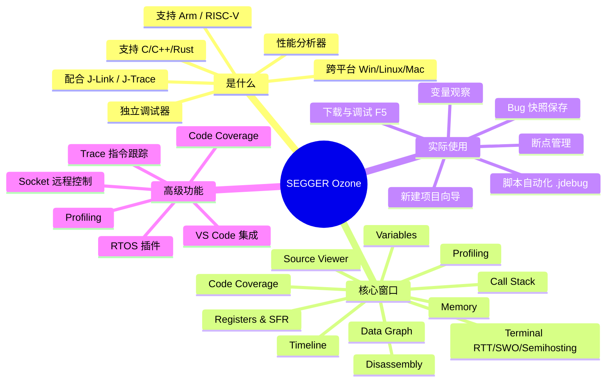
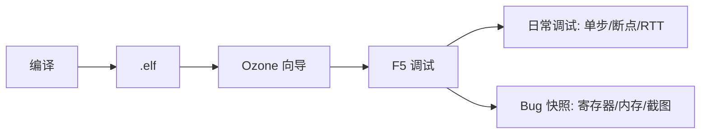

日期：2026.6.3

文章标签： #debug #jlink #ozone #segger

## 1. 学习内容

### 知识点总览

| 序号  | 知识点 |
| --- | --- |
| 1   | Ozone 是什么 — 全功能独立调试器与性能分析工具 |
| 2   | Ozone 各窗口介绍 — Source/Memory/Register/Disassembly/Terminal/Profile 等 |
| 3   | Ozone 实际使用方法 — 项目创建、调试流程、自动化脚本、Bug 现场快照保存 |
| 4   | Ozone 高级功能 — Trace/Code Coverage/Profiling/脚本自动化/Socket 远程控制 |

### 知识点关联思维导图



---

## 2. 逐点精讲

### 知识点 1：Ozone 是什么

#### 实际意义

Ozone 是 SEGGER 公司开发的一款**图形化独立调试器 + 性能分析器**，配合 J-Link / J-Trace 使用。它不依赖任何 IDE（Keil/IAR/Embedded Studio 均可），直接加载编译产出的 .elf/.hex 文件即可开始调试，解耦了 " 编译工具链 " 和 " 调试环境 "。

#### 应用场景

- 没有 IDE 或不想开 IDE 时快速调试
- 需要 **指令级 Trace** 回溯分析崩溃原因（配合 J-Trace）
- 做 **Code Coverage** 验证测试覆盖率
- **Profiling** 定位性能瓶颈（哪个函数占 CPU 最多）
- 自动化测试/CI 中通过脚本控制调试流程
- **Bug 现场快照保存** — 冻结变量/寄存器/内存状态，便于事后分析

#### 常见误区

- **误区**：Ozone 只能配合 J-Link 用 → 2025 年 9 月起也支持第三方调试器（通过 GDB Remote Protocol）
- **误区**：Ozone 需要单独买 license → 购买 J-Link PLUS/ULTRA+/PRO 免费附带，个人非商用友好许可
- **误区**：Ozone 只能调试 GCC 编译的固件 → 支持 IAR/Keil/GCC/Clang/ARMCC 所有主流工具链
- **误区**：Ozone 不能看外设寄存器 → 有 SFR 视图直接查看和编辑 MCU 外设寄存器

#### 辅助图示

1. Ozone 窗口示意图 ![[file-20260607164943372.png]]

#### 通俗人话解释

Ozone 像是给单片机做 " 解剖手术 " 的一整套工具。**Source Viewer** 是 B 超屏幕能看到源代码执行到哪一行，**Memory** 是血液检测仪能看到内存里每个字节的值，**Registers** 是心电图看 CPU 寄存器的实时状态，**Terminal** 是病人的 " 喊话器 " 接收 printf 输出，**Trace** 是行车记录仪可以回放 CPU 执行过的每一条指令。

#### 核心逻辑/原理

Ozone 通过 J-Link 的调试接口（SWD/JTAG）与目标 MCU 通信：

1. **下载**：通过 SWD/JTAG 将固件烧录到 Flash
2. **控制**：发送 halt/step/resume 命令控制 CPU 执行状态
3. **读取**：读取 CPU 寄存器、内存、外设寄存器
4. **Trace**（J-Trace）：通过 ETM/ETB 接口捕获指令执行流，实时上传到 PC
5. **脚本**：C 风格脚本调用底层 API 实现自动化控制

#### 关键公式/结论

- **Ozone ≠ IDE**，它是独立调试器，专注调试一个环节
- **J-Link 用户免费使用**（PLUS 以上型号）
- **支持格式**：ELF / DWARF / Intel HEX / Motorola S / Binary
- **项目文件**：`.jdebug`（本质是 C 风格脚本，可编辑可复用）

---

### 知识点 2：Ozone 各窗口介绍

#### 实际意义

熟悉每个窗口的用途是高效调试的前提，现场出 Bug 时能秒级定位到哪个窗口查什么信息。

#### 应用场景

| 窗口 | 什么时候用 |
|------|-----------|
| Source Viewer | 源码级单步调试、设断点、查看当前执行行 |
| Disassembly | 查看编译器生成的汇编代码、指令级定位 |
| Memory | 查看数组/缓冲区内容、检查内存越界、栈内容 |
| Registers | 查看 R0-R15/CPSR/SP/LR/PC、外设寄存器 |
| Variables | 查看全局/局部变量当前值、监视特定表达式 |
| Call Stack | HardFault 回溯调用链、看函数嵌套关系 |
| Terminal | 接收 RTT/SWO/Semihosting 输出 |
| Timeline | 可视化任务切换、中断响应时间分析 |
| Data Graph | 绘制变量变化曲线（ADC 采样值/传感器数据） |
| Coverage | 检查代码覆盖情况（哪些行被执行过） |
| Profiling | 统计各函数/各文件的 CPU 占用百分比 |

#### 辅助图示

1. Ozone 各窗口 ![[file-20260607165332058.png]]

#### 各窗口详解

1. **Source Viewer** — 源码语法高亮，左侧设断点（无限），黄色箭头标记当前行，支持双栏
2. **Disassembly** — 与源码同步滚动，源码↔汇编对应，支持混排与汇编级断点
3. **Memory** — 8/16/32-bit 显示，双击编辑，异步滚动不阻塞，支持 Save As 导出
4. **Registers** — 内核寄存器 R0-R15/xPSR + SFR 外设寄存器（GPIO/USART），值变化彩色高亮，双击修改
5. **Variables** — Globals/Locals/Watch 三级，树形展开结构体/数组，值变化高亮
6. **Call Stack** — 函数调用链，点击跳转源码，HardFault 直接定位末帧
7. **Terminal** — 接收 RTT/SWO/Semihosting 数据，支持键盘输入回传
8. **Timeline** — 函数调用时序可视化，ISR 响应时间分析，多核/多任务调度
9. **Data Graph** — 实时绘制变量曲线，支持 C 表达式，时间轴缩放
10. **Code Coverage** — 颜色标记执行覆盖，生成函数/文件/行级报告
11. **Profiling** — 各函数/文件 CPU 占用百分比 + 直方图，采样/精确双模式

---

### 知识点 3：Ozone 实际使用方法

#### 实际意义

在实际开发中用 Ozone 替代或补充 IDE 调试，可以做到 " 调试环境与编译工具链解耦 "，特别是配合 J-Link 时体验远超 IDE 自带调试器。

#### 应用场景

1. **日常单步调试** — 替代 Keil/IAR 调试视图
2. **HardFault 分析** — 直接定位崩溃位置 + 调用栈回溯
3. **Bug 现场快照** — 保存寄存器/内存/变量快照在事发一刻
4. **自动化测试** — CI 环境中的自动烧录 + 调试 + 导出覆盖率
5. **性能调优** — Profiling 找出 CPU 占用最高的函数

#### 实战步骤

**Step 1：新建 Ozone 项目**

1. 打开 Ozone → **File → New Project Wizard**
2. 选择目标芯片：`STM32F411CE`
3. 选择连接方式：`USB`（J-Link 默认）
4. 选择调试接口：`SWD`（STM32 默认）
5. 选择固件文件：编译生成的 `project.elf` / `project.hex`
6. 保存项目为 `.jdebug` 文件

**Step 2：开始调试**

| 操作 | 快捷键 | 说明 |
|------|--------|------|
| 下载并运行到 main | F5 | 烧录 + 复位 + 执行到 main() 暂停 |
| 全速运行 | F5 | 如果已经在调试，继续全速运行 |
| 暂停 | Esc | 立即暂停目标 CPU |
| 单步进入 | F11 | Step Into 进入函数内部 |
| 单步跳过 | F10 | Step Over 跳过当前行 |
| 单步返回 | Shift+F11 | Step Out 跳出当前函数 |
| 复位 | Ctrl+F2 | 复位目标 CPU |
| 重启调试 | Ctrl+Shift+F5 | 重新下载并开始调试 |

**Step 3：设断点**

- 源码行左侧单击 = 设行断点
- **数据断点**：Watch 窗口右键 → Set Data Breakpoint
- **条件断点**：断点右键 → Edit → 输入条件表达式
- **断点命令**：断点触发时自动执行脚本（自动输出变量值）

**Step 4：Bug 现场快照保存**

当 Bug 复现暂停在断点时：

1. **保存寄存器快照**：

   ```
   Registers 窗口 → 右键 → Save State
   ```

   → 生成 `.reg` 文件

2. **保存内存快照**：

   ```
   Memory 窗口 → 右键 → Save As
   ```

   → 选择地址范围，保存为 `.mem` 文件

3. **保存变量值**：

   ```
   Variables 窗口 → 全选 → Ctrl+C
   ```

   → 粘贴到笔记中

4. **保存全窗口截图**：

   ```
   Ozone → View → Save Screenshot
   ```

#### 常见误区

- **误区**：必须先开 IDE 生成 .elf 才能用 Ozone → Ozone 独立加载 .elf，无需 IDE
- **误区**：Ozone 不能和 IDE 同时用 → 完全兼容，可以 Keil 编译 + Ozone 调试并行
- **误区**：切换工程要重新配 → 保存为 .jdebug 文件，下次直接双击打开
- **误区**：Bug 快照保存太麻烦 → 脚本化后一次配置，后续一键导出

#### 辅助图示

1. Ozone 的使用整体流程



2. 创建 ozone 工程 ![[file-20260607165504108.png]]
3. Ozone 调试 ![[file-20260607170000869.png]]
4. Ozone 报错 ![[file-20260607213630723.png]]

---

## 3. 相关资料

### 🎥 视频链接

- [SEGGER Ozone 官方介绍视频](https://www.segger.com/products/development-tools/ozone-j-link-debugger/)
- [B站 搜索 Ozone 调试](https://search.bilibili.com/all?keyword=Ozone%20%E8%B0%83%E8%AF%95)
- [YouTube SEGGER Ozone Tutorials](https://www.youtube.com/results?search_query=segger+ozone+tutorial)

### 🔗 资料链接

- Ozone 产品页：https://www.segger.com/products/development-tools/ozone-j-link-debugger/
- Ozone 用户手册（UM08025 PDF）：https://www.segger.com/downloads/jlink/UM08025_Ozone.pdf
- Ozone 入门指南：https://www.segger.com/products/development-tools/ozone-j-link-debugger/technology/getting-started-with-ozone/
- SEGGER 知识库：https://kb.segger.com/
- Ozone 自动化测试示例：https://kb.segger.com/Automated_Tests_with_Ozone
- Ozone Socket 远程控制：https://kb.segger.com/Connecting_to_Ozone%27s_Automation_Socket_Interface

### 💻 代码/PDF

- Ozone 下载：https://www.segger.com/downloads/jlink/#Ozone
- 用户手册 UM08025（下载页面已有）
- J-Link 配套软件包（含 Ozone、J-Flash、J-Link Commander）

---

## 4. Q&A

### Q 1：.axf 文件和 .elf 文件有什么区别？

A 1：本质上是同一种文件格式（都是 ELF），只是后缀名不同。.axf 是 ARM 工具链（Keil/ARMCC）默认输出的后缀，.elf 是 GCC 工具链默认输出的后缀。内容结构完全兼容，Ozone 两者都能加载，可互换使用。

### Q 2：.axf 文件包含了什么内容？

A 2：包含固件完整信息：（1）**机器码**（.text 段）；（2）**已初始化数据**（.data 段）；（3）**零初始化信息**（.bss 段大小 + 地址）；（4）**DWARF 调试信息**（源码行号映射、变量类型、符号表）。调试器靠调试信息实现源码级单步和变量查看。

### Q 3：有了 .axf 是否可以生成 .hex 和 .bin 文件？

A 3：可以。使用 `fromelf`（ARM 工具链）或 `arm-none-eabi-objcopy`（GCC 工具链）即可提取：

- **生成 .hex**（Intel HEX，ASCII 格式，含地址信息）：`fromelf --bin --output=out.hex in.axf`
- **生成 .bin**（纯二进制，无元数据）：`arm-none-eabi-objcopy -O binary in.elf out.bin`

.hex 常用于烧录器/工厂量产，.bin 常用于 OTA 升级或 J-Flash 烧录。
