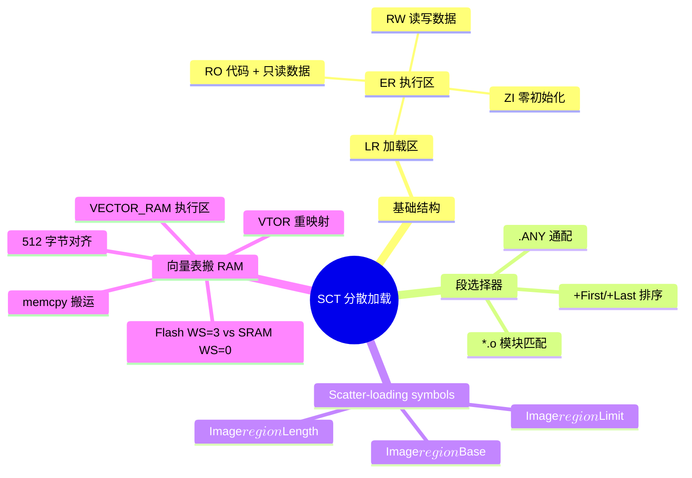
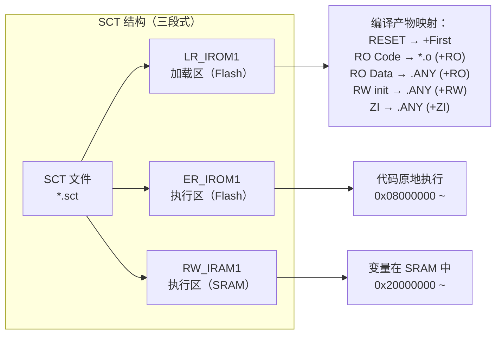
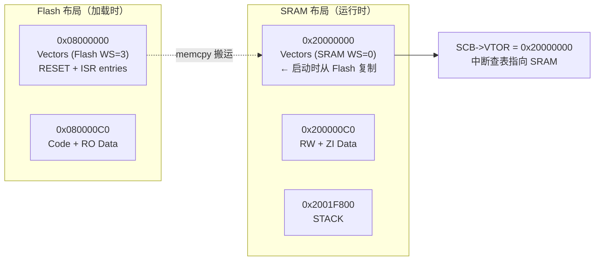

日期：2026.6.2

文章标签： #stm32 #sct #cmbacktrace

## 1. 学习内容

### 知识点总览

| 序号 | 知识点 |
| --- | --- |
| 1 | SCT 文件结构与语法 |
| 2 | 利用 SCT 将中断向量表加载到 RAM 提高实时性 |

### 知识点关联思维导图



---

## 2. 逐点精讲

### 知识点 1：SCT 文件结构与语法

#### 实际意义

SCT 文件是 Keil MDK-ARM 使用的分散加载描述文件（Scatter Loading Description File），告诉链接器如何将编译后的各个段映射到目标 MCU 的物理内存（Flash/SRAM）中。

- **没有 SCT** → 链接器使用默认布局，无法自定义分区（OTA 双区、非连续内存映射）
- **SCT 配置错误** → 烧录后不跑、HardFault、栈溢出检测不到

#### 应用场景

- **定制内存布局** — Bootloader+App 双区 OTA、外部 QSPI Flash 映射
- **非连续 SRAM** — F411 的 128KB SRAM 分为 64KB+64KB 两个 BANK，需手动映射
- **栈/堆定位** — 指定栈区位置和大小，与启动文件保持一致

#### 常见误区

| 误区                 | 真相                                        |
| ------------------ | ----------------------------------------- |
| SCT 只有 Keil 用      | IAR 用 `.icf`，GCC 用 `.ld` 链接脚本，功能等价        |
| CubeMX 生成的 SCT 不用改 | OTA/外部 Flash 定制栈名时**必须**手动修改               |
| 栈段名随便写             | 启动文件 `startup_*.s` **必须**与 SCT 严格一致       |
| LR 和 ER 必须同名       | LR（加载区）和 ER（执行区）可以不同，RW 段可加载在 ROM 执行在 RAM |
|                    |                                           |

#### 辅助图示

1. SCT 文件的结构分析



2. SCT 中自定义 flash 和 SRAM 区域 ![[file-20260607211450787.png]]

#### 通俗人话解释

> SCT 文件像是**装修图纸**：
>
> - **LR_IROM1** → 建材仓库（Flash 存储区）
> - **ER_IROM1** → 客厅家具位置图（代码在 Flash 原地执行）
> - **RW_IRAM1** → 茶几上的遥控器（变量在 SRAM 中动态读写）
> - **STACK** → 垃圾桶的位置（栈区，必须标在图纸上让编译器知道放哪）
> 
> CmBacktrace 就像保洁阿姨——她要知道垃圾桶（STACK 段）放在哪，才能准确清空和检查垃圾（栈回溯）。图纸上说垃圾桶在厨房（SCT 中定义 `STACK` 段），但阿姨听成了卫生间（`cmb_cfg.h` 中写了不同的段名）→ 阿姨走错房间，CmbBacktrace 找错栈位置，回溯全错。

#### 核心逻辑/原理

**SCT 文件基本语法**（ARMCC v5/v6，F411CEU6）：

```
; CubeMX 默认布局 — Flash 512KB, SRAM 128KB
LR_IROM1 0x08000000 0x00080000  {
  ER_IROM1 0x08000000 0x00080000  {
   *.o (RESET, +First)
   *(InRoot$$Sections)
   .ANY (+RO)
   .ANY (+XO)
  }
  RW_IRAM1 0x20000000 0x00020000  {
   .ANY (+RW +ZI)
  }
}
```

**关键关键字**：

| 关键字 | 含义 | 示例 |
|--------|------|------|
| `LR_*` | 加载时域（Load Region）— 描述烧录到 Flash 中的布局 | `LR_IROM1` |
| `ER_*` | 执行时域（Execution Region）— 描述运行时内存布局 | `ER_IROM1` |
| `*.o` | 精确选择特定目标文件中的段 | `main.o (+RO)` |
| `.ANY` | 通配符，选择任意目标文件的段 | `.ANY (+RW +ZI)` |
| `+First` | 强制放在该区域的起始位置 | `*(RESET, +First)` |
| `+Last` | 强制放在该区域的末尾 | `*(HEAP, +Last)` |
| `UNINIT` | 不解初始化（上电不擦除） | `RW_IRAM2 0x20000000 UNINIT 0x20000` |
| `FIXED` | 地址固定不变，链接器不调整 | `ER_FIXED 0x08010000 FIXED` |

**STM32F411CEU6 内存参数**：

| 存储区 | 起始地址 | 大小 |
|--------|----------|------|
| Flash | 0x08000000 | 0x00080000 (512KB) |
| SRAM | 0x20000000 | 0x00020000 (128KB) |

==在 Flash 和 SRAM 中的内存分布都可以在 map 文件中查找==

#### 关键公式/结论

**SCT 三段黄金法则**：

```
① 所有 RO 段的总和 ≤ Flash 大小
② 所有 RW + ZI 段的总和 ≤ SRAM 大小
③ 栈（STACK） + 堆（HEAP） ⊆ ZI 区域
```

---

### 知识点 2：利用 SCT 将中断向量表加载到 RAM 提高实时性

#### 实际意义

STM32F411CEU6 最高运行在 100MHz，此时 Flash 需要插入 **3 个等待周期**（Flash WS=3==，Flash 需要等待系统时钟信号降频至 flash 可用频率==），而 SRAM 为 **0 等待周期**。CPU 响应中断时，硬件自动从向量表读取入口地址——如果向量表在 Flash 中，每次取向量都受 Flash 等待周期拖慢，增加中断延迟。

将中断向量表加载到 SRAM 并重映射 VTOR，可将中断响应速度提升到 SRAM 级别，对硬实时场景至关重要。

- **Flash WS=3 的瓶颈**：向量表第一个读取的是 MSP（栈顶指针），在 100MHz 下耗时 ~30ns，乘以等待周期倍数累加可观
- **零等待 SRAM**：向量表在 SRAM 中，每个向量取出仅 1 个 CPU 周期
- **VTOR 重映射**：Cortex-M4 支持 `SCB->VTOR` 寄存器动态设置向量表基址

#### 应用场景

- **硬实时中断** — 高速 ADC 采样、电机 FOC 控制、通信协议时序关键路径
- **低延迟中断链** — 多个高频中断嵌套，每次查向量表都在 SRAM 完成
- **Bootloader + App 跳转** — App 向量表可加载到 SRAM 固定地址，通过 SCT 保证布局
- **安全关键场景** — 运行时无需依赖 Flash 控制器的缓存/预取，时序确定性强

#### 常见误区

| 误区 | 真相 |
|------|------|
| 向量表在 Flash 中直接读取不香吗？ | Flash 有等待周期，高主频下取向量延迟累积可达数十 ns，SRAM 零等待优势明显 |
| 只要在 C 代码中 memcpy 向量表到 RAM 就行 | SCT 不配合的话向量表的链接地址仍在 Flash，memcpy 后需要自己修正符号引用 |
| 改 VTOR 就能将向量表切到 RAM，和 SCT 无关 | 没有 SCT 分配 RAM 执行区，链接器不会为向量表预留 SRAM 空间，可能被 ZI 数据覆盖 |
| RAM 向量表必须复制整个表 | 是的，Cortex-M 向量表必须连续驻留，不能部分在 Flash 部分在 RAM |

#### 辅助图示

1. 向量表搬运步骤



#### 通俗人话解释

> 中断向量表在 Flash 中就像**快递员去郊区仓库取货**——仓库远（Flash WS=3），每取一单都要开车跑一趟（1 次向量读取 = 若干等待周期）。
>
> 把向量表搬到 SRAM 就像**在市中心开了个分仓**——快递员走两步就到，即取即走，零等待。
>
> SCT 文件就是**市区分仓的房产证**：它告诉链接器：" 分仓地址在 0x20000000，留出 320 字节（80 个向量 × 4 字节）位置，别让其他货物占了 "。
>
> 启动代码中的 memcpy 是**搬家公司**——把货物从郊区仓库搬到市区分仓。最后 SCB->VTOR = 0x20000000 是在门口挂上招牌：" 快递从此处取件 "。

#### 核心逻辑/原理

##### 基本原理

Cortex-M 响应中断的流程：

```
中断触发 → 硬件查向量表（读取 PC 入口地址）→ 压栈 → 跳转 ISR
                │
                ├─ 向量表在 Flash: 1 次读取 + Flash WS 周期
                └─ 向量表在 SRAM:  1 次读取（零等待）
```

STM32F411CEU6 Flash 等待周期 vs 主频关系：

| 主频 | Flash WS | 单次向量读取额外延迟 |
|------|----------|-------------------|
| ≤ 30MHz | 0 WS | 0 cycle |
| ≤ 60MHz | 1 WS | 1 cycle |
| ≤ 90MHz | 2 WS | 2 cycles |
| ≤ 100MHz | 3 WS | 3 cycles |

100MHz 下，每次中断至少读取 2 个向量（PC + SP），额外消耗 **6 个 CPU 周期 × 中断次数**。

##### SCT：向量表 + 显式 STACK（可直接替换 CubeMX 默认 SCT）

```
LR_IROM1 0x08000000 0x00080000  {
  ER_IROM1 0x08000000 0x00080000  {
   *.o (RESET, +First)
   *(InRoot$$Sections)
   .ANY (+RO)
   .ANY (+XO)
  }

  VECTOR_RAM 0x20000000 0x00000200  {  ; 向量表搬 SRAM (80 ISR * 4 = 320B)
   *(.isr_vector)
  }

  RW_IRAM1 0x20000200 0x0001F600  {   ; RW + ZI 从向量表后开始
   .ANY (+RW +ZI)
  }

  STACK 0x2001F800 UNINIT 0x00000800  {
   *.o (STACK)
  }
}
```

> `VECTOR_RAM` 用 `*(.isr_vector)` 精确匹配而非 `.ANY`，确保向量段固定在该区域。VTOR 要求 512 字节对齐，基址 0x20000000 天然满足。链接器自动生成 `Image$$VECTOR_RAM$$Base/Limit/Length` 符号供启动代码 memcpy + VTOR 重映射使用。

#### 关键公式/结论

**SCT 三段黄金法则**：

```
① 所有 RO 段的总和 ≤ Flash 大小
② 所有 RW + ZI 段的总和 ≤ SRAM 大小
③ 栈（STACK） + 堆（HEAP） ⊆ ZI 区域
```

**向量表加载到 RAM 三步骤**：

```
① SCT 中声明 VECTOR_RAM 执行区，基址 = SRAM 起始，段选择 = *(.isr_vector)
② 启动代码中 memcpy(__Vectors → VECTOR_RAM)
③ SCB->VTOR = VECTOR_RAM 基址 + __DSB()
```

**中断延迟改善估算**（F411CEU6 @ 100MHz, WS=3）：

```
中断响应总延迟 = 入栈(12 cycles) + 向量读取(WS cycles) + 分支(3 cycles)
  Flash: 12 + 3 + 3 = 18 cycles → 180ns
  SRAM:  12 + 0 + 3 = 15 cycles → 150ns
  节省: 3 cycles = 30ns 每次中断
```

**Cortex-M4 VTOR 对齐要求**：

```
VTOR[28:9] = 向量表基址高 20 位 → 512 字节对齐
即 VTOR & 0x000001FF == 0 必须成立
```

---

## 3. 相关资料

### 🔗 资料链接

- **Keil 官方 SCT 文档**: [Scatter-loading Features](https://developer.arm.com/documentation/101754/latest)
- **ARM 链接器参考**: [armlink User Guide — Scatter-loading](https://developer.arm.com/documentation/100123/1)
- **Keil scatter-loading 符号说明**: [armlink — Symbols and Scatter-loading](https://developer.arm.com/documentation/100123/1/Scatter-loading/Scatter-loading-symbols)
- **STM32F411 Reference Manual (RM0383)** — Section 2.3 (Memory map)
- **[转载] Keil MDK 的 sct 分散加载文件详解** — [博客园](https://www.cnblogs.com/yinsua/p/18583561)
- **B 站【硬汉嵌入式论坛】第 7 期 BSP 驱动教程：MDK 专题高级进阶，重要的分散加载使用** — [BV1MR4y157XS](https://www.bilibili.com/video/BV1MR4y157XS/)（含向量表搬 ITCM/RAM 实战案例）

### 💻 代码/PDF

**知识点 1：CubeMX 默认 SCT（Flash 512KB, SRAM 128KB）**

```
LR_IROM1 0x08000000 0x00080000  {
  ER_IROM1 0x08000000 0x00080000  {
   *.o (RESET, +First)
   *(InRoot$$Sections)
   .ANY (+RO)
   .ANY (+XO)
  }
  RW_IRAM1 0x20000000 0x00020000  {
   .ANY (+RW +ZI)
  }
}
```

**知识点 2：VECTOR_RAM + 显式 STACK（可直接替换 CubeMX 默认 SCT）**

```
LR_IROM1 0x08000000 0x00080000  {
  ER_IROM1 0x08000000 0x00080000  {
   *.o (RESET, +First)
   *(InRoot$$Sections)
   .ANY (+RO)
   .ANY (+XO)
  }

  VECTOR_RAM 0x20000000 0x00000200  {  ; 向量表搬 SRAM (80 ISR * 4 = 320B)
   *(.isr_vector)
  }

  RW_IRAM1 0x20000200 0x0001F600  {   ; RW + ZI 从向量表后开始
   .ANY (+RW +ZI)
  }

  STACK 0x2001F800 UNINIT 0x00000800  {
   *.o (STACK)
  }
}
```

---

## 4. Q&A

### 🟢 基础篇

#### **Q1（LR vs ER 区别）**：SCT 文件中 LR_IROM1 和 ER_IROM1 的区别是什么？为什么在 STM32 中它们地址通常相同？什么情况下两者地址会不同？

 A 1:

 1. LR_IROM 1 表示的是代码存储的地址，ER_IROM 1 表示的是代码运行的地址
 2. 节省 RAM 空间，也不用多余的代码搬运进行运行
 3. 需要关键代码运行至 SRAM 中，提高运行速度和反应时间；或者使用外部 flash 或者外部 SRAM，数据非常大无法放入内部 flash

#### **Q2（Flash WS 对中断延迟的影响）**：STM32F411 在 100MHz 下 Flash 等待周期（WS）对中断延迟的具体影响是什么？每次中断额外消耗的 CPU 周期数如何计算？

 A 2:

 1. 中断延迟包括取指，入栈和寄存器数据调整，flash 的读写速度是影响中断延迟时间的重要因素
 2. 从 flash 读取的寄存器个数 * 3 个系统周期 * 中断次数

#### **Q3（向量表搬 RAM 三步骤）**：利用 SCT 将中断向量表搬到 SRAM 需要哪三步？每一步解决什么问题？遗漏任何一步会出现什么故障？

 A 3:

 1. 先在 sct 中声明中断向量表的位置，其次将 flash 中的中断向量表使用 memcpy 复制到声明的位置，最后将中断向量表寄存器进行中断向量表的地址偏移
 2. 第一步解决了中断向量表的实际物理地址，第二步解决了 SRAM 的中断向量表与 flash 中的保持一致性，第三步解决了 CPU 读取中断向量表的初始位置
 3. 第一步未做可能导致 SRAM 中堆栈数据被覆盖，第二步未做可能导致 CPU 访问至非法地址，第三步未做即没有实现将中断向量表放入 SRAM 提速的功能

### 🟡 进阶篇

#### **Q4（VTOR 对齐要求）**：Cortex-M4 的 VTOR 寄存器有什么对齐要求？为什么 SCT 中 VECTOR_RAM 基址设为 0x20000000 天然满足这个要求？

 A 4:

 1. 因为 cotex-m 4 的中断数量最大 256 各和 4 字节大小计算出需要 1024 字节的向量表大小，但是因为实际中 vtor 的低九位会被强制清零，实际的有效地址为 2^9 = 512 个字节
 2. SRAM 起始地址从 bit0 到 bit8 共 9 位全是 0，即该地址天然对齐到 512 字节边界（==一个数能被 2^n 整除的充要条件是：该数的二进制表示的低 n 位 全部为 0==）

#### **Q5（段选择器差异）**：SCT 中 `*(.isr_vector)` 和 `.ANY (+RO +RW)` 有什么区别？为什么向量表段必须用前者精确匹配而不能用后者通配？

 A 5:

 1. * 表示选择命名为 isr_vector 的段，而 any 表示选择属性 ro，rw 的未被其他规则匹配的段
 2. 中断向量表需要严格的内存对齐要求，不能随机匹配内存地址
