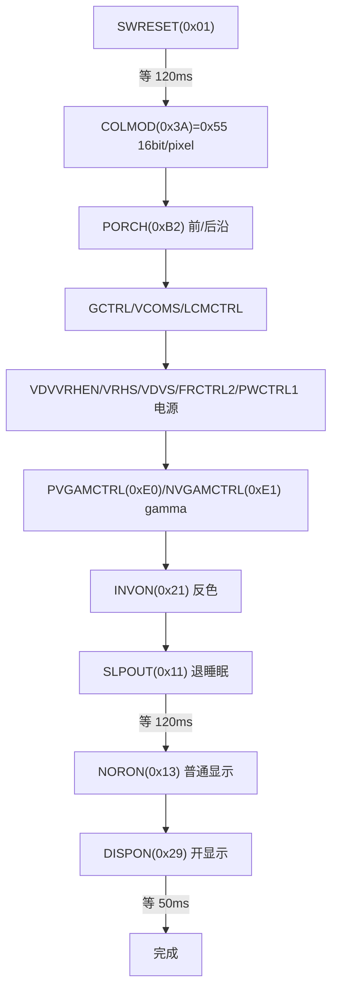

# 📖 引言

> 通过接口注入（`bsp_st7789_core_ops_t`）将 ST7789 LCD 驱动与具体 SPI/GPIO/时基平台解耦，以命令/数据发送原语 + 面板初始化序列 + MADCTL 旋转 + 窗口/像素操作，实现可移植、可测试的 TFT-LCD 驱动层。

> 📌 本笔记为按 [[CST816T的driver文件架构设计思路]] 模板直接生成的 AI 分析（用户指定跳过问答），栏目内容基于 `bsp_st7789_driver.c/h`、`bsp_st7789_config.h` 代码证据。

---

# 📝 ST7789 driver 文件的设计思路

> 一句话定义：Driver 对 ST7789 芯片的初始化序列与显示操作（命令、窗口、像素、填充、背光）做抽象，经 `bsp_st7789_core_ops_t` 注入 SPI、时基、GPIO 硬件能力；Driver 只负责命令时序与坐标几何，不碰任何 HAL/GPIO/RTOS，可在任意支持 C 语言的 MCU 上复用。

## 实际意义

1. **SPI 时序封装**：命令/数据靠 DC 线区分、CS 低有效包夹——这些时序若散落在 App，每处刷屏都要重复且易错。
2. **初始化序列复杂**：ST7789 上电需约 20 条命令（复位、像素格式、PORCH、gamma、电源、退出睡眠），无 Driver 则 App 无法可靠完成。
3. **坐标几何集中**：面板偏移（`Y_OFFSET=20`）、旋转（MADCTL）、窗口地址换算集中在一处，换面板/方向只改 config。

## 应用场景

1. **装配建链**：`Bsp/porting/drv_adapter_port_display/src/bsp_adapter_port_display.c:1153` 构造 Handle → 注册 Driver（内部 `pf_construct` 构造 → init 跑初始化序列）。
2. **LVGL 输出端（flush）**：`Core/Src/lvgl_port.c:132` `bsp_st7789_adapter_wrapper_write_area` 把 LVGL 渲染好的区域写入屏幕。

> 角色区分：ST7789 是 LVGL 的**输出（display）**端——LVGL 把画面 " 写 " 给它；CST816T 是**输入（indev）**端。

## 核心逻辑/原理

### 0. 面板几何（内嵌 SVG 静态图）

> ST7789 面板物理 240×320，本项目只使用 **240×280** 显示区，Y 方向偏移 20（`config.h:18`）。窗口写地址时必须叠加偏移。

```html
<svg width="520" height="420" xmlns="http://www.w3.org/2000/svg" font-family="Consolas, monospace" font-size="13">
  <rect x="60" y="20" width="400" height="380" rx="6" fill="#f5f0e8" stroke="#b5894a" stroke-width="2"/>
  <text x="80" y="45" fill="#b5894a" font-weight="bold">ST7789 物理面板 240 × 320</text>

  <rect x="60" y="120" width="400" height="280" fill="#eef2fb" stroke="#4a6fb5" stroke-width="3"/>
  <text x="80" y="145" fill="#4a6fb5" font-weight="bold">逻辑显示区 240 × 280</text>
  <text x="80" y="168" fill="#333">Y_OFFSET = 20（上）</text>
  <text x="80" y="386" fill="#333">底部留空 20</text>

  <line x1="60" y1="110" x2="460" y2="110" stroke="#888" stroke-width="1" stroke-dasharray="4,4"/>
  <line x1="60" y1="410" x2="460" y2="410" stroke="#888" stroke-width="1" stroke-dasharray="4,4"/>
  <text x="475" y="120" fill="#888">20</text>
  <text x="475" y="410" fill="#888">20</text>

  <text x="80" y="220" fill="#333">width = 240, height = 280</text>
  <text x="80" y="240" fill="#333">DEFAULT_ROTATION = 2 → MADCTL = 0x00</text>
  <text x="80" y="260" fill="#333">TX_ROW_BYTES = 240 × 2 = 480 字节</text>
</svg>
```

### 1. React 交互组件：MADCTL 旋转演示器（动态）

> 演示 4 个方向的 MADCTL 值映射（`driver_rotation_to_madctl`，driver.c:375）。点击按钮查看该方向写入 `0x36` 寄存器的值。需 obsidian-react-components 插件。

```jsx:component:MadctlViewer
const { useState } = React;
const rots = [
  { id: 0, madctl: "0xC0", desc: "MX | MY | RGB（0x40|0x80|0x00）— 双向镜像" },
  { id: 1, madctl: "0xA0", desc: "MY | MV | RGB（0x80|0x20|0x00）— 旋转 90°" },
  { id: 2, madctl: "0x00", desc: "RGB — 默认，无镜像无交换" },
  { id: 3, madctl: "0x60", desc: "MX | MV | RGB（0x40|0x20|0x00）— 旋转 270°" },
];
const [cur, setCur] = useState(2);
const btn = (i) => ({
  margin: "6px 8px 6px 0", padding: "8px 14px", fontFamily: "monospace",
  cursor: "pointer", borderRadius: 6, border: "1px solid #4a6fb5",
  background: i === cur ? "#eef2fb" : "#fff",
});
return (
  <div style={{ fontFamily: "monospace", border: "1px solid #4a6fb5", borderRadius: 8, padding: 16 }}>
    {rots.map((r) => (
      <button key={r.id} style={btn(r.id)} onClick={() => setCur(r.id)}>
        rotation {r.id}
      </button>
    ))}
    <p>MADCTL = <b>{rots[cur].madctl}</b> → 写 ST7789_REG_MADCTL(0x36)</p>
    <p style={{ color: "#888" }}>{rots[cur].desc}</p>
  </div>
);
```

```jsx:
<bsp.st7789.driver.MadctlViewer/>
```

### 2. 机制一：命令/数据发送（DC 区分 + CS 包夹）

SPI 是 " 数据线 + 命令线 " 分离协议：**DC 线低 = 命令，高 = 数据**；CS 低有效，包夹一次传输。

```c
/* driver.c:144-163 — 发送命令字节（DC=低） */
static bsp_st7789_status_t driver_write_command(bsp_st7789_driver_t *p_self,
                                                uint8_t command) {
    p_spi = p_self->p_core_ops->p_spi;
    p_spi->pf_cs_enable(p_spi->context);              /* CS 拉低 */
    p_spi->pf_dc_write(p_spi->context, false);        /* DC=低 → 命令 */
    status = driver_write(p_self, &command, 1U);
    p_spi->pf_cs_disable(p_spi->context);             /* CS 释放 */
    return status;
}
/* driver.c:172-191 — 发送数据段（DC=高） */
```

命令/数据经注入的 `p_spi->pf_write` 发送，底层是轮询 `HAL_SPI_Transmit`（<32B）或 SPI1 TX-DMA（≥32B，`bsp_adapter_port_display.c:45`）。

### 3. 机制二：面板初始化序列

`driver_configure_panel`（driver.c:211-368）按数据手册顺序发送约 20 条命令：



> **反色（INVON）说明**：ST7789 面板若 SPI 极性/贴装导致显示反相，`INVON` 可统一校正色彩反转——本项目默认开启。

### 4. 机制三：MADCTL 旋转

`driver_rotation_to_madctl`（driver.c:375-390）用 `rotation & 0x03` 映射 4 个方向到 MADCTL 寄存器（0x36）的 `MX`(0x40)/`MY`(0x80)/`MV`(0x20) 位。旋转后需重新 `driver_set_window` 按新几何写窗口。

| rotation | MADCTL | 效果 |
|---|---|---|
| 0 | 0xC0（MX\|MY） | 双轴镜像 |
| 1 | 0xA0（MY\|MV） | 旋转 90° |
| **2（默认）** | **0x00（RGB）** | **无镜像无交换** |
| 3 | 0x60（MX\|MV） | 旋转 270° |

### 5. 机制四：窗口设置与坐标偏移

```c
/* driver.c:546-590 — CASET(0x2A)/RASET(0x2B) + RAMWR(0x2C) */
data[0] = (uint8_t)((x0 + p_self->x_offset) >> 8);   /* 列地址高 8 位 */
data[1] = (uint8_t)(x0 + p_self->x_offset);          /* 列地址低 8 位 */
/* ... 行地址同理（叠加 y_offset）... */
status = driver_write_command(p_self, ST7789_REG_RAMWR);  /* 进入显存写模式 */
```

**地址换算公式**：`CASET = (x0+off)<<8 | (x1+off)`，`RASET` 同理；窗口须落在显示区内（`x1 < width && y1 < height`，越界返回 `ARGUMENT`）。

### 6. 机制五：整屏填充与共享行缓冲

`driver_fill`（driver.c:617-649）用**文件级 static 行缓冲** `s_fill_row[480]` 构造一整行 RGB565 大端扫描线，`set_window` 全屏后逐行重复发送 `height` 次：

```c
for (row = 0U; row < BSP_ST7789_WIDTH; row++) {
    s_fill_row[2U * row] = (uint8_t)(color >> 8);      /* 高字节在前 */
    s_fill_row[(2U * row) + 1U] = (uint8_t)color;
}
```

> ⚠️ `s_fill_row` 是共享缓冲，**Driver 内部不加锁**——并发 fill 会互相覆盖；线程安全依赖 Handle 层互斥（`handle_lock`）。

### 7. 机制六：driver_wait_ms 与状态管理

- `driver_wait_ms`（driver.c:99-112）：用 `pf_get_tick_ms` 差值**轮询**延时，非阻塞式，可被任务切换打断。
- 状态管理：`is_inited`（NOT_INITED/INITED）+ `driver_is_ready`（driver.c:87-92）双重守卫；`deinst` 先 `deinit`（关背光 + 标记）再 `memset` 清零。

## 🔑 关键代码片段：命令发送 + MADCTL + 窗口 + 填充

```c
/* 来源：bsp_st7789_driver.c:375-390 — MADCTL 映射 */
static uint8_t driver_rotation_to_madctl(uint8_t rotation) {
    switch (rotation & 0x03U) {
    case 0U: return ST7789_REG_MADCTL_MX | ST7789_REG_MADCTL_MY | ST7789_REG_MADCTL_RGB;
    case 1U: return ST7789_REG_MADCTL_MY | ST7789_REG_MADCTL_MV | ST7789_REG_MADCTL_RGB;
    case 2U: return ST7789_REG_MADCTL_RGB;
    default: return ST7789_REG_MADCTL_MX | ST7789_REG_MADCTL_MV | ST7789_REG_MADCTL_RGB;
    }
}

/* 来源：bsp_st7789_driver.c:546-590 — 窗口设置（CASET/RASET/RAMWR） */
static bsp_st7789_status_t driver_set_window(bsp_st7789_driver_t *p_self,
                                             uint16_t x0, uint16_t y0,
                                             uint16_t x1, uint16_t y1) {
    uint8_t data[4];
    if (!driver_is_ready(p_self) || (x0 > x1) || (y0 > y1) ||
        (x1 >= p_self->width) || (y1 >= p_self->height))
        return BSP_ST7789_STATUS_ARGUMENT;
    data[0] = (uint8_t)((x0 + p_self->x_offset) >> 8);   /* CASET */
    data[1] = (uint8_t)(x0 + p_self->x_offset);
    data[2] = (uint8_t)((x1 + p_self->x_offset) >> 8);
    data[3] = (uint8_t)(x1 + p_self->x_offset);
    /* ... 同 RAST ... */
    return driver_write_command(p_self, ST7789_REG_RAMWR);   /* 显存写模式 */
}

/* 来源：bsp_st7789_driver.c:617-649 — 整屏填充（共享行缓冲逐行发） */
static bsp_st7789_status_t driver_fill(bsp_st7789_driver_t *p_self, uint16_t color) {
    if (!driver_is_ready(p_self)) return BSP_ST7789_STATUS_STATE;
    for (uint32_t row = 0U; row < BSP_ST7789_WIDTH; row++) {
        s_fill_row[2U * row]     = (uint8_t)(color >> 8);
        s_fill_row[(2U * row) + 1U] = (uint8_t)color;
    }
    status = driver_set_window(p_self, 0U, 0U, p_self->width - 1U, p_self->height - 1U);
    if (status != BSP_ST7789_STATUS_OK) return status;
    for (uint32_t row = 0U; row < p_self->height; row++) {
        status = driver_write_data(p_self, s_fill_row, sizeof(s_fill_row));
        if (status != BSP_ST7789_STATUS_OK) return status;
    }
    return BSP_ST7789_STATUS_OK;
}
```

## 关键公式/结论

### 面板几何（config.h:14-19）

| 项 | 值 | 说明 |
|---|---|---|
| width / height | 240 × 280 | 逻辑显示区 |
| X_OFFSET / Y_OFFSET | 0 / 20 | 面板物理 240×320 内的偏移 |
| DEFAULT_ROTATION | 2 | MADCTL = 0x00 |
| TX_ROW_BYTES | 480 | 一行 RGB565 = 240×2 字节 |

### 命令表（config.h:22-43）

| 命令 | 值 | 用途 |
|---|---|---|
| SWRESET | 0x01 | 软件复位 |
| SLPOUT | 0x11 | 退出睡眠 |
| NORON | 0x13 | 普通显示 |
| INVON | 0x21 | 开反色 |
| DISPON | 0x29 | 开显示 |
| CASET / RASET / RAMWR | 0x2A / 0x2B / 0x2C | 窗口与写显存 |
| COLMOD | 0x3A | 像素格式（=0x55：16bit） |
| MADCTL | 0x36 | 显存访问控制（旋转） |

### MADCTL 位（config.h:46-49）

`MY=0x80`（行镜像）、`MX=0x40`（列镜像）、`MV=0x20`（行列交换）、`RGB=0x00`。

### 像素格式与地址换算

```
RGB565 大端：高字节在前（(color>>8) 先发）
窗口地址：CASET = (x0+off)<<8 | (x1+off)，RASET 同理
```

## 实际操作步骤（从零验证）

1. 准备逻辑分析仪（或示波器）抓 SPI 波形与 DC/CS 时序。
2. 上电调用 `bsp_adapter_port_display_init()`，观察 Driver init 是否返回 OK。
3. `driver_fill` 单色验证：填红/绿/蓝各一次，屏幕应全屏变色。
4. 用 `driver_set_window` + `driver_write_pixels` 画对角线/色块，核对坐标与偏移。
5. 依次 `driver_set_rotation` 0~3，观察方向变化与 MADCTL 值（逻辑分析仪抓 0x36 数据）。
6. 失败定位：SPI 波形无 → 查 `port_spi_write`（轮询/DMA 阈值 32B）；颜色反 → 查 `INVON`；位置偏 → 查 `Y_OFFSET` 与 MADCTL。

## 常见问题

| 现象 | 根因 | 处理 |
|---|---|---|
| 显示偏移/错位 | 窗口未叠加 `Y_OFFSET`（面板 240×320 只显 240×280） | `driver_set_window` 已叠加偏移；换面板改 config.h:18 |
| 颜色反相 | SPI 极性/面板贴装 | 默认开 `INVON`（config.h:26） |
| 并发填充画面花屏 | `s_fill_row` 共享缓冲无锁，多任务并发覆盖 | 依赖 Handle 层互斥（`handle_lock`） |
| 小帧刷屏慢 | <32B 走轮询 `HAL_SPI_Transmit` | ≥32B 自动切 SPI1 TX-DMA（bsp_adapter_port_display.c:45） |
| 窗口越界 | 旋转后未按新几何写窗口 | `driver_set_window` 校验 `x1<width` 等，返回 ARGUMENT |

## 💬 Q&A

### 🟢 基础

#### Q1: DC 线的作用是什么？

A1: DC（Data/Command）线区分 SPI 传输的类型——低电平=命令字节（如 0x2C RAMWR），高电平=数据（像素/参数）。CS 低有效包夹一次完整传输。见 driver.c:144-191。

#### Q2: RGB565 像素为什么 " 高字节在前 "？

A2: ST7789 显存按 16bit/像素、大端序组织。`(uint8_t)(color>>8)` 先发高字节，保证面板按预期颜色解析。见 driver_fill 中 `s_fill_row[2*row]`。

### 🟡 进阶

#### Q3: MADCTL 的 MX/MY/MV 位如何实现旋转？

A3: `MX`=列扫描反向，`MY`=行扫描反向，`MV`=行列交换。组合产生 4 种扫描方向，对应 0°/90°/180°/270°。本项目默认 rotation 2 → 0x00（无镜像无交换）。见 driver.c:375。

#### Q4: 为什么 SLPOUT 后要等 120ms？

A4: 面板内部 DC/DC 电源与时钟稳定需要时间，手册规定退出睡眠后须等待充足时长才能保证后续命令可靠执行。见 driver.c:357。

### 🔴 困难

#### Q5: 共享行缓冲 `s_fill_row` 不加锁的取舍是什么？

A5: Driver 保持无锁、无 OS 依赖（可移植/可测试），把并发安全委托给 Handle 层互斥。代价：若上层绕过 Handle 直接并发调 Driver，填充会互相覆盖——这是 "Driver 纯净 " 与 " 线程安全 " 之间的取舍。

#### Q6: 换一块面板（分辨率/偏移不同）时，哪些不变、哪些必须调整？

A6: 不变：命令发送原语、初始化序列骨架、MADCTL 机制、填充/窗口逻辑。必须调整：`BSP_ST7789_WIDTH/HEIGHT/X_OFFSET/Y_OFFSET`（config.h）、gamma/电源参数（若面板型号不同）、`TX_ROW_BYTES`。

## 📋 总结

> **AI 分析：** ST7789 Driver 以 " 命令/数据发送原语 + 面板初始化序列 + MADCTL 旋转 + 窗口/像素操作 " 为核心，通过 `bsp_st7789_core_ops_t` 注入 SPI/时基/GPIO，与 CST816T 同样 " 只暴露唯一构造函数 + 实例函数指针表 "；面板几何（240×280 + Y 偏移 20）与旋转集中在 config/driver，换面板只改配置。整屏填充复用共享行缓冲逐行发送，线程安全交给 Handle 层互斥。

## 📎 参考资料

### 🔗 博客/文档链接

- [ST7789V 数据手册](https://cdn-shop.adafruit.com/product-files/3787/ST7789V_v1.6.pdf) — 命令集、时序与面板初始化参考

### 📄 代码/附件

- `Bsp/board_driver/display/driver/st7789/inc/bsp_st7789_config.h` — 面板几何、MADCTL、命令/寄存器常量
- `Bsp/board_driver/display/driver/st7789/inc/bsp_st7789_driver.h` — 状态码、南向接口、实例结构体
- `Bsp/board_driver/display/driver/st7789/src/bsp_st7789_driver.c` — 命令/初始化/MADCTL/窗口/像素/填充/背光实现
- `Bsp/porting/drv_adapter_port_display/src/bsp_adapter_port_display.c` — SPI1 TX-DMA、TIM2 背光 PWM+DMA、装配
- [[CST816T的driver文件架构设计思路]]
- [[ST7789的handle文件架构设计思路]]
