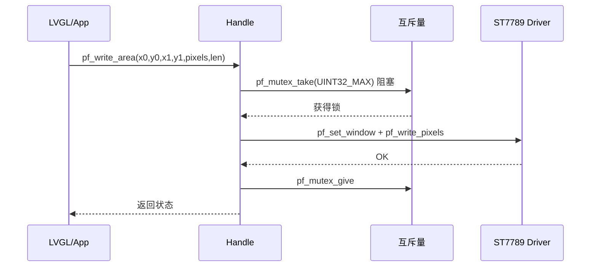

# 📖 引言

> Handler 位于 Driver 之上，用互斥量把多任务的显示访问（刷屏/填充/背光）串行化到同一 SPI 面板，并预留"事件队列 + worker 线程"的异步路径，同时管理 Driver 的惰性注册与生命周期。

> 📌 本笔记为按 [[CST816T的handle文件架构设计思路]] 模板直接生成的 AI 分析（用户指定跳过问答），栏目内容基于 `bsp_display_handle.c/h`、`bsp_adapter_port_display.c` 代码证据。

---

# 📝 ST7789 handle 文件的设计思路

> 一句话定义：Handle 对"显示"这一类外设做统一管理——互斥量保护同步调用（刷屏/填充/背光）、预留事件队列 + worker 线程异步路径、惰性注册 Driver 并管理生命周期；不负责具体面板/SPI 协议细节（属 Driver）。

## 实际意义

1. **并发访问串行化**：SPI 面板与共享行缓冲是单一资源，多任务同时刷屏会花屏/互相覆盖——互斥量把访问串行化。
2. **Driver 解耦**：Handle 不碰 Driver 成员与协议细节，经 `driver_ops` 抽象表调用，换显示芯片（如 ILI9341）只换 Driver。
3. **异步路径预留**：事件队列 + worker 已就绪，未来可把耗时刷屏移到 worker，避免阻塞 LVGL 任务。

## 应用场景

1. **LVGL flush（同步路径，当前实际使用）**：`Core/Src/lvgl_port.c:132` `bsp_st7789_adapter_wrapper_write_area` → Handle `pf_write_area`（互斥保护）。
2. **整屏填充/背光控制（同步）**：App 调 `pf_fill` / `pf_set_backlight`。
3. **异步事件提交（预留未用）**：`pf_event_submit` 非阻塞入队，由 worker 线程分发。

## 核心逻辑/原理

### 0. 线程模型（内嵌 SVG 静态图）

> 同步路径是当前集成唯一实际使用的路径；异步路径（事件队列 + worker）为预留基础设施。

```html
<svg width="820" height="420" xmlns="http://www.w3.org/2000/svg" font-family="Consolas, monospace" font-size="13">
  <defs><marker id="a3" markerWidth="10" markerHeight="7" refX="9" refY="3.5" orient="auto"><polygon points="0 0,10 3.5,0 7" fill="#888"/></marker></defs>

  <rect x="40" y="20" width="740" height="60" rx="6" fill="#eef2fb" stroke="#4a6fb5" stroke-width="2"/>
  <text x="60" y="45" fill="#4a6fb5" font-weight="bold">上层调用（LVGL / App 任务）</text>
  <text x="60" y="66" fill="#333">pf_write_area / pf_fill / pf_set_backlight / pf_event_submit</text>

  <rect x="40" y="130" width="350" height="120" rx="6" fill="#f0f8f0" stroke="#4a9b5a" stroke-width="2"/>
  <text x="60" y="155" fill="#4a9b5a" font-weight="bold">同步路径（当前使用）</text>
  <text x="60" y="180" fill="#333">handle_lock（mutex_take）</text>
  <text x="60" y="200" fill="#333">→ Driver set_window/write_pixels</text>
  <text x="60" y="220" fill="#333">→ handle_unlock（mutex_give）</text>

  <rect x="430" y="130" width="350" height="120" rx="6" fill="#f5f0e8" stroke="#b5894a" stroke-width="2"/>
  <text x="450" y="155" fill="#b5894a" font-weight="bold">异步路径（预留未用）</text>
  <text x="450" y="180" fill="#333">pf_event_submit（非阻塞入队）</text>
  <text x="450" y="200" fill="#333">→ 事件队列 → worker 线程</text>
  <text x="450" y="220" fill="#333">→ handle_dispatch_event → Driver</text>

  <rect x="40" y="320" width="740" height="60" rx="6" fill="#fdeef0" stroke="#c0504d" stroke-width="2"/>
  <text x="60" y="345" fill="#c0504d" font-weight="bold">Driver（ST7789，单一 SPI 面板 + 共享行缓冲）</text>
  <text x="60" y="366" fill="#333">由 Handle 互斥量串行化访问 · bsp_st7789_driver_inst() 唯一构造</text>

  <line x1="215" y1="80" x2="215" y2="130" stroke="#888" stroke-width="2" marker-end="url(#a3)"/>
  <line x1="605" y1="80" x2="605" y2="130" stroke="#888" stroke-width="2" marker-end="url(#a3)"/>
  <line x1="215" y1="250" x2="215" y2="320" stroke="#888" stroke-width="2" marker-end="url(#a3)"/>
  <line x1="605" y1="250" x2="605" y2="320" stroke="#888" stroke-width="2" marker-end="url(#a3)"/>
  <text x="225" y="112" fill="#888">同步调用</text>
  <text x="615" y="112" fill="#888">异步提交</text>
</svg>
```

### 1. React 交互组件：同步 vs 异步路径查看器（动态）

> 点击切换两条路径，查看各自调用链。需 obsidian-react-components 插件。

```jsx:component:DisplayPathViewer
const { useState } = React;
const paths = [
  { name: "同步路径（当前使用）", color: "#4a9b5a",
    steps: ["App/LVGL → pf_write_area", "handle_lock（mutex_take, UINT32_MAX）",
            "Driver: pf_set_window + pf_write_pixels", "handle_unlock（mutex_give）"] },
  { name: "异步路径（预留未用）", color: "#b5894a",
    steps: ["App → pf_event_submit（非阻塞入队）", "事件队列（WRITE_AREA/FILL/BACKLIGHT/STOP）",
            "worker 线程 → handle_dispatch_event", "handle_lock → Driver → 回调"] },
];
const [cur, setCur] = useState(0);
const btn = (i) => ({
  margin: "6px 8px 6px 0", padding: "8px 14px", fontFamily: "monospace",
  cursor: "pointer", borderRadius: 6, border: "1px solid #888",
  background: i === cur ? "#f0f8f0" : "#fff",
});
return (
  <div style={{ fontFamily: "monospace", border: "1px solid #4a9b5a", borderRadius: 8, padding: 16 }}>
    {paths.map((p, i) => (
      <button key={i} style={btn(i)} onClick={() => setCur(i)}>{p.name}</button>
    ))}
    <ol style={{ marginTop: 12, paddingLeft: 22 }}>
      {paths[cur].steps.map((s, i) => (<li key={i}>{s}</li>))}
    </ol>
  </div>
);
```

```jsx:
<bsp.st7789.handle.DisplayPathViewer/>
```

### 2. 机制一：OS 对象创建与逆序回滚

`handle_init`（bsp_display_handle.c:245-294）在**调度器启动后**依次创建互斥量 → 事件队列 → worker 线程，任一步失败按逆序回滚（线程失败：删队列→删互斥量；队列失败：删互斥量）。与触摸 Handle 的资源回滚原则一致。

```c
/* handle.c:255-293 */
mutex_handler = pf_mutex_create(...);                  /* ① 互斥量 */
if (!pf_queue_create(...)) { pf_mutex_delete(...); return STATE; }  /* ② 队列 */
if (!pf_thread_create(...)) {                          /* ③ worker */
    pf_queue_delete(...); pf_mutex_delete(...);        /* 逆序回滚 */
    return STATE;
}
stop_requested = false; state = BSP_DISPLAY_HANDLE_INITED;
```

### 3. 机制二：互斥同步调用（核心路径）

`handle_write_area`（handle.c:423-458）用 `handle_lock`（`mutex_take(UINT32_MAX)` 阻塞等待）串行化 SPI 访问，完成后 `handle_unlock`。`handle_is_ready` 同时要求 `state==INITED` 且**调度器已启动**（`pf_scheduler_started`，handle.c:96）。



### 4. 机制三：惰性 Driver 注册

`handle_register_driver`（handle.c:370-410）：经注入的 `pf_construct` 构造 Driver → 检查 `pf_is_ready` → **未就绪才调用 `pf_init`**（惰性初始化）；失败则解绑并保持 Handle 可用。重复注册返回 `STATE`。

### 5. 机制四：预留异步事件路径

`handle_event_submit`（handle.c:560-579）非阻塞入队（超时 0），worker `handle_thread_entry` 恒阻塞于空队列（`UINT32_MAX`），收到事件后 `handle_dispatch_event` 按类型分发到 `handle_write_area/fill/set_backlight/STOP`，结果经事件回调返回。

> ⚠️ `bsp_display_handle_event_t` 的 `WRITE_AREA` **只复制像素指针、不复制内容**（handle.h:69-71）——调用方必须保证像素缓冲在事件回调完成前有效。这是该路径当前未启用的原因之一。

### 6. 机制五：去初始化

`handle_deinit`（handle.c:303-337）：置 `stop_requested=true` → `pf_thread_delete`（**阻塞回收 worker**）→ 删队列 → 删互斥量，逆序释放。

> ⚠️ 与触摸 Handle 的**协作式 STOP 事件**不同：显示 Handle 的 worker 恒阻塞于空队列，靠 `pf_thread_delete` 阻塞等它退出（当前 worker 阻塞时删除是安全的，见 handle.c:299 注释）；没有入队 STOP 事件唤醒的协作式退出。

### 7. 与触摸 Handle 的模式对比

| 维度 | CST816T touch Handle | ST7789 display Handle |
|---|---|---|
| 并发保护 | 临界区（短，快照缓存） | 互斥量（长，SPI 传输可阻塞） |
| 数据流向 | 事件驱动（ISR→队列→worker→快照） | 同步调用（LVGL 任务直接刷屏） |
| 消费者 | LVGL 读快照（非阻塞） | LVGL 写面板（同步等待） |
| 异步路径 | worker 事件循环（实际使用） | 事件队列 + worker（预留未用） |
| 退出方式 | 协作式 STOP 事件入队 | `stop_requested` + `thread_delete` 阻塞回收 |
| 兜底机制 | 20ms 轮询兜底 | 无（同步路径天然自刷新） |

## 🔑 关键代码片段：互斥同步调用 + 惰性注册 + 事件分发

```c
/* 来源：bsp_display_handle.c:423-458 — 互斥同步写区域 */
static bsp_st7789_status_t handle_write_area(bsp_display_handle_t *p_self,
                                             uint16_t x0, uint16_t y0,
                                             uint16_t x1, uint16_t y1,
                                             const uint8_t *pixels,
                                             uint32_t length) {
    if (!handle_is_ready(p_self) || (NULL == p_self->driver_instance))
        return BSP_ST7789_STATUS_STATE;
    if ((NULL == pixels) || (0U == length)) return BSP_ST7789_STATUS_ARGUMENT;
    locked = handle_lock(p_self);                       /* mutex_take(UINT32_MAX) */
    if (!locked) return BSP_ST7789_STATUS_STATE;
    status = p_self->p_driver_ops->pf_set_window(
        p_self->driver_instance, x0, y0, x1, y1);
    if (BSP_ST7789_STATUS_OK == status)
        status = p_self->p_driver_ops->pf_write_pixels(
            p_self->driver_instance, pixels, length);
    handle_unlock(p_self, locked);                      /* mutex_give */
    return status;
}

/* 来源：bsp_display_handle.c:370-410 — 惰性 Driver 注册 */
static bsp_st7789_status_t handle_register_driver(
    bsp_display_handle_t *p_self,
    const bsp_display_handle_driver_if_t *p_driver_if) {
    if (!handle_is_ready(p_self) || (NULL == p_driver_if) ||
        (NULL == p_driver_if->driver_storage) ||
        (NULL == p_driver_if->pf_construct) ||
        !handle_driver_ops_is_valid(p_driver_if->p_driver_ops))
        return BSP_ST7789_STATUS_ARGUMENT;
    if (NULL != p_self->driver_instance) return BSP_ST7789_STATUS_STATE;  /* 防重复 */
    status = p_driver_if->pf_construct(p_driver_if->driver_storage);      /* 构造 Driver */
    if (BSP_ST7789_STATUS_OK != status) return status;
    p_self->driver_instance = p_driver_if->driver_storage;
    p_self->p_driver_ops = p_driver_if->p_driver_ops;
    if (!p_driver_if->p_driver_ops->pf_is_ready(p_driver_if->driver_storage)) {
        status = p_driver_if->p_driver_ops->pf_init(p_driver_if->driver_storage); /* 惰性 init */
        if (BSP_ST7789_STATUS_OK != status) { p_self->driver_instance = NULL; ...; return status; }
    }
    return BSP_ST7789_STATUS_OK;
}

/* 来源：bsp_display_handle.c:180-209 — worker 事件分发 */
static void handle_dispatch_event(bsp_display_handle_t *p_self,
                                  const bsp_display_handle_event_t *p_event) {
    status = BSP_ST7789_STATUS_ARGUMENT;
    switch (p_event->type) {
    case BSP_DISPLAY_HANDLE_EVENT_WRITE_AREA:
        status = handle_write_area(p_self, p_event->x0, p_event->y0,
                                   p_event->x1, p_event->y1,
                                   p_event->pixels, p_event->length);
        break;
    case BSP_DISPLAY_HANDLE_EVENT_FILL:      status = handle_fill(p_self, p_event->color); break;
    case BSP_DISPLAY_HANDLE_EVENT_BACKLIGHT: status = handle_set_backlight(p_self, p_event->backlight_enabled); break;
    case BSP_DISPLAY_HANDLE_EVENT_STOP:      p_self->stop_requested = true; status = BSP_ST7789_STATUS_OK; break;
    default: break;
    }
    handle_callback(p_event, status);        /* 结果经回调返回提交方 */
}
```

## 关键公式/结论

### Handle 配置与接口（bsp_display_handle.c:24-26, bsp_display_handle.h）

| 项 | 值 | 说明 |
|---|---|---|
| 队列长度 | 8 | 事件队列容量（预留异步路径） |
| worker 栈深 | 256 字 | 事件分发无深调用 |
| worker 优先级 | 2 | 高于触摸 worker（1） |
| OS 接口表 | mutex×5 + queue×4 + thread×2 + scheduler_started×1 | handle.h:100-131 |
| Driver Ops 表 | is_ready/init/deinit/set_window/write_pixels/fill/set_backlight/get_width/get_height | handle.h:139-158 |
| 事件类型 | WRITE_AREA / FILL / BACKLIGHT / STOP | handle.h:47-53 |
| Handle 状态 | NOT_INITED / INITED / ERROR | handle.h:37-42 |

### 事件消息（handle.h:72-85）

`WRITE_AREA` 事件携带 `pixels` **指针**（不复制内容）——调用方须保证缓冲在回调完成前有效。

## 实际操作步骤（生命周期）

1. `bsp_display_handle_inst(&s_handle, port_timebase_ops(), port_os_ops())` —— 构造即创建互斥量/队列/worker（**须调度器启动后**）。
2. `bsp_display_handle_register_driver(&s_handle, &s_driver_if)` —— 经 `pf_construct` 构造 Driver，未就绪则惰性 `pf_init`。
3. 运行期：LVGL 经 Wrapper → `pf_write_area` / `pf_fill` / `pf_set_backlight` 同步刷屏（互斥保护）。
4. `bsp_adapter_port_display_deinit()` → `pf_deinit`：`stop_requested=true` → 阻塞删 worker → 删队列 → 删互斥量。

> **注意**：装配顺序（Port 层）是先 `port_bl_hw_init()`（TIM2 PWM+DMA 背光）再构造 Handle/Driver——因为 Driver init 会回调 `port_backlight_write`，届时 PWM 必须已就绪（bsp_adapter_port_display.c:1163-1168）。

## 常见问题

| 现象 | 根因 | 处理 |
|---|---|---|
| 调度器启动前调用失败 | `handle_is_ready` 要求 `pf_scheduler_started` 为真 | 在调度器启动后的任务上下文装配 |
| 刷屏花屏/错乱 | 多任务并发刷屏竞争 SPI 与行缓冲 | 同步路径已互斥保护；勿绕过 Handle 直调 Driver |
| 异步事件丢数据 | `WRITE_AREA` 只复制像素指针，缓冲提前释放 | 保证缓冲在事件回调完成前有效（该路径当前未启用） |
| 去初始化后死锁 | worker 持锁时被阻塞回收 | 当前 worker 恒阻塞于空队列，`pf_thread_delete` 回收安全；若启用异步刷屏需改协作式退出 |

## 💬 Q&A

### 🟢 基础

#### Q1: 同步路径为什么要用互斥量？

A1: SPI 面板与共享行缓冲 `s_fill_row` 是单一资源，多任务同时 `pf_write_area` 会互相覆盖/花屏。互斥量把访问串行化——一次只有持有锁的任务能操作面板。见 handle.c:423-458。

#### Q2: `handle_is_ready` 为什么还要检查调度器已启动？

A2: 互斥量/队列/线程的创建与阻塞取/放都依赖 FreeRTOS 调度器运行；调度器未启动时 OS 调用不可靠，直接返回 `STATE` 拒绝。见 handle.c:86-98。

### 🟡 进阶

#### Q3: 异步事件路径为什么当前未启用？

A3: ① `WRITE_AREA` 事件只复制像素指针，异步消费时缓冲生命周期难保证；② 当前 LVGL flush 直接同步调用已满足性能；③ worker 恒阻塞于空队列，异步路径的退出机制（`thread_delete` 阻塞回收）尚未按协作式改造。事件队列 + worker 是预留基础设施。

#### Q4: 触摸 Handle 用临界区，显示 Handle 用互斥量，为什么不同？

A4: 触摸快照更新只写几个字段（几十个周期，可关中断用临界区）；显示刷屏要发整块 SPI 数据（可阻塞数毫秒，必须用能睡眠等待的互斥量）。临界区关中断，互斥量让出 CPU——按"临界区时长"选型。

### 🔴 困难

#### Q5: 显示 Handle 的退出与触摸 Handle 有何不同？各有什么风险？

A5: 触摸用**协作式 STOP 事件**（worker 自然退出，无死锁风险）；显示用 `stop_requested + pf_thread_delete` **阻塞回收**（当前 worker 恒阻塞于空队列，回收安全）。风险：若未来启用异步刷屏，worker 可能在持锁传输中被 `thread_delete`——需改为协作式退出（同触摸方案）。

#### Q6: 若换一块不支持 DMA 的小面板，Handle 层哪些保持不变？

A6: 不变：Handle 全部逻辑（互斥/注册/事件分发）——它只依赖 `driver_ops` 抽象表。必须调整：Port 层 `port_spi_write`（DMA 阈值/轮询实现）与 Driver 的初始化序列。这正是"Driver/Handle 解耦 + Port 集中硬件差异"的收益。

## 📋 总结

> **AI 分析：** ST7789 Handle 以"互斥量串行化 SPI 面板访问"为核心，提供同步刷屏路径（LVGL 实际使用）与预留的事件队列 + worker 异步路径；经 `driver_ops` 抽象表 + `pf_construct` 惰性注册与具体面板解耦。与触摸 Handle 相比，它用互斥量（可阻塞）而非临界区（关中断），因为刷屏传输耗时；退出靠 `thread_delete` 阻塞回收而非协作式 STOP——这是两类外设"数据消费型 vs 命令生产型"的线程模型差异。

## 📎 参考资料

### 📄 代码/附件

- `Bsp/board_driver/display/handler/inc/bsp_display_handle.h` — 状态/事件/OS 接口/Driver 注入/实例定义
- `Bsp/board_driver/display/handler/src/bsp_display_handle.c` — 互斥同步调用、惰性注册、worker 分发、去初始化实现
- `Bsp/porting/drv_adapter_port_display/src/bsp_adapter_port_display.c` — SPI1 TX-DMA、TIM2 背光 PWM+DMA、装配
- [[ST7789的driver文件架构设计思路]]
- [[CST816T的handle文件架构设计思路]]
- [[MPU6050的handle文件架构设计思路]]
