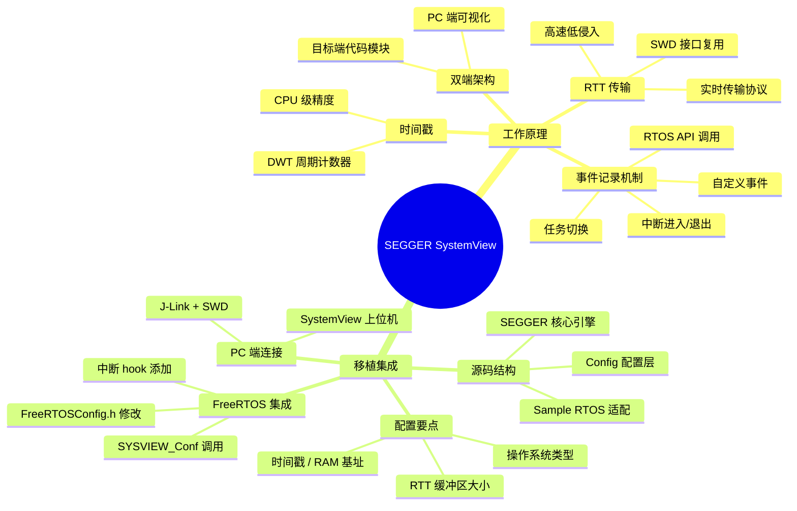
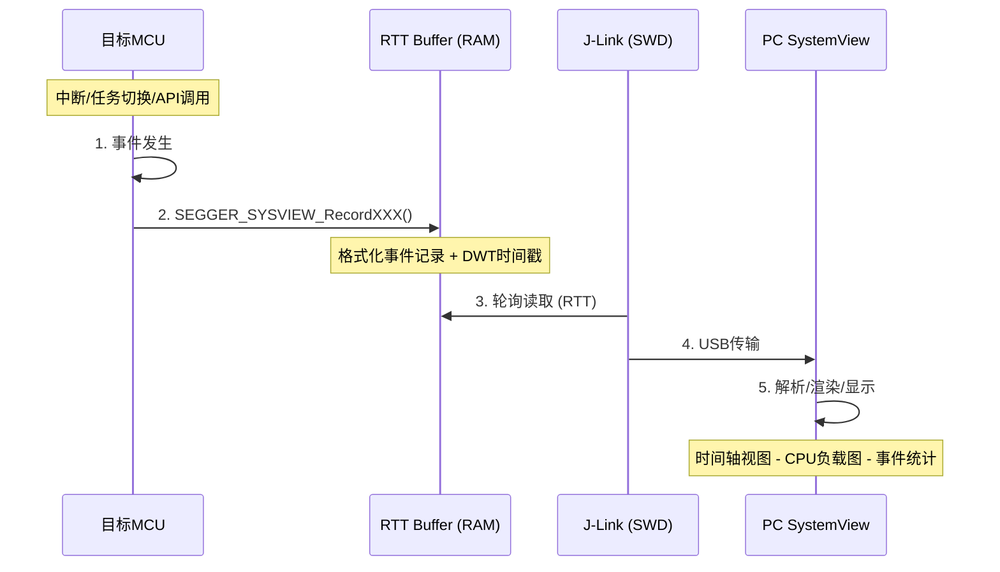
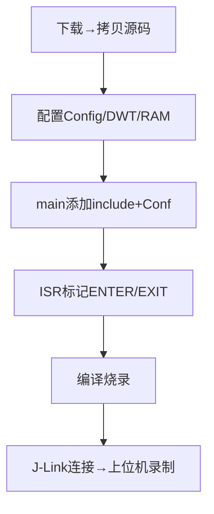

日期：2026.6.5

文章标签： #debug #systemview #rtos

## 1. 学习内容

### 知识点总览

| 序号 | 知识点 |
| --- | --- |
| 1 | SystemView 工作原理 |
| 2 | SystemView 移植（STM32F411CEU6 + FreeRTOS） |

### 知识点关联思维导图



---

## 2. 逐点精讲

### 知识点 1：SystemView 工作原理

#### 实际意义

嵌入式系统进入 RTOS 时代后，任务调度、中断嵌套、资源争用等并发问题让传统调试器（断点 + 单步）力不从心——断点会停掉整个系统，破坏实时性。SystemView 能以极低的开销（<1% CPU）**实时记录**系统的运行时行为，将 " 黑盒子 " 变为可视化时间轴，让开发者看清系统到底在做什么。

#### 应用场景

- **RTOS 调度分析**：验证任务优先级、时间片、阻塞/就绪状态是否正确
- **中断延迟排查**：测量中断响应时间和服务时间，定位关中断过长的位置
- **CPU 负载分析**：按任务粒度分解 CPU 占用率，找出性能热点
- **裸机系统时序**：通过自定义事件标注关键代码段的执行时间
- **启动序列分析**：单次记录模式捕获系统从上电到稳态的全过程
- **长时间稳定性测试**：循环记录模式，事后分析异常前的最后一个事件序列

#### 常见误区

| 误区 | 事实 |
|------|------|
| SystemView 只能在 RTOS 上用 | 裸机也可以，通过 `SEGGER_SYSVIEW_OnTaskCreate/OnTaskSwitch` 手动标注上下文 |
| 需要额外串口引脚输出数据 | 不需要，走 SWD 接口复用 J-Link 的 RTT 通道 |
| 会用很多 CPU 资源 | 实测 200MHz Cortex-M4 上，每秒 10,000 事件 CPU 负载 < 1% |
| 只能用 J-Link | 对，RTT 是 J-Link 私有协议，ST-Link 不支持 |
| 和串口 log 是一回事 | 串口 log 只有 " 文本 "，SystemView 输出的是**结构化事件数据**带精确时间戳，上位机能解析渲染 |

#### 辅助图示



#### 通俗人话解释

想象你是一块 MCU，正在运行多个 " 任务 "。传统调试器像照相机——拍一张照片（断点），所有任务都定格了，你看不到它们实际跑起来的样子。

SystemView 像装在系统上的 **行车记录仪**：

- 它记录每个 " 重要时刻 "（任务切换、中断发生、API 调用）
- 每个记录都打上**精确的时间戳**（用 DWT 计数器，精度纳秒级）
- 这些记录通过 **SWD 接口**实时传到 PC 端（不是串口，不需要额外排针）
- PC 端把记录渲染成**时间轴**——哪个任务在跑、跑了多久、谁抢占了谁，一目了然

#### 核心逻辑/原理

SystemView 的架构分为三层：

**① 事件采集层（目标端）**

在关键事件点插入记录宏，输出固定格式的事件数据包：

```
事件类型 (1B) | 事件ID (2B) | 时间戳 (4/8B) | 参数 (N B)
```

预定义事件类型包括：

| 事件宏 | 对应场景 |
|--------|---------|
| `traceISR_ENTER()` | 中断进入 |
| `traceISR_EXIT()` | 中断退出 |
| `traceTASK_SWITCHED_IN()` | 任务被切换进来 |
| `traceTASK_SWITCHED_OUT()` | 任务被切换出去 |
| `SEGGER_SYSVIEW_RecordEnterISR()` | 手动记录中断进入 |
| `SEGGER_SYSVIEW_PrintString()` | 自定义文本事件 |

**② RTT 传输层**

- 数据写入目标 RAM 中的**环形缓冲区**（SEGGER_RTT.c 管理）
- J-Link 通过 SWD 接口以 ~1MB/s 速率轮询读取缓冲区
- 传输采用 **NO_BLOCK_SKIP** 模式：缓冲区满时丢弃新数据，不阻塞目标

**③ PC 端解析与渲染层**

- 接收原始事件流，解析为结构化事件
- 在时间轴上渲染为色块/标记/波形
- 自动统计 CPU 负载、任务执行时间、中断频率

#### 关键公式/结论

- **时间戳精度** = 1 / CPU 主频（STM32F411 @ 100MHz → 10ns 分辨率）
- **每个事件开销** ≈ 几十个 CPU 周期 + 1 次 memcpy（< 1µs）
- **RTT 带宽上限** ≈ SWD 速率 / 协议开销（4MHz SWD 下约 200~500KB/s 实际吞吐）
- **RAM 占用量** = BUFFER_SIZE_UP + BUFFER_SIZE_DOWN ≈ 1~8KB
- **Flash 占用量** ≈ 4~8KB（取决于是否包含 printf 组件）

---

### 知识点 2：SystemView 移植（STM32F411CEU6 + FreeRTOS）

#### 实际意义

ST 的很多开发板默认用 ST-Link，但 ST-Link 无法使用 RTT，因此无法直接使用 SystemView。F411CEU6 这类小封装板通常有 SWD 接口引出，配合外部 J-Link（如 J-Link OB 或 J-Link EDU Mini）即可启用 SystemView。移植成功后，调试 RTOS 问题从 " 猜 " 变成 " 看 "，效率提升一个量级。

#### 应用场景

- 正在使用 STM32F411CEU6 + FreeRTOS 的项目
- 遇到任务优先级规划、任务饿死、定时器延迟等调度问题
- 评估系统 CPU 余量，优化功耗模式切换
- 验证中断响应时间是否满足设计要求

#### 常见误区

| 误区 | 事实 |
|------|------|
| 需要把所有文件一股脑放进工程 | 只需选择必要的文件（RTT 核心 + SystemView 核心 + FreeRTOS 适配），约 10 个文件 |
| 需要改 FreeRTOS 内核源码 | 不需要改内核，`traceISR_ENTER()` 等宏通过 `SEGGER_SYSVIEW_FreeRTOS.h` 覆盖 FreeRTOS 的空宏实现 |
| `SEGGER_SYSVIEW_Conf()` 放哪都行 | **必须**在 `vTaskStartScheduler()` 之前调用，否则无法捕获首次任务切换 |
| FreeRTOSConfig.h 随便加 include | 必须在**文件末尾** `#include "SEGGER_SYSVIEW_FreeRTOS.h"`，避免宏重定义警告 |
| 数据线用 USB 转 TTL 也可以 | 不行！必须 J-Link，RTT 是 J-Link 独有的 SWD 调试通道，ST-Link/V2 不支持 |

#### 辅助图示

1. 需要移植的代码文件 ![[file-20260605213840531.png]]
2. 移植 systemview 流程



3. Systemview 界面线程运行时间对比 ![[file-20260607131058879.png]]

#### 通俗人话解释

给 STM32F411CEU6 + FreeRTOS 移植 SystemView，核心做四件事：

1. **拷贝文件**：从官方源码包把 SystemView 和 RTT 的源文件复制到工程目录（约 10 个文件）
2. **改配置**：告诉 SystemView —— 你的 MCU 主频多少、RAM 基地址在哪、系统是 FreeRTOS、用哪个定时器做时间戳
3. **安 hook**：在 `FreeRTOSConfig.h` 末尾加一行 `#include "SEGGER_SYSVIEW_FreeRTOS.h"`，让 SystemView 的宏覆盖 FreeRTOS 的空宏，从而实现自动捕获任务切换事件
4. **写 main.c**：
   - 顶部 `#include "SEGGER_SYSVIEW.h"`（才能调用 SystemView API）
   - 在 `vTaskStartScheduler()` 之前调用 `SEGGER_SYSVIEW_Conf()`
5. **标记中断**：在你想监控的中断函数首尾加上 `traceISR_ENTER()` 和 `traceISR_EXIT()`

做完这五步，编译烧录，连上 J-Link，打开 PC 端的 SystemView 软件点 " 开始记录 "，就能看到 FreeRTOS 的任务调度时间轴了。

#### 核心逻辑/原理

**移植的核心是 hook 机制**：

FreeRTOS 内核源码中散布了许多 **trace 宏**（`traceTASK_SWITCHED_IN`、`traceQUEUE_SEND` 等），默认定义为空宏。

SEGGER 提供了一个头文件 `SEGGER_SYSVIEW_FreeRTOS.h`，它通过 `#undef` + `#define` 将这些空宏**覆盖**为实际记录操作的实现。

当 `FreeRTOSConfig.h` 末尾 `#include "SEGGER_SYSVIEW_FreeRTOS.h"` 时：

```
FreeRTOS 发布版: #define traceTASK_SWITCHED_IN()           (空)
SEGGER 覆盖:      #define traceTASK_SYSVIEW_SWITCHED_IN()  SEGGER_SYSVIEW_OnTaskSwitch... (实际记录)
```

这样无需修改 FreeRTOS 内核一行代码即可实现事件追踪。

#### 关键公式/结论

- **时序约束**：`SEGGER_SYSVIEW_Conf()` 必须在 `vTaskStartScheduler()` 之前调用
- **main.c 必加头文件**：`#include "SEGGER_SYSVIEW.h"`，否则 `SEGGER_SYSVIEW_Conf()` 编译报错
- **FreeRTOSConfig.h 必加头文件**：文件末尾 `#include "SEGGER_SYSVIEW_FreeRTOS.h"`，否则 trace 宏不会覆盖
- **时间戳关键配置**：F411 @ 100MHz，使用 DWT_CYCCNT（地址 `0xE0001004`），分辨率 10ns
- **RAM 基地址**：STM32F411CEU6 的 SRAM 起始地址为 `0x20000000`，大小 128KB
- **RTT 缓冲区推荐**：`BUFFER_SIZE_UP = 2048`（常规）、`4096`（高事件率）
- **最小文件集**：约 10 个源文件（3 个 RTT + 4 个 SystemView 核心 + 3 个 FreeRTOS 适配）
- **Flash/RAM 占用**：约 4-8KB Flash，2-4KB RAM（取决于缓冲区配置）

---

## 3. 相关资料

### 🎥 视频链接

- [SEGGER 官方 webinar: Analyzing & recording runtime behavior](https://www.segger.cn/support/training-classes/webinar-runtime-behavior-analysis/)

### 🔗 资料链接

- [SEGGER SystemView 产品页](https://www.segger.com/products/development-tools/systemview/)
- [SEGGER SystemView What is SystemView](https://www.segger.cn/products/development-tools/systemview/technology/what-is-systemview/)
- [SEGGER SystemView 下载页面](https://www.segger.com/downloads/systemview/)
- [SEGGER Wiki: FreeRTOS with SystemView](https://wiki.segger.com/FreeRTOS_with_SystemView)
- [SEGGER KB: Use SystemView without RTOS](https://kb.segger.com/Use_SystemView_without_RTOS)
- [SEGGER RTT 官方仓库 (GitHub)](https://github.com/SEGGERMicro/RTT)
- [博客园: SystemView+FreeRTOS 移植过程](https://www.cnblogs.com/neriq/p/14728938.html)
- [CSDN: STM32+FreeRTOS 移植 SystemView 以及打补丁](https://blog.csdn.net/hpuylx/article/details/145292435)
- [CSDN: 系统级调试利器 SystemView 移植及使用教程](https://blog.csdn.net/xiangaler/article/details/148538085)
- [公众号: 拒绝"玄学"调试：FreeRTOS 移植 SystemView 全流程避坑指南](http://mp.weixin.qq.com/s?__biz=Mzg5ODY1NDc1MQ==&mid=2247483681&idx=1&sn=a233abeaa6b241dd080a63de99aa5905)

### 💻 代码/PDF

- [SEGGER RTT GitHub 仓库](https://github.com/SEGGERMicro/RTT)（BSD 许可）
- 官方用户手册 UM08027（SystemView 安装目录 Help → User Guide 可打开）

---

## 4. Q&A

### Q 1：SystemView 和串口 printf 调试，本质区别是什么？为什么说 SystemView 对 RTOS 调试来说是 " 降维打击 "？

A 1：

1. Systemview 利用的是 jlink 的 rtt 输出数据，MCU 发数据给 jlink 的缓冲区中，上位机从缓冲区中拿数据，不用等待 CPU 发送完成；而 printf 调试要等待 MCU 发送完毕后开始接收，在 115200 的情况下发送一个字节都需要几十 us，发送过多字节就会阻塞系统运行
2. 使用 rtt 来获取系统信息，即不会影响 CPU 运行，同时其读取速度也是极低延迟，并且提供了完整的系统时间线

### Q 2：移植完成后，SystemView 上位机能连上 J-Link，但时间轴上**看不到任何中断事件**（只有任务切换）。可能的原因有哪些？排查思路是什么？

A 2：

1. 可能是 rtt 未将系统数据写入缓存区内是# include "SEGGER_SYSVIEW_Config. H" 没有添加 `SEGGER_SYSVIEW_FreeRTOS.h` 头文件或者条件编译宏未启动
2. 看移植过程有没有文件遗漏未移植；

### Q 3：系统跑起来后，SystemView 弹出 "Buffer Overflow" 警告。说出至少 3 种排查和解决方向，按优先级排序

A 3：

1. Sysvier 接收缓存区大小过小，rtt 发送字节过多，增大 SysView_record_buffer（记录缓冲区）太小至 4096
2. 中断频率过高，rtt 输出溢出了，降低中断频率
3. Jlink 的硬件问题，rtt 通道输出错误

### Q 4：SystemView 实现的原理是什么？为什么能捕获任务切换的情况？（结合源码讲解 `SEGGER_SYSVIEW_FreeRTOS.h` 和 FreeRTOS `tasks.c` 的宏覆盖机制）

A 4：

1. Freertos 预留了给外部调试的宏提供给 segger 来重新定义
2. SystemView 捕获任务切换的完整流程
	1. 预处理阶段：SEGGER_SYSVIEW_FreeRTOS.h 覆盖了 traceTASK_SWITCHED_OUT 和 traceTASK_SWITCHED_IN 宏，将其替换为 SystemView 的记录函数。
	2. 运行时：当 vTaskSwitchContext() 被调用时（通常在 xPortSysTickHandler 或更高优先级任务阻塞后），宏展开为：
		1. 调用 SEGGER_SYSVIEW_RecordStartCall（标记开始）
		2. 调用 SEGGER_SYSVIEW_RecordTaskSwitch（记录旧任务信息）
		3. 执行实际上下文切换
		4. 调用 SEGGER_SYSVIEW_RecordTaskSwitch（记录新任务信息）
		5. 调用 SEGGER_SYSVIEW_RecordEndCall（标记结束）
	3. 传输：记录的数据存入 SystemView 内部缓冲区，由 RTT 等接口实时发往 PC。
	4. 解析与显示：SystemView PC 端根据任务 ID 列表和时间戳绘制出任务切换的时间轴

### Q 5：什么是 FreeRTOS 的钩子函数（Hook Function）？钩子函数什么时候被调用？列举常用的钩子函数及其触发条件

A 5：

1. 钩子函数是 freertos 优先级最低的空闲任务的回调函数，需要 configUSE_IDLE_HOOK 在 FreeRTOSConfig.h 中设置为 1 即可调用钩子函数，一般在低功耗模式下使用
2. 还有 tick，malloc，堆栈溢出和守护任务的钩子函数，在 FreeRTOSConfig.h 中找到对应的使能宏定义来开启钩子函数，分别用于周期性检查，内存事件，错误现场保持，初始化后台任务资源

### Q 6：SystemView 给你提供了各个任务的调用过程（执行时间、切换频率、CPU 占用率等数据），该如何基于这些数据重新规划任务优先级？有哪些分析思路和优化策略？

A 6：

1. 对于一些实时性要求高的且执行时间短的任务调高其优先级，CPU 占用时间长的需要降低其优先级防止其他任务被饿死
2. 阻塞时间长的降低优先级，其任务本身运行需要的时间不多
3. 切换频率高的要考虑拆分任务或者调整切换频率
4. 还要考虑优先级反转和死锁情况，添加互斥量来保证任务的优先级
