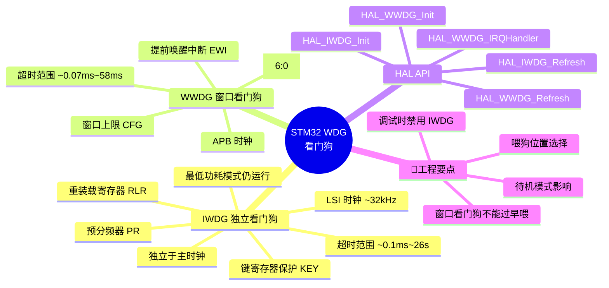
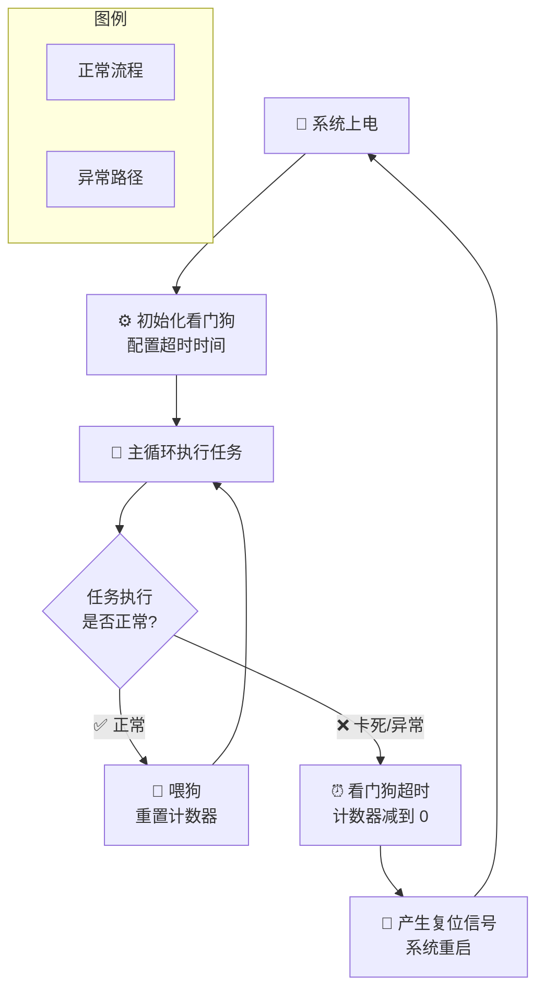
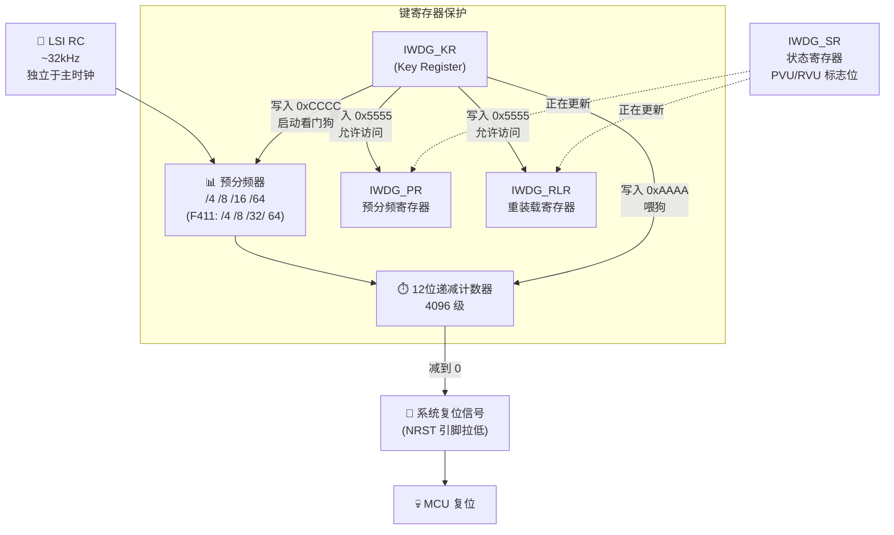
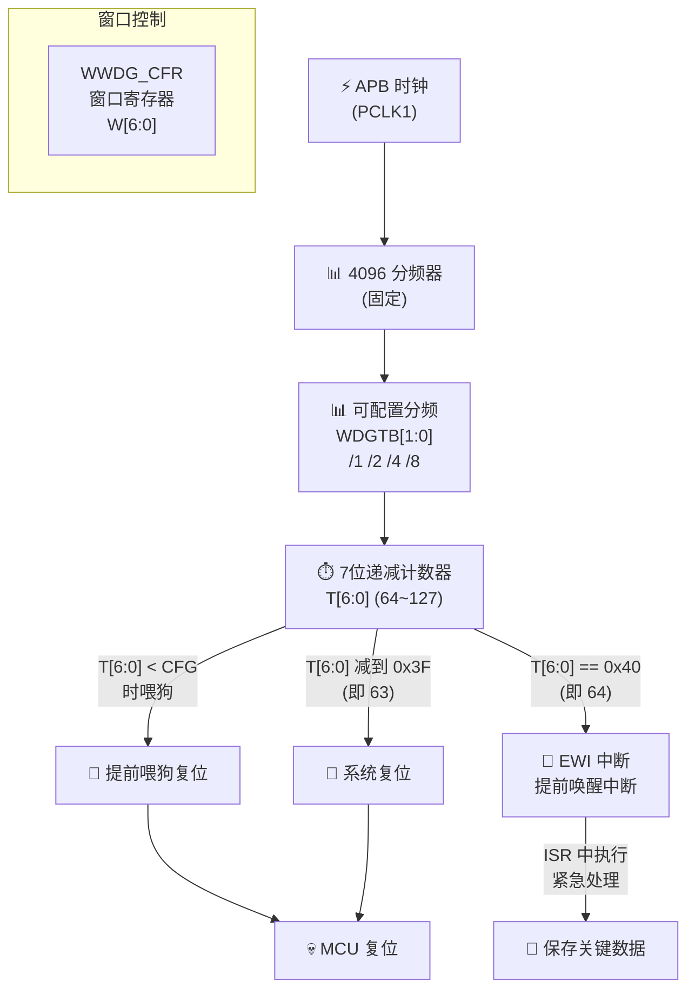

日期：2026.05.25

文章标签： #STM32 #WDG #看门狗 #IWDG #WWDG #系统可靠性

## 1. 学习内容

### 知识点总览

| 序号 | 知识点 |
| --- | --- |
| 1 | WDG 基本原理：看门狗的核心机制与复位逻辑 |
| 2 | IWDG（独立看门狗）：LSI 时钟驱动，低功耗可靠 |
| 3 | WWDG（窗口看门狗）：APB 时钟驱动，精确定时窗口 |
| 4 | HAL 库 WDG 编程实战 |
| 5 | WDG 工程应用与调试要点 |

### 知识点关联思维导图



---

## 2. 逐点精讲

### 知识点 1：WDG 基本原理——看门狗的核心机制与复位逻辑

#### 实际意义

看门狗（Watchdog Timer，WDT）是嵌入式系统中**最后一道防线**。当程序因硬件干扰、软件 Bug 或外部异常陷入死循环、卡死在某个中断、或跑飞（PC 指针跳到未初始化区域）时，看门狗能在规定时间内检测到 " 系统没有正常喂狗 "，强制复位 MCU，让系统重新回到已知的初始状态。

没有看门狗的嵌入式系统，在工业现场（电机启停、电磁干扰、温度剧烈变化）中几乎无法长期可靠运行。它是 IEC 60730 等安全标准中的强制要求。

#### 应用场景

| 场景 | 说明 |
|------|------|
| **工业控制** | PLC、变频器、电机驱动——电磁噪声极易干扰程序执行流 |
| **汽车电子** | CAN 节点、ECU——必须满足 ISO 26262 功能安全等级 |
| **物联网终端** | 户外长期无人值守设备，死机后必须自恢复 |
| **消费电子** | 智能家居、可穿戴——用户体验要求数月不重启 |
| **安全苛求系统** | 医疗设备、消防报警——IEC 60730 B 类认证强制要求 |

#### 常见误区

1. **「看门狗只是在主循环喂一次就行」**—— 如果中断卡死而主循环仍在跑，主循环中的喂狗无法检测中断异常。正确的做法是多点喂狗或多级看门狗。
2. **「IWDG 和 WWDG 随便选一个就行」**—— 两者设计目标完全不同：IWDG 负责 " 长时间没响应就复位 "，WWDG 负责 " 太早或太晚响应都复位 "，后者对时序有严格要求。
3. **「调试时看门狗不用关」**—— 调试器停在断点时 CPU 停止喂狗，看门狗会超时复位。开发阶段必须禁用或使用调试模式下的冻结功能（`DBGMCU` 寄存器）。
4. **「看门狗超时时间设得越长越好」**—— 超时太长会延迟故障发现时间，超时太短会导致正常操作被误复位。需根据系统最坏情况执行时间来设定。

#### 辅助图示



> **看门狗工作流程**：系统正常时周期性喂狗，计数器归零重新倒计时；系统异常时无人喂狗，计数器减到 0 即触发复位。

#### 通俗人话解释

想象你养了一条狗，它饿了一定时间就会叫（复位）。你每天定时喂它（喂狗）。如果哪天你忘了喂（程序卡死），狗就叫了，邻居（看门狗复位逻辑）就会踹开你家门让一切重新开始。

STM32 有两种狗：

- **IWDG（中华田园犬）**：给它一个固定长度的骨头，它慢慢啃，啃完了你还没给新的它就叫。它不怕断电（独立时钟），特别老实。
- **WWDG（边牧）**：这狗聪明又挑剔——你必须在特定的时间窗口内喂它，**喂早了它嫌你快了**，喂晚了它饿，只有正正好的时间喂它才安静。

#### 核心逻辑/原理

看门狗的本质是一个**硬件递减计数器**：

1. 启动后计数器从预设值开始递减
2. 正常运行时软件周期性 " 喂狗 "（将计数器重置为预设值）
3. 如果计数器减到 0，触发系统复位
4. 喂狗操作本身也是一种 " 系统健康宣言 "——能执行到喂狗代码，说明至少这部分逻辑还在正常运行

STM32F411 集成了两种完全独立的看门狗：

| 特性 | IWDG（独立看门狗） | WWDG（窗口看门狗） |
|------|------------------|------------------|
| **时钟源** | LSI RC (~32kHz)，独立于主时钟 | APB 总线时钟，依赖主时钟 |
| **时钟失效时** | 仍可工作 | 失效 |
| **停止/待机模式** | 可继续运行 | 停止 |
| **计时精度** | 较低（LSI 误差 ±5%~±15%） | 较高（APB 时钟精度取决于晶振） |
| **超时范围** | ~0.1ms ~ 26s（可配置 4 种分频 + 12 位重装载） | ~0.07ms ~ 58ms（7 位计数器 + 分频） |
| **喂狗限制** | 无限制，随时可喂 | **有窗口**：必须在窗口上限之后、计数器减到 0 之前喂 |
| **中断** | 无（仅复位） | 有（提前唤醒中断 EWI，可在复位前执行紧急处理） |
| **保护机制** | 键寄存器（KEY）防止误配置 | 无特殊保护，可随时配置 |

#### 关键公式/结论

**IWDG 超时时间**：

$$
T_{IWDG} = \frac{RLR \times 4 \times 2^{PR}}{f_{LSI}}
$$

- $RLR$：重装载值（0~4095，12 位）
- $PR$：预分频器值（0~3，对应 /4、/8、/16、/64 或 /256，因型号而异）
- $f_{LSI}$：LSI 时钟频率（典型值 32kHz）

**典型值速查**（$f_{LSI} = 32kHz$）：

| PR 分频 | RLR | 超时时间 |
|---------|-----|---------|
| /4 | 4095 | ~2.0s |
| /64 | 4095 | ~32.7s |
| /4 | 1000 | ~0.5s |
| /16 | 4095 | ~8.2s |

**WWDG 超时时间**：

$$
T_{WWDG} = \frac{T_{[6:0]} + 1}{f_{PCLK} / 4096 \times 2^{WDGTB}}
$$

- $T_{[6:0]}$：递减计数器值（0~127）
- $WDGTB$：定时器分频因子（0~3，对应 /1、/2、/4、/8）
- $f_{PCLK}$：APB 时钟频率

**WWDG 喂狗窗口**：

$$
t_{early} < t_{feed} < t_{timeout}
$$

- $t_{early}$：窗口上限时间（由 `CFG` 寄存器设定）
- $t_{timeout}$：计数器减到 0 的时间
- 喂狗必须在**窗口上限之后、超时之前**完成，否则触发复位

---

### 知识点 2：IWDG（独立看门狗）——LSI 时钟驱动，低功耗可靠

#### 实际意义

IWDG 的核心优势在于**完全独立**——它使用独立的 LSI RC 振荡器，不依赖系统主时钟（HSE/His）。这意味着即使主时钟停振、PLL 失锁、甚至系统时钟树完全崩溃，IWDG 依然在精准计时。对安全苛求系统而言，这种独立性是不可妥协的。

此外，IWDG 在 STOP 和 STANDBY 低功耗模式下仍可运行（需配置），是电池供电设备 " 死机自恢复 " 的唯一选择。

#### 硬件架构



> **IWDG 架构特点**：LSI 独立供电→预分频→12 位递减计数器→减到 0 触发复位。键寄存器保护机制防止软件误操作。PR/RLR 写入时需要轮询状态寄存器等待就绪。

#### 寄存器详解

| 寄存器 | 地址 | 功能 |
|--------|------|------|
| **IWDG_KR**（键寄存器） | `0x40003000` | 写入 `0xCCCC` 启动、`0xAAAA` 喂狗、`0x5555` 允许写 PR/RLR |
| **IWDG_PR**（预分频器） | `0x40003004` | 分频系数选择 |
| **IWDG_RLR**（重装载寄存器） | `0x40003008` | 12 位重装载值（低 12 位有效） |
| **IWDG_SR**（状态寄存器） | `0x4000300C` | PVU（PR 更新中）/ RVU（RLR 更新中）标志位 |

**PR 分频配置**（STM32F411）：

| PR[2:0] 值 | 分频系数 | 最大超时（RLR=4095，LSI≈32kHz） |
|-----------|---------|-------------------------------|
| 0 | /4 | ~512ms |
| 1 | /8 | ~1024ms |
| 2 | /16 | ~2048ms |
| 3 | /32 | ~4096ms |
| 4 | /64 | ~8192ms |
| 5 | /128 | ~16384ms |
| 6 | /256 | ~32768ms |
| 7 | /256 | ~32768ms |

#### 键寄存器保护机制

IWDG 的 PR 和 RLR 寄存器受**键寄存器（KR）保护**，这是设计上的精妙之处：

```
IWDG_KR = 0x5555  →  解锁 PR 和 RLR 的写入权限
IWDG_KR = 0xAAAA  →  喂狗（将 RLR 值重载到计数器）
IWDG_KR = 0xCCCC  →  启动 IWDG（启动后不可逆！）
```

**关键注意**：一旦写入 `0xCCCC` 启动 IWDG，**无法停止**，除非系统复位。这种 " 一次启动不可逆 " 的设计是为了防止程序跑飞后恶意关闭看门狗。

#### 状态寄存器轮询

写入 PR 或 RLR 后，硬件需要几个 LSI 周期来同步更新。在此期间必须轮询 SR 寄存器：

```c
// 写入 PR 后等待 PVU 清零
IWDG->KR = 0x5555;       // 解锁
IWDG->PR = 0;            // 设置分频 /4
while (IWDG->SR & IWDG_SR_PVU);  // 等待 PR 更新完成

IWDG->KR = 0x5555;       // 重新解锁（上一步写入后自动锁定）
IWDG->RLR = 4095;        // 设置重装载值
while (IWDG->SR & IWDG_SR_RVU);  // 等待 RLR 更新完成

IWDG->KR = 0xAAAA;       // 喂狗初始化计数器
IWDG->KR = 0xCCCC;       // 启动 IWDG
```

---

### 知识点 3：WWDG（窗口看门狗）——APB 时钟驱动，精确定时窗口

#### 实际意义

WWDG 比 IWDG 多了一个约束——**喂狗必须在特定的时间窗口内完成，过早或过晚都会触发复位**。这个 " 窗口约束 " 使得 WWDG 不仅能检测 " 系统卡死了 "（过晚喂狗），还能检测 " 系统运行节奏异常 "（过早喂狗）。

这在检测以下故障时特别有效：

- **中断风暴**：中断过于频繁，主循环被大量抢占，意外提前喂狗
- **时序错乱**：函数调用顺序被破坏，喂狗代码被意外提早执行
- **时钟异常**：APB 时钟频率异常导致计数速度变化

#### 硬件架构



> **WWDG 架构特点**：APB 时钟经两级分频后驱动 7 位递减计数器。喂狗必须在计数器值 < CFG（窗口上限）且 > 0x3F 之间完成。计数器到达 0x40 时可触发 EWI 中断，给软件一个 " 遗言 " 机会。

#### 寄存器详解

| 寄存器 | 地址 | 功能 |
|--------|------|------|
| **WWDG_CR**（控制寄存器） | `0x40002C00` | `T[6:0]`（计数器）+ `WDGA`（激活位，置 1 启动） |
| **WWDG_CFR**（配置寄存器） | `0x40002C04` | `W[6:0]`（窗口上限）+ `WDGTB[1:0]`（分频）+ `EWI`（使能中断） |
| **WWDG_SR**（状态寄存器） | `0x40002C08` | `EWIF`（EWI 中断标志位，需软件清零） |

#### 窗口机制详解

WWDG 最核心也是最容易被忽略的是它的**窗口机制**：

```
计数器值变化（递减）：
  127   ...   窗口上限(CFG)   ...   64   63  →  复位
  ┌──────────┐     ┌──────────────┐   ┌──────┐
  │ ❌ 不能喂 │     │  ✅ 可以喂狗  │   │ 复位 │
  │  太早了!  │     │   正常窗口    │   │  区  │
  └──────────┘     └──────────────┘   └──────┘
```

- **CFG（窗口上限）**：当计数器值 > CFG 时喂狗，立即触发复位→" 太早了！"
- **计数器减到 0x3F（63）**：自动触发复位→" 太晚了！"
- **EWI 中断触发点**：计数器减到 0x40（64），在复位前给最后一次救急机会

**WWDG 典型配置思路**：

假设 APB 时钟 = 48MHz，WDGTB = /1（即 4096×1 = 4096 分频），则一个计数步长 = 4096/48MHz ≈ 85.3μs。

若希望看门狗周期约 5ms，则 7 位计数器初始值应设为 5ms / 85.3μs ≈ 58.6 → 取 59，即 T[6:0] = 59+64 = 123 → `0x7B`。窗口上限设为 100（即约 3ms 之前不能喂狗）。

---

### 知识点 4：HAL 库 WDG 编程实战

#### 实际意义

HAL 库封装了 IWDG 和 WWDG 的所有寄存器操作，提供了简洁的初始化、喂狗和中断处理函数。正确使用 HAL API 能大幅降低看门狗的使用门槛，但底层原理的理解（尤其是窗口机制和 PR/RLR 同步问题）仍然是调试的关键。

#### IWDG 初始化与喂狗

```c
// ========== IWDG 配置（HAL 库） ==========
IWDG_HandleTypeDef hiwdg;

hiwdg.Instance = IWDG;
hiwdg.Init.Prescaler = IWDG_PRESCALER_64;   // LSI /64 ≈ 500Hz
hiwdg.Init.Reload = 4095;                     // 超时 ≈ 4095/500 ≈ 8.2s

HAL_IWDG_Init(&hiwdg);

// 主循环中喂狗
while (1)
{
    // 执行任务...
    HAL_Delay(1000);

    HAL_IWDG_Refresh(&hiwdg);  // 写入 0xAAAA 到 IWDG_KR
}
```

**IWDG 预分频器可选值**：

| HAL 宏定义 | 分频 | 计数频率 (LSI≈32kHz) |
|-----------|------|---------------------|
| `IWDG_PRESCALER_4` | /4 | ~8kHz |
| `IWDG_PRESCALER_8` | /8 | ~4kHz |
| `IWDG_PRESCALER_16` | /16 | ~2kHz |
| `IWDG_PRESCALER_32` | /32 | ~1kHz |
| `IWDG_PRESCALER_64` | /64 | ~500Hz |
| `IWDG_PRESCALER_128` | /128 | ~250Hz |
| `IWDG_PRESCALER_256` | /256 | ~125Hz |

#### WWDG 初始化与喂狗

```c
// ========== WWDG 配置（HAL 库） ==========
WWDG_HandleTypeDef hwwdg;

hwwdg.Instance = WWDG;
hwwdg.Init.Prescaler = WWDG_PRESCALER_8;      // WDGTB = 3 → /8
hwwdg.Init.Window = 80;                        // 窗口上限：计数器 > 80 时不能喂狗
hwwdg.Init.Counter = 127;                      // 计数器初始值 127（递减到 63 复位）
hwwdg.Init.EWIMode = WWDG_EWI_ENABLE;          // 使能提前唤醒中断

HAL_WWDG_Init(&hwwdg);

// 主循环中喂狗
while (1)
{
    // 执行任务...

    // 必须在计数器值在 [Window, 64) 区间内喂狗
    // 即 80 ≤ counter < 127（递减中，实际值从 127 逐渐减小）
    HAL_WWDG_Refresh(&hwwdg);
}
```

#### WWDG 中断处理

```c
// WWDG 提前唤醒中断服务函数
void WWDG_IRQHandler(void)
{
    HAL_WWDG_IRQHandler(&hwwdg);
}

// HAL 回调函数——复位前最后一刻执行
void HAL_WWDG_EarlyWakeupCallback(WWDG_HandleTypeDef *hwwdg)
{
    // ⚠️ 这里只剩最后一次喂狗机会（计数器 = 64，下一次递减就复位）
    // 可以保存关键数据到备份寄存器或 Flash
    __HAL_WWDG_CLEAR_FLAG(hwwdg, WWDG_FLAG_EWIF);  // 清除中断标志

    // 可以在此喂狗（延寿最后一次），但不推荐
    // HAL_WWDG_Refresh(hwwdg);  // 除非你知道自己在做什么
}
```

#### 调试模式下的冻结配置

调试时必须防止看门狗在断点处超时：

```c
// 在 SystemClock_Config() 之后配置 DBGMCU
__HAL_DBGMCU_FREEZE_IWDG();   // 调试时暂停 IWDG 计数
__HAL_DBGMCU_FREEZE_WWDG();   // 调试时暂停 WWDG 计数
```

**寄存器级**（调试初始化代码中）：

```c
DBGMCU->APB1FZ |= DBGMCU_APB1_FZ_DBG_IWDG_STOP;  // IWDG 在调试时冻结
DBGMCU->APB1FZ |= DBGMCU_APB1_FZ_DBG_WWDG_STOP;  // WWDG 在调试时冻结
```

#### IWDG vs WWDG 编程要点对比

| 要点 | IWDG | WWDG |
|------|------|------|
| **初始化时机** | 系统时钟初始化后即可 | APB 时钟就绪后 |
| **喂狗时机** | **随时可喂** | **必须在窗口内喂** |
| **启动后能否停止** | ❌ 不可逆，只能复位停 | ✅ 可写 WDGA=0 停止 |
| **中断支持** | ❌ 无 | ✅ EWI 提前唤醒中断 |
| **调试冻结** | `DBGMCU_IWDG_STOP` | `DBGMCU_WWDG_STOP` |
| **低功耗处理** | STOP/STANDBY 可选运行 | STOP 模式停止 |

---

### 知识点 5：WDG 工程应用与调试要点

#### 实际意义

看门狗的工程价值不在于 " 能不能用 "，而在于**怎么用才真正可靠**。许多系统虽然配置了看门狗，但由于喂狗位置选择不当、超时时间设置不合理、或未考虑低功耗模式的影响，看门狗要么形同虚设，要么频繁误复位。

#### 喂狗策略

| 策略 | 做法 | 适用场景 | 风险 |
|------|------|---------|------|
| **单点喂狗** | 主循环末尾喂一次 | 简单裸机程序 | 中断卡死检测不到 |
| **多点喂狗** | 关键函数执行后分别喂 | 复杂任务调度 | 代码耦合度高 |
| **分级看门狗** | IWDG 长超时 + WWDG 短窗口 | 安全苛求系统 | 配置复杂 |
| **任务级喂狗** | 每个 RTOS 任务独立喂 | FreeRTOS 多任务 | 额外资源开销 |

**推荐做法——IWDG + WWDG 联合使用**：

```
IWDG（约 10s 超时）  →  后备保护，防完全死机
WWDG（约 10ms 窗口） →  检测时序异常，防任务抖动

WWDG 在关键任务的"期望执行窗口"内喂
IWDG 在主循环最末尾喂（确保所有任务都有机会执行）
```

#### 喂狗位置选择的黄金法则

1. **不要在中断中喂狗**——如果主循环卡死而中断仍能触发，中断中的喂狗会让看门狗误以为系统正常
2. **不要在同一个地方连续喂两次**——这意味着第一次喂完后到第二次之间出现死循环也检测不到
3. **喂狗点应该分布在关键路径上**——每个关键任务执行后都喂一次，确保系统确实在按预期推进

#### IWDG 低功耗注意事项

| 低功耗模式 | IWDG 行为 | 处理方式 |
|-----------|----------|---------|
| **Sleep** | IWDG 继续运行 | 正常喂狗即可 |
| **Stop** | IWDG 继续运行（需配置） | 唤醒后必须立即喂狗 |
| **Standby** | IWDG 继续运行 | **唤醒后 IWDG 会自动复位！必须在进入 Standby 前关闭或重置** |

**关键坑**：从 Standby 模式唤醒后，IWDG 的计数器在睡眠期间一直在递减，唤醒后来不及喂狗就会复位。解决方案：

```c
// 进入 Standby 前重新初始化 IWDG，给出最长超时
HAL_IWDG_Init(&hiwdg, IWDG_PRESCALER_256, 4095);  // 尽量延长时间

// 或者：进入 Standby 前写入备份寄存器标记，复位后检测
```

#### 调试技巧

| 问题 | 可能原因 | 解决方案 |
|------|---------|---------|
| **频繁复位** | 超时时间太短 | 测量最坏情况执行时间，设置 1.5~2 倍裕量 |
| **断点调试就复位** | 未配置调试冻结 | 配置 `DBGMCU_FREEZE_IWDG/WWDG` |
| **WWDG 意外复位** | 喂狗太早了（在窗口外） | 检查窗口值配置，确认喂狗时计数器值 |
| **IWDG 无法关闭** | 设计如此 | 只能用硬件复位来停止 |
| **LSI 误差导致时间不准** | LSI RC 振荡器温漂大 | 测量实际 LSI 频率，校准 RLR；高温场景留更大裕量 |
| **Standby 后立即复位** | IWDG 在睡眠期间超时 | 进入 Standby 前重设 IWDG 或使用 RTC 唤醒 |

#### LSI 时钟校准

LSI 的典型频率为 32kHz，但实际可在 17kHz~47kHz 之间变化（受温度和电压影响）。对 IWDG 超时时间要求严苛的场合，建议：

1. 通过 TIM 测量 LSI 实际频率：

   ```c
   // 使用 TIM5 的通道输入捕获测量 LSI 频率
   // 将 LSI 连接到 MCO，再用 TIM 捕获
   ```

2. 根据实际频率校准 `RLR` 值
3. LSI 校准后仍保留 ±5%~±15% 的温漂，高温/低温场景需留足够裕量

---

## 3. 相关资料

### 🎥 视频链接

| 序号 | 标题 | 链接 |
|------|------|------|
| 1 | STM32 看门狗详解——IWDG 与 WWDG 原理对比 | [B站搜索：STM32 IWDG WWDG](https://search.bilibili.com/all?keyword=STM32+IWDG+WWDG) |
| 2 | 嵌入式系统可靠性设计——看门狗的正确用法 | [B站搜索：看门狗 嵌入式 可靠性](https://search.bilibili.com/all?keyword=%E7%9C%8B%E9%97%A8%E7%8B%97+%E5%B5%8C%E5%85%A5%E5%BC%8F+%E5%8F%AF%E9%9D%A0%E6%80%A7) |

### 🔗 资料链接

| 序号 | 标题 | 链接 |
| --- | --- | --- |
| 1 | STM32F411 Reference Manual - IWDG Section (RM0383 Chapter 20) | 参考手册 RM0383 Chapter 20 |
| 2 | STM32F411 Reference Manual - WWDG Section (RM0383 Chapter 21) | 参考手册 RM0383 Chapter 21 |
| 3 | AN3155 - IWDG 使用指南与应用笔记 | [ST AN3155](https://www.st.com/resource/en/application_note/an3155-using-the-hardware-watchdog-in-stm32-products.pdf) |
| 4 | CSDN：STM32 看门狗详解 | [CSDN 文章](https://blog.csdn.net/2401_83015491/article/details/138318251) |
| 5 | IEC 60730 安全标准中的看门狗要求 | [ST IEC 60730](https://www.st.com/content/st_com/en/support/resources/iec-60730.html) |

### 💻 代码/PDF

| 序号  | 内容                                           | 备注                     |
| --- | -------------------------------------------- | ---------------------- |
| 1   | `IWDG_Demo.c` — HAL 库 IWDG 完整示例              | 含初始化 + 单点喂狗 + 多点喂狗         |
| 2   | `WWDG_Demo.c` — HAL 库 WWDG 完整示例              | 含窗口配置 +EWI 中断 + 喂狗时序      |
| 3   | `IWDG_WWDG_Combined.c` — 双看门狗联合示例            | IWDG 长超时后备 + WWDG 精确定时 |
| 4   | RM0383 Reference Manual (IWDG/WWDG Chapters) | ST 官方参考手册              |

---

## 4. Q&A

### IWDG 基础类

**Q 1**：IWDG 启动后为什么不能关闭？这种 " 不可逆 " 设计在什么场景下可能成为问题？

**Q 2**：IWDG 的键寄存器保护机制（KR=0x5555 解锁）是为了防止什么情况？如果程序跑飞后恰好执行了 `IWDG->KR = 0x5555` 会怎样？

**Q 3**：IWDG 写入 PR 和 RLR 后为什么要轮询 SR 寄存器等待 PVU/RVU 清零？不轮询直接下一步会有什么后果？

**Q 4**：LSI 时钟的频率范围是 17kHz~47kHz，如果在一个 85℃ 环境下 LSI 漂到了 17kHz，原来设置的 2 秒超时会变成多少？

**Q 5**：IWDG 在 Stop 模式下仍在计数，从 Stop 唤醒后距离复位还剩多少时间？如果进入 Stop 前没有喂狗会怎样？

### WWDG 窗口机制类

**Q 6**：WWDG 的窗口上限（CFG）应该怎么确定？如果设得太接近计数器初始值会有什么问题？

**Q 7**：WWDG 的 EWI 中断触发时，此时计数器值是多少？在 EWI 中断里喂狗能不能阻止即将到来的复位？

**Q 8**：如果系统中有多个中断嵌套，WWDG 的喂狗点设在哪里才能确保既不提前也不延后？

**Q 9**：WWDG 的计数器是 7 位的（最大 127），为什么超时范围这么短？能不能通过软件扩展它的超时时间？

### IWDG vs WWDG 对比类

**Q 10**：什么场景下应该只用 IWDG、只用 WWDG、或者两者都用？请给出具体的判断标准。

**Q 11**：IWDG 和 WWDG 的时钟源不同（LSI vs APB），在同一个系统中两者互相独立——如果 LSI 停振而 APB 正常，或者 APB 异常而 LSI 正常，分别会发生什么？

**Q 12**：为什么 IWDG 没有中断而 WWDG 有提前唤醒中断？这是设计缺陷还是功能取舍？

### 工程实战类

**Q 13**：FreeRTOS 任务中怎么设计喂狗？是在空闲任务喂、每个任务分别喂、还是用一个独立的高优先级任务专门负责喂狗？各有何利弊？

**Q 14**：系统有多级任务优先级，低优先级任务可能长时间得不到执行——这时候喂狗点应该放在高优先级任务还是低优先级任务里？

**Q 15**：看门狗超时时间如何确定？是和系统最大执行时间一样、还是留 2 倍裕量、还是 10 倍裕量？

**Q 16**：Bootloader 中的看门狗和 App 中的看门狗如何衔接？跳转到 App 时 IWDG 还在计数，如何处理 " 复位后立刻喂狗 " 与 "App 初始化较慢 " 之间的矛盾？

**Q 17**：量产测试时看门狗频繁复位，但开发板上一切正常——从硬件和软件两个角度分别可能是什么原因？

**Q 18**：Flash 擦写操作会阻塞 CPU 几十毫秒，如果此时 WWDG 超时了怎么办？有什么策略可以避免？

**Q 19**：看门狗复位和上电复位在硬件上有什么不同？软件如何区分是 " 正常上电 " 还是 " 看门狗复位 "？

**Q 20**：在 IWDG 的喂狗函数 `HAL_IWDG_Refresh()` 上打断点，断点命中时 IWDG 还在计数吗？此时不断点继续执行，系统会不会因为断点期间消耗了时间而提前复位？

**Q 21**：如果系统中有多个外设共享同一个中断优先级，WWDG 的 EWI 中断应该设成什么优先级？设成最高或最低各有何问题？

**Q 22**：电池供电设备在进入深度睡眠前，应该如何配置 IWDG？是应该关闭 IWDG（虽然关不了）还是将超时设到最长，还是唤醒后尽快喂狗？

**Q 23**：IEC 60730 B 类认证对看门狗有哪些具体要求？两个独立的看门狗（IWDG + WWDG）是否能满足认证需求？

**Q 24**：OTA 升级过程中，擦写 Flash 扇区需要较长时间——这个过程如何设计喂狗策略？是每擦一个扇区喂一次，还是临时禁用看门狗？

**Q 25**：如果 WDG 复位后需要快速判断是 " 真的异常复位 " 还是 " 正常复位 " 以区分首次启动和异常重启，应该用 RTC 备份寄存器还是用 RCC 复位标志？
