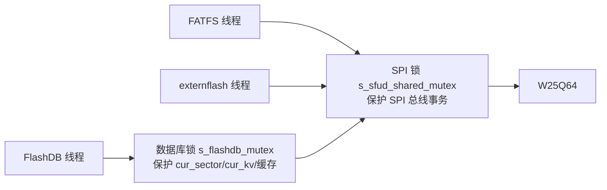

# 📖 引言

> 在 STM32F411CEU6（内部 512K Flash / 128K RAM）+ W25Q64（外部 8MB SPI Flash）上，SFUD、FAL、FlashDB、FATFS、OTA、LVGL 六大组件如何划分 8MB 外部空间、分配 128KB 内部内存、并在共用一根 SPI 总线时保证并发安全。核心思路：以 **FAL 分区表为单一事实来源**，上层组件只认"分区名 + 相对偏移"，从而做到换芯片/改分区只动配置、不动源码。

---

# 📝 分层存储栈的设计思路

> 一句话定义：**W25Q64 ← SPI ← SFUD ← FAL ← {FlashDB KVDB, FatFs}**，每层只认下一层给的接口，靠"函数指针多态 + 静态分区表 + 相对偏移寻址"解耦。

## 实际意义

- **换芯片零改动**：W25Q64→W25Q128 时 SFUD 内置表自动按 JEDEC ID 识别（[sfud_flash_def.h:134](Middlewares/SFUD/inc/sfud_flash_def.h#L134) 已有 W25Q128BV），FAL 容量运行时动态取（[fal_flash_sfud_port.c:129](Middlewares/FAL/port/fal_flash_sfud_port.c#L129)），分区表重规划即可，其余代码零改动。
- **改分区全链生效**：分区物理位置只定义在 `fal_cfg.h` 一处，上层用相对偏移寻址（[fal_partition.c:428](Middlewares/FAL/src/fal_partition.c#L428) `part->offset + addr`），改一处表全部跟随。
- **并发安全分层**：SPI 锁管物理事务原子，FlashDB 数据库锁管逻辑状态原子，各司其职。

## 应用场景

1. FlashDB 通过 `fal_partition_find("fdb")` 拿 KV 分区（[fdb.c:66](Middlewares/FlashDB/src/fdb.c#L66)）。
2. FatFs 通过 `fal_partition_find("fatfs")` 拿文件系统分区（[diskio.c:70](Middlewares/FATFS/port/diskio.c#L70)）。

## 核心逻辑/原理

### 机制 1：分层存储栈调用链

### 机制 2：两层互斥锁

### 机制 3：OTA 双区解耦

## 关键公式/结论

1. **分区表约束**：每个分区 `offset + len ≤ 设备容量(8MB)`（初始化校验 [fal_partition.c:145](Middlewares/FAL/src/fal_partition.c#L145)）；各分区首尾相接、互不重叠（**重叠 FAL 不查，规划者自查**）。
2. **RAM 账本**：FreeRTOS 堆 24KB + 任务栈×3 ~12KB + s_work 8KB（一次性，f_mkfs 后释放）+ s_fs ~4.1KB + s_kvdb ~0.9KB ≈ 49.5KB，128KB 余约 78KB。
3. **显存矛盾**：320×240 RGB565 整帧 = 150KB > 128KB RAM，须用**分区渲染**（画一块 flush 一块）解决，SPI+DMA 异步送显降 CPU 占用。

## 实际操作步骤

### 第一步：初始化顺序

`user_init()` 按序执行（[user_init.c:38-89](User_Task/User_Init/Src/user_init.c#L38-L89)）：port 注册 → wrapper init → FAL → FlashDB → FATFS。**FAL 必须先于 FlashDB/FATFS**（分区表来源）。

### 第二步：扩容分区（以 fdb 512K→1M 为例）

1. 改 [fal_cfg.h:62](Middlewares/FAL/port/fal_cfg.h#L62) fdb 的 `len` 为 `1UL*1024*1024`。
2. 联动让位：rsvd 的 offset 前移到 fdb 新末尾（7MB）、len 缩到 1MB（[fal_cfg.h:63](Middlewares/FAL/port/fal_cfg.h#L63)）。
3. 重新编译，其余源码零改动。

### 第三步：真实 Flash 操作必须在任务线程内

SFUD 层 SPI 锁 take 依赖调度器已启动（[drv_adapter_sfud_externflash.c:186](Bsp/porting/drv_adapter_sfud_externflash/Src/drv_adapter_sfud_externflash.c#L186) 注释），调度器前同步读写会崩溃。

## 常见问题

### 问题：FlashDB 分区太小 → GC 频繁
**现象** → **根因** → **修复** → **验证**
- 现象：KV 高频更新时写入慢/偶尔 `KV full`。
- 根因：分区小 → 空闲扇区跌破阈值 → 每写满一个扇区触发 GC 迁移+擦除（[fdb_kvdb.c:1076](Middlewares/FlashDB/src/fdb_kvdb.c#L1076)）。
- 修复：扩大 fdb 分区（≥128 扇区）提供 GC 缓冲。
- 验证：观测 GC 触发频率下降。

### 问题：误删 SFUD SPI 锁
**现象** → **根因** → **修复**
- 现象：FATFS/FlashDB 数据偶发损坏。
- 根因：SPI 事务被其他线程腰斩（总线交错）；数据库锁只防逻辑状态、不防物理事务。
- 修复：恢复 SPI 锁；两层锁缺一不可。

---

# 💬 Q&A

## 🟢 基础

### Q1：换 W25Q128 并扩 fdb 分区，要改什么？
A1：只改 `fal_cfg.h` 分区表——fdb 的 len（512K→1M）+ 邻接分区（rsvd）offset/len 联动让位，保证不越界不重叠。SFUD/port/FlashDB/FATFS 源码零改动（SFUD 内置表已有 W25Q128BV，FAL 容量运行时动态取）。

## 🟡 进阶

### Q2：删掉 SPI 锁会怎样？
A2：SPI 字节流交错 → FATFS 读回错误数据（文件损坏）、FlashDB 写入字节错误（CRC 不过，KV 损坏）。FlashDB 数据库锁只保护 cur_sector/cur_kv/缓存等逻辑状态，不碰 SPI 总线；两层锁各自管一层，缺一不可。

## 🔴 困难

### Q3：加 2.4MB 环形录音分区，怎么统筹？
A3：压缩未接入的 LVGL（lvgl_res 3M→2M 腾 1M）+ 动用预留区（rsvd 让 1.4M），新建 record 2.4M 插到 lvgl 后，fatfs/fdb 顺移。写入用 **TSDB**（`fdb_tsl_append`，天然环形+时序+掉电安全），而非 KVDB。

---

# 📋 总结

> 外部 8MB 按"OTA 双区 + LVGL 资源 + FATFS + KVDB + 预留"划分，分区表是唯一事实来源；内部 128KB 的大头是堆/栈/s_work，均可裁剪；并发靠"SPI 物理锁 + 数据库逻辑锁"两层；换芯片、改 SPI、扩分区都只动配置。未验证项：LVGL、OTA 仅规划未实现，显存 buffer 等参数待实机测量。

---

# 📎 参考资料

## 🔗 博客/文档链接
- [SFUD 文档](https://github.com/armink/SFUD) — 串行 Flash 通用驱动库
- [FAL 文档](https://github.com/armink/FAL) — Flash 抽象层
- [FlashDB 文档](https://github.com/armink/FlashDB) — KVDB/TSDB 嵌入式数据库
- [FatFs 官方](http://elm-chan.org/fsw/ff/00index_e.html) — 通用 FAT 文件系统模块

## 💻 仓库链接
- [armink/SFUD](https://github.com/armink/SFUD)
- [armink/FAL](https://github.com/armink/FAL)
- [armink/FlashDB](https://github.com/armink/FlashDB)
- [chaN/FatFs](http://elm-chan.org/fsw/ff/00index_e.html)
