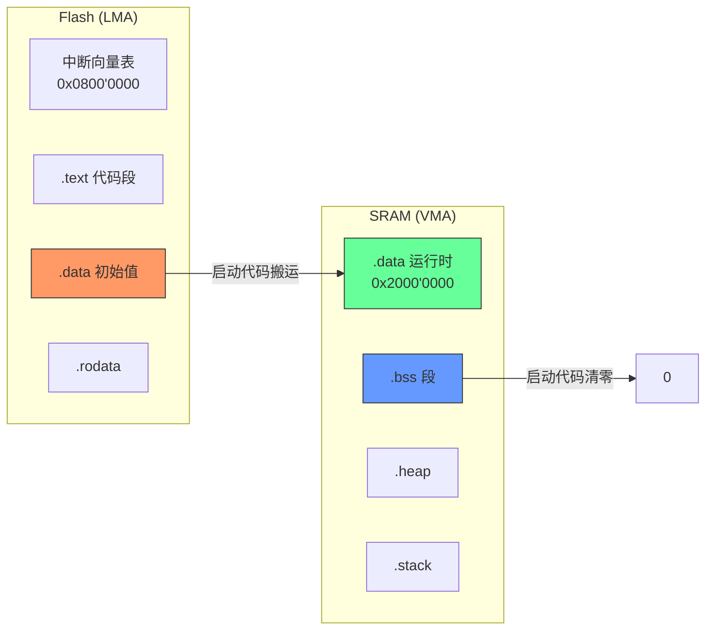

 #debug #重定位 #PIC #bootloader

## 1. 学习内容

### 知识点总览

| 序号 | 知识点 |
| --- | --- |
| 1 | **重定位是什么** — 链接重定位 vs 运行时重定位，LMA 与 VMA 的概念 |
| 2 | **如何实现重定位** — 三种实现路径：链接脚本 AT() + 启动文件搬运 / PIC/PIE 编译 / Bootloader 跳转前重定位 |

### 知识点关联思维导图


---

## 2. 逐点精讲

### 知识点 1：重定位是什么？

#### 通俗人话解释

```
你写了一份"周末采购清单"贴在家里冰箱上（Flash），
但出门时把它拍照存在手机里（RAM）跟着走——
这个"从冰箱上的地址 → 手机上的地址"的转换过程就是重定位。

或者：你约朋友去电影院，但电影院临时换了栋楼——
这个"通知所有朋友新地址"的过程也叫重定位。
```

#### 核心逻辑/原理

重定位（Relocation）在嵌入式系统中有 **两层含义**：

**1）链接阶段的静态重定位**（由链接器自动完成）

```
源码中的函数名("main", "HAL_Init") → 目标文件中的符号引用
                                   → 链接器解析为最终地址(0x08001000)
                                   → 写入可执行文件
```

这是链接器的本职工作，开发者一般只通过链接脚本（.ld）间接控制。

**2）运行时的动态重定位**（由启动代码/应用程序完成）

核心矛盾：**代码烧录在 A 地址，但需要在 B 地址运行**。

```
LMA （Load Memory Address）   —— 加载地址，程序烧录时存放的位置（Flash）
VMA （Virtual Memory Address） —— 运行时地址，程序执行时所在的位置（RAM 或不同 Flash 偏移）

例如：
  .data 段：LMA = 0x0800'0000 (Flash)，VMA = 0x2000'0000 (SRAM)
  → 启动时必须从 Flash 复制到 SRAM
```

重定位的本质：

  [LMA 的数据] → 搬运到 [VMA] → 修正其中的绝对地址引用

搬运量 = 段大小（_edata - _sdata）

修正量 = VMA - LMA（地址偏移量）

#### 实际意义

- **Bootloader 架构**：App 可以烧录在 Flash 的不同偏移位置（0x0800'0000、0x0804'0000 等），无需为每个位置重新编译
- **RAM 执行**：将关键代码/数据搬到 SRAM 运行（比 Flash 零等待状态区更快，或实现 Flash 擦写时的代码连续执行）
- **OTA 升级**：A/B 双分区，固件可烧录到任意分区，通过重定位机制在对应分区运行

#### 应用场景

| 场景 | 需要重定位的原因 |
|------|----------------|
| Bootloader + App | App 链接地址 = 实际烧录地址 + 偏移，需修正地址 |
| OTA 双分区 | 固件可能在 Bank1 或 Bank2 运行，地址不同 |
| 复制代码到 RAM 执行 | Flash 中代码的 LMA ≠ RAM 中运行的 VMA |
| 中断向量表重映射 | VTOR 必须在运行时指向实际中断向量表位置 |
| 多固件镜像 | 同一固件二进制可在不同 Flash 偏移位置执行（PIC） |

#### 常见误区

| 误区 | 正解 |
|------|------|
| " 重定位只是把代码从 Flash 复制到 RAM" | 复制只是搬运，**修正绝对地址**才是重定位的核心 |
| " 重定位 = PIC" | PIC 只是实现重定位的一种方式，还有链接脚本 AT() 和 Bootloader 搬运 |
| "STM32 所有代码都在 Flash 跑，不需要重定位 " | .data 段必须重定位到 RAM，否则全局变量无法写入 |
| " 用 -fPIC 编译就能随便搬 " | 库文件（newlib/libgcc）也要用 -fPIC 重新编译，否则会有绝对引用 |

#### 辅助图示

1. 重定位的作用示例图



2. 重定位的反汇编代码常用函数 ![[file-20260606203115787.png]]

---

### 知识点 2：如何实现重定位？

#### 核心逻辑/原理

该工程采用 **路径 A 变体**—Keil  scatter-loading 重定位 + 自定义手动搬运验证。

```
实现链路：
  .sct 链接脚本定义 LMA/VMA         ← 编译阶段
    → __scatterload（__main 内部）    ← 启动时自动搬运
      → main() 顶部显式重新搬运一次   ← 冗余验证
```

#### 关键代码一：自定义 sct 散列文件

**文件：** `MDK-ARM/FreeRTOS_Helloworld/Own_Sct/own_sct_V1.sct`

```txt
; 加载区 1 — 主 Flash（448KB, LMA 0x08000000）
LR_IROM1 0x08000000 0x00070000  {
  ER_IROM1 0x08000000 0x00070000  {   ; LMA == VMA，代码原地执行
   *.o (RESET, +First)
   *(InRoot$$Sections)
   .ANY (+RO)
   .ANY (+XO)
  }
  RW_IRAM1 0x20000000 0x00020000  {   ; .data LMA=Flash, VMA=SRAM
   .ANY (+RW +ZI)                      ; 链接器自动分配 .data/.bss
   *.o (myram)                         ; myram 段放入 SRAM
  }
}

; 加载区 2 — 二级 Flash（64KB, 0x08070000）
LR_IROM2 0x08070000 0x00010000  {
  ER_IROM2 0x08070000 0x00010000  {   ; 原地执行
   *.o (myflash)                       ; myflash 段单独存放
  }
}
```

**解读：**

| 段 | LMA（Flash 地址） | VMA（运行时地址） | 搬运方向 |
|------|------|------|------|
| ER_IROM1（代码 +rodata） | 0x08000000 | 0x08000000 | 不动（原地执行） |
| RW_IRAM1（.data+.bss） | 0x080043e0 | 0x20000000 | Flash → SRAM |
| LR_IROM2（myflash） | 0x08070000 | 0x08070000 | 不动（原地执行） |

`.data` 的实际 LMA 地址由链接器根据代码段大小自动推算（`0x080043e0`），

开发者只需在 sct 中声明 `VMA=SRAM`，链接器自动插入搬运符号。

#### 关键代码二：启动文件（Keil 标准流程）

**文件：** `MDK-ARM/startup_stm32f411xe.s`

```asm
Reset_Handler    PROC
                 EXPORT  Reset_Handler             [WEAK]
                 IMPORT  SystemInit
                 IMPORT  __main                     ; ← 入口点
                 LDR     R0, =SystemInit
                 BLX     R0                         ; 初始化时钟
                 LDR     R0, =__main
                 BX      R0                         ; 转到 __main
                 ENDP
```

`__main` 是 ARM C 库入口，内部调用 `__scatterload`：

```
__main
  └─ __scatterload
       ├─ __scatterload_copy     ← 遍历执行区，将 LMA 数据搬运到 VMA
       └─ __scatterload_zeroinit ← 将 ZI(.bss) 段清零
  └─ __main_after_scatterload
       └─ main()                 ← 用户入口
```

**关键点：** 启动文件中**看不见**搬运循环的汇编代码，搬运逻辑封装在 ARM C 库的 `__scatterload` 内部，链接时自动注入。

#### 关键代码三：main() 顶部的冗余手动搬运

**文件：** `Core/Src/main.c`

```c
/* Keil scatter 符号 — 链接器自动生成 */
extern int Load$$RW_IRAM1$$Base;      /* .data 在 Flash 中的 LMA 起始  0x080043e0 */
extern int Load$$RW_IRAM1$$Limit;     /* .data 在 Flash 中的结束        0x0800447c */
extern int Image$$RW_IRAM1$$Base;     /* .data 在 SRAM 中的 VMA 起始   0x20000000 */
extern int Image$$RW_IRAM1$$Limit;    /* .data 在 SRAM 中的结束        0x2000009c */
extern int Image$$RW_IRAM1$$ZI$$Base;      /* .bss 在 SRAM 起始        0x2000009c */
extern int Image$$RW_IRAM1$$ZI$$Limit;     /* .bss 在 SRAM 结束        0x20004e00 */

/* 手动逐字搬运 .data：Flash → SRAM */
void copy_memory(uint32_t source, uint32_t destination, uint32_t size) {
  uint32_t *src_ptr  = (uint32_t *)source;
  uint32_t *dest_ptr = (uint32_t *)destination;
  uint32_t *end_ptr  = (uint32_t *)(source + size);
  while(src_ptr < end_ptr) {
    *dest_ptr++ = *src_ptr++;
  }
}

/* 手动逐字节清零 .bss */
void zero_initialize(uint32_t start_add, uint32_t size) {
  uint8_t *current_ptr = (uint8_t *)start_add;
  uint8_t *end_ptr     = (uint8_t *)(start_add + size - 16);
  while (current_ptr < end_ptr) {
    *current_ptr++ = 0;
  }
}

int main(void) {
  /* 手动重定位（__scatterload 已经做过一次，此处是冗余验证）*/
  copy_memory((uint32_t)&Load$$RW_IRAM1$$Base,
              (uint32_t)&Image$$RW_IRAM1$$Base,
              (uint32_t)&Load$$RW_IRAM1$$Limit -
              (uint32_t)&Load$$RW_IRAM1$$Base);

  zero_initialize((uint32_t)&Image$$RW_IRAM1$$ZI$$Base,
                  (uint32_t)&Image$$RW_IRAM1$$ZI$$Limit -
                  (uint32_t)&Image$$RW_IRAM1$$ZI$$Base);

  HAL_Init();
  ...
  /* 打印地址验证重定位结果 */
  printf("g_test_data = [%d]\r\n", g_test_data);
  printf("Load$$RW_IRAM1$$Base  = [0x%x]\r\n", (uint32_t)&Load$$RW_IRAM1$$Base);
  printf("Load$$RW_IRAM1$$Limit = [0x%x]\r\n", (uint32_t)&Load$$RW_IRAM1$$Limit);
  printf("Image$$RW_IRAM1$$Base = [0x%x]\r\n", (uint32_t)&Image$$RW_IRAM1$$Base);
  printf("Image$$RW_IRAM1$$Limit = [0x%x]\r\n", (uint32_t)&Image$$RW_IRAM1$$Limit);
  ...
}
```

#### Keil scatter 符号命名规则

| 符号格式                         | 含义                           |
| ---------------------------- | ---------------------------- |
| `Load$$RW_IRAM1$$Base`       | .data 在 Flash 中的 LMA 起始地址    |
| `Load$$RW_IRAM1$$Limit`      | .data 在 Flash 中的结束地址（=下个段起始） |
| `Image$$RW_IRAM1$$Base`      | .data 在 SRAM 中的 VMA 起始地址     |
| `Image$$RW_IRAM1$$Limit`     | .data 在 SRAM 中的结束地址          |
| `Image$$RW_IRAM1$$ZI$$Base`  | .bss 在 SRAM 中的起始地址           |
| `Image$$RW_IRAM1$$ZI$$Limit` | .bss 在 SRAM 中的结束地址           |

规则：`操作$$执行区名称$$属性`

#### 实际分配结果（.map 文件验证）

```
加载区 LR_IROM1    0x08000000  大小: 0x0000447c  (17.5 KB)
  执行区 ER_IROM1   0x08000000  大小: 0x000043e0  (17.4 KB)
  执行区 RW_IRAM1   0x20000000  大小: 0x00004e00  (19.5 KB)

Load$$RW_IRAM1$$Base      0x080043e0    ← .data 在 Flash 末尾
Load$$RW_IRAM1$$Limit     0x0800447c    ← 仅 156 字节
Image$$RW_IRAM1$$Base     0x20000000    ← .data 搬到 SRAM 头部
Image$$RW_IRAM1$$Limit    0x2000009c
Image$$RW_IRAM1$$ZI$$Base   0x2000009c
Image$$RW_IRAM1$$ZI$$Limit  0x20004e00  ← .bss ~19.3 KB
```

#### 关键公式/结论

1. **Keil scatter-loading 是路径 A 的 ARM 编译器实现**，`__scatterload` 自动完成 LMA→VMA 搬运和 ZI 清零，开发者只需在 .sct 中声明分区
2. **工程做了冗余搬运**：`__scatterload` 已完成的事，`main()` 顶部又做了一次——对验证重定位地址有效，但实际工程不应这样写（浪费启动时间）
3. **VTOR 未配置**（`USER_VECT_TAB_ADDRESS` 注释掉），向量表固定在 Flash 基址 `0x08000000`，此时搬运只涉及 .data/.bss 段，不涉及代码段重定位
4. **自定义段 myram / myflash**：通过 `.sct` 的 `*.o (myram)` / `*.o (myflash)` 语法，可将指定 .o 的目标段放到特定内存区域
5. **Keil 与 GCC 的搬运区别**：Keil 用 `__scatterload`（自动化），GCC 用启动文件中的汇编循环（显式），但本质都是路径 A——链接脚本定义 LMA/VMA + 启动代码搬运

#### 常见误区

| 误区 | 正解 |
|------|------|
| "Keil 启动文件没有搬运代码，所以 Keil 不做重定位 " | 搬运在 `__main → __scatterload` 中自动执行，启动文件看不到循环 |
| " 手动在 main() 里再 copy 一次是必要的 " | 冗余操作，`__scatterload` 在跳转到 main() 之前已经完成了 |
| "sct 只影响编译，不产生运行时行为 " | sct 定义的 LMA/VMA 会让链接器自动插入 scatterload 符号和搬运表 |
| ".data 放在 SRAM，程序也能直接访问 Flash 里的值 " | 初始值在 Flash（LMA），运行时必须在 SRAM（VMA），否则写操作无效 |

---

## 3. 相关资料

### 🎥 视频链接

- [使用重定位的方法](https://www.bilibili.com/video/BV1SSfjYSEo5/?spm_id_from=333.337.search-card.all.click&vd_source=6f77320ec3e6e86d4e2e004a411d3f96)

### 🔗 资料链接

- [如何开发与存储位置无关的 STM32 应用 (EETrend)](https://mcu.eetrend.com/content/2022/100563689.html)
- [让 STM32 应用与存储位置无关 (CSDN)](https://wangjw.blog.csdn.net/article/details/126853650)
- [CubeMX+CLion 下 STM32 CMake 工程 Flash 地址重定向实战 (CSDN)](https://blog.csdn.net/z4a5b6/article/details/154375377)
- [STM32CubeIDE 链接文件使用技巧 LAT0816 (ST 官方)](https://mcu.eetrend.com/files/2021-04/wen_zhang_/100100590-195836-lat0816stm32cubeideshiyongjiqiaozhildlianjiewenjianv10.pdf)
- [ARM 社区：多应用程序代码与 Bootloader 讨论](https://community.arm.com/support-forums/f/compilers-and-libraries-forum/44009/multiple-application-code-with-bootloader)
- [工程师笔记：如何开发与存储位置无关的 STM32 应用 (EEWorld)](https://news.eeworld.com.cn/mcu/ic631986.html)
- [如何开发与存储位置无关的 STM32 应用 (21ic BBS)](https://bbs.21ic.com/icview-3504044-1-38.html)
- [MDK编译过程及ARM编译工具链](https://www.cnblogs.com/mindtechnist/p/17243733.html)

### 💻 代码/PDF

- 路径 A 代码：STM32 标准启动文件 + .ld 链接脚本
- 路径 B 代码：PIC 编译 Makefile + GOT 修正 C 函数
- 路径 C 代码：Bootloader 跳转函数 `jump_to_app()`

---

## 4. Q&A

### Q1：重定位初始化了哪些区域的值？

 A1：

重定位（运行时重定位）主要初始化以下 **3 个区域**：

**① .data 段 — Flash 初始值 → SRAM 运行时位置**

```
Flash(LMA) 0x080043e0  ──copy_memory()──▶  SRAM(VMA) 0x20000000
  [g_test_data = 12]                         [g_test_data = 12]
  [其他全局变量初始值]                          [其他全局变量初始值]
```

搬运量 = `Load$$RW_IRAM1$$Limit - Load$$RW_IRAM1$$Base`

**② .bss / ZI 段 — SRAM 清零**

```
SRAM(VMA) 0x2000009c  ──zero_initialize()──▶  0x20004e00
  [乱值]                                        [0]
```

清零量 = `Image$$RW_IRAM1$$ZI$$Limit - Image$$RW_IRAM1$$ZI$$Base`

**③ 栈指针 MSP — 加载向量表第一项**

这不是 " 搬运 "，但也是启动时初始化的关键值：

```asm
__initial_sp  →  __set_MSP(__initial_sp)  ; 在 Reset_Handler 入口自动完成
```

### Q2：STM32F411 的 .data 段重定位是启动文件做的，这部分代码在哪里？

 A2：查询 map 文件可知，keil 工程的系统重定位在. Text 段中，因为编译器的原因，keil 工程只在链接过程中会加载重定位而不会显示在启动文件中 ![[file-20260608094639371.png]]

### Q3：重定位函数如果自己写，能有什么辅助我们 Debug 的好处？

 A3：

**好处 1：运行时验证地址分配是否正确**

```c
printf("Load$$RW_IRAM1$$Base  = [0x%x]\r\n", &Load$$RW_IRAM1$$Base);   // 0x080043e0
printf("Image$$RW_IRAM1$$Base = [0x%x]\r\n", &Image$$RW_IRAM1$$Base);  // 0x20000000
printf("Image$$RW_IRAM1$$Limit = [0x%x]\r\n", &Image$$RW_IRAM1$$Limit); // 0x2000009c
```

如果 sct 写错了（比如 LR_IROM1 大小裁过头、VMA 地址重叠），打印出来的地址一眼就能看出问题——不用去翻 .map。

**好处 2：抓到全局变量初始值为 0 的隐性 bug**

```c
/* 如果搬运漏了，g_test_data 会保持 0xFF（Flash 擦除态）或随机值 */
printf("g_test_data = [%d]\r\n", g_test_data);
```

正常打印预期的初始值（如 42）。如果打印 0 或乱值 → .data 搬运没生效。`__scatterload` 做错你只能上调试器看内存，自己写直接一个 printf 定位。

**好处 3：检测 SRAM 溢出（.data + .bss 是否超限）**

```c
uint32_t data_size  = (uint32_t)&Image$$RW_IRAM1$$Limit -
                      (uint32_t)&Image$$RW_IRAM1$$Base;
uint32_t bss_size   = (uint32_t)&Image$$RW_IRAM1$$ZI$$Limit -
                      (uint32_t)&Image$$RW_IRAM1$$ZI$$Base;
uint32_t sram_total = data_size + bss_size;

if (sram_total > 128 * 1024) {  /* STM32F411 SRAM = 128KB */
    printf("[X] SRAM 溢出！.data + .bss = %d KB\r\n", sram_total / 1024);
    while(1);  /* 卡住，不让程序跑飞 */
}
```

**好处 4：加 DWT 计时，量化启动时间**

```c
DWT->CTRL |= 1;             /* 使能 CYCCNT */
uint32_t t0 = DWT->CYCCNT;
copy_memory(...);
uint32_t t1 = DWT->CYCCNT;
printf(".data 搬运耗时: %d cycles\r\n", t1 - t0);
```

知道启动时花了多少时间在搬运上，对 Bootloader 有时间约束的场景（如看门狗超时前必须完成跳转）很实用。

### Q4：我们勾选的微库 Micro-Lib 的 Printf 函数的定义是在哪里？为什么 keil 里面跳转不过去？

 A4：

ARM 编译器安装目录下的预编译库文件 ![[file-20260608095850559.png]]

Map 中 printf 的定位

![[file-20260608100017345.png]]

**为什么 Keil 里 F12 跳转不过去：**

| 原因     | 说明                                                         |
| ------ | ---------------------------------------------------------- |
| 预编译二进制 | Micro-Lib 以 `.lib` 形式提供，没有配套的 `.c` 源文件暴露给 IDE              |
| 源码浏览范围 | Keil 的 Source Browser / F12 只对**工程中添加的源文件**和**已解析的头文件**有效  |
| 链接时提取  | `printf` 在链接阶段才从 `microlib.lib` 中抓取目标代码到 .axf，编译阶段只有函数声明可用 |
