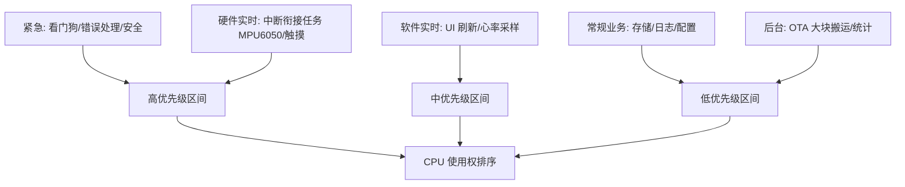
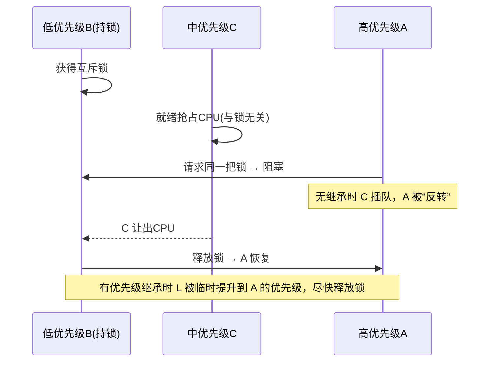

# 📖 引言

> 这篇笔记要讲什么？用一句话概括核心主题。

作为一个架构设计师，该如何基于业务为任务分配合理的优先级，来防止优先级反转甚至死锁

---

# 📝 优先级分配的原则与分类

> 用一句话说清楚这个知识点是什么。

优先级分配遵循的核心指导思想与经典优先级分级思路：先按业务价值把任务分成若干实时等级，再在等级内分配优先级编号，并用互斥锁优先级继承来防止优先级反转。

## 实际意义

> 为什么会有该知识点？

1. 随着工程中业务的不断扩展，代码中各种类型的线程任务也随之不断增加，同时各种问题也纷至沓来（优先级反转、任务饿死、共享资源竞争、死锁），此时就需要根据业务对齐线程进行分类和优先级管理
2. 让系统功能能够在设定好的反应时间范围内正常响应，不会系统死机或者死锁导致资源无法使用

## 应用场景

> 在实际中主要被用来做什么？

1. 提高系统运行速度，即系统性能优化：把 CPU 优先分配给关键链路，减少无效等待与上下文切换
2. 多任务实时系统的统一优先级规划表：工程中每个任务上线前先查表归位（EC-S100 的“任务优先级分配”与 OS Platform 的“任务优先级整体规划和统一表”）[[EC-S100智能手表软件架构设计文档STM32F411侧 copy]] §3.3.1 / §4.2.1
3. 中断→线程的衔接：ISR 只做“快进快出”并唤醒高优先级处理任务，实质工作在线程中完成（如 MPU6050 FIFO 中断 → 任务通知 → 硬件实时层任务批量处理）[[EC-S100智能手表软件架构设计文档STM32F411侧 copy]] §3.4.4

## 核心逻辑/原理

> 它是如何工作的？拆解背后的机制。

### 机制 1：优先级 = 截止时间与周期的排序表达

FreeRTOS 中**数值越大优先级越高**，就绪态下高优先级任务抢占低优先级任务。架构师的工作是把业务的“时间约束”翻译成这个排序：

- 硬实时（错过即失败）→ 最高优先级区间
- 软实时（偶尔抖动可接受）→ 中间区间
- 非实时（后台/批量）→ 低优先级区间

### 机制 2：四大原则如何落到优先级

1. **关键路径优先**：从数据源→处理→响应的整条链路分配最低延迟预算，链路上的任务优先级最高
2. **实时性分层**：按硬实时/软实时/非实时分层，每层占一个优先级区间，层内再编号细分，避免“全部平铺”导致饿死
3. **资源依赖解耦**：共享资源用带优先级继承的互斥锁保护，持锁任务不被无关中优先级任务抢占
4. **能耗优化**：低频/非关键任务降优先级、按需采样（如 0.1Hz 温湿度），不打扰高优先级实时任务

### 机制 3：五级分类 → 优先级区间



### 机制 4：优先级反转与互斥锁优先级继承



```c
/* 示例：五级分级的优先级编号（非本工程源码，数值需按工程 FreeRTOSConfig.h 调整）
 * 工程统一经 OSAL 封装任务创建，OSAL 设计见对应学习笔记 */
#define PRIO_EMERGENCY    7   /* 紧急：看门狗/错误处理 */
#define PRIO_HW_REALTIME  6   /* 硬件实时：MPU6050/触摸衔接任务 */
#define PRIO_SW_REALTIME  5   /* 软件实时：UI 刷新/心率采样 */
#define PRIO_NORMAL       3   /* 常规业务：存储/日志/配置 */
#define PRIO_BACKGROUND   1   /* 后台：OTA 大块搬运/统计 */
/* FreeRTOSConfig.h: #define configMAX_PRIORITIES 8 */
```

## 关键公式/结论

> 最终结论和公式。

1. 其优先级分配的核心原则分别是关键路径优先，实时性分层，资源依赖解耦，能耗优化
2. 其经典优先级分级为紧急，硬件实时，软件实时，常规业务和后台任务
3. FreeRTOS 落地参数（本工程实测）：`configMAX_PRIORITIES=56`（`FreeRTOSConfig.h:69`），数值越大优先级越高，空闲任务优先级恒为 0；`configUSE_MUTEXES=1` 已开启，优先级继承只在互斥锁 `xSemaphoreCreateMutex` 上内置，信号量/二值信号量没有
4. 优先级反转的三个必要条件：低优先级任务持锁 + 中优先级任务就绪 + 高优先级任务请求同一把锁；三者齐备才会出现“假死”

## 实际操作步骤

> 以立芯嵌入式 FreeRTOS 工程（STM32F411CEU6 + FreeRTOS V10.3.1 + LVGL）为样例，从真实代码盘点任务并分配优先级。

### 第一步 任务盘点（工程实测）

| # | 任务名 | 创建处 | 优先级(代码) | 栈(字/字节) | 状态 |
|---|---|---|---|---|---|
| 1 | `userTask` | `User_Init.c:109` | 26 | 512/2KB | ✅ 一次性初始化 |
| 2 | `LVGLTask` | `User_Init.c:90` | 26 | 1024/4KB | ✅ UI 刷新 |
| 3 | `ExtFlashTask` | `User_Init.c:78` | 26 | 512/2KB | ✅ 存储管理 |
| 4 | `ExtFlashDrv` | `drv_adapter_port_flash.c:200` | 26 | 512/2KB | ✅ W25Q64 驱动 |
| 5 | `defaultTask` | `freertos.c:95` | 24 | 128/512B | ✅ 占位 |
| 6 | `tempHandlerTask` | `drv_adapter_port_temp_humi.c:203` | 24 | 768B | ⛔ `#if 0` 未使能 |
| 7 | `SensorTask` | `User_Init.c:71`（#if0 内） | 15 | 512/2KB | ⛔ 未使能 |

> 依据：`os_task_create_impl`（`os_impl_task.c:15`）把 OSAL 参数原样透传 `xTaskCreate`，故 26/15 即 FreeRTOS 原始优先级；`configMAX_PRIORITIES=56`（`FreeRTOSConfig.h:69`）。栈单位：`osal_task_create` 的 `stack_size` 为字，×4 得字节。

### 第二步 五级归类并分配优先级区间

按 紧急→硬件实时→软件实时→常规业务→后台任务 归类，在 `configMAX_PRIORITIES=56` 内分配（0 最低、55 最高）：

| 层级 | 区间 | 任务 | 建议优先级 |
|---|---|---|---|
| 紧急 | 47–55 | WatchdogTask（建议新增） | 50 |
| 硬件实时 | 37–46 | tempHandlerTask / ExtFlashDrv | 44 / 42 |
| 软件实时 | 27–36 | LVGLTask / ExtFlashTask | 34 / 30 |
| 常规业务 | 14–26 | userTask（一次性）、(预留)OTA/FATFS | 24 / 22 |
| 后台 | 1–13 | SensorTask | 12 |

> 关键取舍：把 **ExtFlashDrv(42) 提到 LVGLTask(34) 之上**——LVGL 的数据就绪信号量由 ExtFlashDrv 释放，驱动优先级高才能保证关键路径阻塞最短（对应"关键路径优先"原则）。

### 第三步 优先级分配表（12 列）

| 任务名称 | 优先级(建议/当前) | 轮询周期/触发条件 | 执行时间估算 | 使用的资源 | 对外接口 | 依赖关系 | 任务状态 | 容错策略 | RAM/ROM | 可扩展性 | 功能描述 |
|---|---|---|---|---|---|---|---|---|---|---|---|
| WatchdogTask(建议新增) | 50 / — | 1s 周期喂狗 | <0.5ms/次 | IWDG、任务心跳表 | 无 | 独立；监测所有任务 | Blocked | 超时日志+软复位 | 栈512B | 注册式心跳表 | 任务级看门狗 |
| tempHandlerTask | 44 / 24(未使能) | 事件触发 | AHT21 软件I2C ~80–120ms/次 | 软件I2C PB13/14、事件组 | `temphumi_read_temp_and_humi()` | AHT21 | Blocked | 10s 超时 | 栈768B | OS 接口已解耦 | 温湿度采集线程 |
| ExtFlashDrv | 42 / 26 | 队列事件 | 1050B SPI 轮询读 ~5–15ms(估算) | SPI1(PB3)、W25Q64、队列 | `externflash_read/write` | 被 ExtFlashTask 依赖 | Blocked | 无超时重试(隐患) | 栈2KB | adapter 注册模式 | W25Q64 驱动线程 |
| LVGLTask | 34 / 26 | 5ms 周期 | 每帧 ~1–10ms；全刷 240×240×2B≈30ms(估算) | SPI2+DMA、触摸、LVGL 堆 | `Read_LvglData()`;`SetBackLight()` | →ExtFlashTask→ExtFlashDrv | Running/Blocked | 背光钳制；读数据无超时(隐患) | 栈4KB | GUI Guider 生成页面 | LVGL 主循环 |
| ExtFlashTask | 30 / 26 | 事件(EVENT_LVGL) | 分发 ~0.1ms | 事件组、信号量、互斥锁、`g_au8_lvgldata` | `Read_LvglData()` | →ExtFlashDrv；为 UI 供数 | Blocked | mutex 失败 while(1)(隐患)；地址/范围校验 | 栈2KB | 事件位预留 OTA/FATFS | 外部 Flash 存储管理 |
| userTask | 24 / 26 | 开机一次性 | 初始化 ~1–5ms | 栈、事件组/信号量 | `UserAppTask_Init()` | 初始化 Flash→建各任务→自删 | Deleted | 创建失败 log_e | 栈2KB | 任务工厂 | 应用初始化 |
| SensorTask | 12 / 15(未使能) | 2000ms 轮询 | ~80–120ms/次 | AHT21 接口 | `temphumi_read_temp_and_humi()` | →tempHandlerTask | 未创建 | 无回退(待补) | 栈2KB | 采样率参数化 | 周期采样 |
| defaultTask | 删除 / 24 | osDelay(1) | <0.1ms | 栈512B | 无 | 独立 | Blocked | 无 | 512B | 可删 | CubeMX 占位 |

### 第四步 资源与同步审计（工程实测）

- **共享资源**：`g_au8_lvgldata[1100]`（LVGLTask 读 / ExtFlashTask 经 ExtFlashDrv 写）、SPI1（仅 ExtFlashDrv）、SPI2+DMA（仅 LVGLTask）、软件 I2C（仅 tempHandlerTask）
- **同步原语**：事件组 + 二值信号量握手（`Read_LvglData`）、互斥锁（`extern_flash_mutex_handler`）
- **当前隐患**：见"常见问题 5/6/7"

### 第五步 运行验证

1. SystemView 观察调度时序，确认无饿死、无反转
2. `uxTaskGetStackHighWaterMark` 检查各任务栈余量
3. 建议新增任务级看门狗（当前工程缺失），喂狗周期 > 各任务最大阻塞时长
4. Keil 全速跑，断点观察 `Read_LvglData` 返回路径，量化 Flash 链路时延

## 常见问题

> 现象 → 根因 → 修复。

### 问题 1：高优先级任务饿死低优先级任务

- 现象：后台/存储任务长时间得不到运行
- 根因：优先级区间过密，高优先级任务忙等或周期过短
- 修复：任务改为事件阻塞；拉开等级间距；必要时低优先级任务让出或降级

### 问题 2：高优先级任务周期性超时/卡死

- 现象：UI 或传感器任务偶发超时，SystemView 显示在等待
- 根因：优先级反转（低优先级持锁 + 中优先级抢占）
- 修复：共享资源改用互斥锁（优先级继承），不用信号量

### 问题 3：进入 Tickless 后高实时任务抖动

- 现象：低功耗模式下手表高实时响应延迟变大
- 根因：Tickless 挂起 tick，影响时间精度
- 修复：仅在非硬实时阶段允许进入 Tickless；唤醒后先恢复 tick 再恢复实时任务

### 问题 4：看门狗任务被饿死导致整机复位

- 现象：系统周期性复位，复位原因“看门狗超时”
- 根因：看门狗任务优先级过低，被高优先级任务长期抢占
- 修复：看门狗/错误任务放入“紧急”层，并配独立硬件 IWDG 兜底

### 问题 5（本工程实测）：业务任务优先级全平铺

- 现象：UI 偶发掉帧，Flash 读取时延不确定
- 根因：`LVGLTask / ExtFlashTask / ExtFlashDrv` 同为优先级 26，FreeRTOS 时间片轮转，关键路径无优先级保障
- 修复：按五级分层，关键路径驱动（ExtFlashDrv）提到 UI 之上

### 问题 6（本工程实测）：互斥锁创建失败死循环

- 现象：Flash 管理任务卡死，UI 数据请求无响应
- 根因：`storage_manager_task` 中 `osal_mutex_create` 失败即 `while(1)`（`User_ExternflashManage.c:109`）
- 修复：失败时降级为轮询重试或错误上报，不允许 `while(1)`

### 问题 7（本工程实测）：UI 读 Flash 无超时

- 现象：Flash 驱动卡死后 UI 永久挂起
- 根因：`Read_LvglData` 中两个 `osal_sema_take` 均为 `OSAL_MAX_DELAY` 无限等待（`User_ExternflashManage.c:86-87`）
- 修复：有限超时 + 错误返回，UI 侧做数据新鲜度回退

---

# 💬 Q&A

> 自问自答，检验理解深度。按难度递进排列。

## 🟢 基础

> 最基本的概念和用法，入门必知。

### Q 1

A 1：

### Q 2

A 2：

## 🟡 进阶

> 容易踩的坑和常见误区。

### Q 3

A 3：

## 🔴 困难

> 结合实战的深层原理和设计权衡。

### Q 4

A 4：

---

# 📋 总结

> 3-5 句话回顾核心要点，用自己的话复述。

任务优先级分配的本质，是把业务的“时间约束”（截止时间、周期、是否硬实时）翻译成 CPU 使用权排序——FreeRTOS 中数值越大优先级越高。核心遵循四大原则：关键路径优先、实时性分层、资源依赖解耦、能耗优化，并据此把任务归入 紧急→硬件实时→软件实时→常规业务→后台任务 五个等级。共享资源必须用带优先级继承的互斥锁保护，否则低优先级持锁 + 中优先级抢占会触发优先级反转，最坏导致高优先级任务“假死”、看门狗复位。落地靠“盘点→归类→审计→验证→回归”五步：先建任务登记表，再分配优先级区间，最后用 SystemView、栈水位和任务看门狗确认无饿死、无反转。优先级分配不是一次性配置，而是随业务扩展持续维护的架构职责——换芯片或换 RTOS 时原则不变，只换配置参数。

---

# 📎 参考资料

> 学习过程中用到的外部资源汇总。

## 🎥 视频链接

> B 站 / YouTube 教程，优先选项目实战类和原理动画类。

- [标题](url) — 一句话说明讲了什么

## 🔗 博客/文档链接

> 分析最透彻的博客、官方文档、社区帖子。

- [标题](url) — CSDN / 博客园 / 飞书 / 知乎
- [标题](url) — 芯片厂商官方文档

## 💻 仓库链接

> GitHub / Gitee 源码仓库，含 Demo 工程和工具链。

- [FreeRTOS/FreeRTOS-Kernel](https://github.com/FreeRTOS/FreeRTOS-Kernel) — FreeRTOS 内核源码，优先级就绪表与抢占式调度的直接实现（`task.c` / `portable/`）
- [FreeRTOS/FreeRTOS-Kernel-Book](https://github.com/FreeRTOS/FreeRTOS-Kernel-Book) — 官方《Mastering the FreeRTOS Real Time Kernel》Markdown 源，优先级继承/调度的权威教材
- [STMicroelectronics/STM32CubeF4](https://github.com/STMicroelectronics/STM32CubeF4) — STM32F4 官方固件包，含 FreeRTOS 中间件集成与例程，对照 `FreeRTOSConfig.h` 配置优先级参数
- [iclite/Mastering-the-FreeRTOS-Real-Time-Kernel-CN](https://github.com/iclite/Mastering-the-FreeRTOS-Real-Time-Kernel-CN) — 上述官方书的中文翻译，优先级继承与调度章节中文阅读版
- [XcentricCoder/FreeRTOS-Kernel-Profiler](https://github.com/XcentricCoder/FreeRTOS-Kernel-Profiler) — 针对 STM32F411 的 FreeRTOS 运行时分析器（DWT 周期计数），实测每任务执行周期/CPU 占用/切换频率，验证优先级分配是否合理

## 📄 代码/附件

> 本地 PDF、代码包、工具链文件。

- [[附件文件.pdf]]
- [[示例代码.zip]]
