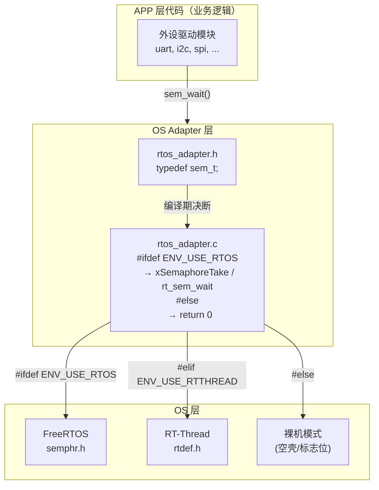
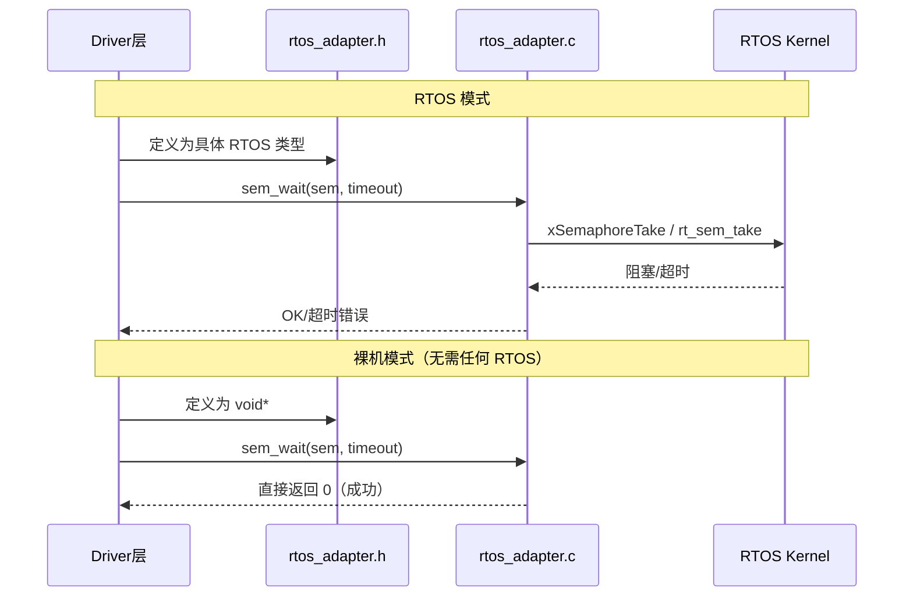
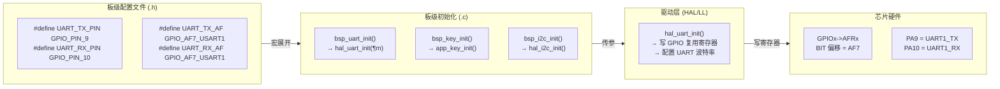
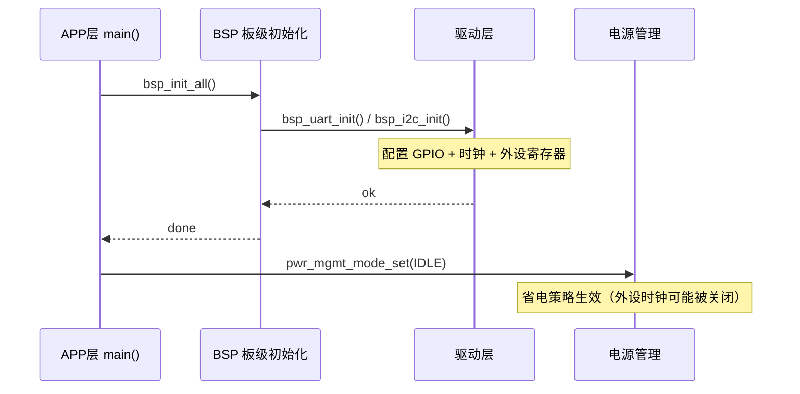

# 📖 引言

> 项目集成是将独立开发的软硬件模块（外设驱动、RTOS、应用逻辑）按分层架构（OS/BSP/APP）组合为完整系统的工程过程，核心挑战不是"能不能连上"，而是"换一颗芯片或换一个 RTOS 时，改几行代码"。

---

# 📝 嵌入式项目集成设计：OS/BSP/APP 三层架构 + Adapter 体系

> 每一层都设计了 Adapter 接口来进行适配和更换——通过编译期多态、引脚映射分离、回调注入等机制，让 OS、BSP、APP 三层之间的接口标准化，使换芯片/换 OS 时 APP 层代码一行不动。

## 实际意义

> 没有分层 + Adapter 设计，各层会高度耦合。移植到其他平台、使用其他外设或切换 RTOS 时，上下层都需要修改——"牵一发而动全身"。Adapter 层把"什么会变"和"什么不变"分开，让变更波及面从"全工程"降为"一个文件"。

具体代价对比：

| 场景 | 无 Adapter 层 | 有 Adapter 层 |
|------|--------------|--------------|
| 换芯片（同系列不同型号） | 改 GPIO/UART/I2C 全部驱动代码 + 应用代码 | 只改 BSP 板级配置文件 + 芯片宏定义 |
| 切换 OS（FreeRTOS → RT-Thread/裸机） | 全局替换 RTOS API 调用 | `rtos_adapter.h` 编译期切换，DRV 层代码不变 |
| 移植第三方中间件 | 强制改写中间件的 HAL 调用 | 通过 Adapter 实例化驱动 + 抽象通信接口 |

## 应用场景

### 场景 1：芯片更换（同系列升级）
项目需要从一颗芯片迁移到同系列的另一颗芯片（如更大 Flash/更多引脚），BSP 层的板级配置文件重写引脚映射，APP 层的业务逻辑完全不变——因为协议栈接口是芯片无关的。

### 场景 2：项目业务逻辑复用
从一个模板项目迁移到另一个业务项目时，`main.c` 的启动序列（`bsp_init` → `app_stack_init` → 主循环）保持不变，只改业务模块中的事件处理逻辑。

### 场景 3：代码复用降低开发时间
BSP 层板级配置文件作为"移植接口"集中管理芯片差异，新项目只需复制模板目录、修改这个文件即可快速在新板上跑通基础外设。

### 场景 4：中间件隔离集成
将第三方外部设备驱动（依赖某一平台 HAL）迁入项目时，利用 DRV 层的 Adapter 将通信接口抽象化，中间件无需关注底层是 HAL 还是 LL 实现，只调抽象接口，解耦而不影响现有驱动。

## 核心逻辑/原理

> 分层+Adapter 是"三分离"设计：OS 依赖抽离（RTOS Adapter）、硬件引脚抽离（Board Config）、配置与实现抽离（Project Config）。

### 1. OS 层 Adapter：编译期静态多态



**核心机制**：头文件通过 `#ifdef` 切换类型定义，源文件通过 `#ifdef` 切换实现代码。驱动层始终调用统一的抽象接口（如 `sem_wait()`、`mutex_lock()`），不直接调用任何具体 RTOS 的 API。

```c
// rtos_adapter.h — 类型定义
#ifdef ENV_USE_FREERTOS
    typedef SemaphoreHandle_t   sem_t;      // FreeRTOS: 真实的信号量句柄
#elif ENV_USE_RTTHREAD
    typedef rt_sem_t            sem_t;      // RT-Thread: 信号量句柄
#else
    typedef void *              sem_t;      // 裸机: 不透明空壳指针（编译通过，运行时为空操作）
#endif

// rtos_adapter.c — 实现多态切换
uint16_t driver_sem_wait(sem_t sem, uint32_t timeout) {
#ifdef ENV_USE_FREERTOS
    return xSemaphoreTake((SemaphoreHandle_t)sem, timeout);   // FreeRTOS 真阻塞
#elif ENV_USE_RTTHREAD
    return rt_sem_take((rt_sem_t)sem, timeout);              // RT-Thread 阻塞
#else
    return 0;                                                  // 裸机直接返回成功
#endif
}
```

> **选择 `void *` 而非 `int` 作为裸机类型**的原因：`void *` 是不透明句柄（opaque handle），禁止解引用和算术运算，从语法层面杜绝了裸机模式下写出 `if(sem > 3)` 等无效检查代码。



### 2. BSP 层 Adapter：板级文件 + 引脚映射



**核心设计原则**：引脚号（物理坐标）与复用功能号（外设模式）**分开定义**。

```c
// board_config.h — 分离设计
#define UART_TX_PIN       GPIO_PIN_9       // ① "哪个脚" — 物理坐标
#define UART_TX_AF        GPIO_AF7_USART1  // ② "干什么用" — 复用功能
```

**为什么分开**：每个 GPIO 引脚有多种可选功能。物理引脚属于**硬件 PCB 布局决策**，功能复用属于**芯片数据手册决策**。两个正交问题分开定义，改板换引脚时只需改 PIN 号，不会误改 AF 号；换芯片重新映射功能时只需改 AF 号，不会动引脚布局。

**启动时序约束**：



如果电源管理模式在外设初始化**之前**生效，外设寄存器虽然写入了正确的值，但没有有效时钟驱动信号——UART/I2C 看起来初始化"成功"但无法通信，是最难排查的静默故障之一。

### 3. APP 层与底层边界：启动流程中的控制反转

```mermaid
sequenceDiagram
    participant STARTUP as startup_&lt;chip&gt;.s
    participant PLAT as platform_init()
    participant BSP as BSP 初始化
    participant APP as main()
    participant STACK as 协议栈/中间件
    participant RTOS as FreeRTOS

    STARTUP->>STARTUP: 堆栈/数据段/BSS 初始化
    STARTUP->>PLAT: 跳转 → system_platform_init()
    PLAT->>PLAT: 中断向量表重定位
    PLAT->>PLAT: 底层硬件预配置（时钟/电源/总线）
    PLAT->>APP: main()
    APP->>BSP: bsp_init() ← 板级外设初始化
    APP->>STACK: stack_init(evt_handler, heap)
    Note over STACK: 回调注入：APP 控制 "事件发生后的行为"

    opt 使用 RTOS
        APP->>RTOS: vTaskStartScheduler()
        Note over APP,RTOS: 进入 RTOS 调度，不再返回
    end
    
    alt 裸机模式
        APP->>APP: while(1) { 轮询事件 / 调度协程 }
    end
```

**初始化拆分为两阶段的原因**：

| 阶段 | 调用方 | 特征 | 职责 |
|------|--------|------|------|
| platform_init | 启动文件 / 链接脚本 | 无参、硬编码、自动执行 | 底层环境准备：时钟配置、中断向量、内存初始化 |
| main() 中的初始化 | APP 代码 | 带参（回调函数、配置表） | 业务准备：外设选择、事件处理绑定、堆池分配 |

**控制反转**：底层平台代码（platform_init）只负责通用的硬件准备，不决定"业务逻辑怎么做"。具体的行为选择（如收到连接后做什么）通过**回调注入**交由 APP 层决定。

### 4. 配置中心模式

```
依赖方向：所有层 → 配置中心（单向）
  ┌──────────────────────────────────────────────┐
  │ driver_config.h   ←─ #include "custom_config.h"  │
  │ bsp_init.c        ←─ #include "custom_config.h"  │
  │ main.c            ←─ #include "custom_config.h"  │
  │ rtos_config.h     ←─ #include "custom_config.h"  │
  └──────────────────────────────────────────────┘
            ↑
    custom_config.h（项目目录下）
            ↑
    （不 #include 任何 SDK 文件，纯宏定义）
```

```c
// custom_config.h —— 项目持有配置（不依赖任何 SDK 模块）
#define SOC_CHIP_TYPE            SOC_XXX          // 芯片型号
#define SYSTEM_CLOCK             0                // 系统时钟选择
#define CFG_MAX_CONNECTIONS      5                // 最大连接数
#define SYSTEM_STACK_SIZE        0x3000           // 系统堆栈大小

// driver_config.h —— SDK 各层读取配置 + 兜底默认值
#include "custom_config.h"                         // 先读项目配置
#ifndef DRV_LOG_LEVEL
#define DRV_LOG_LEVEL   LOG_LEVEL_NONE             // 没设就静默兜底
#endif
```

**设计权衡**：

| 方面 | 好处 | 代价 |
|------|------|------|
| 移植性 | 新项目只改 `custom_config.h` 一个文件 | 各层被"污染"同一个头文件（宏命名冲突风险） |
| 编译期安全 | `#ifndef` 兜底确保编译不中断 | 忘记配置时静默用默认值，排查困难 |
| 工具支持 | Keil/IAR 提供图形化 Configuration Wizard，GCC 下纯文本 | 两个环境安全性不同（IDE 约束值域，GCC 不校验） |

## 关键公式/结论

### 集成设计中影响最大的参数

| 参数 | 默认值 | 来源 | 设错的后果 | 难排查等级 |
|------|--------|------|-----------|-----------|
| `SYSTEM_CLOCK` | 最高主频 | 芯片 Datasheet | 全局时序错乱（UART 乱码/断连） | 🟡 容易 |
| `CFG_MAX_CONNECTIONS` | 与 RAM 相关 | 协议栈规格 | 超限被拒绝（有错误码返回） | 🟡 容易 |
| `DRV_TIMEOUT` | 20000ms | 外设规格 | 超时提前触发（有回调错误码） | 🟡 容易 |
| `NVDS_SIZE / NVM_SIZE` | 与绑定数相关 | 存储规划 | 配对/配置信息静默覆盖（无错误码） | 🔴 最难 |

> **最难排查的 bug**：非易失存储（NVM/NVDS）空间设太小 → 绑定信息被覆盖 → 功能静默失败。协议栈不会报"存储满了"，只会报"加密失败"或"配置丢失"，排查时完全想不到是存储容量的锅。

### 集成顺序的选择

嵌入式与纯软件工程最大的区别：**硬件依赖导致"先集成跑通，后做单元测试"是务实选择**。

```
集成优先策略（嵌入式常见）：
① 系统集成跑通高用力路径（多外设并发、总线冲突、中断嵌套）
   ↓
② 回头补单元测试覆盖边界场景（超时处理、错误注入、临界条件）
   ↓
③ 交叉验证（修了单元测试的 bug，回系统重测）

TDD 规范策略（纯软件/有模拟器时）：
① 单元测试（隔离验证每个模块）
   ↓
② 集成测试（验证接口连线）
   ↓
③ 系统测试（全链路验证）
```

**注意**：复杂环境（系统集成）通过，**不代表**简单环境（单元测试）也一定通过。典型反例——某个驱动模块依赖一个全局 tick 变量，系统集成时恰巧被 RTOS 心跳任务初始化了，裸机单元测试时该变量未初始化导致触发错误的分支。反之亦然：简单环境通过也不代表复杂环境通过。

两种策略各有利弊，实际项目应**两轮都做**，交叉验证。

## 实际操作步骤

> 从零开始，按三层架构逐步搭建一个嵌入式项目。每一步说明要创建哪些文件、文件里写什么、以及它属于哪一层。

### 项目文件结构总览

开始之前，先看完整的目标目录树。按这个结构创建空文件夹，然后逐步填充：

```
my_project/
│
├── custom_config.h              ← APP层 · 项目配置中心（一处改，全局生效）
├── main.c                       ← APP层 · 启动入口（唯一的 main）
│
├── bsp/                         ← BSP层 · 板级支持包
│   ├── board_config.h           ←   引脚宏定义（换板只改这一个头文件）
│   └── board_init.c             ←   板级初始化序列（调各外设init）
│
├── adapter/                     ← Adapter层 · 跨层隔离接口
│   ├── os_adapter.h             ←   OS类型抽象（sem_t/mutex_t/queue_t）
│   ├── os_adapter.c             ←   OS实现多态（#ifdef编译期切换）
│   ├── hal_adapter.h            ←   HAL绑定接口（不依赖厂商HAL函数名）
│   └── hal_adapter.c            ←   HAL实例化（换芯片只改这个文件）
│
├── drivers/                     ← DRV层 · 外设驱动（平台无关）
│   ├── drv_uart.h / .c          ←   UART驱动（不调任何RTOS或HAL原生API）
│   ├── drv_i2c.h / .c           ←   I2C驱动
│   ├── drv_spi.h / .c           ←   SPI驱动
│   └── drv_gpio.h / .c          ←   GPIO驱动
│
├── modules/                     ← APP层 · 业务模块（不碰任何寄存器）
│   ├── sensor/                  ←   传感器子模块
│   │   ├── sensor_task.c        ←     RTOS任务（生产者：定时读取）
│   │   └── sensor_proto.c       ←     协议解析（I2C字节→工程值）
│   ├── storage/                 ←   存储子模块
│   │   └── storage_task.c
│   └── comm/                    ←   通信子模块
│       └── comm_task.c
│
├── rtos/                        ← OS层 · RTOS内核源码
│   └── FreeRTOS/                ←   原样放入SDK或官方源码，不修改
│
├── middleware/                  ← 第三方库（原样放入，不改源码）
│   └── some_lib/                ←   通过 hal_adapter 隔离其对HAL的依赖
│
└── tests/                       ← 测试目录
    ├── mock/                    ←   Mock适配器（测试用）
    │   ├── mock_os.c            ←     模拟信号量/队列/互斥量
    │   └── mock_hal.c           ←     模拟I2C收发/GPIO电平
    ├── unit/                    ←   单元测试
    │   ├── test_drv_uart.c
    │   └── test_sensor_proto.c
    └── integration/             ←   集成测试
        └── test_sensor_chain.c
```

### 各层文件职责速查

| 文件 | 层 | 换芯片时 | 换RTOS时 | 换业务时 |
|------|----|----------|---------|---------|
| `custom_config.h` | APP | 改宏 | 不改 | 改业务参数 |
| `main.c` | APP | 不改 | 不改 | 可能加任务 |
| `board_config.h` | BSP | **重写引脚映射** | 不改 | 不改 |
| `board_init.c` | BSP | 改外设ID列表 | 不改 | 不改 |
| `os_adapter.h/c` | Adapter | 不改 | **加#elif分支** | 不改 |
| `hal_adapter.h/c` | Adapter | **重写HAL绑定** | 不改 | 不改 |
| `drivers/drv_*.c` | DRV | 不改 | 不改 | 不改 |
| `modules/*.c` | APP | 不改 | 不改 | **重写业务** |

---

### 第一步：搭建空项目骨架（5 分钟）

**目标**：创建目录结构 + 空的 `main.c` + `custom_config.h`，确认编译通过。

**要创建的文件**：

```
my_project/
├── custom_config.h       ← 先写芯片型号和主频两个宏
├── main.c                ← 只写空 main(){while(1);}
├── adapter/              ← 空目录，后续填充
├── drivers/              ← 空目录
├── modules/              ← 空目录
├── bsp/                  ← 空目录
└── tests/                ← 空目录
```

**`main.c` 最小内容**：
```c
// main.c —— 第一步只验证编译通过
#include "custom_config.h"

int main(void) {
    // 后续步骤会在这里依次加入 bsp_init() → os_init() → tasks
    while (1) {
        // 裸机模式下的空闲循环
    }
}
```

**`custom_config.h` 初始内容**：
```c
// custom_config.h —— 先只写两个必选宏
#ifndef CUSTOM_CONFIG_H
#define CUSTOM_CONFIG_H

/* ====== 芯片选择 ====== */
#define SOC_SERIES              3           // 芯片系列号
#define SYSTEM_CLOCK_MHZ        96          // 系统主频

/* ====== 构建模式 ====== */
#define ENV_USE_FREERTOS        1           // 1=FreeRTOS  0=裸机
#define LOG_LEVEL               2           // 0=关闭 1=错误 2=警告 3=调试

#endif
```

**验证标准**：编译通过（只有 `main.c` + `custom_config.h`，不链接任何 SDK 文件）。

---

### 第二步：搭建 OS Adapter — 隔离 RTOS 依赖（30 分钟）

**目标**：创建 `adapter/os_adapter.h` 和 `adapter/os_adapter.c`，让后续所有驱动和业务代码都不直接 touch FreeRTOS API。

**要创建的文件**：

```
adapter/
├── os_adapter.h      ← 类型定义 + 接口声明
└── os_adapter.c      ← 实现（#ifdef 三路分支）
```

**`os_adapter.h` 完整内容**：
```c
// os_adapter.h —— OS 类型抽象 + 接口声明
#ifndef OS_ADAPTER_H
#define OS_ADAPTER_H

#include <stdint.h>
#include "custom_config.h"

/* ====== 类型定义（编译期多态） ====== */
#if ENV_USE_FREERTOS == 1
    #include "FreeRTOS.h"
    #include "semphr.h"
    #include "queue.h"
    #include "task.h"
    typedef SemaphoreHandle_t   sem_t;
    typedef QueueHandle_t       queue_t;
    typedef TaskHandle_t        thread_t;
#else  // 裸机
    typedef void *              sem_t;
    typedef void *              queue_t;
    typedef void *              thread_t;
#endif

/* ====== 统一接口（驱动和模块只调这些） ====== */

// 信号量
sem_t   os_sem_create(void);
void    os_sem_delete(sem_t sem);
int     os_sem_wait(sem_t sem, uint32_t timeout_ms);
int     os_sem_post(sem_t sem);

// 消息队列
queue_t os_queue_create(uint32_t item_size, uint32_t item_count);
void    os_queue_delete(queue_t q);
int     os_queue_send(queue_t q, void *data, uint32_t timeout_ms);
int     os_queue_recv(queue_t q, void *data, uint32_t timeout_ms);

// 线程
thread_t os_thread_create(void (*func)(void*), void *arg, 
                          uint32_t stack_size, uint32_t priority);
void     os_thread_delete(thread_t t);
void     os_delay_ms(uint32_t ms);

// 临界区
void     os_enter_critical(void);
void     os_exit_critical(void);

#endif
```

**`os_adapter.c` 关键实现**：
```c
// os_adapter.c —— 编译期切换实现
#include "os_adapter.h"

#if ENV_USE_FREERTOS == 1

    // ========== FreeRTOS 分支 ==========
    sem_t os_sem_create(void) {
        return xSemaphoreCreateBinary();
    }
    int os_sem_wait(sem_t sem, uint32_t timeout_ms) {
        return xSemaphoreTake((SemaphoreHandle_t)sem, 
                              pdMS_TO_TICKS(timeout_ms));
    }
    int os_sem_post(sem_t sem) {
        return xSemaphoreGive((SemaphoreHandle_t)sem);
    }
    // ... queue、thread、critical 同理

#else

    // ========== 裸机分支（空壳） ==========
    sem_t os_sem_create(void) { return (void*)1; }  // 非NULL表示"成功"
    void os_sem_delete(sem_t sem) { (void)sem; }
    int  os_sem_wait(sem_t sem, uint32_t timeout_ms) { (void)sem; (void)timeout_ms; return 1; }
    int  os_sem_post(sem_t sem) { (void)sem; return 1; }
    // ... queue、thread 返回 NULL 表示不支持

#endif
```

**验证标准**：新建一个空任务，用 `os_sem_create()` + `os_sem_wait()` 验证能编译、能阻塞、能唤醒。

---

### 第三步：搭建 HAL Adapter — 隔离芯片 HAL（30 分钟）

**目标**：创建 `adapter/hal_adapter.h` 和 `adapter/hal_adapter.c`，把 I2C/UART/SPI/GPIO 的底层 HAL 函数封装为统一接口。换芯片时只改这个文件。

**要创建的文件**：

```
adapter/
├── hal_adapter.h      ← HAL 操作接口（函数指针表 / 直接封装）
└── hal_adapter.c      ← 绑定到具体芯片 HAL 的实现
```

**`hal_adapter.h`**：
```c
// hal_adapter.h —— HAL 抽象接口
#ifndef HAL_ADAPTER_H
#define HAL_ADAPTER_H

#include <stdint.h>

/* ====== I2C 接口 ====== */
int  hal_i2c_init(uint8_t bus_id, uint32_t speed_hz);
int  hal_i2c_write(uint8_t bus_id, uint8_t dev_addr, 
                   const uint8_t *data, uint16_t len);
int  hal_i2c_read(uint8_t bus_id, uint8_t dev_addr,
                  uint8_t *data, uint16_t len);

/* ====== UART 接口 ====== */
int  hal_uart_init(uint8_t uart_id, uint32_t baudrate);
int  hal_uart_send(uint8_t uart_id, const uint8_t *data, uint16_t len);
int  hal_uart_recv(uint8_t uart_id, uint8_t *data, uint16_t len, 
                   uint32_t timeout_ms);

/* ====== GPIO 接口 ====== */
int  hal_gpio_init(uint8_t pin, uint8_t mode);  // mode: IN/OUT/OD/AF
int  hal_gpio_write(uint8_t pin, uint8_t level);
int  hal_gpio_read(uint8_t pin, uint8_t *level);

/* ====== 时基接口 ====== */
uint32_t hal_get_tick_ms(void);
void     hal_delay_us(uint32_t us);

#endif
```

**`hal_adapter.c` 关键实现**：
```c
// hal_adapter.c —— 绑定到具体芯片 HAL
#include "hal_adapter.h"
#include "custom_config.h"

// 此处 include 芯片厂商的 HAL 头文件
// 换芯片时，下面这些 include 变了，但 hal_xxx() 的函数签名不变
#if SOC_SERIES == 3
    #include "stm32f4xx_hal.h"   // STM32F4 系列
#elif SOC_SERIES == 5
    #include "gr55xx_hal.h"      // GR55xx 系列
#endif

int hal_i2c_write(uint8_t bus_id, uint8_t dev_addr,
                  const uint8_t *data, uint16_t len) {
#if SOC_SERIES == 3
    return HAL_I2C_Master_Transmit(&hi2c[bus_id], dev_addr<<1, 
                                   (uint8_t*)data, len, 100);
#elif SOC_SERIES == 5
    return hal_i2c_master_send(bus_id, dev_addr, data, len);
#endif
}

uint32_t hal_get_tick_ms(void) {
#if SOC_SERIES == 3
    return HAL_GetTick();
#elif SOC_SERIES == 5
    return hal_get_tick();
#endif
}
```

**验证标准**：写一个单次 I2C 扫描脚本，遍历 0x00-0x7F 地址，看逻辑分析仪上是否有 SCL/SDA 波形。

---

### 第四步：编写外设驱动 — 平台无关的 Driver 层（每个外设 1-2 小时）

**目标**：写 `drivers/drv_uart.c`、`drivers/drv_i2c.c` 等外设驱动。这些文件**不 include 任何 FreeRTOS 头文件**，**不 include 任何芯片 HAL 头文件**——只通过 `os_adapter.h` 和 `hal_adapter.h` 访问下层。

**要创建的文件（以 I2C 为例）**：

```
drivers/
├── drv_i2c.h
└── drv_i2c.c
```

**`drv_i2c.h`**：
```c
// drv_i2c.h —— I2C 驱动接口（平台无关）
#ifndef DRV_I2C_H
#define DRV_I2C_H

#include <stdint.h>

/* 驱动初始化 */
int drv_i2c_init(uint8_t bus_id, uint32_t speed_hz);

/* 带重试的寄存器读写（驱动层帮你处理重试和超时） */
int drv_i2c_reg_read(uint8_t bus_id, uint8_t dev_addr,
                     uint8_t reg_addr, uint8_t *data, uint16_t len,
                     uint8_t retry_count);
int drv_i2c_reg_write(uint8_t bus_id, uint8_t dev_addr,
                      uint8_t reg_addr, const uint8_t *data, uint16_t len,
                      uint8_t retry_count);

#endif
```

**`drv_i2c.c` 关键实现**：
```c
// drv_i2c.c —— 只调 os_adapter + hal_adapter，不碰任何原生 API
#include "drv_i2c.h"
#include "os_adapter.h"      // ← 信号量互斥保护
#include "hal_adapter.h"     // ← 实际的 I2C 收发

static sem_t i2c_mutex;      // I2C 总线互斥锁（多任务安全）

int drv_i2c_init(uint8_t bus_id, uint32_t speed_hz) {
    i2c_mutex = os_sem_create();       // ← 不调 xSemaphoreCreateBinary
    os_sem_post(i2c_mutex);            // 初始可用
    return hal_i2c_init(bus_id, speed_hz);  // ← 不调 HAL_I2C_Init
}

int drv_i2c_reg_read(uint8_t bus_id, uint8_t dev_addr,
                     uint8_t reg_addr, uint8_t *data, uint16_t len,
                     uint8_t retry_count) {
    int ret = -1;
    
    os_sem_wait(i2c_mutex, 1000);     // ← 总线锁（不调 xSemaphoreTake）
    
    for (uint8_t i = 0; i <= retry_count; i++) {
        // 写寄存器地址
        if (hal_i2c_write(bus_id, dev_addr, &reg_addr, 1) != 0)
            continue;
        // 读数据
        if (hal_i2c_read(bus_id, dev_addr, data, len) == 0) {
            ret = 0;
            break;
        }
    }
    
    os_sem_post(i2c_mutex);           // ← 释放总线锁
    return ret;
}
```

**验证标准**：连接一个真实的 I2C 设备（如温湿度传感器），用 `drv_i2c_reg_read()` 读设备 ID 寄存器，与 Datasheet 默认值对比。

---

### 第五步：编写板级配置 — BSP 层（1 小时）

**目标**：创建 `bsp/board_config.h` 把所有引脚映射集中在一个文件；创建 `bsp/board_init.c` 写清初始化调用顺序。

**要创建的文件**：

```
bsp/
├── board_config.h      ← 所有引脚宏定义（换板只改这个）
└── board_init.c        ← bsp_init_all() 初始化序列
```

**`board_config.h`**：
```c
// board_config.h —— 引脚映射（一个文件描述整块板的硬件连接）
#ifndef BOARD_CONFIG_H
#define BOARD_CONFIG_H

/* ====== 芯片系列 ====== */
#define BSP_SOC_SERIES      3

/* ====== UART — 日志输出 ====== */
#define BSP_LOG_UART_ID     1
#define BSP_LOG_UART_BAUD   115200
#define BSP_UART1_TX_PIN    9       // ← 仅物理引脚号
#define BSP_UART1_TX_AF     7       // ← 仅复用功能号（分开！）
#define BSP_UART1_RX_PIN    10
#define BSP_UART1_RX_AF     7

/* ====== I2C — 传感器总线 ====== */
#define BSP_SENSOR_I2C_ID   1
#define BSP_SENSOR_I2C_SPEED 100000
#define BSP_I2C1_SCL_PIN    6
#define BSP_I2C1_SCL_AF     4
#define BSP_I2C1_SDA_PIN    7
#define BSP_I2C1_SDA_AF     4

/* ====== GPIO — 按键和LED ====== */
#define BSP_LED_PIN         13
#define BSP_KEY_PIN         0

/* ====== SPI — 外部Flash ====== */
#define BSP_FLASH_SPI_ID    1
#define BSP_SPI1_SCK_PIN    5
#define BSP_SPI1_SCK_AF     5
#define BSP_SPI1_MISO_PIN   6
#define BSP_SPI1_MISO_AF    5
#define BSP_SPI1_MOSI_PIN   7
#define BSP_SPI1_MOSI_AF    5
#define BSP_SPI1_CS_PIN     4       // ← 片选用普通GPIO输出，不配AF

#endif
```

**`board_init.c`**：
```c
// board_init.c —— 初始化序列（顺序不能乱）
#include "board_config.h"
#include "hal_adapter.h"
#include "drv_i2c.h"
#include "drv_uart.h"

void bsp_init_all(void) {
    /* ① 系统时钟（platform_init 已完成，此处假设就绪） */

    /* ② GPIO — 先配引脚模式，再配外设 */
    hal_gpio_init(BSP_LED_PIN,  GPIO_MODE_OUTPUT);
    hal_gpio_init(BSP_KEY_PIN,  GPIO_MODE_INPUT);
    hal_gpio_init(BSP_SPI1_CS_PIN, GPIO_MODE_OUTPUT);

    /* ③ 通信外设 — 日志UART最先初始化（方便调试输出） */
    hal_uart_init(BSP_LOG_UART_ID, BSP_LOG_UART_BAUD);
    drv_uart_init(BSP_LOG_UART_ID, BSP_LOG_UART_BAUD);

    /* ④ 传感器总线 */
    drv_i2c_init(BSP_SENSOR_I2C_ID, BSP_SENSOR_I2C_SPEED);

    /* ⑤ 存储总线 */
    // drv_spi_init(BSP_FLASH_SPI_ID);

    /* ⑥ 初始化完成后才配置低功耗策略 */
    // pwr_mgmt_set(PWR_MODE_IDLE);
}
```

**验证标准**：`bsp_init_all()` 执行后，LED 能闪、日志 UART 能输出字符、I2C 扫描能看到设备。

---

### 第六步：编写业务模块 — APP 层（每个模块 2-4 小时）

**目标**：写 `modules/sensor/`、`modules/storage/` 等业务模块。这些文件**不 include 任何 HAL 头文件、不写任何寄存器地址**——只通过 `drv_xxx.h` 访问硬件、通过 `os_adapter.h` 创建任务和队列。

**要创建的文件（以传感器模块为例）**：

```
modules/
└── sensor/
    ├── sensor_task.c      ← RTOS 任务（创建线程、管理消息队列）
    └── sensor_proto.c     ← 协议层（I2C 字节 → 物理量）
```

**`sensor_proto.h`**：
```c
// sensor_proto.h —— 协议层（纯数据转换，不碰硬件）
#ifndef SENSOR_PROTO_H
#define SENSOR_PROTO_H

#include <stdint.h>

/* 一个传感器的解析结果 */
typedef struct {
    float    temperature;       // 温度 (°C)
    float    humidity;          // 湿度 (%RH)
    uint32_t timestamp_ms;      // 采集时刻
} sensor_data_t;

/* 从7字节原始数据解析温湿度 */
int sensor_parse(const uint8_t raw[7], sensor_data_t *out);

/* CRC校验 */
int sensor_crc_check(const uint8_t data[7]);

#endif
```

**`sensor_task.c`**：
```c
// sensor_task.c —— RTOS 任务（生产者：定时采集 → 投递事件）
#include "os_adapter.h"         // ← 只用 os_xxx()，不调 FreeRTOS 原生 API
#include "drv_i2c.h"            // ← 只用 drv_xxx()，不调 HAL 原生 API
#include "board_config.h"       // ← 只取 BSP 宏，不写寄存器
#include "sensor_proto.h"

static uint8_t  DEV_ADDR  = 0x38;    // 传感器 I2C 地址
static uint32_t INTERVAL_MS = 5000;  // 采集间隔

void sensor_task(void *arg) {
    sensor_data_t data;
    uint8_t raw[7];
    uint32_t last_tick = 0;
    
    while (1) {
        os_delay_ms(100);  // 每 100ms 检查一次是否到期
        
        if (hal_get_tick_ms() - last_tick < INTERVAL_MS)
            continue;
        last_tick = hal_get_tick_ms();
        
        // ① 读传感器原始数据（通过 driver，不走 HAL）
        if (drv_i2c_reg_read(BSP_SENSOR_I2C_ID, DEV_ADDR, 
                              0x00, raw, 7, 3) != 0) {
            continue;  // 读取失败，跳过本次
        }
        
        // ② 协议解析（sensor_proto 不依赖任何硬件）
        if (sensor_parse(raw, &data) != 0)
            continue;
        data.timestamp_ms = hal_get_tick_ms();
        
        // ③ 投递到后续模块（通过消息队列，不直接调回调）
        // os_queue_send(g_sensor_queue, &data, 0);
    }
}
```

**验证标准**：烧录后通过 RTT/UART 日志看到定时输出的温度和湿度值，与真实环境相符。

---

### 第七步：串联 main.c — APP 层系统入口（30 分钟）

**目标**：写最终的 `main.c`，把 BSP → 驱动 → 业务模块 → RTOS 全部串联起来。

**`main.c` 最终内容**：
```c
// main.c —— APP 层系统入口
#include "custom_config.h"
#include "os_adapter.h"
#include "board_init.h"

// 外部声明各业务模块的初始化函数
extern void sensor_module_init(void);
extern void storage_module_init(void);
extern void comm_module_init(void);

int main(void) {
    /* ====== 阶段 1：硬件就绪 ====== */
    bsp_init_all();                      // BSP: 引脚+外设初始化

    /* ====== 阶段 2：业务模块初始化（创建线程和队列） ====== */
    sensor_module_init();                // APP: 启动传感器采集任务
    storage_module_init();               // APP: 启动存储任务
    comm_module_init();                  // APP: 启动通信任务

    /* ====== 阶段 3：启动调度 ====== */
#if ENV_USE_FREERTOS == 1
    vTaskStartScheduler();               // RTOS 接管，下面代码不会执行
#else
    while (1) {
        // 裸机模式：轮询所有模块
    }
#endif
}
```

**完整启动链路**（对照三层架构追踪）：
```
main()
  ├─ bsp_init_all()                ← BSP层: board_init.c
  │   ├─ hal_uart_init()           ← Adapter: hal_adapter.c → 芯片HAL
  │   ├─ drv_uart_init()           ← DRV层: drv_uart.c (平台无关)
  │   └─ drv_i2c_init()            ← DRV层: drv_i2c.c (平台无关)
  │
  ├─ sensor_module_init()          ← APP层: sensor_task.c
  │   └─ os_thread_create(         ← Adapter: os_adapter.c → FreeRTOS
  │         sensor_task, ...)      
  │
  └─ vTaskStartScheduler()         ← OS层: FreeRTOS (真阻塞从这里开始)
```

**验证标准**：上电后 LED 闪、日志 UART 持续输出传感器数据、系统 24 小时不崩溃。

---

### 第八步：编写测试 — 分层验证（每个模块 1-2 小时）

**目标**：用 Mock Adapter 隔离硬件，验证每个模块的边界行为。

**要创建的文件**：

```
tests/
├── mock/
│   ├── mock_os.c          ← 模拟信号量/队列（可控制超时）
│   └── mock_hal.c         ← 模拟 I2C 收发（可注入错误）
├── unit/
│   └── test_sensor_proto.c ← 纯逻辑单测（CRC、换算、边界值）
└── integration/
    └── test_sensor_chain.c ← 接口链路测试（driver → proto → task）
```

**`mock_hal.c` 设计要点**：
```c
// mock_hal.c —— 测试专用，模拟硬件行为

// 可编程的返回值（每个测试用例在 setUp() 里设置）
static int mock_i2c_write_result = 0;   // 0=成功, -1=失败
static int mock_i2c_read_result  = 0;
static uint8_t mock_i2c_rx_buf[256];    // 模拟传感器返回的数据

// 模拟一次 I2C 写
int hal_i2c_write(uint8_t bus, uint8_t addr, 
                  const uint8_t *data, uint16_t len) {
    (void)bus; (void)addr; (void)data; (void)len;
    return mock_i2c_write_result;  // ← 测试用例控制返回值
}

// 模拟一次 I2C 读
int hal_i2c_read(uint8_t bus, uint8_t addr,
                 uint8_t *data, uint16_t len) {
    (void)bus; (void)addr;
    memcpy(data, mock_i2c_rx_buf, len);  // ← 返回预设数据
    return mock_i2c_read_result;
}
```

**单元测试示例**（`test_sensor_proto.c`）：
```c
void test_sensor_crc_valid(void) {
    // Arrange: 一组 CRC 正确的原始数据
    uint8_t raw[7] = {0x1C, 0x00, 0x00, 0x00, 0x00, 0x00, 0x00};
    raw[6] = sensor_calc_crc(raw, 6);  // 计算正确的 CRC 填入
    
    // Act & Assert
    TEST_ASSERT_EQUAL(1, sensor_crc_check(raw));
}

void test_sensor_parse_negative_temperature(void) {
    // Arrange: 模拟零下温度数据
    uint8_t raw[7] = {0x00, 0x00, 0x00, 0x00, 0x80, 0x00, 0x00};
    raw[6] = sensor_calc_crc(raw, 6);
    sensor_data_t result;
    
    // Act
    sensor_parse(raw, &result);
    
    // Assert: 零下温度应正常解析
    TEST_ASSERT_FLOAT_WITHIN(0.1, -20.0, result.temperature);
}
```

**验证标准**：Mock 测试全部 PASS → 上真板子只验证通信时序和传感器读取，逻辑问题已在单测阶段消灭。

---

### 集成进度清单

| 步骤 | 验证标准 | 通过 |
|------|---------|------|
| ① 空项目骨架 | 编译通过 | ☐ |
| ② OS Adapter | 信号量创建/等待/释放正常 | ☐ |
| ③ HAL Adapter | 逻辑分析仪看到 I2C/UART 波形 | ☐ |
| ④ 外设驱动 | 读设备 ID 寄存器与 Datasheet 一致 | ☐ |
| ⑤ 板级配置 | `bsp_init_all()` 后 LED 闪、UART 有输出 | ☐ |
| ⑥ 业务模块 | UART/RTT 看到持续输出的传感器数据 | ☐ |
| ⑦ main.c 串联 | 系统启动后各任务正常运行 | ☐ |
| ⑧ 分层测试 | Mock 单测 PASS + 真板 24h 不崩溃 | ☐ |

## 常见问题

### 问题 1：移植中间件导致上下层都受影响

**现象**：将一个第三方外部设备驱动迁入项目时，修改了底层 SPI 代码适配中间件，结果项目中原有的 SPI Flash 驱动也出了问题。

**根因**：中间件代码与实际硬件平台紧耦合，修改下层通信实现时连锁影响了无关的上层业务。

**修复**：在驱动层写一个 Adapter，将通信接口抽象化——第三方驱动只调抽象接口，Adapter 内部完成具体平台的实现。第三方驱动和原有驱动互不了解对方的存在。

### 问题 2：电源管理设早于外设初始化

**现象**：某个外设初始化看起来成功（寄存器配了、GPIO 设置了），但通信全是乱码。用逻辑分析仪看接口波形，频率明显不对。

**根因**：低功耗管理模式在外设初始化之前生效，外设模块的时钟被关闭。配置虽写入了寄存器但无有效时钟驱动信号。

**修复**：确保初始化顺序为 `底层时钟配置 → 外设初始化 → 电源管理策略设置`。

### 问题 3：集成环境掩盖了裸机下的 bug

**现象**：一个 I2C 传感器在 FreeRTOS 系统集成测试中完全正常。但单独在裸机项目中使用时，首次读取返回错误数据。

**根因**：驱动中依赖了一个全局 tick 变量。系统集成时恰巧被 RTOS 的心跳任务初始化了，裸机下没有其他模块给这个变量赋初值。

**修复**：每个外设的初始化函数内**检查和初始化自己依赖的全部状态**，不信任"外部世界碰巧初始化了什么"。

---

# 💬 Q&A

> 自问自答，检验理解深度。按难度递进排列。

## 🟢 基础

> 最基本的概念和用法，入门必知。

### Q1: RTOS Adapter 中为什么用 `void *` 作为裸机模式的信号量类型，而不是 `int`？

**A1**：`void *` 是不透明句柄（opaque handle），语法上禁止解引用和算术运算。`int` 会在裸机模式下诱导开发者写 `if(sem > 3)` 等无效检查；`void *` 从语法层面杜绝了这种误用。同时 `void *` 可以隐式转换为任何类型的指针，方便在不同 RTOS 实现间做强制类型转换。

### Q2: 应用层初始化外设时，为什么电源管理策略必须在外设初始化完之后设置？

**A2**：大多数芯片的低功耗模式会关闭未使用外设的时钟。如果省电策略在外设寄存器配置之前生效，初始化过程中时钟被屏蔽——外设配置"写入看起来成功"，但无有效时钟驱动信号，导致接口通信全乱码且极难排查。

---

## 🟡 进阶

> 容易踩的坑和常见误区。

### Q3: 系统集成测试全部通过，但把某个模块单独拎出来做单元测试时发现了 bug。这是因为"集成环境更难"所以暴露更多问题，还是别的什么原因？

**A3**：不是因为集成环境更难，而是**集成环境会掩盖某些 bug**。常见原因包括：
- 全局变量被其他模块的初始化过程碰巧赋值了
- 中断优先级编排掩盖了竞态条件
- RTOS 调度延迟隐藏了时序敏感的错误

所以"复杂环境通过了 → 简单环境肯定也能过"是错误推论，两种环境的测试范围有交集但不是子集关系。

### Q4: 配置中心文件不 `#include` 任何 SDK 文件，反而各层都来 `#include` 它。这种依赖方向叫什么？好处是什么？

**A4**：**编译期集中配置模式**。配置中心属于项目，单向地被所有层读取。各层提供 `#ifndef` 兜底默认值，项目侧通过先 `#include` 来覆盖。好处是：换平台/换项目时只需要改这一个文件，不需要翻各层去找配置项。

---

## 🔴 困难

> 结合实战的深层原理和设计权衡。

### Q5: "先系统集成跑通，后做单元测试"是嵌入式开发的常见顺序，但与 TDD 的"先单元测试后集成"相反。这种务实选择背后的工程约束是什么？

**A5**：根本原因是**硬件依赖性**。
1. **硬件到手晚于开发**——嵌入式软件开发往往在硬件确定之前就开始了，拿到样件后首要目标是"跑通验证硬件能否工作"。
2. **硬件不确定性**——原理图可能有 bug（上拉漏焊、晶振不匹配），只有系统集成才能暴露。
3. **项目周期压力**——管理层需要先验证"项目可行"，而不是先看覆盖报告。

但代价明确：集成环境会掩盖"碰巧被初始化"的全局依赖 bug。折中方案：**先跑通系统验证硬件可行，再回头补单元测试覆盖边界场景**，两轮结果交叉验证。

### Q6: BSP 层中把"引脚号"和"复用功能号"分开定义，这种分离设计的本质是什么？如果不分开设计，会出什么问题？

**A6**：本质是**正交性分离**——两个独立变化的维度不应该耦合在同一个宏里。
- "引脚号"由 PCB 布局工程师决定（用哪个物理脚走线最优）
- "复用功能号"由芯片数据手册决定（该外设需要绑定哪个 AF 值）

如果合起来写（如 `#define UART1_TX  {GPIO_PIN_9, AF7}`），改 PCB 换引脚时程序员必须同时确认新的 AF 号是否正确——只改了引脚号、漏改了 AF 号会导致配置错误。分开定义让两个决策各自独立修改、互不影响。

---

# 📋 总结

> 3-5 句话回顾核心要点，用自己的话复述。

**是什么** — 嵌入式项目集成是将外设驱动（BSP）、操作系统（OS）、应用逻辑（APP）三层通过 Adapter 接口组合为完整系统的工程过程。

**为什么** — 解决了三对核心矛盾：RTOS vs 裸机的调度差异、芯片间硬件差异、外设间依赖耦合——Adapter 层把"什么会变"和"什么不变"分开，让变更的影响范围从"全工程改"缩小到"改一个文件"。

**怎么做** — 三组机制联动：
1. **OS Adapter**：编译期静态多态，RTOS 下真阻塞、裸机下变空壳，驱动代码不感知底层 OS 存在
2. **BSP 板级配置**：引脚号与复用功能号分离定义，换板只改一个配置文件
3. **控制反转的启动序列**：底层平台控制初始化顺序，APP 层通过回调注入控制行为内容

**关键取舍** — Adapter 层带来了 5-10% 的间接调用开销，换来了 90%+ 应用代码跨芯片复用率。`#ifndef` 静默兜底牺牲了"忘设配置时预警"，换来了"任意编译器都能无改编译"。先系统集成后单元测试是应对硬件依赖的务实选择，但需要两轮交叉验证来弥补相互掩盖的问题。

---

# 📎 参考资料

> 学习过程中用到的外部资源汇总。

## 🎥 视频链接
> 暂无

## 🔗 博客/文档链接

- [01_项目集成介绍：概念和注意事项](https://twd6onxsxva.feishu.cn/docx/TnHTdK917o7jknxuEskcV2JlnVg) — 什么是项目集成、为什么集成、集成时的 10 类关注点
- [02_项目集成_集成顺序](https://twd6onxsxva.feishu.cn/docx/Kcvydeb9MoVJxhxQkRFcbPWSn52) — 9 步集成顺序：从硬件集成到发布维护
- [[项目代码的单元测试、集成测试以及系统测试]] — 与项目集成配套的测试策略笔记

## 💻 仓库链接
> 暂无通用链接

## 📄 代码/附件
> 具体代码文件路径请参考对应工程项目。本文的通用原则适用于大多数 MCU SDK 的分层架构。
