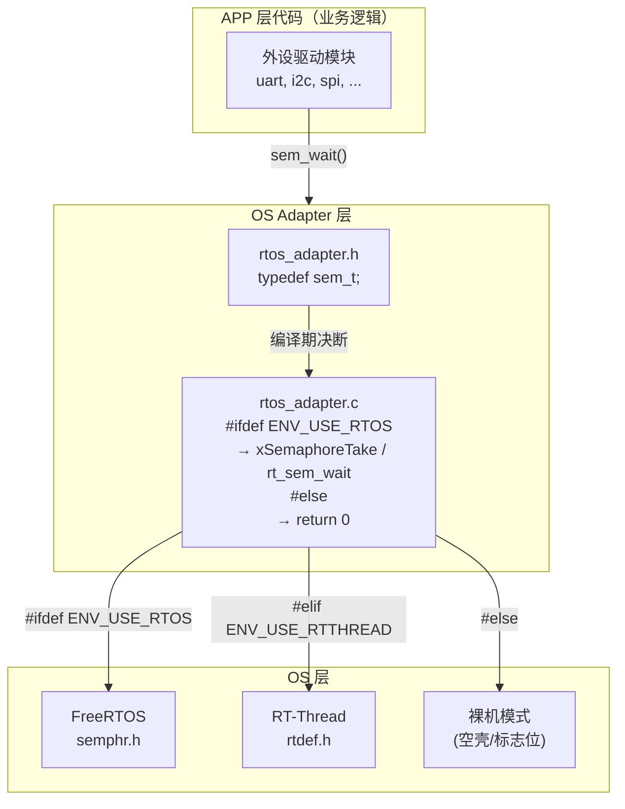
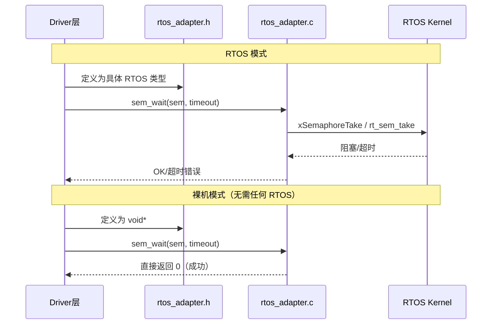
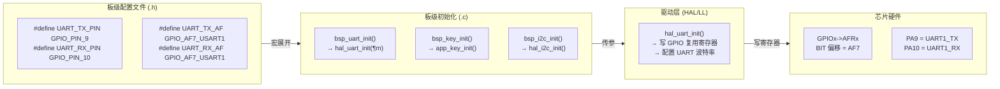
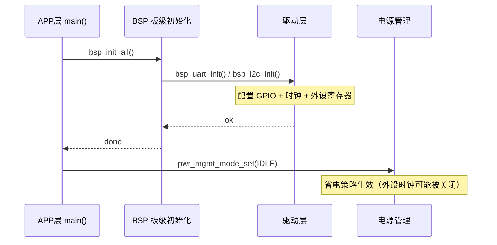

# 📖 引言

> 项目集成是将独立开发的软硬件模块（外设驱动、RTOS、应用逻辑）按分层架构（OS/BSP/APP）组合为完整系统的工程过程，核心挑战不是"能不能连上"，而是"换一颗芯片或换一个 RTOS 时，改几行代码"。

---

# 📝 嵌入式项目集成设计：OS/BSP/APP 三层架构 + Adapter 体系

> 每一层都设计了 Adapter 接口来进行适配和更换——通过编译期多态、引脚映射分离、回调注入等机制，让 OS、BSP、APP 三层之间的接口标准化，使换芯片/换 OS 时 APP 层代码一行不动。

## 实际意义

> 没有分层 + Adapter 设计，各层会高度耦合。移植到其他平台、使用其他外设或切换 RTOS 时，上下层都需要修改——"牵一发而动全身"。Adapter 层把"什么会变"和"什么不变"分开，让变更波及面从"全工程"降为"一个文件"。

具体代价对比：

| 场景 | 无 Adapter 层 | 有 Adapter 层 |
|------|--------------|--------------|
| 换芯片（同系列不同型号） | 改 GPIO/UART/I2C 全部驱动代码 + 应用代码 | 只改 BSP 板级配置文件 + 芯片宏定义 |
| 切换 OS（FreeRTOS → RT-Thread/裸机） | 全局替换 RTOS API 调用 | `rtos_adapter.h` 编译期切换，DRV 层代码不变 |
| 移植第三方中间件 | 强制改写中间件的 HAL 调用 | 通过 Adapter 实例化驱动 + 抽象通信接口 |

## 应用场景

### 场景 1：芯片更换（同系列升级）
项目需要从一颗芯片迁移到同系列的另一颗芯片（如更大 Flash/更多引脚），BSP 层的板级配置文件重写引脚映射，APP 层的业务逻辑完全不变——因为协议栈接口是芯片无关的。

### 场景 2：项目业务逻辑复用
从一个模板项目迁移到另一个业务项目时，`main.c` 的启动序列（`bsp_init` → `app_stack_init` → 主循环）保持不变，只改业务模块中的事件处理逻辑。

### 场景 3：代码复用降低开发时间
BSP 层板级配置文件作为"移植接口"集中管理芯片差异，新项目只需复制模板目录、修改这个文件即可快速在新板上跑通基础外设。

### 场景 4：中间件隔离集成
将第三方外部设备驱动（依赖某一平台 HAL）迁入项目时，利用 DRV 层的 Adapter 将通信接口抽象化，中间件无需关注底层是 HAL 还是 LL 实现，只调抽象接口，解耦而不影响现有驱动。

## 核心逻辑/原理

> 分层+Adapter 是"三分离"设计：OS 依赖抽离（RTOS Adapter）、硬件引脚抽离（Board Config）、配置与实现抽离（Project Config）。

### 1. OS 层 Adapter：编译期静态多态



**核心机制**：头文件通过 `#ifdef` 切换类型定义，源文件通过 `#ifdef` 切换实现代码。驱动层始终调用统一的抽象接口（如 `sem_wait()`、`mutex_lock()`），不直接调用任何具体 RTOS 的 API。

```c
// rtos_adapter.h — 类型定义
#ifdef ENV_USE_FREERTOS
    typedef SemaphoreHandle_t   sem_t;      // FreeRTOS: 真实的信号量句柄
#elif ENV_USE_RTTHREAD
    typedef rt_sem_t            sem_t;      // RT-Thread: 信号量句柄
#else
    typedef void *              sem_t;      // 裸机: 不透明空壳指针（编译通过，运行时为空操作）
#endif

// rtos_adapter.c — 实现多态切换
uint16_t driver_sem_wait(sem_t sem, uint32_t timeout) {
#ifdef ENV_USE_FREERTOS
    return xSemaphoreTake((SemaphoreHandle_t)sem, timeout);   // FreeRTOS 真阻塞
#elif ENV_USE_RTTHREAD
    return rt_sem_take((rt_sem_t)sem, timeout);              // RT-Thread 阻塞
#else
    return 0;                                                  // 裸机直接返回成功
#endif
}
```

> **选择 `void *` 而非 `int` 作为裸机类型**的原因：`void *` 是不透明句柄（opaque handle），禁止解引用和算术运算，从语法层面杜绝了裸机模式下写出 `if(sem > 3)` 等无效检查代码。



### 2. BSP 层 Adapter：板级文件 + 引脚映射



**核心设计原则**：引脚号（物理坐标）与复用功能号（外设模式）**分开定义**。

```c
// board_config.h — 分离设计
#define UART_TX_PIN       GPIO_PIN_9       // ① "哪个脚" — 物理坐标
#define UART_TX_AF        GPIO_AF7_USART1  // ② "干什么用" — 复用功能
```

**为什么分开**：每个 GPIO 引脚有多种可选功能。物理引脚属于**硬件 PCB 布局决策**，功能复用属于**芯片数据手册决策**。两个正交问题分开定义，改板换引脚时只需改 PIN 号，不会误改 AF 号；换芯片重新映射功能时只需改 AF 号，不会动引脚布局。

**启动时序约束**：



如果电源管理模式在外设初始化**之前**生效，外设寄存器虽然写入了正确的值，但没有有效时钟驱动信号——UART/I2C 看起来初始化"成功"但无法通信，是最难排查的静默故障之一。

### 3. APP 层与底层边界：启动流程中的控制反转

```mermaid
sequenceDiagram
    participant STARTUP as startup_&lt;chip&gt;.s
    participant PLAT as platform_init()
    participant BSP as BSP 初始化
    participant APP as main()
    participant STACK as 协议栈/中间件
    participant RTOS as FreeRTOS

    STARTUP->>STARTUP: 堆栈/数据段/BSS 初始化
    STARTUP->>PLAT: 跳转 → system_platform_init()
    PLAT->>PLAT: 中断向量表重定位
    PLAT->>PLAT: 底层硬件预配置（时钟/电源/总线）
    PLAT->>APP: main()
    APP->>BSP: bsp_init() ← 板级外设初始化
    APP->>STACK: stack_init(evt_handler, heap)
    Note over STACK: 回调注入：APP 控制 "事件发生后的行为"

    opt 使用 RTOS
        APP->>RTOS: vTaskStartScheduler()
        Note over APP,RTOS: 进入 RTOS 调度，不再返回
    end
    
    alt 裸机模式
        APP->>APP: while(1) { 轮询事件 / 调度协程 }
    end
```

**初始化拆分为两阶段的原因**：

| 阶段 | 调用方 | 特征 | 职责 |
|------|--------|------|------|
| platform_init | 启动文件 / 链接脚本 | 无参、硬编码、自动执行 | 底层环境准备：时钟配置、中断向量、内存初始化 |
| main() 中的初始化 | APP 代码 | 带参（回调函数、配置表） | 业务准备：外设选择、事件处理绑定、堆池分配 |

**控制反转**：底层平台代码（platform_init）只负责通用的硬件准备，不决定"业务逻辑怎么做"。具体的行为选择（如收到连接后做什么）通过**回调注入**交由 APP 层决定。

### 4. 配置中心模式

```
依赖方向：所有层 → 配置中心（单向）
  ┌──────────────────────────────────────────────┐
  │ driver_config.h   ←─ #include "custom_config.h"  │
  │ bsp_init.c        ←─ #include "custom_config.h"  │
  │ main.c            ←─ #include "custom_config.h"  │
  │ rtos_config.h     ←─ #include "custom_config.h"  │
  └──────────────────────────────────────────────┘
            ↑
    custom_config.h（项目目录下）
            ↑
    （不 #include 任何 SDK 文件，纯宏定义）
```

```c
// custom_config.h —— 项目持有配置（不依赖任何 SDK 模块）
#define SOC_CHIP_TYPE            SOC_XXX          // 芯片型号
#define SYSTEM_CLOCK             0                // 系统时钟选择
#define CFG_MAX_CONNECTIONS      5                // 最大连接数
#define SYSTEM_STACK_SIZE        0x3000           // 系统堆栈大小

// driver_config.h —— SDK 各层读取配置 + 兜底默认值
#include "custom_config.h"                         // 先读项目配置
#ifndef DRV_LOG_LEVEL
#define DRV_LOG_LEVEL   LOG_LEVEL_NONE             // 没设就静默兜底
#endif
```

**设计权衡**：

| 方面 | 好处 | 代价 |
|------|------|------|
| 移植性 | 新项目只改 `custom_config.h` 一个文件 | 各层被"污染"同一个头文件（宏命名冲突风险） |
| 编译期安全 | `#ifndef` 兜底确保编译不中断 | 忘记配置时静默用默认值，排查困难 |
| 工具支持 | Keil/IAR 提供图形化 Configuration Wizard，GCC 下纯文本 | 两个环境安全性不同（IDE 约束值域，GCC 不校验） |

## 关键公式/结论

### 集成设计中影响最大的参数

| 参数 | 默认值 | 来源 | 设错的后果 | 难排查等级 |
|------|--------|------|-----------|-----------|
| `SYSTEM_CLOCK` | 最高主频 | 芯片 Datasheet | 全局时序错乱（UART 乱码/断连） | 🟡 容易 |
| `CFG_MAX_CONNECTIONS` | 与 RAM 相关 | 协议栈规格 | 超限被拒绝（有错误码返回） | 🟡 容易 |
| `DRV_TIMEOUT` | 20000ms | 外设规格 | 超时提前触发（有回调错误码） | 🟡 容易 |
| `NVDS_SIZE / NVM_SIZE` | 与绑定数相关 | 存储规划 | 配对/配置信息静默覆盖（无错误码） | 🔴 最难 |

> **最难排查的 bug**：非易失存储（NVM/NVDS）空间设太小 → 绑定信息被覆盖 → 功能静默失败。协议栈不会报"存储满了"，只会报"加密失败"或"配置丢失"，排查时完全想不到是存储容量的锅。

### 集成顺序的选择

嵌入式与纯软件工程最大的区别：**硬件依赖导致"先集成跑通，后做单元测试"是务实选择**。

```
集成优先策略（嵌入式常见）：
① 系统集成跑通高用力路径（多外设并发、总线冲突、中断嵌套）
   ↓
② 回头补单元测试覆盖边界场景（超时处理、错误注入、临界条件）
   ↓
③ 交叉验证（修了单元测试的 bug，回系统重测）

TDD 规范策略（纯软件/有模拟器时）：
① 单元测试（隔离验证每个模块）
   ↓
② 集成测试（验证接口连线）
   ↓
③ 系统测试（全链路验证）
```

**注意**：复杂环境（系统集成）通过，**不代表**简单环境（单元测试）也一定通过。典型反例——某个驱动模块依赖一个全局 tick 变量，系统集成时恰巧被 RTOS 心跳任务初始化了，裸机单元测试时该变量未初始化导致触发错误的分支。反之亦然：简单环境通过也不代表复杂环境通过。

两种策略各有利弊，实际项目应**两轮都做**，交叉验证。

## 实际操作步骤

> 从零开始将一个嵌入式项目组装起来的集成顺序：

### 第一步：需求分析与硬件资源分配
- 根据功能需求确定所需外设（传感器、显示、通信接口）
- 检查 GPIO/UART/I2C/SPI 等外设资源是否有冲突
- 在板级配置文件中完成引脚映射分配

### 第二步：单个外设驱动开发与通信验证
- 每个外设独立开发适配（利用 DRV 层的 Adapter 实例化）
- 使用逻辑分析仪/示波器验证通信时序（I2C 地址、SPI 时钟极性、UART 波特率）
- 确认每个外设的读写操作在硬件上真实有效

### 第三步：各外设初步集成为子系统
- 将独立验证的外设驱动合并到一个工程
- 验证多外设并发工作时的稳定性和资源互斥
- 合理分配中断优先级和 RTOS 任务优先级

```c
// 集成入口（通用框架）
int main(void) {
    bsp_init();                 // ① 板级初始化（GPIO/UART/I2C/SPI...）
    stack_init(evt_handler);    // ② 协议栈初始化（带回调注入）
    
    // ③ 启动调度
    #ifdef ENV_USE_RTOS
        vTaskStartScheduler();  // RTOS: 任务调度器接管
    #else
        while(1) {
            idle_hook();        // 裸机: 轮询 + 休眠
        }
    #endif
}
```

### 第四步：系统联调与稳定性测试
- 验证并发场景下模块间是否存在资源冲突
- 压力测试：大数据量读写、多连接并发、长时间运行
- 总线冲突排查：I2C 总线锁死、SPI 片选竞争、UART 缓冲区溢出

### 第五步：单元测试（补充阶段）
- 对每个模块的功能边界进行隔离验证
- 测试"被复杂环境掩盖的 bug"（如全局依赖未显式初始化）
- 利用 Mock Adapter 模拟超时、错误注入等边界场景

### 第六步：性能优化与低功耗
- CPU 占用分析（Profile 热点函数）
- RTOS Tickless 模式 + 芯片低功耗模式协调调试
- DMA + 中断优化 CPU 负担

### 第七步：固件安全处理
- OTA 升级固件加密
- Bootloader 完整性校验
- 非易失存储保护机制

### 第八步：发布与反馈跟踪
- 发布后跟踪产品反馈
- 按"现象 → 根因 → 修复"三步记录每个 bug

### 一步可选：中间件二次集成
如果项目中需要集成第三方中间件（如某屏幕驱动依赖另一平台 HAL），在驱动层创建 Adapter 隔离中间件与底层通信：

```c
// 不良做法：直接修改第三方驱动中的 HAL 调用，影响其他模块
// 通用做法：在驱动层创建 Adapter，将通信接口抽象化
// 第三方驱动只调 xxx_write()，不关心底层是哪个厂商的 HAL 实现
```

## 常见问题

### 问题 1：移植中间件导致上下层都受影响

**现象**：将一个第三方外部设备驱动迁入项目时，修改了底层 SPI 代码适配中间件，结果项目中原有的 SPI Flash 驱动也出了问题。

**根因**：中间件代码与实际硬件平台紧耦合，修改下层通信实现时连锁影响了无关的上层业务。

**修复**：在驱动层写一个 Adapter，将通信接口抽象化——第三方驱动只调抽象接口，Adapter 内部完成具体平台的实现。第三方驱动和原有驱动互不了解对方的存在。

### 问题 2：电源管理设早于外设初始化

**现象**：某个外设初始化看起来成功（寄存器配了、GPIO 设置了），但通信全是乱码。用逻辑分析仪看接口波形，频率明显不对。

**根因**：低功耗管理模式在外设初始化之前生效，外设模块的时钟被关闭。配置虽写入了寄存器但无有效时钟驱动信号。

**修复**：确保初始化顺序为 `底层时钟配置 → 外设初始化 → 电源管理策略设置`。

### 问题 3：集成环境掩盖了裸机下的 bug

**现象**：一个 I2C 传感器在 FreeRTOS 系统集成测试中完全正常。但单独在裸机项目中使用时，首次读取返回错误数据。

**根因**：驱动中依赖了一个全局 tick 变量。系统集成时恰巧被 RTOS 的心跳任务初始化了，裸机下没有其他模块给这个变量赋初值。

**修复**：每个外设的初始化函数内**检查和初始化自己依赖的全部状态**，不信任"外部世界碰巧初始化了什么"。

---

# 💬 Q&A

> 自问自答，检验理解深度。按难度递进排列。

## 🟢 基础

> 最基本的概念和用法，入门必知。

### Q1: RTOS Adapter 中为什么用 `void *` 作为裸机模式的信号量类型，而不是 `int`？

**A1**：`void *` 是不透明句柄（opaque handle），语法上禁止解引用和算术运算。`int` 会在裸机模式下诱导开发者写 `if(sem > 3)` 等无效检查；`void *` 从语法层面杜绝了这种误用。同时 `void *` 可以隐式转换为任何类型的指针，方便在不同 RTOS 实现间做强制类型转换。

### Q2: 应用层初始化外设时，为什么电源管理策略必须在外设初始化完之后设置？

**A2**：大多数芯片的低功耗模式会关闭未使用外设的时钟。如果省电策略在外设寄存器配置之前生效，初始化过程中时钟被屏蔽——外设配置"写入看起来成功"，但无有效时钟驱动信号，导致接口通信全乱码且极难排查。

---

## 🟡 进阶

> 容易踩的坑和常见误区。

### Q3: 系统集成测试全部通过，但把某个模块单独拎出来做单元测试时发现了 bug。这是因为"集成环境更难"所以暴露更多问题，还是别的什么原因？

**A3**：不是因为集成环境更难，而是**集成环境会掩盖某些 bug**。常见原因包括：
- 全局变量被其他模块的初始化过程碰巧赋值了
- 中断优先级编排掩盖了竞态条件
- RTOS 调度延迟隐藏了时序敏感的错误

所以"复杂环境通过了 → 简单环境肯定也能过"是错误推论，两种环境的测试范围有交集但不是子集关系。

### Q4: 配置中心文件不 `#include` 任何 SDK 文件，反而各层都来 `#include` 它。这种依赖方向叫什么？好处是什么？

**A4**：**编译期集中配置模式**。配置中心属于项目，单向地被所有层读取。各层提供 `#ifndef` 兜底默认值，项目侧通过先 `#include` 来覆盖。好处是：换平台/换项目时只需要改这一个文件，不需要翻各层去找配置项。

---

## 🔴 困难

> 结合实战的深层原理和设计权衡。

### Q5: "先系统集成跑通，后做单元测试"是嵌入式开发的常见顺序，但与 TDD 的"先单元测试后集成"相反。这种务实选择背后的工程约束是什么？

**A5**：根本原因是**硬件依赖性**。
1. **硬件到手晚于开发**——嵌入式软件开发往往在硬件确定之前就开始了，拿到样件后首要目标是"跑通验证硬件能否工作"。
2. **硬件不确定性**——原理图可能有 bug（上拉漏焊、晶振不匹配），只有系统集成才能暴露。
3. **项目周期压力**——管理层需要先验证"项目可行"，而不是先看覆盖报告。

但代价明确：集成环境会掩盖"碰巧被初始化"的全局依赖 bug。折中方案：**先跑通系统验证硬件可行，再回头补单元测试覆盖边界场景**，两轮结果交叉验证。

### Q6: BSP 层中把"引脚号"和"复用功能号"分开定义，这种分离设计的本质是什么？如果不分开设计，会出什么问题？

**A6**：本质是**正交性分离**——两个独立变化的维度不应该耦合在同一个宏里。
- "引脚号"由 PCB 布局工程师决定（用哪个物理脚走线最优）
- "复用功能号"由芯片数据手册决定（该外设需要绑定哪个 AF 值）

如果合起来写（如 `#define UART1_TX  {GPIO_PIN_9, AF7}`），改 PCB 换引脚时程序员必须同时确认新的 AF 号是否正确——只改了引脚号、漏改了 AF 号会导致配置错误。分开定义让两个决策各自独立修改、互不影响。

---

# 📋 总结

> 3-5 句话回顾核心要点，用自己的话复述。

**是什么** — 嵌入式项目集成是将外设驱动（BSP）、操作系统（OS）、应用逻辑（APP）三层通过 Adapter 接口组合为完整系统的工程过程。

**为什么** — 解决了三对核心矛盾：RTOS vs 裸机的调度差异、芯片间硬件差异、外设间依赖耦合——Adapter 层把"什么会变"和"什么不变"分开，让变更的影响范围从"全工程改"缩小到"改一个文件"。

**怎么做** — 三组机制联动：
1. **OS Adapter**：编译期静态多态，RTOS 下真阻塞、裸机下变空壳，驱动代码不感知底层 OS 存在
2. **BSP 板级配置**：引脚号与复用功能号分离定义，换板只改一个配置文件
3. **控制反转的启动序列**：底层平台控制初始化顺序，APP 层通过回调注入控制行为内容

**关键取舍** — Adapter 层带来了 5-10% 的间接调用开销，换来了 90%+ 应用代码跨芯片复用率。`#ifndef` 静默兜底牺牲了"忘设配置时预警"，换来了"任意编译器都能无改编译"。先系统集成后单元测试是应对硬件依赖的务实选择，但需要两轮交叉验证来弥补相互掩盖的问题。

---

# 📎 参考资料

> 学习过程中用到的外部资源汇总。

## 🎥 视频链接
> 暂无

## 🔗 博客/文档链接

- [01_项目集成介绍：概念和注意事项](https://twd6onxsxva.feishu.cn/docx/TnHTdK917o7jknxuEskcV2JlnVg) — 什么是项目集成、为什么集成、集成时的 10 类关注点
- [02_项目集成_集成顺序](https://twd6onxsxva.feishu.cn/docx/Kcvydeb9MoVJxhxQkRFcbPWSn52) — 9 步集成顺序：从硬件集成到发布维护
- [[项目代码的单元测试、集成测试以及系统测试]] — 与项目集成配套的测试策略笔记

## 💻 仓库链接
> 暂无通用链接

## 📄 代码/附件
> 具体代码文件路径请参考对应工程项目。本文的通用原则适用于大多数 MCU SDK 的分层架构。
