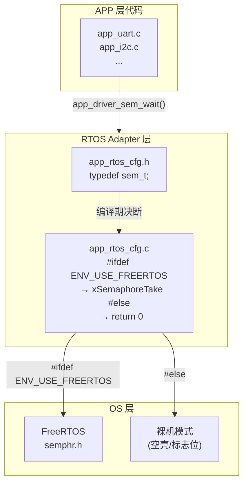
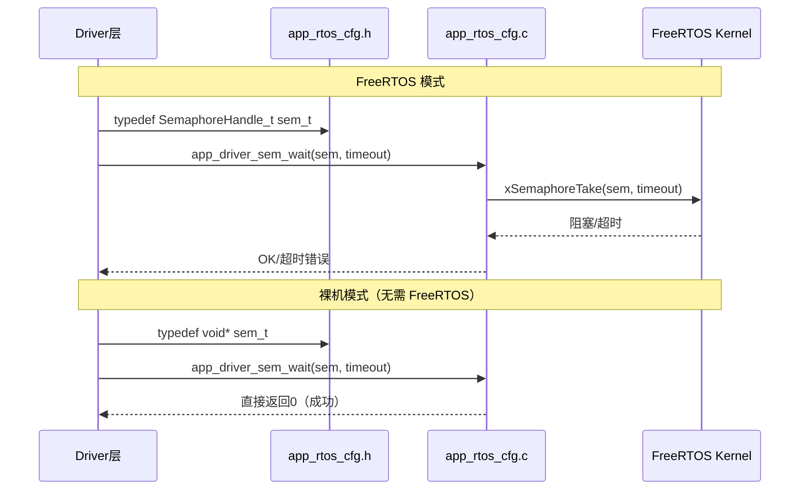
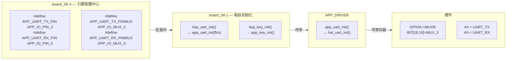
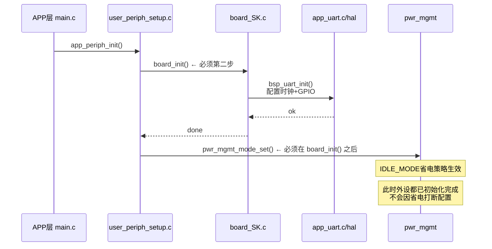
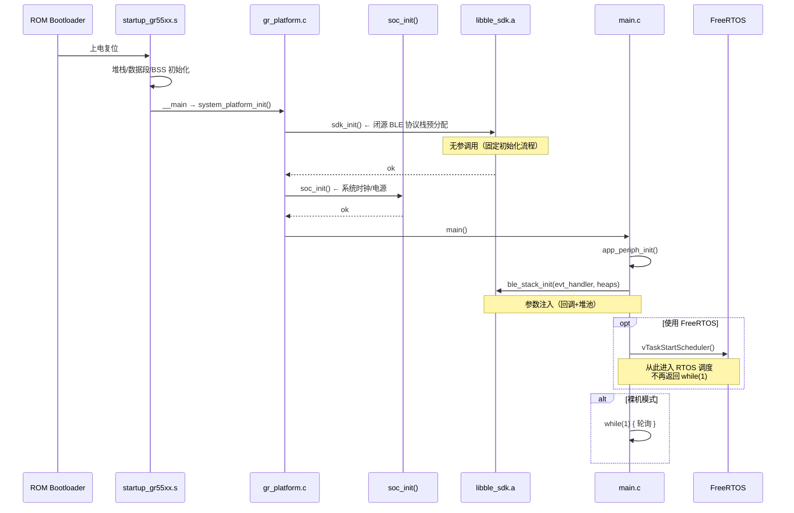

# 📖 引言

> 项目集成是将独立开发的软硬件模块（芯片、外设驱动、RTOS、应用逻辑）按分层架构（OS/BSP/APP）组合为完整系统的过程，其核心挑战不是"能不能连上"，而是"换一颗芯片或换一个 RTOS 时，改几行代码"。

---

# 📝 项目集成设计：OS/BSP/APP 三层 + Adapter 体系

> 每一层都设计了 Adapter 层来进行适配和更换——通过编译期多态、引脚映射分离、回调注入等机制，让 OS、BSP、APP 三层之间的接口标准化，使换芯片/换 OS 时 APP 层代码一行不动。

## 实际意义

> 没有分层 + Adapter 设计，各层会高度耦合。移植到其他平台、使用其他外设或切换 RTOS 时，上下层都需要修改——"牵一发而动全身"。Adapter 层把"什么会变"和"什么不变"分开，让变更波及面从"全工程"降为"一个文件"。

具体代价对比：

| 场景 | 无 Adapter 层 | 有 Adapter 层 |
|------|--------------|--------------|
| 换芯片 (GR5526 → GR5515) | 改 GPIO/UART/I2C 全部驱动代码 + 应用代码 | 只改 `board_SK.h` + `custom_config.h` 芯片宏 |
| 切换 OS (FreeRTOS → 裸机) | 全局 `xSemaphoreTake` 不可编译 | `app_rtos_cfg.h` 编译期切换，DRV 层代码不变 |
| 移植第三方中间件 | 强制改写中间件的 HAL 调用 | 通过 Adapter 实例化驱动 + 抽象通信接口 |

## 应用场景

### 场景 1：芯片更换
GR5526 → GR5515 或 GR5332 时，`custom_config.h:51` 的 `#define SOC_GR5526` 改为目标芯片宏，`board_SK.h` 重写引脚映射，APP 层的 BLE 事件处理（`ble_evt_handler`）完全不变——因为 BLE 协议栈接口（`ble.h`）是芯片无关的。

### 场景 2：项目业务逻辑移植
从 BLE 模板项目 `ble_app_template` 移植到 `ble_app_hrs`（心率服务）时，`main.c` 的启动序列（`app_periph_init` → `ble_stack_init` → 主循环）保持不变，只改 `user_app.c` 中的 GATT Service 注册和事件处理逻辑。

### 场景 3：代码复用降低开发时间成本
项目的 `custom_config.h` + `board_SK.h` 作为"移植接口"集中管理芯片差异，新项目只需复制模板目录、修改这两个文件即可快速验证硬件平台。

### 场景 4：中间件隔离集成
将第三方屏幕驱动（依赖 STM32 HAL）迁入项目时，利用 DRV 层的 Adapter 将 SPI 通信抽象（`app_spi_*`），屏幕驱动无需关注底层 I2C/SPI 是 HAL 还是 LL 实现，只调抽象接口，解耦而不影响现有驱动。

## 核心逻辑/原理

> 分层+Adapter 是"三分离"设计：OS 依赖抽离（`app_rtos_cfg.h`）、硬件引脚抽离（`board_SK.h`）、配置与实现抽离（`custom_config.h`）。

### 1. OS 层 Adapter：编译期静态多态



**机制**：头文件通过 `#ifdef` 切换类型定义，源文件通过 `#ifdef` 切换实现代码。

```c
// app_rtos_cfg.h — 类型定义
#ifdef ENV_USE_FREERTOS
    typedef SemaphoreHandle_t   sem_t;    // FreeRTOS: 真实的信号量句柄
#else
    typedef void *              sem_t;    // 裸机: 不透明空壳指针
#endif

// app_rtos_cfg.c — 实现
uint16_t app_driver_sem_wait(sem_t sem, uint32_t timeout) {
#ifdef ENV_USE_FREERTOS
    return xSemaphoreTake((SemaphoreHandle_t)sem, timeout);   // 真阻塞
#else
    return 0;                                                  // 直接成功的空壳
#endif
}
```

**设计关键**：Driver 层调 `app_driver_sem_wait()` 时，完全不关心底层是 FreeRTOS 还是裸机。这是**编译器预处理 + 函数接口隔层**共同实现的编译期静态多态，不是运行时多态。



### 2. BSP 层 Adapter：引脚映射与功能分离



**核心设计**：引脚号（物理坐标）与复用功能号（功能模式）**分开定义**。

```c
// board_SK.h — 分离设计
#define APP_UART_TX_PIN       APP_IO_PIN_4     // ① "哪个脚" — 物理坐标
#define APP_UART_TX_PINMUX    APP_IO_MUX_3     // ② "干什么用" — UART 模式
```

这种分离的原因：GR5526 每个 GPIO 引脚有 6~8 种可选功能（MUX_0 ~ MUX_7）。物理引脚属于**硬件布局决策**，功能复选属于**芯片数据手册决策**——两个正交问题分开改，减少漏改风险。

**启动时序约束**：


如果 `pwr_mgmt_mode_set` 在 `board_init()` 之前调，外设初始化过程中时钟可能被省电模式屏蔽，导致外设配置写入成功但无时钟驱动信号——UART/I2C 看起来初始化"成功"但无法通信，是最难排查的静默故障。

### 3. 平台层与 APP 层边界：启动流程中的控制反转



**两步初始化设计意图**：

| 步骤 | 调用方 | 参数 | 做什么 | 为什么放这里 |
|------|--------|------|--------|------------|
| `sdk_init()` | platform 层 `gr_platform.c` | 无参 | BLE 射频/时钟/PHY 预分配 | 纯硬件固定流程，不需要 APP 参与 |
| `ble_stack_init()` | APP 层 `main.c` | 回调函数+堆表 | 注册 GAP/GATT 事件处理+内存池 | APP 通过回调注入"连接后做什么"，是依赖注入 |

`sdk_init()` 硬编码在 platform 层，因为它做什么对任何 BLE 应用都一样；`ble_stack_init()` 需要 APP 层传参，因为"收到连接后怎么做"只有 APP 层知道。这是**控制反转**——platform 层控制启动顺序，APP 层控制行为内容。

### 4. APP 层配置中心：custom_config.h 的编译期集中配置模式

```
依赖方向：所有层 → 配置中心（单向）
  ┌────────────────────────────────────────────┐
  │ app_drv_config.h  ←─ #include "custom_config.h"   │
  │ user_periph_setup.c ←─ #include "custom_config.h" │
  │ main.c            ←─ #include "custom_config.h"   │
  │ FreeRTOSConfig.h  ←─ #include "custom_config.h"   │
  └────────────────────────────────────────────┘
          ↑
  custom_config.h（项目目录下）
          ↑（不 #include 任何 SDK 文件）
```

```c
// custom_config.h —— 项目持有配置（不依赖任何人）
#define SOC_GR5526                                // 芯片型号
#define SYSTEM_CLOCK            0                 // 96MHz

// app_drv_config.h —— SDK 各层读取配置 + 兜底默认值
#include "custom_config.h"                        // 先读项目配置
#ifndef APP_DRV_LOG_LEVEL
#define APP_DRV_LOG_LEVEL  APP_DVR_LOG_LVL_NONE  // 没设就静默兜底
#endif
```

**设计权衡**：

| 方面 | 好处 | 代价 |
|------|------|------|
| 移植性 | 新项目只改 `custom_config.h` 一个文件 | 各层被"污染"同一个头文件（宏命名冲突风险） |
| 编译期安全 | `#ifndef` 兜底确保任何编译器都能编译 | 忘记配置时静默用默认值，排查困难 |
| 环境适应 | Keil MDK 有图形化 Configuration Wizard，GCC 下纯文本 | 两个环境安全性不同（Keil 约束值域，GCC 不校验） |

## 关键公式/结论

### 集成设计中影响最大的参数

| 参数 | 默认值 | 位置 | 设错的后果 | 难排查等级 |
|------|--------|------|-----------|-----------|
| `SYSTEM_CLOCK` | 0(=96MHz) | `custom_config.h:179-189`<br/>（GR5526 Datasheet §时钟树） | 全局时序错乱（UART 乱码/断连） | 🟡 容易 |
| `CFG_MAX_CONNECTIONS` | 5 | `custom_config.h` | 超连接数被拒绝（有错误码） | 🟡 容易 |
| `APP_DRV_MAX_TIMEOUT` | 20000ms | `app_drv.h` | 超时提前触发（有回调错误码） | 🟡 容易 |
| `NVDS_NUM_SECTOR` | 1 | `custom_config.h` | 配对信息静默覆盖（无错误码） | 🔴 最难 |

> **最难排查的 bug**：`NVDS_NUM_SECTOR` 设太小 → BLE 绑定信息被覆盖 → 加密连接静默失败。协议栈不会报"NVDS 满了"，只会报"加密失败"——检查链路时完全想不到是存储容量的锅。

### 集成顺序的核心原则

```
① 验证最坏情况（系统集成时并发/时序/总线冲突）
   ↓  复杂环境通过不代表覆盖了所有简单情况
② 回头做单元测试（隔离验证每个模块）
   ↓  简单环境通过不代表复杂环境通过
③ 回归验证（修了单元测试的 bug，回系统里再验证）
```

嵌入式开发的务实顺序与 TDD 规范的差异：**拿到真硬件时往往先跑通系统，再做单元测试**——因为硬件依赖导致"能不能跑"是首要矛盾。但代价是"复杂环境掩盖的问题（如全局变量被其他模块初始化）容易漏掉"。

## 实际操作步骤

> 从零开始做一个基于 GR5526 SDK 的新项目（带 FreeRTOS + BLE），推荐的集成顺序：

### 第一步：需求分析与硬件资源分配
- 根据用户需求确定所需外设（传感器、显示、按键、通信接口）
- 检查 GPIO/UART/I2C/SPI/QSPI 等外设资源冲突
- 在 `board_SK.h` 中完成引脚映射配置

### 第二步：单个外设驱动开发与通信验证
- 每个外设独立开发适配（利用 DRV 层的 Adapter 实例化）
- 使用逻辑分析仪或示波器验证通信时序（I2C 地址、SPI 时钟极性、UART 波特率）
- 确认每个外设的读写操作在硬件上真实有效

### 第三步：各外设初步集成为子系统
- 将独立验证的外设驱动合并到一个工程
- 验证多外设并发工作时的稳定性和资源互斥
- 检查中断优先级和 FreeRTOS 任务优先级的合理性
- 关键代码路径：
```c
// main.c 集成入口
int main(void) {
    app_periph_init();          // ① 初始化所有外设
    ble_stack_init(evt_handler, &heaps_table);  // ② BLE 协议栈（带回调注入）
    // ③ 进入主循环或启动 RTOS
    while(1) {
        pwr_mgmt_schedule();    // 电源管理
    }
}
```

### 第四步：单元测试（在系统集成之后）
- 对每个模块的功能边界进行隔离验证
- 测试"简单环境下是否暴露被复杂环境掩盖的 bug"

### 第五步：功能验证与系统稳定性测试
- 验证是否实现所有用户需求功能
- 压力/负载测试：大数据量 I2C 读取、多 BLE 连接并发、长时间运行

### 第六步：性能优化与低功耗
- CPU 占用率分析（Profile 热点函数）
- FreeRTOS Tickless 模式 + PMU 省电策略调试
- DMA 优化 CPU 负担（UART DMA + IDLE 中断）

### 第七步：固件安全处理
- OTA 升级固件加密（AES/RSA）
- Bootloader 固件完整性校验（CRC32）
- NVDS 绑定信息加密存储保护

### 第八步：发布与反馈跟踪
- 发布后进行产品反馈跟踪
- 对反馈来的 bug 按"现象 → 根因 → 修复"三步记录

### 一步可选：中间件二次集成
如果项目中需要集成第三方中间件（如某屏幕驱动依赖 STM32 HAL），遵循"DRV 层 Adapter 隔离"原则：
```c
// 不良做法：直接改第三方屏幕驱动中的 HAL_SPI_Transmit 调用
// 优秀做法：在 DRV 层创建 Adapter 实例，将 SPI 通信抽象为 app_spi_*()
// 第三方驱动只调 app_spi_write()，不关心底层是 STM32 HAL 还是 GR5xx HAL
```

## 常见问题

### 问题 1：移植中间件导致上下层都受影响

**现象**：将一个第三方屏幕驱动（依赖 STM32 HAL 的 `HAL_SPI_Transmit`）迁入 GR5526 项目时，修改了底层 SPI 代码适配中间件，结果项目中原有的 SPI Flash 驱动也出了问题。

**根因**：中间件代码与平台 HAL 紧耦合，修改下层实现（SPI 通信）时连锁影响了无关的上层业务（SPI Flash 读写）。

**修复**：在 DRV 层写一个 Adapter，将 SPI 通信抽象化——第三方屏幕驱动只调抽象接口（如 `app_spi_write()`），Adapter 内部完成 GR5526 的具体实现。第三方驱动和原有 SPI Flash 驱动互不了解对方的存在。

### 问题 2：app_uart_init 与 pwr_mgmt_mode_set 的顺序错误

**现象**：UART 初始化看起来成功（寄存器配了、GPIO 设置了），但收发全是乱码。用逻辑分析仪看 TX 引脚，有电平跳变但频率不对。

**根因**：`pwr_mgmt_mode_set(PMR_MGMT_IDLE_MODE)` 在 `board_init()` 之前调用。IDLE_MODE 下 UART 模块的时钟被 PMU 关闭了，配置虽写入了寄存器但无有效时钟驱动信号。

**修复**：确保初始化顺序为 `SYS_SET_BD_ADDR → board_init → pwr_mgmt_mode_set`。

### 问题 3：集成环境掩盖了裸机下的 bug

**现象**：一个 I2C 温度传感器在 FreeRTOS 系统集成测试中完全正常。但单独在裸机项目中使用时，首次读取返回错误数据。

**根因**：I2C 驱动中依赖了一个全局 tick 变量，System 集成时恰巧被 FreeRTOS 的心跳任务初始化了，裸机下没有显式调用 `hal_increment_tick()` 导致 tick=0。

**修复**：每个外设的初始化序列应保证不依赖"外部世界碰巧初始化了某变量"——在 `app_i2c_init()` 内检查/初始化自己依赖的全部状态。

---

# 💬 Q&A

> 自问自答，检验理解深度。按难度递进排列。

## 🟢 基础

> 最基本的概念和用法，入门必知。

### Q1: GR5526 SDK 中 `app_rtos_cfg.h` 把 FreeRTOS 的信号量 `SemaphoreHandle_t` 重命名为 `sem_t`。如果项目切换到裸机模式，`sem_t` 变成什么类型？APP 层的代码改不改？

**A1**：`sem_t` 变成 `void *`（不透明空壳指针）。APP 层代码**不需要修改**——头文件通过 `#ifdef` 自动切换类型定义，驱动层调 `app_driver_sem_wait()` 的接口不变。

选择 `void *` 而非 `int` 的隐含语义：`void *` 是不透明句柄（opaque handle），禁止解引用和算术运算；`int` 会在裸机模式下诱导开发者写 `if(sem > 3)` 等无效检查。`void *` 从语法层面杜绝了这种误用。

### Q2: `app_periph_init()` 中为什么 `pwr_mgmt_mode_set()` 必须在 `board_init()` 之后调？调反了会怎样？

**A2**：IDLE_MODE 省电策略会关闭未使用的模块时钟。如果在 `board_init()`（配置 GPIO/UART/I2C 寄存器）之前调，外设初始化过程中时钟可能被省电模式屏蔽——外设配置写入寄存器"看起来成功"，但无有效时钟驱动信号，导致 UART/I2C 收发全部乱码且极其难排查。

---

## 🟡 进阶

> 容易踩的坑和常见误区。

### Q3: 系统集成测试 UART 正常（FreeRTOS 环境），但拆到裸机单元测试时 `app_driver_sem_wait` 直接返回 0——测试虽然通过了，信号量超时处理的代码逻辑却从未被验证。这种"集成环境里测不出，单元测试里也测不出"的 bug 怎么预防？

**A3**：靠 **Mock Adapter** 而非空壳。写一个测试专用的 `sem_wait` 实现——不直接 `return 0`，也不依赖 FreeRTOS 调度器，而是可控超时阻塞，在规定时间后真实返回错误。这样单元测试就能暴露"信号量超时后是否正确处理"的代码路径。配合逻辑分析仪验证通信时序防漏。

### Q4: `custom_config.h` 不 `#include` 任何文件，反而各层都来 `#include` 它——这种依赖方向叫什么？

**A4**：**编译期集中配置模式**。配置中心（`custom_config.h`）属于项目，单向地被所有层读取。各层提供 `#ifndef` 兜底默认值，项目侧通过先 `#include` 来覆盖。类比 Linux Kernel 的 `.config` → `autoconf.h` + Kconfig 体系。

---

## 🔴 困难

> 结合实战的深层原理和设计权衡。

### Q5: "复杂环境（系统集成）通过 → 简单环境（单元测试）肯定通过"，这个命题正确吗？举一个嵌入式中的具体反例。

**A5**：**不正确**。复杂环境和简单环境测试的是不同的东西，不存在"一个覆盖另一个"。

**反例**：一个 I2C 温度传感器在 FreeRTOS 系统联调时完全正常。但在裸机单元测试中首次读取返回错误数据。根因：I2C 驱动依赖一个全局 tick 计数器，FreeRTOS 系统集成时这个变量恰巧被心跳任务初始化了（=1），裸机下没有其他模块给这个变量赋初值（=0）。

**防范方法**：每个模块的初始化函数内**自检依赖的全部状态**，不信任"外部世界碰巧初始化了什么"。系统集成和单元测试**分两轮执行**，不能因为一轮通过就跳过另一轮。

### Q6: 嵌入式工程师往往"先系统集成跑通，后做单元测试"，而不是 TDD 规范要求的"先单元测试后集成"。这种务实选择背后的工程约束是什么？

**A6**：核心原因是**硬件依赖性**：
1. **硬件到手晚于开发**——软件开发在硬件出来前就开始了，拿到样件后首要目标是"跑通看能不能工作"
2. **硬件的不确定性**——原理图可能有硬件 Bug（上拉电阻没焊、晶振不匹配），系统集成才能暴露
3. **项目周期压力**——PM 催的是"能看到产品功能演示"，不是"覆盖率报告"

但代价明确：集成环境会掩盖"碰巧被其他模块初始化了"的 bug。折中方案：系统集成先跑通高用力路径，再回头补单元测试覆盖边界场景。

---

# 📋 总结

> 3-5 句话回顾核心要点，用自己的话复述。

**是什么** — 项目集成是将独立开发的软硬件模块通过三层架构（OS/BSP/APP）+ Adapter 层组合为完整系统的过程。

**为什么** — 解决了三对核心矛盾：裸机 vs RTOS 的调度差异、芯片间硬件差异、外设间依赖耦合——让"换芯片"的影响范围从"全工程改"缩小为"改一个头文件"。

**怎么做** — 三组 Adapter 机制联动工作：
1. **OS Adapter**（`app_rtos_cfg.h`）：编译期静态多态，FreeRTOS 下真阻塞、裸机下变空壳，Driver 层代码不感知
2. **BSP Adapter**（`board_SK.h`）：引脚号与复用功能号分离定义，换板只改一个文件
3. **启动序列**：platform 层（`sdk_init()` 无参硬编码）控制启动顺序，APP 层（`ble_stack_init()` 带回调注入）控制行为内容

**关键取舍** — Adapter 层多 5-10% 间接调用开销，换来了 90%+ 应用代码跨芯片复用。`#ifndef` 静默兜底设计"不友善"但"任意编译器都能跑"。先跑通系统再补单元测试是硬件开发务实选择，但需要交叉验证来弥补复杂环境可能掩盖的边界问题。

---

# 📎 参考资料

> 学习过程中用到的外部资源汇总。

## 🎥 视频链接
> 暂无

## 🔗 博客/文档链接

- [01_项目集成介绍_STM32F411_Nordic方案](https://twd6onxsxva.feishu.cn/docx/TnHTdK917o7jknxuEskcV2JlnVg) — 什么是项目集成、为什么要集成、集成时注意的 10 类问题
- [02_项目集成_集成顺序](https://twd6onxsxva.feishu.cn/docx/Kcvydeb9MoVJxhxQkRFcbPWSn52) — 9 步集成顺序：从硬件集成到发布维护
- [[项目代码的单元测试、集成测试以及系统测试]] — 与项目集成配套的测试策略笔记

## 💻 仓库链接

- [goodix/GR5526_SDK](https://www.goodix.com) — GR5526 蓝牙 SoC 软件开发套件 v1.0.3

## 📄 代码/附件

- `GR5526_SDK_v1.0.3/projects/ble/ble_peripheral/ble_app_template/Src/user/main.c` — 项目集成入口示例（启动序列）
- `GR5526_SDK_v1.0.3/projects/ble/ble_peripheral/ble_app_template/Src/user/user_app.c` — APP 层 BLE 逻辑 + 回调注入
- `GR5526_SDK_v1.0.3/projects/ble/ble_peripheral/ble_app_template/Src/platform/user_periph_setup.c` — 外设集成初始化
- `GR5526_SDK_v1.0.3/drivers/inc/app_rtos_cfg.h` — OS Adapter 层核心（编译期静态多态）
- `GR5526_SDK_v1.0.3/platform/boards/board_SK.h` — BSP 板级配置（引脚映射分离）
- `GR5526_SDK_v1.0.3/platform/boards/board_SK.c` — BSP 板级初始化实现
