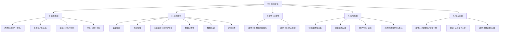

日期：2026-05-18

文章标签：#嵌入式 #通信协议 #I2C #IIC

## 1. 学习内容

### 知识点总览

| 序号 | 知识点 |
| --- | --- |
| 1 | I2C 基本概念与通信特点 |
| 2 | I2C 总线时序（6 个关键信号） |
| 3 | 硬件 IIC 与软件 IIC 的区别与选择 |
| 4 | I2C 的典型应用场景 |
| 5 | I2C 常见问题与解决方法（硬件 + 协议 + 软件） |

### 知识点关联思维导图



---

## 2. 逐点精讲

### 知识点 1：I2C 基本概念与通信特点

#### 实际意义

I2C 用**仅两根线**实现了一个微控制器与多个外设之间的数据交换，极大节省了 PCB 走线和芯片引脚资源。在嵌入式系统中，它是最常用的 " 板级管理总线 "。

#### 应用场景

任何需要连接多个低速外设（传感器、存储器、IO 扩展芯片等）且引脚资源有限的场景。

#### 常见误区

- 以为 I2C 可以像 SPI 一样高速传输大量数据 —— 实际上它定位是**中低速**通信
- 以为两根线可以直接远距离通信 —— I2C 是为**同一块 PCB 板内**设计的

#### 辅助图示

1. I 2 C 的结构框图 ![[file-20260518203855641.png]]

![[assets/I2C/Pasted image 20250927134101.png]]

#### 通俗人话解释

I2C 就像**一个对讲机系统**：所有设备共用两根线（一根是 " 说话时钟 "SCL，一根是 " 说话内容 "SDA）。主机喊一个地址（就像叫某个人的名字），被叫到的从机回应。因为只有两根线，所以不会占用太多引脚。

#### 核心逻辑/原理

- **两线制总线**：SDA（数据线）+ SCL（时钟线），均为开漏输出，需外接上拉电阻
- **主从架构**：主机产生时钟、发起通信；从机响应
- **多主机支持**：总线仲裁机制（线与会仲裁）允许多个主机共存
- **地址寻址**：7 位或 10 位地址，每个器件有唯一地址
- **时钟拉伸 (Clock Stretching)**：从机可拉低 SCL 迫使主机等待，用于慢速从机处理数据
- **STM32F4 I2C 特性**：
  - 兼容 SMBus 2.0（带超时检测、ARP、SMBALERT#）
  - 支持 CRC-8 / PEC（分组错误校验）
  - 可编程噪声滤波器（ANOFF 位控制，DNF[3:0] 设置滤波长度）
  - 支持 DMA 传输（TX/RX 独立 DMA 通道，减少 CPU 开销）
  - 双地址寻址（OAR1 + OAR2，可响应两个不同 7 位地址）
  - 支持通用呼叫地址（General Call，0x00 地址响应）
  - 4 种模式：标准模式 (100kHz) / 快速模式 (400kHz) / SMBus / 兼容 SMBus

#### 关键公式/结论

| 特性 | 参数 |
| --- | --- |
| 标准模式速率 | 100 Kbit/s |
| 快速模式速率 | 400 Kbit/s |
| 地址空间 | 7 位（112 个可用地址）或 10 位（1024 个） |
| 总线空闲 | SDA 和 SCL 同时为高电平 |
| SCL 频率计算 | `f_SCL = f_PCLK1 / (CCR × (DUTY+1) × 2)` |
| TRISE 最大值 | `TRISE = t_r(max) / t_PCLK1 + 1`（标准模式 1000ns，快速模式 300ns） |
| 从机响应超时 (SMBus) | 35ms（TIMEOUT 位检测） |
| 时钟拉伸超限 (SMBus) | 25ms |

---

### 知识点 2：I2C 总线时序（6 个关键信号）

#### 实际意义

理解 I2C 时序是用示波器/逻辑分析仪调试通信问题的基本功。所有 I2C 通信错误最终都能在波形上找到答案。

#### 应用场景

- 调试通信失败时，用逻辑分析仪抓波形比对时序
- 用 GPIO 软件模拟 I2C 时，必须严格按照时序图编写代码
- 排查偶发性通信错误时，检查时序参数是否达标

#### 常见误区

- 以为起始/停止信号是 " 电平 " 而不是 " 边沿跳变 " —— 实际上是 SCL 高电平期间 SDA 的**跳变**
- 在 SCL 为高电平时去改变 SDA 数据 —— 这会被误读为起始/停止条件

#### 辅助图示

![[assets/I2C/Pasted image 20250927170744.png]]

![[assets/I2C/Pasted image 20250927205259.png]]

#### 通俗人话解释

I2C 通信就像**老师讲课**：

- **起始信号** = 老师说 " 上课了，安静 "（主机通知总线：我要开始了）
- **数据有效性** = 老师写字时黑板不能晃（SCL 高电平时 SDA 不能变）
- **应答信号** = 老师问 " 听懂了吗 "，学生点头（从机拉低 SDA 表示收到）
- **停止信号** = 老师说 " 下课 "（主机释放总线）

#### 核心逻辑/原理

| 时序要素 | 规则 | 发起方 |
| --- | --- | --- |
| ① 起始信号 | SCL 高电平时，SDA 由高→低跳变 | 主机 |
| ② 停止信号 | SCL 高电平时，SDA 由低→高跳变 | 主机 |
| ③ 应答信号 (ACK/NACK) | 第 9 个时钟脉冲，接收方拉低 SDA = ACK；保持高 = NACK | 接收方 |
| ④ 数据有效性 | SCL 高电平期间 SDA 必须稳定；SCL 低电平时才允许变化 | — |
| ⑤ 数据传输 | 每个 SCL 脉冲对应 1 bit，MSB 先发，边沿触发 | — |
| ⑥ 空闲状态 | SDA 和 SCL 同时为高电平 | — |
| ⑦ 时钟拉伸 | 从机拉低 SCL 保持低电平，强制主机进入等待状态 | 从机 |
| ⑧ 总线仲裁 | 多主机同时发送时，检测 SDA 电平与自身输出是否一致，不一致则退出的主机 | 主机 |

#### 关键时序参数

| 参数 | 含义 | 方向 |
| --- | --- | --- |
| tSU;STA | 起始条件建立时间：SCL 高电平期间 SDA 下降前的最小时间 | SDA |
| tHD;STA | 起始条件保持时间：起始后第一个 SCL 下降沿前的时间 | SDA |
| tSU;STO | 停止条件建立时间：SCL 高电平期间 SDA 上升前的最小时间 | SDA |
| tSU;DAT | 数据建立时间：SCL 上升沿前数据必须稳定的最小时间 | SDA |
| tHD;DAT | 数据保持时间：SCL 下降沿后数据需保持的最小时间 | SDA |
| tLOW / tHIGH | SCL 低电平 / 高电平最小持续时间 | SCL |
| tBUF | 总线空闲时间：停止→新起始的最小间隔 | 总线 |
| tR / tF | 上升/下降时间：SDA/SCL 跳变的最大允许时间 | 总线 |

#### 关键公式/结论

**SCL 频率计算（STM32 I2C 外设）**

```
f_SCL = f_PCLK1 / (CCR × (DUTY+1) × 2)
```

- `f_PCLK1`：I2C 外设时钟（通常 42MHz，由 RCC 配置）
- `CCR`：I2C_CCR 寄存器中的 12 位分频值
- `DUTY`：快速模式下占空比选择位（0 → Tlow/Thigh = 1:1；1 → Tlow/Thigh = 2:1）

**标准模式**（DUTY 位无影响）：

- `Thigh = CCR × t_PCLK1`
- `Tlow = CCR × t_PCLK1`

**快速模式 DUTY=0**：

- `Thigh = CCR × t_PCLK1`
- `Tlow = 2 × CCR × t_PCLK1`

**快速模式 DUTY=1**（16/9 占空比）：

- `Thigh = 9 × CCR × t_PCLK1`
- `Tlow = 16 × CCR × t_PCLK1`

**TRISE 配置**

```
TRISE = t_r(max) / t_PCLK1 + 1
```

- 标准模式：`t_r(max) = 1000ns` → TRISE = 1000ns / t_PCLK1 + 1
- 快速模式：`t_r(max) = 300ns` → TRISE = 300ns / t_PCLK1 + 1
- 若 f_PCLK1 = 42MHz（t_PCLK1 ≈ 23.8ns）：标准模式 TRISE ≈ 43，快速模式 TRISE ≈ 14

**SCL 低电平超时检测（SMBus 模式）**

- 当 SCL 被拉低超过 35ms 时，TIMEOUT 标志置位，产生中断
- 可用于检测总线死锁

---

### 知识点 3：硬件 IIC 与软件 IIC 的区别与选择

#### 实际意义

选错方案要么浪费硬件资源（明明有硬件 IIC 却用软件模拟），要么被引脚限制卡住（硬件 IIC 引脚被占用），要么性能不达标（软件 IIC 速率不够）。

#### 应用场景

| 场景 | 推荐方案 |
| --- | --- |
| 高速数据采集、实时图像传输 | 硬件 IIC |
| 引脚资源紧张、需要灵活分配引脚 | 软件 IIC |
| 需要多路 I2C 但硬件仅 1 路 | 软件 IIC 补充 |
| 快速原型验证 | 软件 IIC（更快上手） |
| 量产产品、可靠性优先 | 硬件 IIC |

#### 常见误区

- 认为硬件 IIC 一定比软件 IIC 好 —— 硬件 IIC 引脚固定、配置复杂，不总是最优解
- 以为软件 IIC 随便写延时就能用 —— 必须严格遵守时序，否则偶发性错误很难排查

#### 通俗人话解释

- **硬件 IIC**：芯片内置了一个 " 自动发报机 "，你只要告诉它发什么，它自动帮你搞定时序。快、稳，但只能用指定引脚。
- **软件 IIC**：你自己用手（GPIO）模拟发报动作，手动控制每根线的电平。灵活，可以用任意引脚，但手速慢，还容易出错。

#### 核心逻辑/原理

| 对比维度 | 硬件 IIC | 软件 IIC |
| --- | --- | --- |
| 实现方式 | 芯片内置 I2C 外设模块 | GPIO 引脚 + 软件模拟时序 |
| 通信速率 | 可达几十 MHz | 几十 kHz ~ 几百 kHz |
| 引脚限制 | 固定引脚，不可更改 | 任意 GPIO |
| 稳定性 | 高（硬件电路保证） | 受 CPU 负载影响，可能被中断打断 |
| 开发难度 | 需理解寄存器配置 | 相对简单，但需精确控制时序 |
| CPU 占用 | 低（DMA 可进一步释放） | 高（软件逐 bit 翻转引脚） |

#### STM32F4 硬件 IIC 补充

**引脚映射（复用功能 AF4）**

| I2C 外设 | SCL | SDA |
| --- | --- | --- |
| I2C1 | PB6 / PB8 | PB7 / PB9 |
| I2C2 | PB10 | PB11 |
| I2C3 | PA8 | PC9 |

**HAL 初始化关键字段**

```c
hi2c1.Instance = I2C1;
hi2c1.Init.ClockSpeed = 100000;        // 目标 SCL 频率 (Hz)
hi2c1.Init.DutyCycle = I2C_DUTYCYCLE_2; // 快速模式占空比
hi2c1.Init.OwnAddress1 = 0x00;          // 自身地址（从机模式）
hi2c1.Init.AddressingMode = I2C_ADDRESSINGMODE_7BIT;
hi2c1.Init.DualAddressMode = I2C_DUALADDRESS_DISABLE;
hi2c1.Init.OwnAddress2 = 0x00;
hi2c1.Init.GeneralCallMode = I2C_GENERALCALL_DISABLE;
hi2c1.Init.NoStretchMode = I2C_NOSTRETCH_DISABLE; // 允许时钟拉伸
HAL_I2C_Init(&hi2c1);
```

**三种传输方式对比**

| 方式 | 优点 | 缺点 | 适用场景 |
| --- | --- | --- | --- |
| **轮询 (Polling)** | 代码简单，无需中断配置 | 阻塞 CPU，效率最低 | 短数据、启动初始化、调试 |
| **中断 (Interrupt)** | 不阻塞 CPU，响应及时 | 频繁中断仍有一定开销 | 中等数据量、不定长传输 |
| **DMA** | CPU 完全解放，速率最高 | 占用 DMA 通道，配置稍复杂 | 大数据块、高频率传输（如音频、EEPROM 批量读写） |

#### 关键结论

- **资源有限、追求灵活性** → 软件 IIC
- **性能优先、产品级可靠性** → 硬件 IIC
- **两者可共存**：复用硬件 IIC 接关键设备，用软件 IIC 扩展额外总线

---

### 知识点 4：I2C 的典型应用场景

#### 实际意义

I2C 的核心定位是**短距离、中低速的 " 板级管理总线 "**，其价值在于以极低的硬件成本（仅需两根线）连接和控制多个从设备。

#### 应用场景

| 场景分类 | 具体示例 |
| --- | --- |
| 传感器数据采集 | 温度、湿度、气压、加速度、光照等低速传感器 |
| 功能模块配置与控制 | 配置音频编解码器音量、设置 PMIC 输出电压、控制模拟开关 |
| 小容量非易失存储 | 读写 EEPROM，存储设备参数和校准数据 |
| 系统状态监控 | 服务器/笔记本中监控电压、电流、风扇转速（遵循 SMBus 协议） |

#### 常见误区

- 以为 I2C 适用于所有板级通信 —— 高速/大吞吐量场景应选用 SPI，远距离应选 CAN/RS-485

#### 通俗人话解释

I2C 最适合那些 " 数据量不大、但需要经常打交道的慢速外设 "，就像公司内部的日常沟通，不需要很大的带宽但需要稳定可靠。

#### 核心逻辑/原理

数据量小、更新频率低、硬件成本敏感的板级互联 = I2C 的最佳场景。

#### SMBus 场景补充

SMBus 是基于 I2C 的系统管理总线，在以下场景比普通 I2C 更适用：

| 场景 | 说明 | 与普通 I2C 的关键区别 |
| --- | --- | --- |
| 服务器/PC 系统监控 | 监控电压、温度、风扇转速（SMBus 原生支持） | 超时检测防止总线死锁 |
| 智能电池管理 (BMS) | SMBus 的 SBS 标准定义了电池数据格式 | 数据包带 PEC 校验 |
| PMIC 配置管理 | 电源管理芯片的寄存器配置 | 最小时钟速率 10kHz 限制 |
| 传感器网络 | 需热插拔的场景（ARP 地址解析协议） | ARP 支持动态地址分配 |

**I2C 与 SMBus 主要差异**

| 差异项 | I2C | SMBus |
| --- | --- | --- |
| 时钟速率 | 100kHz / 400kHz / 1MHz+ | 10kHz ~ 100kHz |
| 超时机制 | 无强制超时 | SCL 低电平超过 35ms 触发超时 |
| 时钟拉伸 | 无限制 | 限制 ≤ 25ms |
| 地址解析 (ARP) | 不支持 | 支持动态地址分配 |
| PEC 校验 | 可选（STM32 支持） | 强制 |
| SMBALERT# | 不支持 | 支持，额外中断线通知主机 |
| 最小时钟速率 | 无下限（可 DC 电平） | 最小 10kHz |

---

### 知识点 5：I2C 常见问题与解决方法

#### 实际意义

I2C 调试中 90% 的问题可以归为三类：硬件（上拉电阻/干扰）、协议（地址/NACK）、软件（时序模拟）。有框架地排查，比盲目试错高效得多。

#### 问题一：上拉电阻问题

| 问题 | 现象 | 原因 | 解决 |
| --- | --- | --- | --- |
| 阻值过大 | 高速失败、低速正常；波形上升沿呈 " 圆弧形 " | 上拉太弱，高电平无法在规定时间内到达 | 计算公式：`Rp < t_r / (0.8473 × C_bus)`；常用值：4.7kΩ（3.3V/5V） |
| 阻值过小 | 功耗增大，甚至损坏 IO | 拉低时流过电流过大 | 不低于 1kΩ |
| 未接上拉 | 总线始终低电平 | 开漏输出无内部上拉 | 外接上拉电阻到 VCC |

#### 问题二：信号干扰与毛刺

| 问题 | 现象 | 原因 | 解决 |
| --- | --- | --- | --- |
| 电磁干扰 | 偶发性通信错误、数据误读 | I2C 走线靠近高频信号源 | 远离噪声源、缩短走线、串联 100Ω 电阻抑制振铃 |

#### 问题三：从设备无应答 (NACK)

| 问题 | 现象 | 原因 | 解决 |
| --- | --- | --- | --- |
| 地址错误 | 主机检测不到设备 | 7 位/8 位地址混淆、读写位错误 | 核对数据手册中的 7 位地址 |
| 设备忙 | 发送数据后无 ACK | EEPROM 正在内部写入 | 轮询发送设备地址直到应答 |

#### 问题四：软件模拟时序问题

| 问题 | 现象 | 原因 | 解决 |
| --- | --- | --- | --- |
| 通信不稳定 | 偶发错误 | 延时不准、SCL 高电平期间改变了 SDA | 严格遵守 "SCL 低电平时才能改 SDA"；用示波器检查时序 |

#### 问题五：STM32F4 I2C 错误标志 (SR1 寄存器)

SR1 寄存器记录了 I2C 通信中的各种错误状态，调试时优先检查该寄存器：

| 标志位 | 名称 | 触发条件 | 处理方式 |
| --- | --- | --- | --- |
| AF | 应答失败 | 从机无应答（地址或数据 NACK） | 发送停止信号，重试或报错 |
| BERR | 总线错误 | 起始/停止条件在错误位置出现（SDA 被意外干扰） | 复位 I2C 外设，重试 |
| ARLO | 仲裁丢失 | 多主机场景下仲裁失败（SDA 电平不一致） | 自动重试（硬件会释放总线） |
| OVR | 上溢/下溢 | 接收时 RXNE 为 1 但新数据到达；发送时 TXE 为 0 但新数据未加载 | 检查中断响应是否及时，必要时降低速率 |
| PECERR | PEC 校验错误 | SMBus 模式下接收到的 PEC 与计算值不匹配 | 丢弃数据，重新传输 |
| TIMEOUT | 超时错误 | SCL 被拉低超过 35ms（仅 SMBus 模式） | 释放总线，重新初始化 |

#### 问题六：STM32F4 I2C Errata 问题（Busy 位锁定）

**现象**：I2C 外设初始化后或通信异常复位后，`I2C_SR2` 寄存器的 BUSY 位始终为 1，导致后续所有通信无法启动。

**原因**（STM32F4 设计缺陷）：

- 通信被意外中断时（如掉电、复位），从机可能仍在驱动 SCL/SDA
- I2C 外设检测到总线 " 非空闲 "，BUSY 位无法自动清零
- 这是一个已知的 **STM32F4xx Errata 2.14.3** 问题

**解决方案——软件复位 (SWRST) 工作流**：

```c
void I2C_Reset_Busy(I2C_TypeDef *I2Cx)
{
    // 1. 关闭 I2C 外设
    I2Cx->CR1 &= ~I2C_CR1_PE;

    // 2. 将 I2C_FS 或 I2C_SM 位写入 I2C_CCR
    //    无需在意具体值，只是触发内部状态机复位
    I2Cx->CCR = 0;

    // 3. 在 I2C_CR1 中设置 SWRST 位
    I2Cx->CR1 |= I2C_CR1_SWRST;

    // 4. 等待几个时钟周期（使用 NOP 延时）
    for (volatile uint32_t i = 0; i < 10; i++);

    // 5. 清除 SWRST 位
    I2Cx->CR1 &= ~I2C_CR1_SWRST;

    // 6. 重新初始化 I2C（重新配置 CCR、TRISE、CR2 等）
    // 7. 设置 PE 位使能 I2C
    I2Cx->CR1 |= I2C_CR1_PE;
}
```

#### 问题七：I2C 总线恢复（Bus Recovery）

**现象**：从机异常导致 SDA 被锁定为低电平，主机无法产生起始信号。

**恢复步骤**（通常称为 "9 时钟脉冲法 "）：

1. 主机主动产生最多 9 个 SCL 时钟脉冲
2. 每发一个 SCL 脉冲后检查 SDA 是否被释放（变为高电平）
3. 一旦 SDA 变为高电平，主机发送停止条件
4. 等待 tBUF 时间，总线恢复空闲状态

**软件实现要点**：

```c
void I2C_Bus_Recovery(void)
{
    // 1. 配置 SCL 和 SDA 为 GPIO 开漏输出
    GPIO_InitTypeDef gpio = {0};
    gpio.Mode = GPIO_MODE_OUTPUT_OD;
    gpio.Pull = GPIO_NOPULL;
    gpio.Speed = GPIO_SPEED_FREQ_HIGH;
    // ... 配置引脚

    // 2. 确保 SDA 先释放到高电平
    HAL_GPIO_WritePin(SDA_GPIO_PORT, SDA_PIN, GPIO_PIN_SET);

    // 3. 产生最多 9 个 SCL 脉冲
    for (int i = 0; i < 9; i++) {
        HAL_GPIO_WritePin(SCL_GPIO_PORT, SCL_PIN, GPIO_PIN_SET);  // SCL 高
        delay_us(5);
        HAL_GPIO_WritePin(SCL_GPIO_PORT, SCL_PIN, GPIO_PIN_RESET); // SCL 低
        delay_us(5);
        // 检查 SDA 是否释放
        if (HAL_GPIO_ReadPin(SDA_GPIO_PORT, SDA_PIN) == GPIO_PIN_SET)
            break;
    }

    // 4. 发送停止条件：SCL 高时 SDA 低→高
    HAL_GPIO_WritePin(SDA_GPIO_PORT, SDA_PIN, GPIO_PIN_RESET);
    delay_us(5);
    HAL_GPIO_WritePin(SCL_GPIO_PORT, SCL_PIN, GPIO_PIN_SET);
    delay_us(5);
    HAL_GPIO_WritePin(SDA_GPIO_PORT, SDA_PIN, GPIO_PIN_SET);
    delay_us(5);

    // 5. 恢复 I2C 外设配置
}
```

#### 辅助图示

![[assets/I2C/Pasted image 20250927205259.png]]

#### 通俗人话解释

I2C 出了问题，先用**三把刀**排查：

1. **看硬件**：上拉电阻接了吗？值对吗？示波器看波形是不是方的？
2. **看协议**：地址写对了吗？设备是不是在忙？
3. **看软件**：如果是模拟 I2C，时序延时够不够？有没有在 SCL 高的时候偷偷改了 SDA？

**STM32F4 特别注意**：

- 通信异常后 BUSY 位锁死 → 执行 SWRST 软件复位流程
- SDA 被从机拉死 → 执行 9 时钟脉冲总线恢复
- 先查 SR1 寄存器错误标志位（BERR/ARLO/AF/OVR），定位最快

调试工具方面：**逻辑分析仪**抓完整包（地址 + 数据 +ACK），**示波器**看单根信号质量和时序参数。

#### 关键结论

调试 I2C 的终极武器是**逻辑分析仪/示波器**——在波形面前，所有猜测都无所遁形。

**排查优先级**：

1. SR1 错误标志（BERR/ARLO/AF/OVR） → 定位错误类型
2. SWRST 软件复位 → 解决 BUSY 位锁死
3. 9 时钟脉冲总线恢复 → 解决 SDA 被从机拉死

---

## 3. 相关资料

### 🎥 视频链接

### 🔗 资料链接

[AT24C02的移植和使用](https://blog.csdn.net/ZDQ1431/article/details/106888133?ops_request_misc=%257B%2522request%255Fid%2522%253A%25226D2BD69D-E76A-4C28-B728-74BC5F316797%2522%252C%2522scm%2522%253A%252220140713.130102334.pc%255Fall.%2522%257D&request_id=6D2BD69D-E76A-4C28-B728-74BC5F316797&biz_id=0&utm_medium=distribute.pc_search_result.none-task-blog-2~all~first_rank_ecpm_v1~rank_v31_ecpm-5-106888133-null-null.142^v100^pc_search_result_base7&utm_term=at24c02%E5%9C%A8stm32%20F4%E7%9A%84%E4%BB%A3%E7%A0%81%20%E6%A8%A1%E6%8B%9FIIC&spm=1018.2226.3001.4187)

### 💻 代码/PDF

[[STM32F4xx中文参考手册.pdf]]

---

## 4. Q&A

---

### 🔰 基础概念

#### Q 1：I2C 的两根信号线 SDA 和 SCL 各自的功能是什么？为什么它们都需要上拉电阻？

A 1:

---

#### Q 2：I2C 为什么被称为 " 半双工 " 通信？和 SPI 的全双工有什么本质区别？

A 2:

---

#### Q 3：I2C 的标准模式（100kHz）和快速模式（400kHz）在实际使用中，传输速率的上限由什么决定？

A 3:

---

### ⏱️ 时序与信号

#### Q 4：I2C 的起始信号和停止信号分别是什么？它们和普通数据变化的核心区别在哪？

A 4:

---

#### Q 5：为什么规定 "SCL 高电平期间 SDA 必须保持稳定 "？违反这条规则会导致什么后果？

A 5:

---

#### Q 6：ACK 和 NACK 分别表示什么？主机收到 NACK 后通常应该怎么处理？

A 6:

---

#### Q 7：I2C 的起始信号建立时间（tSU;STA）和保持时间（tHD;STA）如果不满足时序要求，分别会出现什么现象？

A 7:

---

### 📍 地址与寻址

#### Q 8：发送 I2C 地址时，7 位地址和 8 位地址的关系是什么？0x50 << 1 后得到 0xA0 的原理是什么？

A 8:

---

#### Q 9：I2C 总线上最多能挂多少个从设备？这个数量由什么因素决定？

A 9:

---

#### Q 10：10 位地址和 7 位地址在发送流程上有什么区别？什么场景需要用 10 位地址？

A 10:

---

### ⚡ 硬件 IIC vs 软件 IIC

#### Q 11：硬件 IIC 和软件 IIC 各自的优缺点是什么？在什么场景下应该优先选择硬件 IIC？

A 11:

---

#### Q 12：用 GPIO 模拟 I2C 时，最容易被忽略的时序陷阱是什么？如何避免？

A 12:

---

#### Q 13：硬件 IIC 的固定引脚被其他功能占用时，有哪些可行的替代方案？

A 13:

---

### 🔌 上拉电阻与硬件设计

#### Q 14：I2C 总线上拉电阻的理论计算公式是什么？试说明每个变量的含义

A 14:

---

#### Q 15：上拉电阻选 4.7kΩ 和 10kΩ 分别适用于什么场景？如果用 1kΩ 会有什么问题？

A 15:

---

#### Q 16：I2C 走线在 PCB 布局时有哪些注意事项？为什么 I2C 不适合远距离通信？

A 16:

---

#### Q 17：多个从设备挂在同一 I2C 总线上，上拉电阻应该接几个？为什么？

A 17:

---

### 🛠️ 实际调试

#### Q 18：从设备无应答（NACK）最常见的三个原因是什么？如何逐一排查？

A 18:

---

#### Q 19：如何用逻辑分析仪快速定位 I2C 通信故障？抓波形时重点关注哪些信号特征？

A 19:

---

#### Q 20：I2C 通信偶发性失败（时好时坏），可能的原因有哪些？排查思路是什么？

A 20:

---

#### Q 21：STM32F4 I2C 的 SR1 寄存器中常见的错误标志有哪些？如何在程序中检测并处理？

A 21:

---

#### Q 22：STM32F4 I2C Errata 中的 BUSY 位锁定问题是什么原因导致的？用 SWRST 软件复位的步骤是什么？

A 22:

---

#### Q 23：I2C 总线恢复（Bus Recovery）的 "9 时钟脉冲法 " 是如何操作的？什么场景下需要执行总线恢复？

A 23:

---

### 🔄 与 SPI / UART 对比

#### Q 24：I2C、SPI、UART 三者在引脚数量、速率、通信距离、多设备支持方面各有什么优劣？

A 24:

---

#### Q 25：为什么说 I2C 是 " 板级管理总线 "，而 SPI 适合 " 高速数据流 "？各举一个最适合的场景

A 25:

---

### 🧠 进阶思考

#### Q 26：I2C 总线的时钟拉伸（Clock Stretching）是什么？从设备在什么情况下会使用它？

A 26:

---

#### Q 27：I2C 如何支持多主机？如果两个主机同时发起通信，总线仲裁机制是怎么工作的？

A 27:

---

#### Q 28：SMBus 和 I2C 有什么区别？为什么服务器主板上的设备监控协议选择 SMBus 而不是纯 I2C？

A 28:

---

#### Q 29：如果让你从零设计一个 I2C 软件模拟库，你会怎么设计它的架构？需要考虑哪些关键问题？

A 29:
