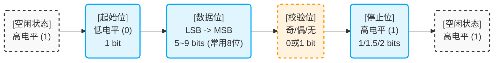

## uart的数据帧的格式组成

```mermaid
flowchart LR
    classDef idle fill:#f9f9f9,stroke:#333,stroke-width:2px,stroke-dasharray: 5 5
    classDef required fill:#e1f5fe,stroke:#03a9f4,stroke-width:2px
    classDef optional fill:#fff3e0,stroke:#ff9800,stroke-width:2px,stroke-dasharray: 5 5

    Idle1("[空闲状态]<br>高电平 (1)"):::idle --> Start("[起始位]<br>低电平 (0)<br>1 bit"):::required
    Start --> Data("[数据位]<br>LSB -> MSB<br>5~9 bits (常用8位)"):::required
    Data --> Parity("[校验位]<br>奇/偶/无<br>0或1 bit"):::optional
    Parity --> Stop("[停止位]<br>高电平 (1)<br>1/1.5/2 bits"):::required
    Stop --> Idle2("[空闲状态]<br>高电平 (1)"):::idle
```

#### 波特率计算

波特率 = UART 时钟频率 / (分频系数 × 过采样倍数)。比如 STM32 APB1 时钟 42MHz，过采样16倍，要得到 115200bps → 分频 = 42000000 / (16 × 115200) ≈ 22.79，取整后实际波特率有微小偏差