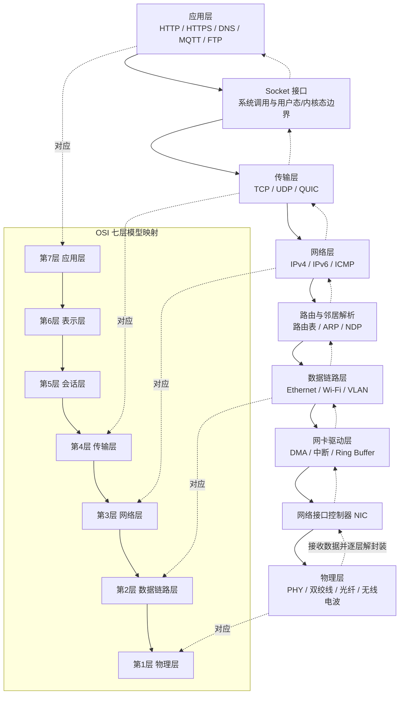

# 计算机网络

## 为什么需要计算机网络？

让任意两台主机上的任意两个应用进程可以跨越复杂网络交互数据

## 计算机网络是什么？

计算机网络中的带宽还是最大数据传输量即最大的bps波特率

### 网络架构

 

```mermaid
flowchart TB
    APP["应用层<br/>HTTP / HTTPS / DNS / MQTT / FTP"]
    SOCKET["Socket 接口<br/>系统调用与用户态/内核态边界"]
    TRANS["传输层<br/>TCP / UDP / QUIC"]
    NET["网络层<br/>IPv4 / IPv6 / ICMP"]
    ROUTE["路由与邻居解析<br/>路由表 / ARP / NDP"]
    LINK["数据链路层<br/>Ethernet / Wi-Fi / VLAN"]
    DRIVER["网卡驱动层<br/>DMA / 中断 / Ring Buffer"]
    NIC["网络接口控制器 NIC"]
    PHY["物理层<br/>PHY / 双绞线 / 光纤 / 无线电波"]

    APP --> SOCKET
    SOCKET --> TRANS
    TRANS --> NET
    NET --> ROUTE
    ROUTE --> LINK
    LINK --> DRIVER
    DRIVER --> NIC
    NIC --> PHY

    PHY -. "接收数据并逐层解封装" .-> NIC
    NIC -.-> DRIVER
    DRIVER -.-> LINK
    LINK -.-> ROUTE
    ROUTE -.-> NET
    NET -.-> TRANS
    TRANS -.-> SOCKET
    SOCKET -.-> APP

    subgraph OSI["OSI 七层模型映射"]
        O7["第7层 应用层"]
        O6["第6层 表示层"]
        O5["第5层 会话层"]
        O4["第4层 传输层"]
        O3["第3层 网络层"]
        O2["第2层 数据链路层"]
        O1["第1层 物理层"]
    end

    O7 --> O6 --> O5 --> O4 --> O3 --> O2 --> O1

    APP -. "对应" .-> O7
    TRANS -. "对应" .-> O4
    NET -. "对应" .-> O3
    LINK -. "对应" .-> O2
    PHY -. "对应" .-> O1
```

#### 应用层

DNS帮助其他应用对象寻找到通信的对象
